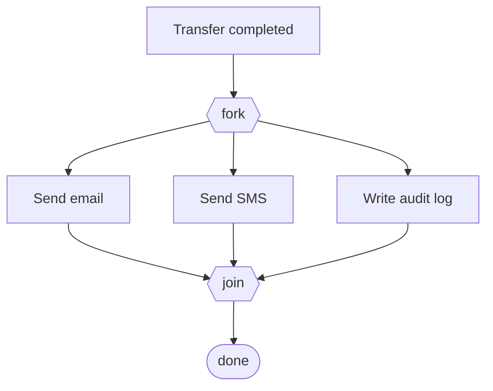
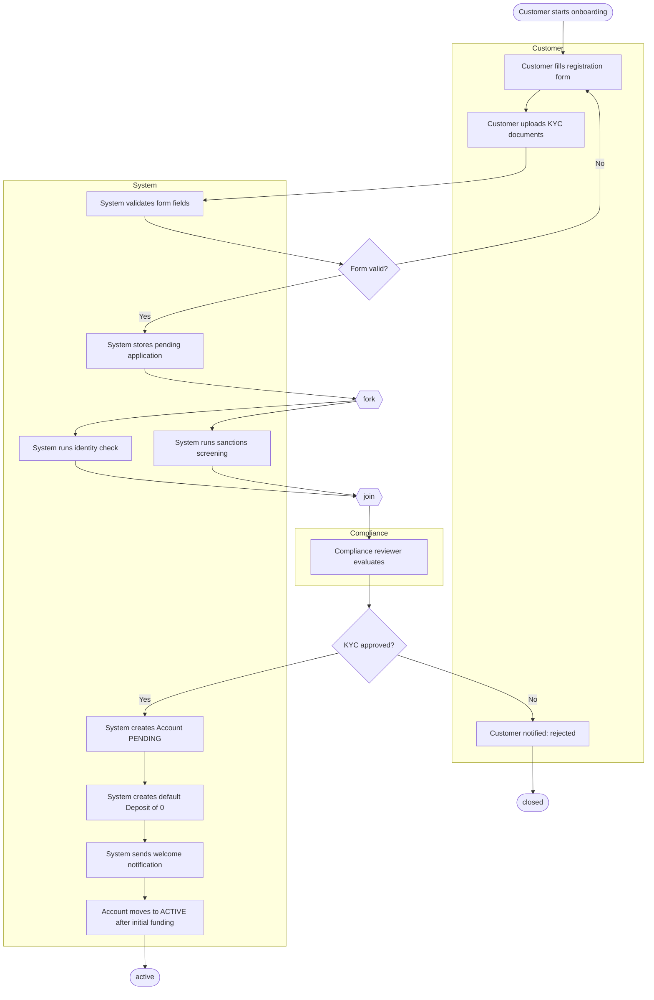

# Activity Diagrams

> Activity diagrams are flowcharts with object flow, decisions, parallelism, and swimlanes. They are the right tool when the question is *what is the workflow, and who owns each step* — not *which object sends which message*.

## What you already know

From [[02-Use-Cases]]: a use case is a sequence of steps. A sequence diagram (see [[02-Sequence-Diagrams]]) assigns those steps to objects. An activity diagram, by contrast, focuses on the *flow* of work — the steps themselves, the decisions between them, the parallel branches — and optionally partitions them by *who* does each step.

From [[06-Coupling-and-Cohesion]]: an activity diagram with swimlanes makes coupling *visible*. When a workflow bounces back and forth between two swimlanes ten times, the coupling is high and the design smells. Reducing swimlane crossings is the same act as reducing coupling between modules.

From [[05-Identity-State-Lifecycle]]: many activities *create* state changes — opening an account moves it from `PENDING` to `ACTIVE`. Activity diagrams and state diagrams (see [[04-State-Diagrams]]) are duals: an activity diagram asks "what steps run?", a state diagram asks "what states does this object pass through?"

## Why this layer exists

Sequence diagrams are excellent for object collaboration but bad at two things:

1. **Showing parallelism.** Two steps that can run concurrently are awkward to express in a sequence diagram (the `par` fragment exists but is rarely drawn).
2. **Showing responsibility partition.** When the workflow crosses teams (Customer, System, Compliance, Operations), the sequence diagram has no native concept of "swimlane." You end up coloring participants by team.

Activity diagrams exist to fill those gaps. They are flowcharts — a notation engineers already know — with two extensions: object flow (data passed between activities) and swimlanes (responsibility partitions). They are the right tool for:

- Workflows that span multiple actors (KYC onboarding, loan approval, dispute resolution).
- Workflows with parallel branches (kick off notifications, kick off ledger posting, kick off audit log — all at once).
- Workflows with complex decision trees (multiple branches, multiple join points).

## What is genuinely new here

- **Decision nodes** (`<condition>` diamonds in classic flowcharts, branches in Mermaid) — fork the flow based on a guard.
- **Fork and join** — split the flow into parallel branches and merge them back. The join is a *barrier*: all parallel branches must complete before the flow continues.
- **Swimlanes** (called "partitions" in UML 2) — vertical or horizontal bands showing *who* owns each activity.
- **Object flow** — activities can produce and consume objects (tokens), drawn as boxes on the arrows. This is the link to data flow.
- **Initial and final nodes** — the start and end of the flow, drawn as a filled circle and a ringed circle.

## Concepts

### Notation

| Symbol | Meaning |
|---|---|
| Filled circle | Initial node (start) |
| Ringed circle | Final node (end) |
| Rounded rectangle | Activity (a step) |
| Diamond | Decision (with guards on outgoing edges) |
| Bold horizontal bar | Fork (split into parallel) or Join (merge parallel back) |
| Rectangle with vertical lines | Swimlane partition |
| Box on an arrow | Object passed between activities |

### Fork and join — the parallelism

A **fork** splits one flow into multiple concurrent flows. A **join** merges them back, and *waits for all* before continuing. The join is a barrier, not a merge — this is the difference from a decision diamond, which chooses *one* path.



This is the classic "fire-and-forget several notifications in parallel" pattern. The fork/join pair says: do all three concurrently, wait for all three, then continue. In Java, this is `CompletableFuture.allOf(...)`.

### Swimlanes — responsibility partitions

A swimlane groups activities by *who* performs them. In a KYC workflow, the lanes are typically: Customer, System, Compliance. The act of drawing swimlanes forces the designer to answer "whose job is each step?" — and to spot when the workflow crosses lanes too often.

Mermaid does not have native swimlanes, but the convention is to use subgraphs. This is a slight loss of formal UML notation but gains native rendering in Obsidian.

## Banking application — the account opening flow

The account opening workflow spans three actors: the Customer (initiates), the System (executes), and Compliance (approves KYC). It is the canonical multi-lane activity in the Banking system.



Reading the diagram:

- The customer initiates and uploads documents.
- The system validates, then forks to run identity check and sanctions screening *in parallel* — both must complete before compliance review.
- Compliance makes the KYC decision.
- On approval, the system creates the Account in `PENDING` state (see [[05-Identity-State-Lifecycle]]), writes an initial zero deposit (so a ledger entry exists), sends a welcome notification, and moves the account to `ACTIVE` once initial funding arrives.

This is a workflow, not a sequence. The point is *what happens* and *who does it*, not *which message goes to which object*. If you wanted the object-collaboration view, you would draw a sequence diagram for the "create Account" step.

### Swimlane crossings as a smell

In the diagram above, the workflow crosses swimlanes four times: Customer → System (form submitted), System → Compliance (review requested), Compliance → System (decision returned), System → Customer (notification sent). Four crossings for a workflow with twelve activities is reasonable.

If you saw twenty crossings for fifteen activities, you would suspect the design has high coupling between the lanes. The cure is the same as in [[06-Coupling-and-Cohesion]]: introduce an abstraction (an interface, an event) that reduces the back-and-forth. Often this means making the inter-lane communication *asynchronous* — Compliance does not block the system; the system posts a "KYC needed" event and Compliance picks it up.

## Code / diagrams — translating to Java

The activity diagram maps to a workflow service. Java 21's `StructuredTaskScope` is a clean way to express the fork/join parallelism:

```java
public final class OnboardingService {

    private final IdentityCheckService identity;
    private final SanctionsService sanctions;
    private final ComplianceQueue compliance;
    private final AccountService accounts;
    private final NotificationService notifications;

    public OnboardingResult onboard(OnboardingRequest req) {
        // Step A1-A3: validate form
        if (!req.isValid()) {
            return OnboardingResult.rejected("invalid form");
        }

        // Step A4: store pending application
        Application app = persist(req);

        // Fork: run identity check + sanctions screening in parallel
        IdentityResult identityResult;
        SanctionsResult sanctionsResult;
        try (var scope = new StructuredTaskScope.ShutdownOnFailure()) {
            var idTask   = scope.fork(() -> identity.check(req));
            var sanTask  = scope.fork(() -> sanctions.screen(req));
            scope.join();
            identityResult  = idTask.get();
            sanctionsResult = sanTask.get();
        } catch (InterruptedException e) {
            Thread.currentThread().interrupt();
            return OnboardingResult.failed("interrupted");
        }

        // A7: send to compliance for review (async via queue)
        compliance.enqueueForReview(app, identityResult, sanctionsResult);
        return OnboardingResult.pendingReview();
    }

    // Called by the compliance worker when review is complete
    public void onComplianceDecision(ComplianceDecision decision) {
        if (!decision.approved()) {
            notifications.notifyAsync(decision.customerId(), "rejected");
            return;
        }
        // A9-A12: create account, initial deposit, welcome notification
        Account account = accounts.open(decision.customerId(), AccountType.CHECKING);
        accounts.deposit(account.id(), BigDecimal.ZERO); // initial ledger entry
        notifications.notifyAsync(decision.customerId(), "welcome");
        // Account is PENDING; moves to ACTIVE after initial funding
    }
}
```

Notes on the mapping:

- The fork in the activity diagram becomes `StructuredTaskScope` with two `fork()` calls. Java 21's structured concurrency makes the parallelism explicit and scoped — see the Java 21 JEPs.
- The compliance review is *not* a synchronous call. The activity diagram implies this because Compliance is a separate swimlane and the review can take hours. The Java uses an async queue.
- The `onComplianceDecision` method is the callback when compliance finishes — this is the *return arrow* from the Compliance swimlane back to System.

## What can go wrong

- **Confusing decision and fork.** A decision picks *one* path; a fork starts *multiple* paths. Drawing a diamond where you mean a fork is a common error — and it makes the diagram say something different from what you intend.
- **Forgetting the join.** A fork without a join is a dangling parallel branch. The flow never re-converges; the final node may be reached by one branch while another is still running.
- **Too many swimlanes.** Five or more lanes make the diagram unreadable. If your workflow has that many actors, group some (e.g., "Compliance + Risk" as one "Risk" lane).
- **Treating swimlanes as object instances.** A swimlane is a *role*, not a specific object. "System" is a role played by many objects; do not put a single class name on the lane.
- **Drawing the whole system as one activity.** Activity diagrams are for workflows, not for the entire system. One diagram per major workflow; do not try to fit everything in.
- **Missing guard conditions on decisions.** A decision diamond without labeled outgoing edges is ambiguous. Always label the branches.

## Trade-offs

- **Activity vs sequence.** Activity diagrams are better for *workflow* (parallelism, lanes, branching). Sequence diagrams are better for *collaboration* (who calls whom, in what order). For most use cases you want one of each: activity for the macro flow, sequence for the trickiest part.
- **Swimlanes vs no swimlanes.** Lanes add information about responsibility but also add visual clutter. Use them when responsibility partition matters (KYC, dispute resolution, loan approval). Skip them for purely system-internal flows.
- **Object flow vs control flow.** Showing objects on the arrows (the boxes with data names) is more informative but denser. Most activity diagrams omit object flow and rely on activity names to imply data.
- **Fork/join vs sequential.** Fork/join is more efficient when the branches are slow, but it adds complexity (error handling for any branch, timeout). The trade-off is the same one as in [[08-Trade-offs-Everywhere]]: parallelism buys latency at the cost of complexity.

## Forward links

- [[02-Sequence-Diagrams]] — the other behavior diagram; use it for object collaboration, use activity for workflow.
- [[04-State-Diagrams]] — the dual view: an activity shows steps, a state diagram shows the lifecycle of the objects those steps touch.
- [[05-Identity-State-Lifecycle]] — the `PENDING → ACTIVE` transition this workflow drives.
- [[06-Banking-LLD]] — where this workflow is implemented as code, with the trade-offs called out.
- [[06-Coupling-and-Cohesion]] — swimlane crossings are a coupling smell.
- [[02-Use-Cases]] — the source of the workflow structure.
