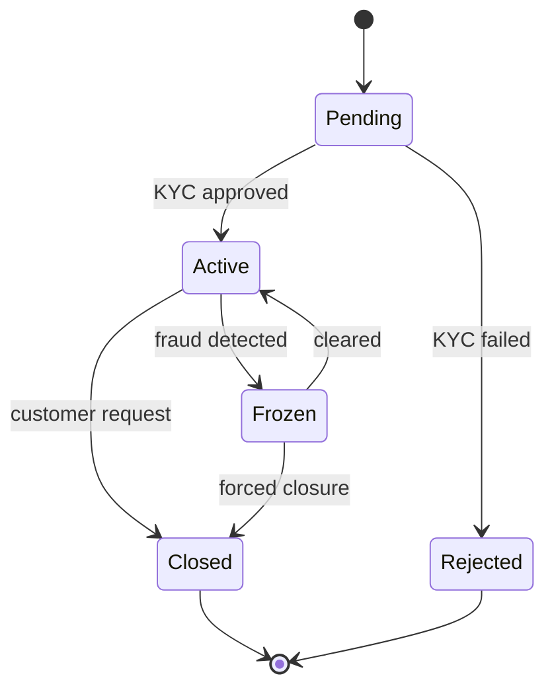
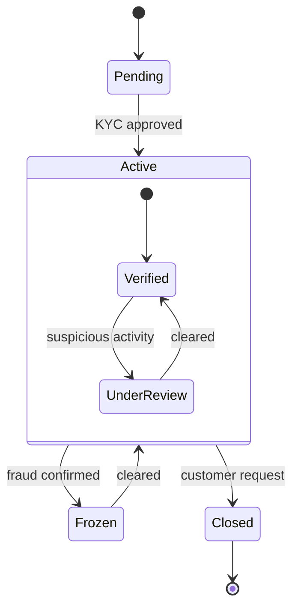
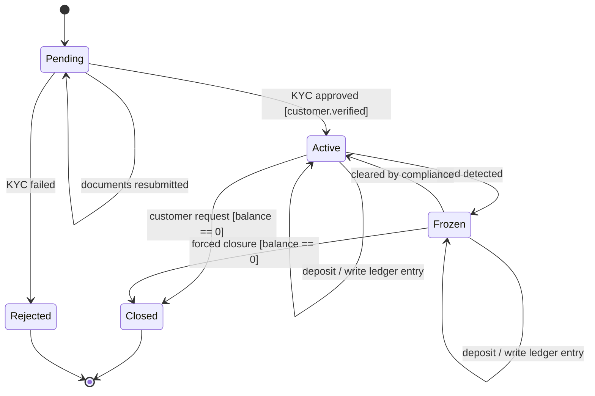

# State Diagrams

> State diagrams capture the lifecycle of an object: the states it can be in, the transitions between them, and the guards that gate those transitions. They are the right tool when the question is *what states can this entity be in, and what is allowed in each?*

## What you already know

From [[05-Identity-State-Lifecycle]]: lifecycle state is a *subset* of state — the subset that drives which operations are legal. An `Account` has many attributes (balance, frozen_until, last_deposit_at) but only some of them constitute its *lifecycle state*: `PENDING`, `ACTIVE`, `FROZEN`, `CLOSED`.

From [[03-Dependency-As-Root-Concept]]: state transitions are guarded by *invariants*. A transition is allowed only if the source state's invariants permit it and the target state's invariants can be established. The diagram makes those guards visible.

From [[02-Use-Cases]]: the use case extensions ("source account is FROZEN: reject with 'account frozen'") are state-transition *guards*. They are the same idea expressed in different vocabulary.

From [[06-Coupling-and-Cohesion]]: a state diagram is a *cohesion test*. If an entity's state machine is small and clean, the entity owns one invariant. If it sprawls across twenty states, the entity is doing too much.

## Why this layer exists

A class diagram shows what attributes an object has. A sequence diagram shows how objects collaborate. Neither answers the question: *"In which states is `withdraw()` legal, and what state does each operation transition to?"*

State diagrams answer that. They are the formalization of lifecycle — the same lifecycle you enforce with `if (status == ACTIVE) ...` guards in code, but lifted to a visualization that exposes missing transitions, illegal transitions, and unreachable states.

In a banking system, this is critical. A `CLOSED` account must not be able to receive a deposit. A `FROZEN` account must not be able to send a withdrawal but may receive a deposit. A `PENDING` account can do neither. If these rules are scattered across `if` statements in twenty methods, bugs are inevitable. A state diagram is the contract; the code is the implementation.

## What is genuinely new here

- **States** — named modes of being (e.g., `ACTIVE`, `FROZEN`).
- **Transitions** — arrows from one state to another, labeled with the trigger and optional guard.
- **Guards** — boolean conditions that must hold for the transition to fire.
- **Initial pseudostate** — the filled circle that says "this is where objects start."
- **Final pseudostate** — the ringed circle that says "this is where objects end."
- **Composite states** — a state that contains sub-states, useful for nested lifecycles (e.g., `ACTIVE` has sub-states `VERIFIED` and `UNDER_REVIEW`).
- The diagnostic power of the diagram: missing transitions, illegal transitions, and unreachable states are immediately visible.

## Concepts

### Anatomy of a state diagram



- `[*]` is the initial pseudostate (start) or final pseudostate (end), depending on position.
- `StateA --> StateB: trigger [guard] / action` is the full transition syntax: a trigger event, an optional guard in brackets, and an optional action after the slash.
- A state with no outgoing transitions is a *final state*. (In the diagram above, `Closed` and `Rejected` are final.)

### Guards, triggers, and actions

A transition can carry up to three pieces of information:

- **Trigger** — the event that causes the transition (e.g., `KYC approved`).
- **Guard** — a condition that must be true for the transition to fire (e.g., `[customer.age >= 18]`).
- **Action** — a side effect to perform during the transition (e.g., `/ send welcome email`).

Guards are crucial: they are where the invariants from [[06-Coupling-and-Cohesion]] live. Without guards, the diagram says "any `Active` account can transition to `Frozen`." With a guard, it says "an `Active` account can transition to `Frozen` *only if* a fraud signal fires."

### Composite states

For entities with rich lifecycles, a state can be decomposed into sub-states:



The `Active` state has its own internal lifecycle. Sub-states inherit the transitions of their parent: any transition out of `Active` (e.g., to `Frozen`) is also valid from `Verified` and `UnderReview`.

## Banking application

Here is the canonical state diagram for the Banking `Account`:



Reading the diagram:

- An account starts in `Pending`. KYC approval moves it to `Active`; KYC failure moves it to `Rejected`. A `Pending` account can have documents resubmitted (self-transition).
- In `Active`, the account can receive deposits (self-transition with action), be frozen (fraud detected), or be closed (customer request, with the guard `balance == 0` — you cannot close an account with a non-zero balance).
- In `Frozen`, the account can still receive deposits but cannot send withdrawals. It can be cleared (back to `Active`) or force-closed (with the same balance guard).
- `Closed` and `Rejected` are final.

### Missing transitions exposed

The diagram immediately exposes design questions:

- **Can a `Closed` account be reopened?** The diagram says no (no outgoing transition from `Closed`). If the business wants to allow reopening, we add `Closed --> Pending: reopen request` — and that forces us to think about what reopening means (new KYC? preserved history? new account number?).
- **Can a `Rejected` application be retried?** Currently no. If yes, we need `Rejected --> Pending: customer reapplies (after 30 days)`.
- **What happens to a `Frozen` account with non-zero balance if compliance never clears it?** The diagram has no path from `Frozen` to `Closed` with `balance != 0`. Either we add one (with a "withdraw remaining funds" action) or we accept that frozen accounts with balances stay frozen forever.
- **What if a fraud signal fires while an account is `Pending`?** The diagram has no `Pending --> Frozen` transition. Either we forbid it (a `Pending` account cannot be frozen because it has not been activated) or we add the transition.

These are not academic questions. Each is a real banking scenario, and the state diagram makes them visible *before* code is written. Code reviews rarely catch missing transitions; state diagrams surface them in five minutes.

## Code / diagrams

The state diagram is implemented in three layers (see [[05-Identity-State-Lifecycle]]):

**Code** — the `AccountStatus` enum and the guard checks:

```java
public enum AccountStatus {
    PENDING, ACTIVE, FROZEN, CLOSED, REJECTED
}

public abstract class Account {
    private AccountStatus status;
    // ...

    public void deposit(BigDecimal amount) {
        // Guard: only ACTIVE or FROZEN accounts can deposit
        if (status != AccountStatus.ACTIVE && status != AccountStatus.FROZEN) {
            throw new IllegalStateTransitionException(
                "deposit not allowed in state " + status);
        }
        this.balance = this.balance.add(amount);
    }

    public void withdraw(BigDecimal amount) {
        // Guard: only ACTIVE accounts can withdraw
        if (status != AccountStatus.ACTIVE) {
            throw new IllegalStateTransitionException(
                "withdraw not allowed in state " + status);
        }
        // ...
    }

    public void freeze() {
        if (status != AccountStatus.ACTIVE) {
            throw new IllegalStateTransitionException(
                "freeze only allowed from ACTIVE, was " + status);
        }
        this.status = AccountStatus.FROZEN;
    }

    public void close() {
        // Guard: balance must be zero
        if (this.balance.compareTo(BigDecimal.ZERO) != 0) {
            throw new IllegalStateTransitionException(
                "close requires zero balance, was " + balance);
        }
        if (status != AccountStatus.ACTIVE && status != AccountStatus.FROZEN) {
            throw new IllegalStateTransitionException(
                "close not allowed in state " + status);
        }
        this.status = AccountStatus.CLOSED;
    }
}
```

**Schema** — a `CHECK` constraint that enforces the legal transitions:

```sql
CREATE TABLE account_status_transitions (
    from_status TEXT NOT NULL,
    to_status   TEXT NOT NULL,
    PRIMARY KEY (from_status, to_status)
);

INSERT INTO account_status_transitions VALUES
    ('PENDING', 'ACTIVE'),
    ('PENDING', 'REJECTED'),
    ('PENDING', 'PENDING'),
    ('ACTIVE',  'FROZEN'),
    ('ACTIVE',  'CLOSED'),
    ('ACTIVE',  'ACTIVE'),
    ('FROZEN',  'ACTIVE'),
    ('FROZEN',  'CLOSED'),
    ('FROZEN',  'FROZEN');

-- Trigger: reject illegal transitions
CREATE FUNCTION check_account_transition() RETURNS TRIGGER AS $$
BEGIN
    IF NEW.status IS DISTINCT FROM OLD.status
       AND NOT EXISTS (
           SELECT 1 FROM account_status_transitions t
           WHERE t.from_status = OLD.status
             AND t.to_status   = NEW.status
       ) THEN
        RAISE EXCEPTION 'Illegal state transition: % -> %',
            OLD.status, NEW.status;
    END IF;
    RETURN NEW;
END;
$$ LANGUAGE plpgsql;

CREATE TRIGGER enforce_account_transition
    BEFORE UPDATE OF status ON accounts
    FOR EACH ROW
    EXECUTE FUNCTION check_account_transition();
```

This is the same diagram, enforced at three layers. The redundancy is deliberate — see [[03-Triggers-As-Constraints]] for why.

## What can go wrong

- **Missing transitions.** The most common bug. If the diagram does not show `Closed --> Pending`, then either the business does not allow reopening (intended) or the designer forgot to consider it (bug). The diagram forces the question.
- **States that are unreachable.** If no transition leads to a state, that state is dead code. Remove it.
- **States with no exit.** A non-final state with no outgoing transitions is a trap. Either mark it final or add an exit.
- **Nondeterministic transitions.** Two transitions from the same state with the same trigger and overlapping guards. The diagram says "either could fire"; the code must pick one. This is a bug.
- **State explosion.** An entity with 30 states has an unreadable diagram. Usually this means the entity is doing too much — split it. Composite states help, but only postpone the explosion.
- **Confusing state and attribute.** `balance == 0` is *not* a state; it is an attribute. A state is a *mode of behavior*. If the only difference between two "states" is an attribute value, you have one state with an attribute, not two states.
- **Confusing state diagram with flowchart.** A flowchart shows steps in a process; a state diagram shows states of an object. They look similar but answer different questions. Use activity diagrams for workflows, state diagrams for lifecycles.

## Trade-offs

- **Granularity of states.** Too few states and the diagram is vague (e.g., `OPEN` and `CLOSED` — but what about frozen?). Too many and the diagram is unreadable. The right level is "states that have *different behavior*."
- **Stateless vs stateful design.** Sometimes you can replace a state machine with a calculation (e.g., "is the account active?" computed from `frozen_until` and `closed_at` timestamps). This is more functional and often simpler. The trade-off: stateless designs are harder to audit (no explicit "transition happened at time T" record) and harder to extend (adding a new state requires a new field, not a new transition).
- **Where to enforce** — code, schema, or both? Code is more expressive (complex guards, side effects). Schema is more reliable (cannot be bypassed by application bugs). The trade-off is redundancy vs expressiveness. See [[03-Triggers-As-Constraints]].
- **Composite states vs flat.** Composite states are more accurate but harder to render. For most banking entities, flat is sufficient.

## Forward links

- [[05-Identity-State-Lifecycle]] — the foundational concept this diagram visualizes.
- [[00-Banking-Case-Study]] — the rules `8` and `9` (closed accounts cannot transact; frozen accounts cannot withdraw) are encoded here.
- [[03-Triggers-As-Constraints]] — how the diagram is enforced at the schema layer.
- [[06-Banking-LLD]] — the state diagram embedded in the full LLD.
- [[05-Anemic-vs-Rich-Models]] — a state machine is the canonical "rich" behavior that distinguishes a real domain model from an anemic one.
- [[04-State-Diagrams]] (this chapter) and [[02-Aggregates]] — the aggregate boundary is the unit over which the state machine runs.
