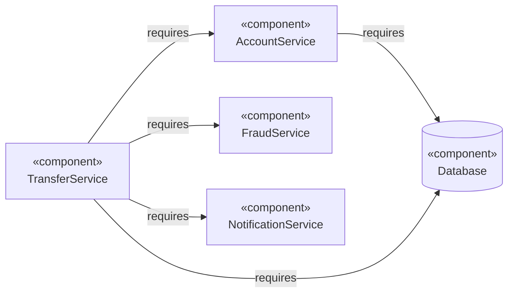
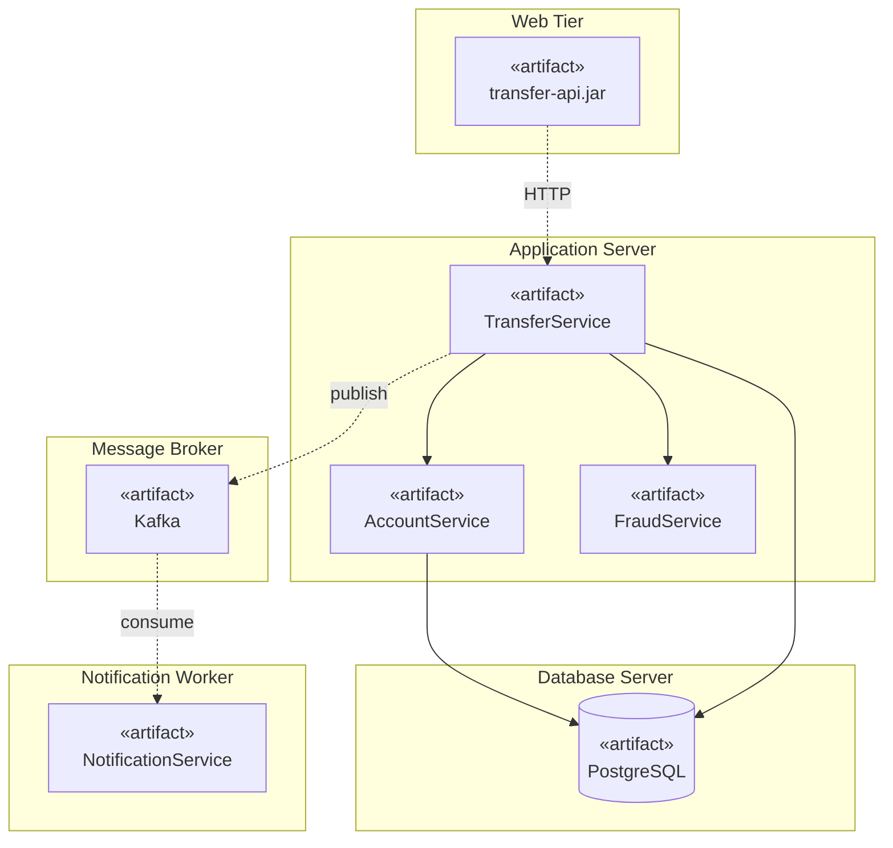
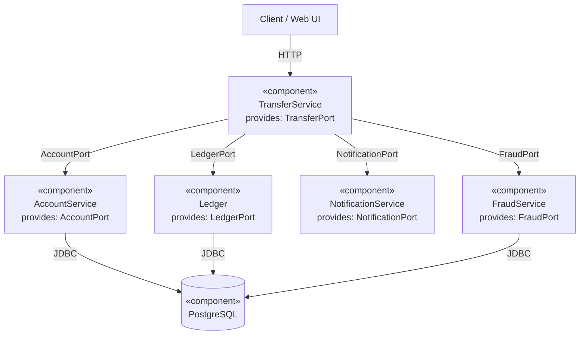
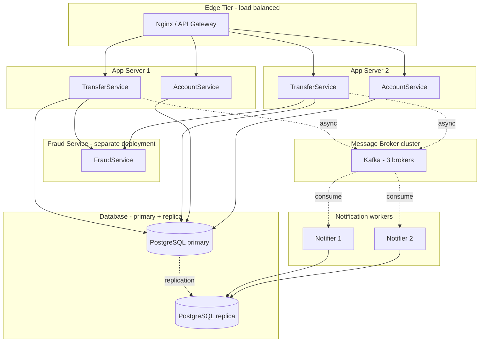

# Component and Deployment Diagrams

> Component diagrams show the *runtime units* of a system and their dependencies. Deployment diagrams show the *physical nodes* those units run on. Together they answer: *what are the deployable pieces, what do they depend on, and where do they live?*

## What you already know

From [[03-Dependency-As-Root-Concept]]: a dependency exists when a change in one place can force a change elsewhere. Component diagrams make inter-module dependencies visible at the deployment-unit level. The arrows are the same dependencies you manage in code, just scaled up.

From [[04-Abstraction-and-Models]]: an interface is an abstraction that hides implementation. Components expose and consume interfaces — a *provided* interface is what a component offers; a *required* interface is what it needs. The match between provided and required is the contract.

From [[06-Coupling-and-Cohesion]]: a component is a cohesion boundary. Everything inside a component changes together; everything between components changes through stable interfaces. The same rule that applies to classes applies to components — only the scale is larger.

From [[00-SOLID-as-Dependency-Management]] and [[05-DIP]]: the Dependency Inversion Principle says "depend on abstractions." At the component level, this means: a component should require *interfaces*, not concrete other components. The wiring happens at deployment time.

## Why this layer exists

Class diagrams show classes. Package diagrams show packages. But the question "*what do we deploy?*" needs a different unit — the **component**. A component is a deployable, replaceable unit with a well-defined interface. In Java terms: a JAR, a WAR, a microservice, a library. In modern terms: a container image, a serverless function.

Once you have components, two questions follow:

1. **What does each component depend on?** This is the component diagram.
2. **Where does each component run?** This is the deployment diagram.

These questions matter because they determine:

- **Build and deploy ordering.** If component A depends on B, B must be built and deployed before A.
- **Failure isolation.** If A depends on B and B is down, A fails too — unless A has a fallback or queue.
- **Scaling.** Each component scales independently. Coarse-grained components scale as a unit; fine-grained components scale per service.
- **Team boundaries.** Conway's Law (see [[01-Design-Forces]]) says the architecture mirrors the org chart. Component boundaries often align with team boundaries.

## What is genuinely new here

- **Components** — modular units with provided and required interfaces.
- **Interfaces (lollipop notation)** — the "ball" represents a provided interface; the "socket" represents a required interface. A component is wired to another by matching ball to socket.
- **Artifacts** — the physical packaging of a component (JAR file, container image).
- **Nodes** — physical or virtual machines that host artifacts.
- **Communication paths** — the network or IPC links between nodes.
- The trade-off at this layer: **coarse-grained (fewer, bigger components) vs fine-grained (more, smaller services).** This is the monolith-vs-microservices axis (see [[05-Architecture-Trade-offs]]).

## Concepts

### Component diagrams

A component diagram shows components as boxes with the «component» stereotype, plus their provided (ball) and required (socket) interfaces, plus dependency arrows between them.



The arrows say "TransferService depends on AccountService, FraudService, NotificationService, and the Database." Each arrow is a dependency from [[03-Dependency-As-Root-Concept]] — a change in the depended-on component's interface can force a change in the depender.

### Provided and required interfaces (lollipop notation)

In strict UML, a component exposes a "ball" (provided interface) and requires a "socket" (required interface). Two components are wired together when one's ball matches the other's socket. This is the same idea as Java's `implements` (provided) and `@Autowired` (required).

Mermaid does not have native lollipop notation, so we use arrows. The intent is the same: dependencies point from consumer to provider.

### Deployment diagrams

A deployment diagram shows *nodes* (physical or virtual machines) and the *artifacts* (component instances) deployed on them. Communication paths between nodes are drawn as arrows labeled with the protocol.



Reading the diagram:

- The Web tier hosts the API edge.
- The application server hosts the TransferService, AccountService, and FraudService. (In a monolith, these would be one artifact; in microservices, three.)
- The message broker decouples notification from the transfer flow — see [[08-Trade-offs-Everywhere]] for the sync-vs-async trade-off.
- The database server hosts PostgreSQL.
- The notification worker is a separate process that consumes from the broker.

Each arrow is labeled with the protocol: HTTP between web and app, native calls inside the app server, Kafka protocol between app and broker, JDBC between app and DB.

## Banking application

The Banking system has four primary components, each owning a cohesive responsibility (see [[06-Coupling-and-Cohesion]]):

| Component | Responsibility | Provided interface | Required interface |
|---|---|---|---|
| `TransferService` | Execute transfers atomically | `TransferPort` | `AccountPort`, `FraudPort`, `NotificationPort`, `LedgerPort` |
| `AccountService` | Manage accounts and balances | `AccountPort` | `AccountRepository` |
| `FraudService` | Evaluate transfers for fraud | `FraudPort` | `FraudRuleEngine`, `FraudRepository` |
| `NotificationService` | Send customer notifications | `NotificationPort` | `EmailGateway`, `SmsGateway` |

### Component diagram



Notice the dependency directions:

- `Client` depends on `TransferService` (and `AccountService` for queries).
- `TransferService` depends on `AccountService`, `FraudService`, `NotificationService`, `Ledger`.
- `AccountService`, `Ledger`, `FraudService` all depend on the database.
- The database depends on nothing — it is the most stable, most depended-on artifact, just as in [[03-Dependency-As-Root-Concept]].

This is the same dependency graph as in the code (see [[01-Class-Diagrams]]) and in the schema (see [[04-Banking-Schema]]). The arrows point the same direction. The component diagram is a higher-level view of the same graph.

### Deployment diagram



Reading the diagram:

- Two app servers run `TransferService` and `AccountService` for horizontal scaling.
- The `FraudService` is deployed separately because it has different scaling and release cadence (it is updated frequently as fraud patterns evolve).
- Notifications are published to Kafka and consumed by worker processes — this is the async decoupling from [[08-Trade-offs-Everywhere]].
- The database has a primary (writes) and a replica (reads). Notifications read from the replica to avoid adding load to the primary.

### Why `FraudService` is a separate component

This is a deliberate trade-off:

- **Pro**: independent deployment, independent scaling, independent release cadence, fault isolation (a FraudService crash does not crash TransferService — the call can fail-fast and the transfer is marked `FRAUD_PENDING`).
- **Con**: network calls add latency, a distributed failure mode (TransferService now depends on FraudService being available), harder local development.

This trade-off is the same shape as in [[08-Trade-offs-Everywhere]]: tighter coupling vs looser coupling, sync vs async, monolith vs microservice. We will revisit this in [[05-Architecture-Trade-offs]].

## Code / diagrams — interfaces as contracts

Each provided interface in the component diagram maps to a Java interface. The required interfaces are dependencies (constructor parameters). This is DIP at the component level — see [[05-DIP]].

```java
// Provided interface (TransferService exposes this)
public interface TransferPort {
    TransferResult transfer(TransferRequest request);
}

// Required interfaces (TransferService depends on these)
public interface AccountPort {
    Account load(AccountId id);
    void save(Account account);
}

public interface FraudPort {
    FraudDecision evaluate(TransferRequest request);
}

public interface NotificationPort {
    void notifyAsync(TransferEvent event);
}

public interface LedgerPort {
    void write(AccountId account, BigDecimal amount, TransferId transfer);
}

// The component: depends on interfaces, not on concrete components
public final class TransferService implements TransferPort {
    private final AccountPort accounts;
    private final FraudPort fraud;
    private final NotificationPort notifications;
    private final LedgerPort ledger;
    private final TransactionManager tx;

    public TransferService(AccountPort accounts, FraudPort fraud,
                           NotificationPort notifications, LedgerPort ledger,
                           TransactionManager tx) {
        this.accounts = accounts;
        this.fraud = fraud;
        this.notifications = notifications;
        this.ledger = ledger;
        this.tx = tx;
    }

    @Override
    public TransferResult transfer(TransferRequest req) {
        // ... as in [[02-Sequence-Diagrams]]
        return tx.inTransaction(() -> {
            Account from = accounts.load(req.from());
            Account to   = accounts.load(req.to());
            from.debit(req.amount());
            to.credit(req.amount());
            ledger.write(req.from(), req.amount().negate(), req.transferId());
            ledger.write(req.to(),   req.amount(),         req.transferId());
            accounts.save(from);
            accounts.save(to);
            notifications.notifyAsync(new TransferEvent(req));
            return TransferResult.completed();
        });
    }
}
```

The key point: `TransferService` depends on the *interfaces* (`AccountPort`, `FraudPort`, etc.), not on the concrete components. The wiring — `JdbcAccountRepository implements AccountPort`, `RestFraudClient implements FraudPort`, etc. — happens at deployment time, typically via a DI container (Spring, Guice).

This is the component-level expression of DIP: the policy (TransferService) depends on abstractions; the details (JDBC, REST clients) depend on the same abstractions. Inverting the dependency makes `TransferService` testable in isolation and makes the deployment topology a deploy-time decision.

## What can go wrong

- **Components that are too coarse.** A single "BankingService" component that does everything is not a component — it is a monolith with a fancy name. Decompose by cohesion boundary (see [[02-Aggregates]]).
- **Components that are too fine.** Splitting every class into its own component creates a distributed monolith: many deployable units, but every change touches them all. The right granularity is one component per *bounded context* (see [[03-Bounded-Contexts]]).
- **Cyclic component dependencies.** Component A depends on B, B depends on A. Neither can be deployed independently. The cure is the same as in [[06-Coupling-and-Cohesion]]: introduce an abstraction both depend on, or merge the components.
- **Shared database as hidden coupling.** Two components share a database schema; each can change the schema in ways that break the other. This is the tightest form of integration — see [[06-Coupling-and-Cohesion]] and [[05-Architecture-Trade-offs]].
- **Missing protocol labels on deployment arrows.** An unlabeled arrow says "they communicate" but not how. Always label with the protocol (HTTP, gRPC, JDBC, Kafka, etc.).
- **Deployment diagram that does not match reality.** Diagrams drift. The cure is to generate them from infrastructure-as-code (Terraform, Kubernetes manifests) where possible.
- **Confusing component diagram with class diagram.** A component is a deployable unit; a class is a code unit. One component contains many classes.

## Trade-offs

- **Monolith vs microservices.** The biggest trade-off at this layer. A monolith is one component containing many classes; microservices are many components, each with a small class set. We will revisit in [[05-Architecture-Trade-offs]]. The default for a new system is a monolith; extract services only when forced.
- **Sync vs async communication between components.** Sync (HTTP/gRPC) is simpler but couples availability. Async (message broker) decouples but introduces eventual consistency. The Banking system uses sync for fraud (the transfer flow needs the decision before committing) and async for notifications (the customer can tolerate a delayed email).
- **Shared database vs database-per-service.** Sharing a database is simpler (one schema, one set of constraints) but couples the components at the schema level (any schema change affects everyone). Database-per-service decouples but requires inter-service queries and distributed transactions. See [[05-Architecture-Trade-offs]].
- **Physical vs virtual vs container deployment.** Physical machines offer isolation but are slow to provision. Virtual machines offer flexibility. Containers offer the fastest deployment but the lowest isolation. The trend is containers (Kubernetes), but the trade-off is real.

## Forward links

- [[06-UML-For-Banking]] — the end-to-end UML model, including this component diagram.
- [[05-Architecture-Trade-offs]] — the trade-offs at this layer, formalized.
- [[03-Hexagonal-Architecture]] — the architecture style that makes the component boundaries explicit as ports and adapters.
- [[04-Clean-Architecture]] — the same idea, with concentric circles.
- [[03-Bounded-Contexts]] — the domain-level concept that defines component boundaries.
- [[04-Enterprise-Patterns]] — Repository and Unit of Work as the patterns that translate between components and the database.
