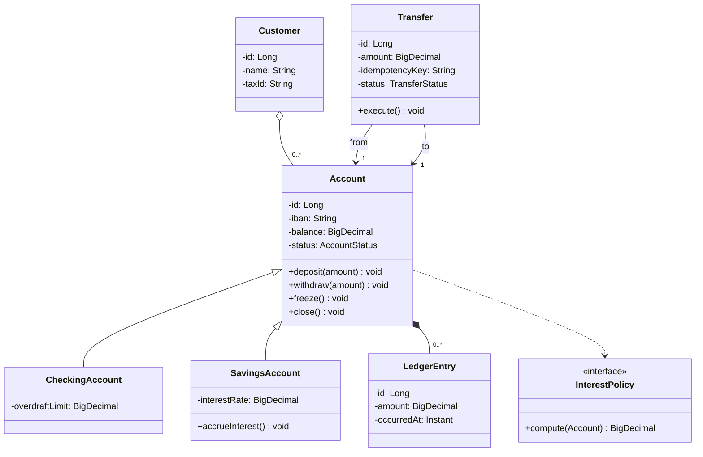
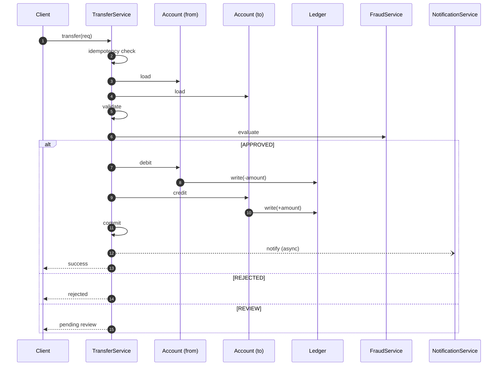
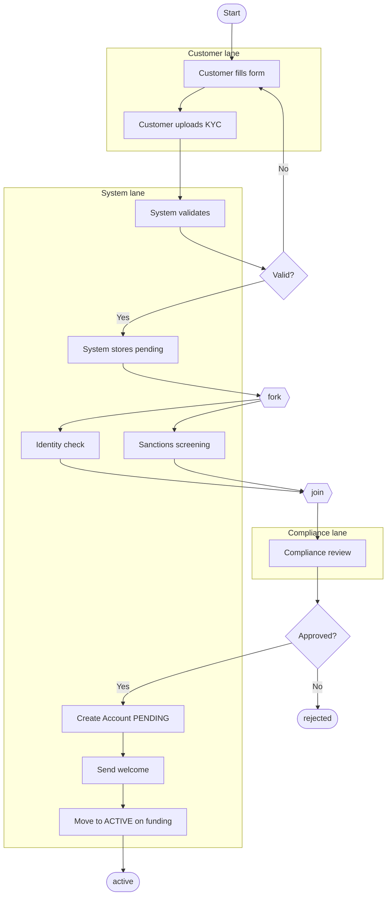
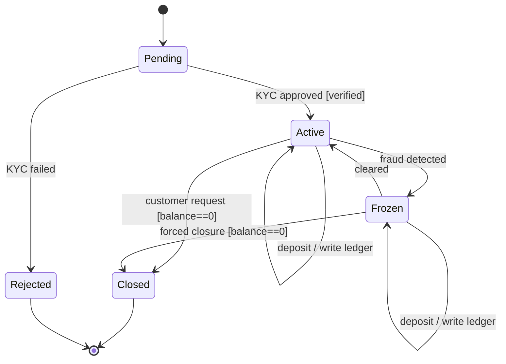
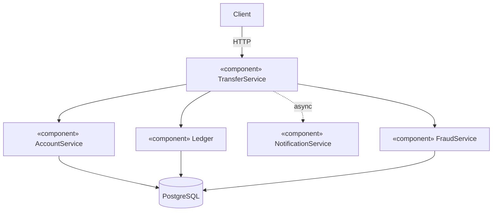

# UML for Banking — End-to-End Model

> One system, five diagrams. This chapter assembles the UML model of the Banking system: class, sequence, state, activity, and component/deployment. The point is not to draw everything; it is to draw the *minimum set* that lets a new engineer understand the system in an afternoon.

## What you already know

From [[00-UML-As-Modeling-Language]]: UML is a notation, not a methodology. The high-leverage subset is class, sequence, state, activity, and component/deployment.

From [[01-Class-Diagrams]] through [[05-Component-And-Deployment]]: each diagram answers a different question, and the questions are complementary. None of them, alone, is the system.

From [[00-Banking-Case-Study]]: the transfer flow is the anchor. Every diagram in this chapter must be consistent with the invariants and the use case catalog from [[02-Use-Cases]].

From [[03-Dependency-As-Root-Concept]] and [[06-Coupling-and-Cohesion]]: every arrow on every diagram is a dependency or a coupling. The diagrams should agree — the class diagram's arrows, the sequence diagram's messages, the component diagram's dependencies, and the schema's foreign keys (see [[04-Banking-Schema]]) all point the same direction.

## Why this layer exists

The previous five chapters each taught one diagram type in isolation. This chapter shows them assembled into a *coherent model* of one system. The point:

1. **Consistency check.** If the class diagram says `Transfer --> Account` and the sequence diagram shows `TransferService` calling `Account`, the diagrams agree. If they do not, you have a bug in your design (or in your documentation).
2. **Coverage check.** The five diagrams together cover the five questions: structure (class), behavior (sequence), workflow (activity), lifecycle (state), deployment (component). If a question is unanswered, the model is incomplete.
3. **Ceremony vs signal.** Which diagrams do you actually need, and which are ceremony? For a banking system, all five pull their weight. For a smaller system, you might skip activity and component.

## What is genuinely new here

- The *assembly* of five diagrams into one model.
- The *traceability* between diagrams: every class on the class diagram appears as a participant on the sequence diagram; every state on the state diagram appears as a guard on the sequence diagram; every component on the component diagram contains classes from the class diagram.
- The *minimum viable set* of diagrams for a real system.

## Concepts — the five views

| View | Diagram | Question |
|---|---|---|
| Static structure | Class | What types exist and how are they related? |
| Object interaction | Sequence | How do instances collaborate over time? |
| Workflow | Activity | What are the cross-actor workflows? |
| Lifecycle | State | What states can each entity be in? |
| Deployment | Component + Deployment | What are the deployable units and where do they run? |

A good model has all five, each at the right level of detail. A great model is small enough that a reader can hold all five in mind at once.

## Banking application — the assembled model

### 1. Class diagram

The structural view. Carried over from [[01-Class-Diagrams]].



### 2. Sequence diagram

The behavioral view of the transfer flow. Carried over from [[02-Sequence-Diagrams]], slightly condensed for the overview.



### 3. Activity diagram

The workflow view. Here we show the account opening workflow, which is the second-most-complex flow in the system. Carried over from [[03-Activity-Diagrams]].



### 4. State diagram

The lifecycle view of `Account`. Carried over from [[04-State-Diagrams]].



### 5. Component and deployment diagram

The runtime topology. Carried over from [[05-Component-And-Deployment]].



### How the diagrams fit together

Trace the `Account` concept through all five diagrams:

| Diagram | Where `Account` appears | What it tells you |
|---|---|---|
| Class | Center of the diagram | Account has id, iban, balance, status; it is composed of LedgerEntry; it has two subtypes. |
| Sequence | Participants `A1` and `A2` | Account instances receive `debit` and `credit` messages during a transfer. |
| Activity | Referenced in "Create Account PENDING" step | Account is created as a side effect of the onboarding workflow. |
| State | Whole diagram | Account's lifecycle: Pending → Active → Frozen → Closed. |
| Component | Inside `AccountService` | Account is owned by the AccountService component; the database persists it. |

If you change `Account` — say, by adding a new field — every diagram is a place to look. The class diagram tells you the new attribute. The state diagram tells you whether the new attribute affects lifecycle. The component diagram tells you which component owns the change. The sequence diagram tells you whether the new attribute is touched during transfers. The activity diagram tells you whether the onboarding workflow needs to set it.

This is the *value* of having all five: each is a different projection of the same model, and each catches different design questions.

## Code / diagrams — the assembly in Java

The full assembly maps to a layered codebase. Here is the skeleton:

```java
// ===== Domain layer (no dependencies on infrastructure) =====
public enum AccountStatus { PENDING, ACTIVE, FROZEN, CLOSED, REJECTED }

public abstract class Account {
    private final Long id;
    private final String iban;
    private BigDecimal balance;
    private AccountStatus status;

    public void deposit(BigDecimal amount) {
        if (status != AccountStatus.ACTIVE && status != AccountStatus.FROZEN) {
            throw new IllegalStateTransitionException("deposit: " + status);
        }
        this.balance = this.balance.add(amount);
    }

    public void withdraw(BigDecimal amount) {
        if (status != AccountStatus.ACTIVE) {
            throw new IllegalStateTransitionException("withdraw: " + status);
        }
        if (!canWithdraw(amount)) throw new IllegalArgumentException("insufficient");
        this.balance = this.balance.subtract(amount);
    }

    protected abstract boolean canWithdraw(BigDecimal amount);

    public void freeze() {
        if (status != AccountStatus.ACTIVE) throw new IllegalStateTransitionException("freeze");
        this.status = AccountStatus.FROZEN;
    }

    public void close() {
        if (balance.compareTo(BigDecimal.ZERO) != 0)
            throw new IllegalStateTransitionException("close: balance != 0");
        if (status != AccountStatus.ACTIVE && status != AccountStatus.FROZEN)
            throw new IllegalStateTransitionException("close: " + status);
        this.status = AccountStatus.CLOSED;
    }
}

public final class CheckingAccount extends Account {
    private final BigDecimal overdraftLimit;
    @Override protected boolean canWithdraw(BigDecimal amount) {
        return currentBalance().subtract(amount).compareTo(overdraftLimit.negate()) >= 0;
    }
    public BigDecimal currentBalance() { return /* ... */ BigDecimal.ZERO; }
}

public final class SavingsAccount extends Account {
    private final BigDecimal interestRate;
    @Override protected boolean canWithdraw(BigDecimal amount) {
        return currentBalance().subtract(amount).compareTo(BigDecimal.ZERO) >= 0;
    }
    public BigDecimal currentBalance() { return /* ... */ BigDecimal.ZERO; }
}

public record LedgerEntry(Long id, Long accountId, BigDecimal amount,
                          Instant occurredAt) {}

// ===== Application layer (orchestration; depends on domain + ports) =====
public interface AccountPort { Account load(Long id); void save(Account a); }
public interface FraudPort { FraudDecision evaluate(TransferRequest req); }
public interface NotificationPort { void notifyAsync(TransferEvent e); }
public interface LedgerPort { void write(Long accountId, BigDecimal amount, Long transferId); }

public final class TransferService implements TransferPort {
    private final AccountPort accounts;
    private final FraudPort fraud;
    private final NotificationPort notifications;
    private final LedgerPort ledger;
    private final TransactionManager tx;

    public TransferResult transfer(TransferRequest req) {
        return tx.inTransaction(() -> {
            Account from = accounts.load(req.from());
            Account to   = accounts.load(req.to());
            FraudDecision d = fraud.evaluate(req);
            return switch (d) {
                case APPROVED -> {
                    from.withdraw(req.amount());
                    to.deposit(req.amount());
                    ledger.write(req.from(), req.amount().negate(), req.transferId());
                    ledger.write(req.to(),   req.amount(),         req.transferId());
                    accounts.save(from);
                    accounts.save(to);
                    notifications.notifyAsync(new TransferEvent(req));
                    yield TransferResult.completed();
                }
                case REJECTED -> TransferResult.rejected();
                case REVIEW   -> TransferResult.pendingReview();
            };
        });
    }
}

// ===== Infrastructure layer (implements ports; depends on framework) =====
public final class JdbcAccountRepository implements AccountPort {
    private final JdbcTemplate jdbc;
    public Account load(Long id) { /* SELECT ... */ return null; }
    public void save(Account a) { /* UPDATE ... */ }
}
```

Every line of this code corresponds to something on a diagram. The class diagram maps to the classes. The state diagram maps to the `if (status != ...)` guards. The sequence diagram maps to the `transfer()` method body. The component diagram maps to the interface/implementation split. The activity diagram maps to the onboarding workflow (not shown here, but parallel in structure).

## What can go wrong

- **Diagrams that disagree.** The class diagram says `Transfer` has no `idempotencyKey`; the sequence diagram checks idempotency. One of them is wrong. The cure: keep diagrams small enough that you can hold them in your head, and review them as a set.
- **Diagrams that drift from code.** Once the code changes and the diagrams do not, the diagrams become lies. The cure: regenerate where possible (PlantUML from Java), and treat diagrams as ephemeral documentation, not contracts.
- **Diagrams that duplicate code.** A diagram that simply mirrors the code adds no value. The diagram should answer a question the code does not — typically a structural or workflow question.
- **Too many diagrams.** A system with thirty UML diagrams is not "well-documented"; it is over-documented. The reader cannot hold thirty diagrams in mind. Aim for the five-view minimum, plus a few per major subdomain.
- **No diagrams at all.** A system with no diagrams forces every new engineer to reconstruct the model from code. That takes weeks. A few diagrams compress that to hours.

## Trade-offs — which diagrams do you actually need?

| Diagram | When you need it | When you can skip it |
|---|---|---|
| Class | Always (it is the structural map) | Never, for a real system |
| Sequence | For each complex use case (transfer, withdrawal) | For trivial CRUD |
| State | For entities with non-trivial lifecycles (Account, Transfer, Loan) | For stateless services |
| Activity | For cross-actor workflows (onboarding, KYC, dispute) | For single-actor flows |
| Component / Deployment | For multi-service systems | For a single-process app |

For the Banking system, all five pull their weight. The system has rich structure (class), complex behavior (sequence), cross-actor workflows (activity), lifecycle-bearing entities (state), and a multi-component deployment (component). For a simpler CRUD app, you might draw only a class diagram and a deployment diagram.

The trade-off is documentation cost vs comprehension speed. More diagrams = more upkeep = faster onboarding for new engineers. The right balance depends on team size and turnover.

## Forward links

- [[00-LLD-Method]] — where UML stops and LLD begins. The diagrams are inputs to LLD; the trade-offs are what LLD adds.
- [[06-Banking-LLD]] — the full LLD of the transfer flow, using these diagrams as inputs.
- [[02-Banking-ER]] — the same system, redrawn as an ER model.
- [[04-Banking-Schema]] — the same system, implemented as SQL tables.
- [[09-Banking-SQL]] — the same system, queried via SQL.
- [[05-Banking-Performance-Tuning]] — the same system, optimized.
