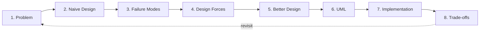

# The LLD Method

> Low-Level Design is not "draw classes." It is a disciplined method: expose the forces, choose a structure that resolves them, document the trade-offs, and only then write the code. The class diagram is the *output* of LLD; the *thinking* happens before the diagram.

## What you already know

From [[04-Abstraction-and-Models]]: every design is a model built for a purpose. LLD is the act of building the *implementation-oriented* model — the one that will become code.

From [[06-Coupling-and-Cohesion]]: the two forces behind every design decision are coupling and cohesion. LLD is the practice of choosing structures that minimize coupling and maximize cohesion *given the specific constraints of the problem*.

From [[08-Trade-offs-Everywhere]]: there are no solutions, only trade-offs. LLD formalizes this — every design decision in LLD is a trade-off, and the method requires you to write it down.

From [[00-UML-As-Modeling-Language]]: UML is a notation for the design; LLD is the *process* that produces the design. UML is the map; LLD is the surveying.

From [[02-Use-Cases]]: every LLD starts from a use case. The use case is the contract the design must implement.

## Why this layer exists

A common mistake among engineers: jump from "we need to build a transfer feature" straight to "let me write a `TransferService` class with a `transfer()` method." The result is a design that works for the happy path, fails on the extensions, and is impossible to evolve.

LLD exists to slow you down at the right moment — *before* you commit to code. The method forces you to:

1. **State the problem** precisely, with its invariants.
2. **Sketch the naive design** — what you would build if you did not think hard.
3. **Find the failure modes** of the naive design — where it breaks under concurrency, failure, scale, or change.
4. **Name the design forces** that the naive design ignored — see [[01-Design-Forces]].
5. **Choose a better design** that resolves those forces — using patterns (see [[04-Enterprise-Patterns]]), architecture styles (see [[02-Layered-Architecture]] through [[04-Clean-Architecture]]), and explicit trade-offs.
6. **Draw the UML** that captures the chosen design.
7. **Implement** in code, with the trade-offs visible in comments and tests.
8. **Document the trade-offs** so future engineers understand why the design is what it is.

Skipping any of these steps produces a worse design. The order matters: you cannot choose a structure before you know the forces; you cannot document trade-offs before you have chosen.

## What is genuinely new here

- LLD as a **method**, not an artifact. The class diagram is the artifact; the method is what produces it.
- The eight-step pipeline: Problem → Naive Design → Failure → Forces → Better Design → UML → Implementation → Trade-offs.
- The discipline of writing down trade-offs as design artifacts (see [[08-Trade-offs-Everywhere]]).
- The recognition that LLD is *where trade-offs become first-class* — UML is a notation; LLD is the thinking.

## Concepts

### The eight-step pipeline



Each step has a specific output and a specific question it answers.

**1. Problem** — State the problem in one paragraph. List the invariants that must hold (see [[00-Banking-Case-Study]] for the Banking invariants). List the use case being designed (see [[02-Use-Cases]]).

**2. Naive Design** — Sketch the simplest possible design. What would a junior engineer build? This is *not* the design you will ship. It is the baseline against which you measure improvement.

**3. Failure Modes** — List how the naive design fails. Concurrency? Lost updates? Coupling? Testability? Performance? Each failure mode is a *gap* the better design must close.

**4. Design Forces** — Name the forces that the naive design ignored. Scalability, correctness, auditability, latency, maintainability, team structure (Conway's Law). See [[01-Design-Forces]].

**5. Better Design** — Choose a structure that resolves the forces. This is where architecture styles (layered, hexagonal, clean — see [[02-Layered-Architecture]] through [[04-Clean-Architecture]]) and patterns (Repository, Unit of Work, CQRS — see [[04-Enterprise-Patterns]]) come in. The choice is driven by the forces, not by fashion.

**6. UML** — Draw the design. Class diagram for structure, sequence diagram for behavior, state diagram for lifecycle. See the UML chapters.

**7. Implementation** — Write the code. The code should be a faithful expression of the UML. If it is not, either the UML is wrong or the code is.

**8. Trade-offs** — Write down what the design gives up. This is the most-skipped step and the most valuable. Future engineers will read this when they want to change the design; without it, they will assume the design is arbitrary and rewrite it.

### Why the order matters

You cannot skip steps. Skipping step 3 (failure modes) means you do not know what the design must survive. Skipping step 4 (forces) means you cannot justify the structure you chose. Skipping step 8 (trade-offs) means the next engineer cannot evaluate whether the design still fits.

You can iterate — the dashed arrow from Trade-offs back to Problem indicates that revisiting the design when constraints change is part of the method. But each pass through the pipeline is complete.

### The naive design is not a strawman

A common failure: deliberately making the naive design look bad so the better design looks good. This is dishonest. The naive design should be *what you would actually build if you did not think hard*. It is the design that passes code review in a hurry. Only by taking it seriously can you find its real failure modes.

## Banking application — applying the method

We will apply the method end-to-end to the transfer flow in [[06-Banking-LLD]]. Here is the outline.

**1. Problem.** Move money from account A to account B. Invariants: balance invariant (sum of ledger entries equals balance), no negative balances for savings, double-entry, atomicity, idempotency, auditability. Use case: [[02-Use-Cases]].

**2. Naive Design.**

```java
public void transfer(Long from, Long to, BigDecimal amount) {
    Account a = accountRepo.findById(from);
    Account b = accountRepo.findById(to);
    a.setBalance(a.getBalance().subtract(amount));
    b.setBalance(b.getBalance().add(amount));
    accountRepo.save(a);
    accountRepo.save(b);
}
```

**3. Failure Modes.**

- **Lost update**: two concurrent transfers from `a` both read balance=100, both write balance=80. Result: balance=80 instead of 60. (See [[01-Concurrency-Anomalies]].)
- **No ledger**: the balance changes but no audit trail. Violates invariant 6.
- **No atomicity**: if the process crashes between `save(a)` and `save(b)`, money disappears.
- **No idempotency**: a retried call transfers twice.
- **No validation**: status checks (FROZEN, CLOSED), overdraft limits, fraud — all missing.
- **Tight coupling**: the method reaches into the database directly; no separation between domain logic and persistence.

**4. Design Forces.**

- Correctness (no lost updates, no partial state)
- Atomicity (all-or-nothing)
- Auditability (ledger)
- Idempotency
- Validation (state, limits, fraud)
- Testability (mockable dependencies)
- Maintainability (separation of concerns)
- Latency (how fast can a transfer complete?)
- Scalability (how many transfers per second?)

See [[01-Design-Forces]] for how these conflict.

**5. Better Design.**

- Wrap the whole flow in a serializable transaction (see [[05-Serializability]]) — solves lost update and atomicity.
- Add a `LedgerPort` that writes two ledger entries per transfer — solves auditability and double-entry.
- Add an `IdempotencyStore` keyed by client-supplied idempotency key — solves idempotency.
- Move validation into the `Account` domain object (the `withdraw` method checks status and balance) — solves validation and improves testability.
- Inject `AccountPort`, `FraudPort`, `NotificationPort`, `LedgerPort` as interfaces — solves coupling (DIP, see [[05-DIP]]).
- Send the notification asynchronously (publish to a broker) — solves latency and decouples notification from transfer.

**6. UML.** See [[02-Sequence-Diagrams]] and [[01-Class-Diagrams]]. The class diagram shows the structure; the sequence diagram shows the transfer flow.

**7. Implementation.** See [[06-Banking-LLD]] for the full code.

**8. Trade-offs.**

- **Serializable isolation vs latency**: serializable is correct but slower than read-committed. We pay the latency because correctness is non-negotiable in banking.
- **Sync fraud check vs async**: we chose sync (the transfer waits for the fraud decision) because letting a fraudulent transfer through and reversing it later is more expensive than the latency. See [[08-Trade-offs-Everywhere]].
- **Async notification vs sync**: we chose async because the customer can tolerate a delayed email, but cannot tolerate a wrong balance.
- **Layered architecture vs hexagonal**: we chose hexagonal (see [[03-Hexagonal-Architecture]]) because the domain is long-lived and the infrastructure (database, broker) is likely to change. The trade-off: more interfaces, more files, more ceremony.
- **Single database vs database-per-service**: we chose single database for now; we will revisit if a bounded context (see [[03-Bounded-Contexts]]) becomes a deployment bottleneck.

Each trade-off is documented so future engineers know what would change the answer.

## Code / diagrams — the method as a Java skeleton

The method produces code shaped like this (full version in [[06-Banking-LLD]]):

```java
public final class TransferService implements TransferPort {
    private final AccountPort accounts;
    private final FraudPort fraud;
    private final NotificationPort notifications;
    private final LedgerPort ledger;
    private final IdempotencyStore idempotency;
    private final TransactionManager tx;

    public TransferResult transfer(TransferRequest req) {
        // 1. Idempotency (force: idempotency)
        Optional<TransferResult> prior = idempotency.lookup(req.idempotencyKey());
        if (prior.isPresent()) return prior.get();

        // 2. Load and validate (force: correctness, validation)
        Account from = accounts.load(req.from());
        Account to   = accounts.load(req.to());

        // 3. Fraud (force: correctness — do not let fraud through)
        FraudDecision decision = fraud.evaluate(req);

        // 4. Execute atomically (force: atomicity, no lost update)
        TransferResult result = tx.inTransaction(() -> {
            from.withdraw(req.amount());     // validation is inside
            to.deposit(req.amount());
            ledger.write(req.from(), req.amount().negate(), req.transferId());
            ledger.write(req.to(),   req.amount(),         req.transferId());
            accounts.save(from);
            accounts.save(to);
            return TransferResult.completed();
        });

        // 5. Async notification (force: latency — decouple)
        notifications.notifyAsync(new TransferEvent(req));

        // 6. Record idempotency (force: idempotency on retry)
        idempotency.store(req.idempotencyKey(), result);
        return result;
    }
}
```

Each comment is a force. Each dependency is an interface. The transaction manager wraps the mutation. The ledger records the audit. The notification is async. Every choice in the method is visible in the code.

## What can go wrong

- **Skipping the naive design.** Engineers who skip step 2 often miss failure modes because they have not visualized what *would* go wrong with the simple approach.
- **Listing forces without conflict.** A list of forces that all point the same way is suspicious. Real problems have forces that conflict (correctness vs latency, auditability vs storage cost). If your forces do not conflict, you have not found the hard part.
- **Choosing a structure by fashion.** "We'll use microservices because everyone does" is not a design decision. The structure must be justified by the forces. If a force does not point to that structure, the structure is wrong.
- **Drawing UML before choosing a structure.** UML captures the design; it does not produce it. If you start with UML, you are drawing what you hope to have, not what you have designed.
- **Implementing before trade-offs.** Once code is written, the trade-offs are baked in. Documenting them after is harder because you have to reverse-engineer your own choices.
- **No revisit loop.** Constraints change. A design that fit at 1,000 transfers per second may not fit at 100,000. The trade-off document should say *when* to revisit.

## Trade-offs

- **Time spent in LLD vs time spent in code.** More LLD upfront = less rework later, but LLD has diminishing returns. The right amount: enough to expose the forces and choose a structure, not so much that you are designing in the abstract.
- **Formal vs informal LLD.** A formal LLD document (eight sections, trade-off table, UML diagrams) is rigorous but slow. An informal LLD (whiteboard sketch, verbal discussion) is fast but lossy. The right level depends on team size and the criticality of the system. For banking, formal. For a prototype, informal.
- **LLD as a one-person activity vs a team activity.** Solo LLD is fast but blind to the team's collective experience. Team LLD is slower but catches more failure modes. The right balance: solo for the sketch, team for the review.

## Forward links

- [[01-Design-Forces]] — the vocabulary of forces, in detail.
- [[02-Layered-Architecture]] through [[04-Clean-Architecture]] — the architecture styles the method chooses between.
- [[05-Architecture-Trade-offs]] — the trade-offs the method must document.
- [[06-Banking-LLD]] — the method applied end-to-end to the transfer flow.
- [[00-UML-As-Modeling-Language]] — the notation LLD uses for the UML step.
- [[08-Trade-offs-Everywhere]] — the meta-force that LLD formalizes.
- [[04-Enterprise-Patterns]] — the patterns the method reaches for when choosing a structure.
- [[00-ACID]] — what the transactional boundary in step 5 actually guarantees.
