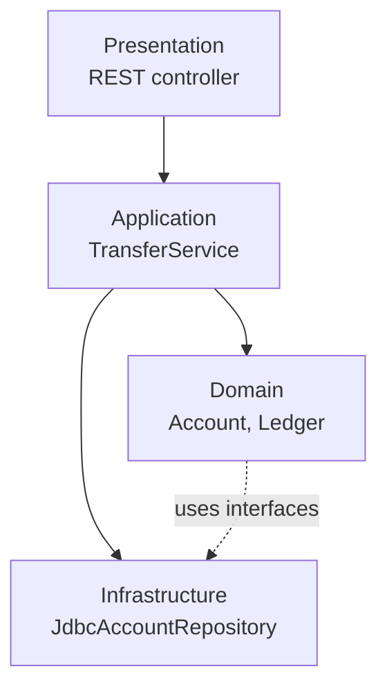
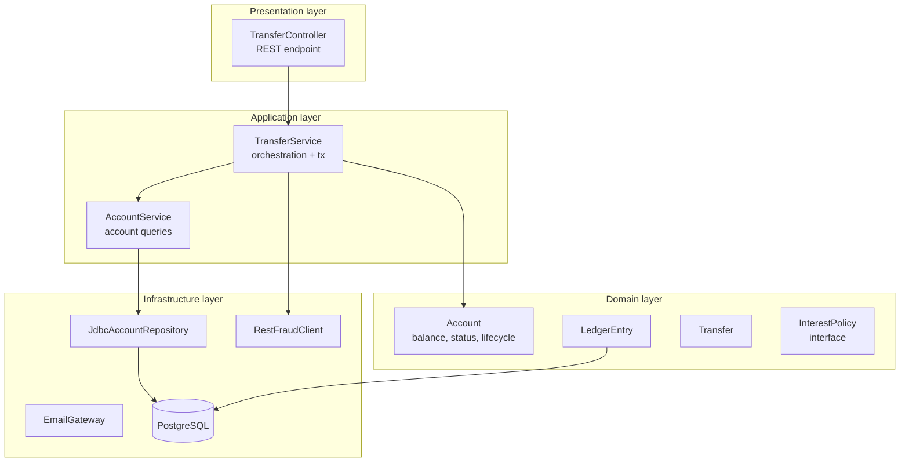

# Layered Architecture

> The classic 4-layer architecture: Presentation → Application → Domain → Infrastructure. Familiar, simple, and the default for most business applications. Its weakness is that the layers hide the domain, leading to the "anemic domain model" anti-pattern.

## What you already know

From [[03-Dependency-As-Root-Concept]]: dependencies should point toward stability. In a layered architecture, dependencies point downward — Presentation depends on Application, Application depends on Domain, Domain depends on Infrastructure. The Domain is the most stable layer; Infrastructure is the most volatile. The arrows point the wrong way.

From [[06-Coupling-and-Cohesion]]: each layer is a cohesion boundary — all the code responsible for one concern lives together. The coupling between layers is controlled by the allowed dependency direction.

From [[05-DIP]]: the Dependency Inversion Principle says "depend on abstractions, not concretions." Layered architecture often violates this — the Domain layer ends up depending on infrastructure interfaces defined in the Infrastructure layer, which inverts the stability direction.

From [[05-Anemic-vs-Rich-Models]]: a rich domain model has behavior; an anemic one is just data. Layered architectures tend to produce anemic models because the behavior migrates up to the Application layer.

## Why this layer exists

Every system has at least three concerns:

1. **User interaction** — receiving requests, returning responses.
2. **Business logic** — the rules that make the system valuable.
3. **Persistence and external systems** — databases, message brokers, third-party APIs.

If you mix these in one layer, every change ripples everywhere. A change to the database schema touches the business logic; a change to the API touches the persistence. The system becomes a tangled ball of yarn.

Layered architecture separates these concerns into horizontal layers, with a strict rule: **dependencies point downward only**. The Presentation layer may call the Application layer; the Application layer may call the Domain layer; the Domain layer may call the Infrastructure layer. No layer may call upward. This rule keeps the dependency graph acyclic and the layers independently testable.

The classic decomposition adds a fourth layer — Application vs Domain — to separate *use-case orchestration* (Application) from *business rules* (Domain). This separation is what makes the architecture testable and the domain logic reusable across multiple use cases.

## What is genuinely new here

- The four layers and their responsibilities.
- The dependency rule: **dependencies point downward**.
- The weakness: the Domain ends up depending on Infrastructure, which violates DIP and stability.
- The "anemic domain model" temptation — when behavior migrates upward, the Domain becomes a data bag.
- The cure that leads to Hexagonal (see [[03-Hexagonal-Architecture]]) and Clean (see [[04-Clean-Architecture]]).

## Concepts

### The four layers

| Layer | Responsibility | Examples (Banking) |
|---|---|---|
| Presentation | Receive requests, return responses; format conversion | REST controllers, JSON serializers, GraphQL resolvers |
| Application | Orchestrate use cases; transaction boundaries; DTOs | `TransferService`, `OnboardingService`, `StatementService` |
| Domain | Business rules; invariants; domain entities | `Account`, `LedgerEntry`, `Transfer`, `InterestPolicy` |
| Infrastructure | Persistence; external systems; framework code | `JdbcAccountRepository`, `RestFraudClient`, `EmailGateway` |

The flow of a request:



The Application layer orchestrates: load accounts from Infrastructure, invoke Domain methods, save back to Infrastructure. The Domain layer contains the rules (balance invariant, state transitions). The Infrastructure layer knows about databases and external APIs.

### The dependency rule

**Dependencies point downward.** Presentation depends on Application; Application depends on Domain and Infrastructure; Domain depends on Infrastructure (for interfaces like `AccountRepository`); Infrastructure depends on nothing in the application (it implements interfaces the upper layers define or use).

The key weakness: in the naive layered architecture, the Domain depends on Infrastructure interfaces that are *defined in the Infrastructure layer*. This means a change to the Infrastructure layer's interface can break the Domain. The dependency direction is wrong — the stable Domain depends on the volatile Infrastructure.

The fix (which leads to Hexagonal/Clean) is to define the interfaces *in the Domain layer* and let Infrastructure implement them. This is DIP — see [[05-DIP]].

### Closed vs open layers

A **closed layer** means requests from above must pass through it. A **open layer** means requests can skip it.

In the classic 4-layer, all layers are closed: a request from Presentation cannot skip Application to reach Domain directly. This is good for separation but adds overhead.

Some architectures add an optional "Service" layer between Application and Domain, marked as open — it can be skipped for simple cases. Most modern codebases collapse Service into Application.

## Banking application

The Banking system in layered architecture looks like this:



Reading the diagram:

- `TransferController` (Presentation) receives the HTTP request and delegates to `TransferService`.
- `TransferService` (Application) orchestrates: load accounts, validate, call fraud, execute transaction, send notification.
- `Account`, `LedgerEntry`, `Transfer`, `InterestPolicy` (Domain) hold the business rules.
- `JdbcAccountRepository`, `RestFraudClient`, `EmailGateway` (Infrastructure) talk to external systems.

## Code / diagrams

```java
// ===== Presentation layer =====
@RestController
@RequestMapping("/transfers")
public final class TransferController {
    private final TransferService transferService;
    public TransferController(TransferService s) { this.transferService = s; }

    @PostMapping
    public ResponseEntity<TransferResponse> transfer(@RequestBody TransferRequest req) {
        TransferResult result = transferService.transfer(req);
        return ResponseEntity.ok(TransferResponse.from(result));
    }
}

// ===== Application layer =====
@Service
public final class TransferService {
    private final AccountRepository accounts;       // interface from Domain
    private final FraudClient fraud;                // interface from Domain
    private final NotificationGateway notifications;// interface from Domain
    private final LedgerRepository ledger;          // interface from Domain
    private final TransactionManager tx;

    public TransferService(AccountRepository accounts, FraudClient fraud,
                           NotificationGateway notifications, LedgerRepository ledger,
                           TransactionManager tx) {
        this.accounts = accounts;
        this.fraud = fraud;
        this.notifications = notifications;
        this.ledger = ledger;
        this.tx = tx;
    }

    @Transactional
    public TransferResult transfer(TransferRequest req) {
        Account from = accounts.findById(req.from()).orElseThrow();
        Account to   = accounts.findById(req.to()).orElseThrow();
        FraudDecision decision = fraud.evaluate(req);
        if (decision == FraudDecision.REJECTED) return TransferResult.rejected();
        if (decision == FraudDecision.REVIEW)   return TransferResult.pendingReview();

        from.withdraw(req.amount());
        to.deposit(req.amount());
        ledger.append(from.id(), req.amount().negate());
        ledger.append(to.id(),   req.amount());
        accounts.save(from);
        accounts.save(to);
        notifications.notifyAsync(new TransferEvent(req));
        return TransferResult.completed();
    }
}

// ===== Domain layer =====
public abstract class Account {
    private final Long id;
    private final String iban;
    private BigDecimal balance;
    private AccountStatus status;

    public void deposit(BigDecimal amount) {
        if (status != AccountStatus.ACTIVE && status != AccountStatus.FROZEN)
            throw new IllegalStateTransitionException("deposit: " + status);
        this.balance = this.balance.add(amount);
    }

    public void withdraw(BigDecimal amount) {
        if (status != AccountStatus.ACTIVE)
            throw new IllegalStateTransitionException("withdraw: " + status);
        if (!canWithdraw(amount)) throw new IllegalArgumentException("insufficient");
        this.balance = this.balance.subtract(amount);
    }
    protected abstract boolean canWithdraw(BigDecimal amount);
}

public interface AccountRepository {
    Optional<Account> findById(Long id);
    void save(Account account);
}

// ===== Infrastructure layer =====
@Repository
public final class JdbcAccountRepository implements AccountRepository {
    private final JdbcTemplate jdbc;
    public JdbcAccountRepository(JdbcTemplate jdbc) { this.jdbc = jdbc; }

    @Override
    public Optional<Account> findById(Long id) {
        // SELECT from accounts table, instantiate Account subclass
        return Optional.empty();
    }

    @Override
    public void save(Account account) {
        // UPDATE accounts SET balance = ?, status = ? WHERE id = ?
    }
}
```

### Notes on the code (continued)

- The `AccountRepository` interface is defined in the Domain layer. `JdbcAccountRepository` is in Infrastructure and implements it. This is DIP applied — the dependency direction is inverted from "Domain depends on JDBC" to "JDBC depends on Domain's interface."
- The `@Transactional` annotation on `TransferService.transfer()` marks the transaction boundary. This is application-layer concern; the Domain does not know about transactions.
- The `Account` class has behavior (`deposit`, `withdraw`, status checks). This is a *rich* domain model. If `Account` only had getters and setters, it would be anemic — see [[05-Anemic-vs-Rich-Models]].

## What can go wrong

- **The anemic domain model.** When behavior migrates up to the Application layer, the Domain becomes a data bag. The `Account` class becomes `getBalance()`, `setBalance()`, `getStatus()`, `setStatus()` — no rules, no invariants. The Application layer ends up doing all the work, and the rules are scattered across services. The cure: push behavior down into the Domain. `withdraw()` belongs in `Account`, not in `TransferService`.
- **Layers that are too thin.** If the Application layer just delegates to the Domain, it adds no value. Either remove it (let Presentation call Domain directly) or give it a real responsibility (transaction management, orchestration of multiple Domain objects).
- **Layers that are too fat.** If the Application layer holds business rules, the Domain is anemic. Push rules down.
- **Circular dependencies between layers.** Domain depends on Infrastructure; Infrastructure depends on Domain. This happens when Infrastructure interfaces are defined in the Infrastructure layer and the Domain uses them. The cure: define the interfaces in the Domain layer (DIP).
- **Cross-cutting concerns bleeding into layers.** Logging, security, transactions are cross-cutting. They should be handled by aspects or middleware, not scattered through every layer.
- **Layered monolith that should be services.** If the layers are deployed independently (e.g., a separate frontend, separate backend), the layered architecture becomes a distributed monolith — same coupling, plus network. See [[05-Architecture-Trade-offs]].
- **Testing only the top layer.** Each layer should be tested in isolation. If only the Presentation layer is tested (via end-to-end tests), the test suite is slow and brittle.

## Trade-offs

- **Simplicity vs isolation.** Layered architecture is simple to understand and apply. The cost is that the Domain depends on Infrastructure (unless DIP is applied) and the layers can leak.
- **Familiarity vs fashion.** Every engineer knows layered architecture. The cost is that it is "boring" and teams may reach for newer styles (Hexagonal, Clean) without the forces justifying them.
- **Speed of development vs long-term maintainability.** Layered architecture is fast to start with — you can build a CRUD app in an afternoon. As the system grows, the layers tend to leak and the Domain becomes anemic. The cure is discipline: keep behavior in the Domain, define interfaces in the Domain, treat Infrastructure as a plugin.
- **Closed vs open layers.** Closed layers enforce separation but add call overhead. Open layers allow shortcuts but reduce separation. The default is closed; open only when forced.
- **Layered vs Hexagonal vs Clean.** Layered is the simplest; Hexagonal (see [[03-Hexagonal-Architecture]]) isolates the Domain more aggressively; Clean (see [[04-Clean-Architecture]]) is Hexagonal with more layers. The choice depends on the forces — see [[05-Architecture-Trade-offs]].

## Forward links

- [[03-Hexagonal-Architecture]] — the next step: ports and adapters, domain at the center.
- [[04-Clean-Architecture]] — concentric circles, dependency rule pointing inward.
- [[05-Architecture-Trade-offs]] — when to choose which style.
- [[05-DIP]] — the principle that fixes the layered architecture's dependency direction.
- [[05-Anemic-vs-Rich-Models]] — the anti-pattern layered architectures tend to produce.
- [[04-Enterprise-Patterns]] — Repository and Unit of Work as the patterns that bridge Application and Infrastructure.
- [[06-Banking-LLD]] — the Banking system, designed in layered (then upgraded to Hexagonal).
