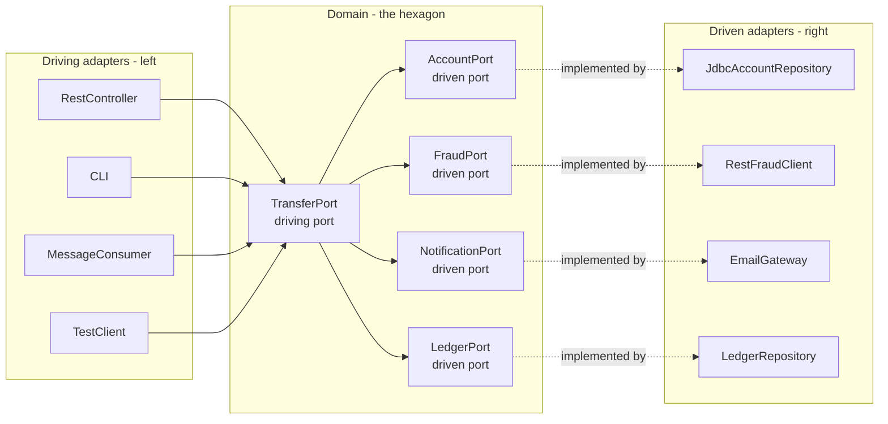
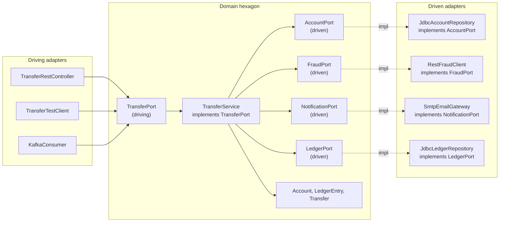

# Hexagonal Architecture (Ports and Adapters)

> Hexagonal Architecture, coined by Alistair Cockburn, isolates the domain at the center of the system. The domain exposes **ports** (interfaces) that define what it needs and what it offers. **Adapters** implement those ports — driving adapters on the left (controllers, CLI, message consumers), driven adapters on the right (databases, external APIs, message producers). The domain never knows about the technology on either side.

## What you already know

From [[03-Dependency-As-Root-Concept]]: dependencies should point toward stability. The domain is the most stable part of the system (the business rules change less often than the technology); therefore everything else should depend on the domain, not vice versa.

From [[05-DIP]]: depend on abstractions, not concretions. Ports are abstractions defined by the domain; adapters are concretions that depend on those abstractions. This inverts the dependency direction from "domain depends on infrastructure" to "infrastructure depends on domain."

From [[02-Layered-Architecture]]: the classic layered architecture has a weakness — the domain ends up depending on infrastructure interfaces defined in the infrastructure layer. Hexagonal fixes this by *moving the interfaces into the domain* and making infrastructure implement them.

From [[04-Abstraction-and-Models]]: a port is an abstraction — it hides the technology (REST, JDBC, Kafka) behind a domain-shaped contract. The same domain can be driven by a REST controller today and a gRPC controller tomorrow, with no change to the domain.

## Why this layer exists

Layered architecture is simple but has two recurring problems:

1. **The domain leaks into infrastructure concerns.** When the domain uses `JdbcTemplate` directly, it knows about SQL. When it serializes to JSON, it knows about HTTP. The domain becomes coupled to the technology, and changing the technology means rewriting the domain.

2. **The domain is hard to test in isolation.** To test `TransferService`, you need a database, a fraud service, and a notification service. Either you stand them all up (slow, brittle) or you mock them (which requires the domain to depend on interfaces, which the layered architecture does not enforce).

Hexagonal Architecture solves both by *putting the domain at the center* and making everything else an adapter. The domain defines ports (interfaces); adapters implement them. The domain is tested by replacing adapters with in-memory fakes. The technology changes by swapping adapters, not by touching the domain.

The shape is a hexagon — not because six sides are special, but because Cockburn wanted a shape that emphasized *multiple* ports (driving and driven) on equal footing, not a top-down layered triangle.

## What is genuinely new here

- **Ports** — interfaces defined by the domain. Two flavors: driving (the domain offers, e.g., `TransferPort`) and driven (the domain needs, e.g., `AccountPort`).
- **Adapters** — implementations of ports. Driving adapters (left side) call into the domain; driven adapters (right side) are called by the domain via the port.
- **The domain knows nothing about adapters.** It only knows the port interfaces it defines. The wiring (which adapter implements which port) happens at application startup, typically via dependency injection.
- **Symmetry** — the domain can be driven by a REST controller, a CLI, a message consumer, or a test, all with equal status. Same on the driven side: it can use PostgreSQL, a mock, or an in-memory store.

## Concepts

### The hexagon shape



Reading the diagram:

- **Driving adapters** (left) call into the domain. They use a *driving port* — an interface the domain offers (e.g., `TransferPort`).
- **Driven adapters** (right) are called by the domain. The domain defines a *driven port* (e.g., `AccountPort`) and the adapter implements it.
- The arrows from driving adapters point *into* the domain. The arrows from the domain to driven ports point *out* of the domain — but the *implementation* of those ports is provided by the adapters, which depend on the port (DIP). So the dependency direction at compile time is: adapter → port (defined in domain) ← domain uses port.

This is the key insight: at runtime, the domain *calls* the adapter (via the port). At compile time, the adapter *depends on* the port (which lives in the domain). The dependency direction is inverted — the adapter depends on the domain, not the other way around.

### Driving port vs driven port

- **Driving port** — the domain's public API. The use cases the domain supports. Example: `TransferPort.transfer(request)`. Implemented by an application service inside the domain; called by driving adapters (controllers, consumers).
- **Driven port** — the domain's needs. The capabilities the domain requires from the outside world. Example: `AccountPort.load(id)`. Implemented by driven adapters (JDBC repositories, REST clients); called by the domain.

The vocabulary shift from "service" and "repository" to "driving port" and "driven port" matters: it forces you to think about which direction the dependency goes.

### Ports as contracts

A port is a *contract* with a specific shape — a domain-shaped interface, not a technology-shaped one. A bad port leaks the technology: `JdbcAccountPort` with a method `executeQuery(String sql)`. A good port hides it: `AccountPort` with `load(id)`, `save(account)`.

The test of a good port: could you swap JDBC for a file-based store without changing the port? If yes, the port is domain-shaped. If no, the port is leaking infrastructure.

## Banking application

The Banking system in Hexagonal Architecture:



## Code / diagrams

```java
// ===== Domain layer — defines the ports and the use case =====

// Driving port: the domain's public API for transfers
public interface TransferPort {
    TransferResult transfer(TransferRequest request);
}

// Driven ports: what the domain needs from the outside
public interface AccountPort {
    Account load(AccountId id);
    void save(Account account);
}
public interface FraudPort {
    FraudDecision evaluate(TransferRequest request);
}
public interface NotificationPort {
    void notifyAsync(TransferEvent event);
}
public interface LedgerPort {
    void write(AccountId account, BigDecimal amount, TransferId transfer);
}

// The use case — implements the driving port, uses the driven ports
public final class TransferService implements TransferPort {
    private final AccountPort accounts;
    private final FraudPort fraud;
    private final NotificationPort notifications;
    private final LedgerPort ledger;
    private final TransactionManager tx;
    private final IdempotencyStore idempotency;

    public TransferService(AccountPort accounts, FraudPort fraud,
                           NotificationPort notifications, LedgerPort ledger,
                           TransactionManager tx, IdempotencyStore idempotency) {
        this.accounts = accounts;
        this.fraud = fraud;
        this.notifications = notifications;
        this.ledger = ledger;
        this.tx = tx;
        this.idempotency = idempotency;
    }

    @Override
    public TransferResult transfer(TransferRequest req) {
        Optional<TransferResult> prior = idempotency.lookup(req.idempotencyKey());
        if (prior.isPresent()) return prior.get();

        Account from = accounts.load(req.from());
        Account to   = accounts.load(req.to());
        FraudDecision decision = fraud.evaluate(req);

        TransferResult result = switch (decision) {
            case APPROVED -> tx.inTransaction(() -> {
                from.withdraw(req.amount());
                to.deposit(req.amount());
                ledger.write(req.from(), req.amount().negate(), req.transferId());
                ledger.write(req.to(),   req.amount(),         req.transferId());
                accounts.save(from);
                accounts.save(to);
                return TransferResult.completed();
            });
            case REJECTED -> TransferResult.rejected();
            case REVIEW   -> TransferResult.pendingReview();
        };

        if (result.isCompleted()) notifications.notifyAsync(new TransferEvent(req));
        idempotency.store(req.idempotencyKey(), result);
        return result;
    }
}

// ===== Driving adapters — call into the domain =====

@RestController
@RequestMapping("/transfers")
public final class TransferRestController {
    private final TransferPort transferPort;  // depends on the port, not the service
    public TransferRestController(TransferPort port) { this.transferPort = port; }

    @PostMapping
    public ResponseEntity<TransferResponse> transfer(@RequestBody TransferRequestDto dto) {
        TransferRequest req = TransferRequestMapper.toDomain(dto);
        TransferResult result = transferPort.transfer(req);
        return ResponseEntity.ok(TransferResponseMapper.from(result));
    }
}

// ===== Driven adapters — implement the domain's driven ports =====

public final class JdbcAccountRepository implements AccountPort {
    private final JdbcTemplate jdbc;
    public JdbcAccountRepository(JdbcTemplate jdbc) { this.jdbc = jdbc; }

    @Override
    public Account load(AccountId id) {
        return jdbc.queryForObject(
            "SELECT id, iban, balance, status, type FROM accounts WHERE id = ?",
            (rs, n) -> mapAccount(rs), id.value());
    }

    @Override
    public void save(Account account) {
        jdbc.update("UPDATE accounts SET balance = ?, status = ? WHERE id = ?",
            account.balance(), account.status().name(), account.id().value());
    }

    private Account mapAccount(ResultSet rs) throws SQLException {
        // instantiate CheckingAccount or SavingsAccount based on type
        return null;
    }
}

public final class RestFraudClient implements FraudPort {
    private final RestClient http;
    private final String fraudServiceUrl;
    public RestFraudClient(RestClient http, String url) {
        this.http = http; this.fraudServiceUrl = url;
    }

    @Override
    public FraudDecision evaluate(TransferRequest req) {
        FraudResponseDto dto = http.post()
            .uri(fraudServiceUrl + "/evaluate")
            .body(FraudRequestMapper.toDto(req))
            .retrieve()
            .body(FraudResponseDto.class);
        return FraudDecision.valueOf(dto.decision());
    }
}

// ===== Test adapter — a driving adapter for testing =====

public final class TransferTestClient implements TransferPort {
    private final TransferPort delegate;
    public List<TransferEvent> notifications = new ArrayList<>();

    public TransferTestClient(TransferPort delegate) { this.delegate = delegate; }

    @Override
    public TransferResult transfer(TransferRequest req) {
        return delegate.transfer(req);
    }
}
```

### Notes on the code (continued)

- `TransferPort`, `AccountPort`, `FraudPort`, `NotificationPort`, `LedgerPort` all live in the domain package. The domain owns them.
- `TransferRestController` depends on `TransferPort` (the interface), not on `TransferService` (the concrete class). This means the controller can be tested with a mock port, and the service can be swapped without touching the controller.
- `JdbcAccountRepository` and `RestFraudClient` depend on the domain's ports. They are in the infrastructure package. The domain does not know they exist.
- A test adapter (`TransferTestClient`) can wrap the real service and capture events. Or, in unit tests, an in-memory `AccountPort` implementation can replace the JDBC one — no database needed.

### Wiring at startup

Spring (or any DI container) wires the adapters to the ports:

```java
@Configuration
public class Wiring {

    @Bean
    public TransferPort transferPort(AccountPort accounts, FraudPort fraud,
                                     NotificationPort notifications, LedgerPort ledger,
                                     TransactionManager tx, IdempotencyStore idempotency) {
        return new TransferService(accounts, fraud, notifications, ledger, tx, idempotency);
    }

    @Bean
    public AccountPort accountPort(JdbcTemplate jdbc) {
        return new JdbcAccountRepository(jdbc);
    }

    @Bean
    public FraudPort fraudPort(RestClient http, @Value("${fraud.url}") String url) {
        return new RestFraudClient(http, url);
    }

    @Bean
    public NotificationPort notificationPort(JavaMailSender mail) {
        return new SmtpEmailGateway(mail);
    }

    @Bean
    public LedgerPort ledgerPort(JdbcTemplate jdbc) {
        return new JdbcLedgerRepository(jdbc);
    }
}
```

The wiring is the *only* place that knows about specific adapters. The domain, the controllers, and the adapters themselves are all decoupled. Changing `JdbcAccountRepository` to `MongoAccountRepository` is a one-line change in the wiring; the domain and the controller are untouched.

## What can go wrong

- **Ports that leak technology.** A port named `JdbcAccountPort` or a method `executeQuery(String sql)` is leaking. The cure: rename to `AccountPort`, redesign methods to be domain-shaped.
- **Too many ports.** A domain with twenty ports is doing too much. Group related ports; consider whether the bounded context (see [[03-Bounded-Contexts]]) is too wide.
- **Too few ports.** A domain with one port for everything is the "god interface" anti-pattern — see [[04-ISP]]. Split by use case.
- **Adapters that contain domain logic.** A `JdbcAccountRepository` that enforces invariants is leaking domain rules into infrastructure. The cure: push the rules into the domain; the adapter should only translate.
- **The domain depending on adapter types.** If `TransferService` imports `JdbcAccountRepository`, the hexagon is broken. The cure: depend on the port only.
- **Anemic domain inside a hexagon.** Hexagonal does not prevent anemia — see [[05-Anemic-vs-Rich-Models]]. The domain still needs to be rich.
- **Over-engineering for simple systems.** A CRUD app does not need Hexagonal. The indirection of ports and adapters adds files and ceremony that small systems do not benefit from. See [[05-Architecture-Trade-offs]].

## Trade-offs

- **Isolation vs ceremony.** Hexagonal isolates the domain completely. The cost is more interfaces, more files, more wiring code. For long-lived, domain-heavy systems, the trade-off pays. For short-lived, simple systems, it does not.
- **Testability vs simplicity.** Hexagonal makes the domain trivially testable (in-memory fakes for driven ports; test doubles for driving ports). The cost is the indirection — every test must wire up the ports.
- **Flexibility vs immediacy.** Hexagonal lets you swap technologies (PostgreSQL → MongoDB, REST → gRPC) without touching the domain. The cost is that you must define the ports upfront, before you know all the use cases.
- **Hexagonal vs Layered.** Layered is simpler; Hexagonal is more isolated. The choice depends on the forces — see [[05-Architecture-Trade-offs]]. For banking, where the domain is long-lived and the technology changes, Hexagonal is justified.
- **Hexagonal vs Clean.** Same idea, different framing. Clean Architecture adds more layers (Entities, Use Cases, Interface Adapters, Frameworks) and emphasizes the Dependency Rule. See [[04-Clean-Architecture]].

## Forward links

- [[04-Clean-Architecture]] — the same idea, with concentric circles and the Dependency Rule.
- [[02-Layered-Architecture]] — the simpler precursor; Hexagonal fixes its weaknesses.
- [[05-Architecture-Trade-offs]] — when to choose Hexagonal vs Layered vs Clean.
- [[05-DIP]] — the principle Hexagonal is built on.
- [[04-Enterprise-Patterns]] — Repository and Unit of Work are the driven-port patterns Hexagonal uses.
- [[03-Bounded-Contexts]] — the domain-level concept that defines the hexagon's scope.
- [[05-Anemic-vs-Rich-Models]] — the risk even inside a hexagon.
- [[06-Banking-LLD]] — the Banking system designed in Hexagonal.
