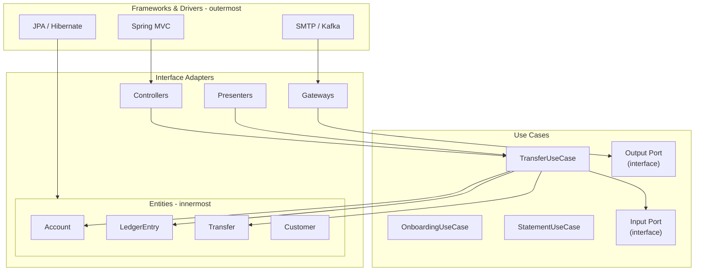
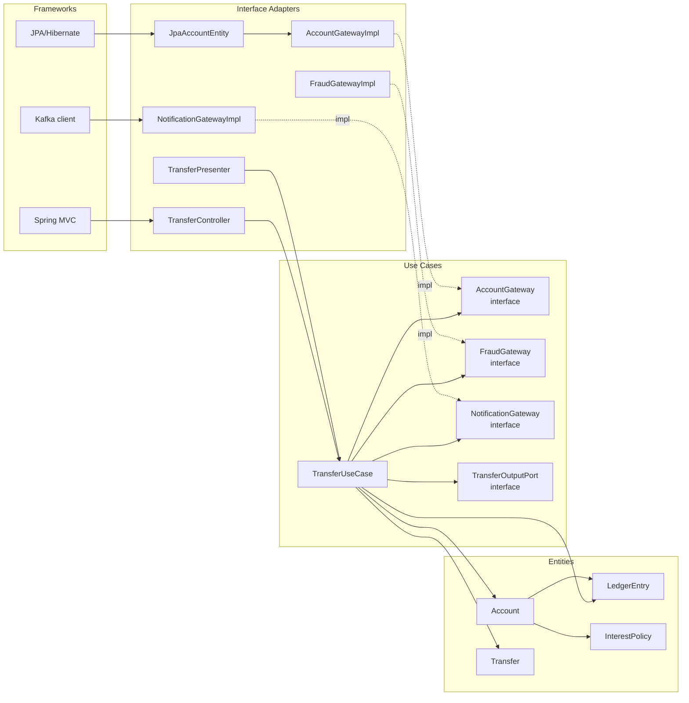

# Clean Architecture

> Uncle Bob's concentric circles: **Entities → Use Cases → Interface Adapters → Frameworks**. The Dependency Rule says dependencies point inward only. Clean Architecture is Hexagonal with a more specific layering and a stronger emphasis on the dependency direction.

## What you already know

From [[03-Hexagonal-Architecture]]: ports and adapters isolate the domain. Clean Architecture is the same idea, expressed as concentric circles with named layers and a strict dependency rule. If you understand Hexagonal, you understand Clean — the differences are mostly vocabulary and emphasis.

From [[03-Dependency-As-Root-Concept]]: dependencies should point toward stability. Clean Architecture's Dependency Rule formalizes this: dependencies point *inward*, toward the most stable layer (Entities). The outermost layer (Frameworks) is the most volatile.

From [[05-DIP]]: depend on abstractions, not concretions. Clean Architecture uses DIP everywhere — every layer talks to the next inner layer via an interface defined in the inner layer.

From [[04-Abstraction-and-Models]]: each circle in Clean Architecture is an abstraction. Moving outward adds detail (frameworks, databases, UI); moving inward throws away detail (just the business rules). The Entities layer is the most abstract; the Frameworks layer is the most concrete.

## Why this layer exists

Hexagonal Architecture isolates the domain but does not prescribe how to organize the code *inside* the domain. A hexagon can have a flat list of use cases and entities, or it can have internal layering. Clean Architecture prescribes the internal layering:

1. **Entities** — enterprise-wide business rules. The most stable, most abstract layer.
2. **Use Cases** — application-specific business rules. Orchestrates entities to fulfill use cases.
3. **Interface Adapters** — converters between the data shapes of the use cases and the data shapes of the external systems (controllers, presenters, gateways).
4. **Frameworks & Drivers** — the outermost layer: web frameworks, databases, UI libraries. The most volatile layer.

The Dependency Rule: **source code dependencies must point only inward, toward higher-level policies.** The inner circles must not know anything about the outer circles.

This rule is the same as Hexagonal's "domain does not depend on adapters." Clean Architecture makes the rule explicit and applies it at every layer boundary, not just at the domain boundary.

## What is genuinely new here

- The four named layers (Entities, Use Cases, Interface Adapters, Frameworks).
- The Dependency Rule: dependencies point inward, always.
- The clarification of **Entities** vs **Use Cases** — enterprise rules vs application rules. `Account` is an entity (the rules of banking); `TransferUseCase` is a use case (the rules of *this application* that uses accounts).
- The **Interface Adapters** layer — the conversion layer between domain-shaped data and framework-shaped data (DTOs, view models, ORM entities).
- The recognition that Clean Architecture and Hexagonal are the same idea, differently framed.

## Concepts

### The concentric circles



Reading the diagram:

- The Frameworks layer (outermost) contains Spring MVC, JPA, SMTP clients. These are volatile — they change with framework versions.
- The Interface Adapters layer contains controllers, presenters, gateways, and ORM entities. These adapt the outer world to the inner shapes.
- The Use Cases layer contains application-specific business rules — one class per use case. Each use case defines input and output ports (interfaces).
- The Entities layer (innermost) contains enterprise-wide rules — `Account`, `LedgerEntry`, `Transfer`, `Customer`. These are the most stable.

Arrows always point inward. The Frameworks layer is depended on by nothing inside; the Entities layer depends on nothing.

### The Dependency Rule in practice

The Dependency Rule is enforced by DIP at each boundary. When an inner layer needs to call something in an outer layer, it defines an interface (a "port" in Hexagonal terms) and the outer layer implements it.

Example: `TransferUseCase` needs to load an `Account`. It cannot call `JdbcAccountRepository` directly — that would be depending on the outer layer. Instead, it defines an `AccountGateway` interface (in the Use Cases layer) and `JdbcAccountRepository` implements it (in the Frameworks layer, via the Interface Adapters layer).

This is the same DIP pattern as Hexagonal; Clean Architecture just gives the layers explicit names and the rule explicit direction.

### Entities vs Use Cases — the key distinction

The clearest contribution of Clean Architecture is the separation of **Entities** from **Use Cases**.

- **Entities** are enterprise rules — they would exist even if there were no application. `Account` with its balance invariant, status lifecycle, and withdrawal rules would exist in *any* banking application: a teller system, a mobile app, a back-office batch processor. The rules are the same.
- **Use Cases** are application rules — they exist only in *this* application. `TransferUseCase` orchestrates the entities to fulfill the transfer flow. A different application (e.g., a back-office batch processor) would have a different use case (`BatchTransferUseCase`) that orchestrates the same entities differently.

The distinction matters for reuse. Entities can be shared across applications. Use cases are application-specific. If you mix them, you cannot reuse the entities.

In the Banking vault, this maps to:

- **Entities**: `Account`, `CheckingAccount`, `SavingsAccount`, `LedgerEntry`, `Transfer`, `Customer`, `InterestPolicy` (the interface).
- **Use cases**: `TransferUseCase`, `OnboardingUseCase`, `StatementUseCase`, `InterestAccrualUseCase`.

### Interface Adapters — the conversion layer

The Interface Adapters layer is the most-named and least-understood part of Clean Architecture. Its job is *conversion*: it translates between the data shapes of the use cases (domain objects) and the data shapes of the outer world (DTOs, ORM entities, view models).

- **Controllers** convert HTTP requests into use-case input DTOs.
- **Presenters** convert use-case output DTOs into HTTP responses.
- **Gateways** convert use-case data needs into repository calls.
- **ORM Entities** are JPA-annotated classes that the database understands; they are converted to and from domain entities at the boundary.

This conversion is what keeps the domain pure. The domain does not know about JSON or SQL; the interface adapters translate. The conversion is overhead — more code, more files — but it isolates the domain completely.

## Banking application

The Banking system in Clean Architecture:



## Code / diagrams

```java
// ===== Entities layer — enterprise rules =====
package com.bank.entities;

public abstract class Account {
    protected final AccountId id;
    protected final String iban;
    protected BigDecimal balance;
    protected AccountStatus status;

    public abstract boolean canWithdraw(BigDecimal amount);

    public void deposit(BigDecimal amount) {
        if (status != AccountStatus.ACTIVE && status != AccountStatus.FROZEN)
            throw new IllegalStateTransitionException("deposit: " + status);
        this.balance = this.balance.add(amount);
    }

    public void withdraw(BigDecimal amount) {
        if (status != AccountStatus.ACTIVE)
            throw new IllegalStateTransitionException("withdraw: " + status);
        if (!canWithdraw(amount)) throw new IllegalArgumentException("insufficient");
        this.balance = this.balance.subtract(amount);
    }
}

public record LedgerEntry(LedgerEntryId id, AccountId accountId,
                          BigDecimal amount, Instant occurredAt) {}

// ===== Use Cases layer — application rules =====
package com.bank.usecases;

public interface TransferInputPort {
    TransferOutput transfer(TransferInput input);
}

public interface TransferOutputPort {
    void present(TransferOutput output);
    void presentError(TransferError error);
}

public interface AccountGateway {
    Account load(AccountId id);
    void save(Account account);
}

public interface FraudGateway {
    FraudDecision evaluate(TransferInput input);
}

public interface NotificationGateway {
    void notifyAsync(TransferEvent event);
}

public final class TransferUseCase implements TransferInputPort {
    private final AccountGateway accounts;
    private final FraudGateway fraud;
    private final NotificationGateway notifications;
    private final LedgerGateway ledger;
    private final TransactionManager tx;
    private final TransferOutputPort output;

    public TransferUseCase(AccountGateway accounts, FraudGateway fraud,
                           NotificationGateway notifications, LedgerGateway ledger,
                           TransactionManager tx, TransferOutputPort output) {
        this.accounts = accounts;
        this.fraud = fraud;
        this.notifications = notifications;
        this.ledger = ledger;
        this.tx = tx;
        this.output = output;
    }

    @Override
    public TransferOutput transfer(TransferInput input) {
        Account from = accounts.load(input.from());
        Account to   = accounts.load(input.to());
        FraudDecision decision = fraud.evaluate(input);

        return switch (decision) {
            case APPROVED -> {
                TransferResult result = tx.inTransaction(() -> {
                    from.withdraw(input.amount());
                    to.deposit(input.amount());
                    ledger.write(input.from(), input.amount().negate());
                    ledger.write(input.to(),   input.amount());
                    accounts.save(from);
                    accounts.save(to);
                    return TransferResult.completed();
                });
                notifications.notifyAsync(new TransferEvent(input));
                yield new TransferOutput(result);
            }
            case REJECTED -> new TransferOutput(TransferResult.rejected());
            case REVIEW   -> new TransferOutput(TransferResult.pendingReview());
        };
    }
}

// ===== Interface Adapters layer =====
package com.bank.adapters;

@RestController
public final class TransferController {
    private final TransferInputPort useCase;
    private final TransferPresenter presenter;
    public TransferController(TransferInputPort useCase, TransferPresenter p) {
        this.useCase = useCase; this.presenter = p;
    }

    @PostMapping("/transfers")
    public ResponseEntity<?> transfer(@RequestBody TransferRequestDto dto) {
        TransferInput input = TransferMapper.toInput(dto);
        TransferOutput output = useCase.transfer(input);
        return presenter.toResponse(output);
    }
}

public final class JpaAccountGateway implements AccountGateway {
    private final AccountJpaRepository repo;
    public JpaAccountGateway(AccountJpaRepository repo) { this.repo = repo; }

    @Override
    public Account load(AccountId id) {
        AccountEntity entity = repo.findById(id.value()).orElseThrow();
        return AccountMapper.toDomain(entity);
    }

    @Override
    public void save(Account account) {
        AccountEntity entity = AccountMapper.toEntity(account);
        repo.save(entity);
    }
}

// ===== Frameworks layer =====
package com.bank.frameworks;

@Entity
@Table(name = "accounts")
public final class AccountEntity {
    @Id private Long id;
    private String iban;
    private BigDecimal balance;
    private String status;
    private String type;
    // getters/setters
}

public interface AccountJpaRepository extends JpaRepository<AccountEntity, Long> {}
```

### Notes on the code (continued)

- The `Account` entity has no JPA annotations. It lives in `com.bank.entities` and knows nothing about the database.
- `AccountEntity` (JPA-annotated) lives in `com.bank.frameworks`. It is a separate class.
- `JpaAccountGateway` (in Interface Adapters) converts between `AccountEntity` and `Account`. This conversion is the cost of Clean Architecture — extra code at every boundary.
- `TransferUseCase` depends only on interfaces (`AccountGateway`, `FraudGateway`, etc.) defined in the Use Cases layer. The implementations (`JpaAccountGateway`, etc.) depend on those interfaces (DIP).

## What can go wrong

- **Over-engineering for simple systems.** Clean Architecture adds four layers of indirection. A CRUD app does not need this. The forces (see [[01-Design-Forces]]) must justify the cost.
- **Conversion boilerplate.** Mapping between domain entities and JPA entities, between DTOs and inputs, between outputs and view models — this is a lot of code. Tools like MapStruct help, but the indirection remains.
- **The "Entities vs Use Cases" line is blurry.** Some rules are enterprise-wide but only invoked by one application. Where do they go? The rule of thumb: if the rule would survive a complete rewrite of the application, it is an Entity. If it would not, it is a Use Case.
- **Circular dependencies at the boundary.** If a Use Case needs an Entity, and the Entity needs to call back into the Use Case, you have a cycle. The cure: define an interface in the Entities layer and have the Use Case implement it (DIP, again).
- **Treating Clean Architecture as a religion.** The circles are a guide, not a law. Some systems need fewer layers; some need more (e.g., a "Services" layer between Use Cases and Interface Adapters for shared orchestration). Use what fits.
- **Anemic entities in the innermost layer.** If Entities are just data bags with no rules, the layering is decorative. The Entities must be rich — see [[05-Anemic-vs-Rich-Models]].

## Trade-offs

- **Isolation vs ceremony.** Clean Architecture isolates the domain more thoroughly than Hexagonal (more layers, more conversion). The cost is more files, more boilerplate, more indirection. Worth it for long-lived, domain-heavy systems; overkill for short-lived, simple ones.
- **Testability vs immediacy.** Clean Architecture makes the use cases testable in complete isolation — no framework, no database, no UI. The cost is that the use cases must be designed before the framework is chosen.
- **Purity vs pragmatism.** Strict Clean Architecture refuses to let any framework annotation touch the inner layers. Pragmatic Clean Architecture allows some leakage (e.g., Lombok annotations on entities) where the cost of purity exceeds the benefit.
- **Clean vs Hexagonal.** Same idea, different framing. Clean prescribes the internal layering of the domain; Hexagonal leaves it open. Choose based on whether you want the prescription.
- **Clean vs Layered.** Layered is simpler; Clean is more isolated. See [[05-Architecture-Trade-offs]] for the choice.

## Forward links

- [[03-Hexagonal-Architecture]] — the precursor; same idea, less prescription.
- [[02-Layered-Architecture]] — the simpler starting point.
- [[05-Architecture-Trade-offs]] — when to choose Clean.
- [[05-DIP]] — the principle Clean Architecture is built on.
- [[05-Anemic-vs-Rich-Models]] — the risk even inside Clean.
- [[02-Aggregates]] — DDD aggregates are the Entities layer, scoped to a single consistency boundary.
- [[06-Banking-LLD]] — the Banking system designed through Clean Architecture (or Hexagonal — same result).
