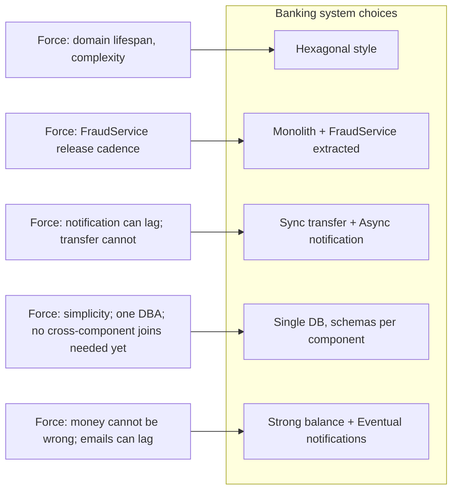

# Architecture Trade-offs

> Layered vs Hexagonal vs Clean. Monolith vs microservices. Synchronous vs event-driven. Shared database vs database-per-service. Every architecture decision is a trade-off. This chapter collects the canonical trade-off axes and gives the default that fits most starting points.

## What you already know

From [[08-Trade-offs-Everywhere]]: every design decision is a trade-off with four parts — axis, two ends, current position, the force pushing you. This chapter applies that framework to the architecture-level decisions.

From [[01-Design-Forces]]: forces conflict. Architecture trade-offs are how those conflicts resolve at the system structure level.

From [[02-Layered-Architecture]] through [[04-Clean-Architecture]]: the three architecture styles and their pros/cons. This chapter compares them head-to-head.

From [[00-LLD-Method]]: trade-offs are documented as design artifacts. This chapter is the artifact for the architecture-level decisions.

## Why this layer exists

Engineers ask "which architecture should we use?" The honest answer is "it depends." This chapter makes the "depends" explicit: each axis has forces pushing toward each end, and the right choice is the one that fits *your* forces.

The trap is choosing by fashion. Microservices are fashionable; Hexagonal is fashionable; event-driven is fashionable. But "fashionable" is not a force. A senior engineer chooses by *forces* — and is willing to choose a monolith if the forces push that way.

This chapter also gives the **default**: start with a layered monolith. Extract services only when forced. Choose the simpler structure until the simpler structure stops fitting. This is the principle of *reversible decisions* — start with what you can change, defer the one-way doors.

## What is genuinely new here

- The architecture trade-off axes, collected in one place.
- The principle of *reversible vs irreversible decisions* applied to architecture (see [[08-Trade-offs-Everywhere]]).
- The default: layered monolith, extract when forced.
- How to choose, not just what the options are.

## Concepts — the canonical axes

### Axis 1: Architecture style (Layered vs Hexagonal vs Clean)

| End | Layered | Hexagonal | Clean |
|---|---|---|---|
| Coupling | Looser than nothing, tighter than Hexagonal | Very loose — domain fully isolated | Very loose — domain isolated + internal layering |
| Testability | Good (with DIP) | Excellent | Excellent |
| Ceremony | Low | Medium | High |
| Best for | Simple apps, CRUD | Long-lived domain-heavy apps | Same as Hexagonal, with prescription |
| Worst for | Domain-heavy systems where domain leaks | Small systems where ceremony exceeds benefit | Same as Hexagonal |

**Default**: Layered. Move to Hexagonal when the domain becomes valuable enough to protect (long-lived, complex business rules). Move to Clean when you need the prescribed internal layering of the domain.

**Force pushing you**: domain complexity, expected lifespan, team turnover.

### Axis 2: Monolith vs microservices

| End | Monolith | Microservices |
|---|---|---|
| Deployment | One artifact | Many artifacts |
| Scaling | Whole app scales | Per-service scaling |
| Fault isolation | One crash takes down all | One crash takes down one service |
| Coupling | Tight (in-process calls) | Loose (network calls), but distributed |
| Operational complexity | Low | High (orchestration, observability, networking) |
| Team autonomy | Low (one codebase) | High (each team owns a service) |
| Latency | Low (in-process) | Higher (network) |
| Consistency | Easy (one transaction) | Hard (distributed transactions) |
| Cost | Low | High (more infra, more ops) |

**Default**: Monolith. Extract services only when forced — typically when a bounded context (see [[03-Bounded-Contexts]]) becomes a deployment bottleneck (different release cadence, different scaling need, different team).

**Force pushing you**: team size, scaling bottlenecks, deployment cadence differences between subdomains.

The classic mistake: starting with microservices because "we will need to scale." You probably will not, and the operational cost is enormous. Start with a monolith; split when you can name the specific service you would extract and the specific force driving the extraction.

### Axis 3: Synchronous vs event-driven

| End | Synchronous (HTTP, gRPC) | Event-driven (Kafka, RabbitMQ) |
|---|---|---|
| Coupling | Tight (caller knows callee) | Loose (caller publishes event) |
| Latency | Higher for the caller (waits) | Lower for the caller (fire-and-forget) |
| Failure mode | Caller fails if callee down | Caller unaffected; callee catches up later |
| Consistency | Strong (caller knows result) | Eventual (event processed later) |
| Debugging | Easy (single call stack) | Hard (event traces across services) |
| Operations | Simple (one call) | Complex (broker, retries, DLQs) |

**Default**: Synchronous for the request-response path; event-driven for side effects (notifications, audit, analytics).

For the Banking transfer flow: the fraud check is synchronous (the transfer must know the decision before committing); the notification is asynchronous (the customer can tolerate a delayed email). This is the canonical mixed pattern.

**Force pushing you**: latency requirements, fault isolation requirements, the cost of synchronous coupling (one service outage blocking others).

### Axis 4: Shared database vs database-per-service

| End | Shared database | Database-per-service |
|---|---|---|
| Coupling | Tightest (schema is shared) | Loose (each service owns its schema) |
| Schema evolution | One schema, all services affected | Each service evolves independently |
| Cross-service queries | Easy (one JOIN) | Hard (API calls or data duplication) |
| Consistency | Easy (one transaction) | Hard (saga, outbox) |
| Operations | Simple (one DBA) | Complex (multiple databases) |
| Cost | Low | Higher |

**Default**: Shared database for a monolith. Database-per-service only when you have actually split into microservices *and* the services have different data needs.

The shared database is the sneakiest form of coupling. Two services sharing a schema are tightly coupled even if they communicate via APIs — any schema change affects both. The cure is to make the schema private to one service and expose data only via that service's API.

**Force pushing you**: microservice split, different data models, different scaling needs for the data.

### Axis 5: Strong consistency vs eventual consistency

| End | Strong consistency | Eventual consistency |
|---|---|---|
| Correctness | Always correct | Eventually correct, may be stale |
| Latency | Higher (synchronous replication) | Lower (async replication) |
| Availability | Lower (must coordinate) | Higher (can serve reads locally) |
| Complexity | Lower (one truth) | Higher (conflict resolution, idempotency) |

**Default**: Strong consistency for money; eventual consistency for everything else.

For the Banking system: the balance is strong (a customer must not see a wrong balance); the notification is eventual (a delayed email is fine); the statement is eventual (a snapshot from yesterday is fine). The trade-off is per-feature, not per-system.

**Force pushing you**: latency, availability, geographic distribution. See [[00-CAP-PACELC]] for the formal version.

## Banking application — the trade-off table

For the Banking system, the chosen positions:

| Axis | Choice | Justification |
|---|---|---|
| Style | Hexagonal | Domain is long-lived and complex; technology will change |
| Deployment | Monolith (with FraudService as separate component) | Most of the system fits in one deployable; FraudService has different release cadence |
| Communication | Mixed — sync for transfer, async for notification | Transfer needs the fraud decision; notification can be delayed |
| Database | Single PostgreSQL, schemas per component | One DB, but each component owns its tables; no cross-component joins |
| Consistency | Strong for balance; eventual for notifications and statements | Money cannot be wrong; side effects can lag |

Each choice is a trade-off. Each has a force pushing it. Each is documented so future engineers can revisit when constraints change.



## How to choose

The choosing process:

1. **Enumerate forces.** Walk the force list from [[01-Design-Forces]] and rank each for your system.
2. **Identify conflicts.** Where do forces pull in opposite directions? (E.g., correctness vs latency, scalability vs simplicity.)
3. **Map conflicts to axes.** Each conflict maps to one or more architecture trade-off axes.
4. **Pick an end deliberately.** Do not drift to the middle. Pick the end that fits the higher-priority force, and accept its cost.
5. **Write it down.** A trade-off note like the one in [[08-Trade-offs-Everywhere]].
6. **State when to revisit.** What change in constraints would flip the choice?

A worked example for the Banking system's choice of "sync fraud check":

```text
Decision: Should the transfer flow call FraudService synchronously or asynchronously?

Axis: Coupling between TransferService and FraudService (Axis 3 above)

Option A: Synchronous RPC
  + Simple flow; one transaction
  + Transfer knows the fraud decision before committing
  - FraudService outage blocks transfers
  - Tight coupling

Option B: Event-driven (transfer created → fraud check → approve)
  + TransferService is decoupled from FraudService
  + FraudService can be down without blocking transfer creation
  - Eventual consistency: a transfer may be created then rejected
  - More moving parts (broker, consumer, retry, DLQ)
  - Customer sees "pending" status until fraud check completes

Force pushing us: Correctness is critical (banking).
A fraudulent transfer that is created and then must be reversed is more expensive
than the latency of a synchronous fraud check.

Decision: Option A (synchronous), with the constraint that FraudService has a
short timeout (e.g., 200ms) and on timeout, the transfer is marked PENDING
rather than rejected. This preserves correctness in the common case and degrades
gracefully under FraudService stress.

Revisit when: FraudService uptime exceeds 99.99% AND average fraud-check latency
exceeds 500ms (i.e., the latency cost becomes unbearable).
```

This is the artifact. It survives the team. It tells future engineers *why* the decision was made and *what would change the answer*.

## Code / diagrams — the trade-offs visible in code

The chosen architecture (Hexagonal, mixed sync/async, single DB) maps to the TransferService we have been building:

```java
public final class TransferService implements TransferPort {
    // Hexagonal: ports injected, not concretions
    private final AccountPort accounts;
    private final FraudPort fraud;        // synchronous — Axis 3, Option A
    private final NotificationPort notifications;  // async — Axis 3, fire-and-forget
    private final LedgerPort ledger;
    private final TransactionManager tx;

    public TransferResult transfer(TransferRequest req) {
        Account from = accounts.load(req.from());
        Account to   = accounts.load(req.to());

        // Synchronous fraud check — chosen for correctness
        FraudDecision decision = fraud.evaluate(req);

        return tx.inTransaction(() -> {
            // Strong consistency — single DB transaction
            from.withdraw(req.amount());
            to.deposit(req.amount());
            ledger.write(req.from(), req.amount().negate(), req.transferId());
            ledger.write(req.to(),   req.amount(),         req.transferId());
            accounts.save(from);
            accounts.save(to);
            return TransferResult.completed();
        });
        // Async notification — chosen because customer can tolerate delay
        // (notifications.notifyAsync is called by the caller, not shown here)
    }
}
```

Every choice is visible in the code as a structural decision — the interface segregation, the sync call to fraud, the async notification, the transactional boundary. None of these are accidental; each is a documented trade-off.

## What can go wrong

- **Choosing by fashion.** "We should use microservices because Netflix does" is not a force. Choose by your forces, not theirs.
- **Choosing by resume-driven development.** "I want to learn Kafka" is a reason to choose event-driven, but it is not a force on the system. Distinguish personal growth from system needs.
- **Drifting to the middle.** Each axis has a midpoint that is usually wrong. Pick an end.
- **Not documenting the trade-off.** Without the trade-off note, future engineers will assume the choice was arbitrary and "improve" it — often by reverting to the other end without understanding the original forces.
- **Treating one-way doors as two-way.** Splitting a monolith into microservices is hard to reverse. Choosing a database is hard to reverse. Spend the time to get it right.
- **Treating two-way doors as one-way.** Choosing a cache library or a web framework is reversible. Do not over-analyze; pick and move on.
- **Forgetting to revisit.** Constraints change. A trade-off that fit at 1,000 users may not fit at 1,000,000. The trade-off note should say *when* to revisit.

## Trade-offs

The trade-off of trade-offs (yes, this is recursive): **the time spent making trade-offs explicit vs the time saved by avoiding rework.** More upfront analysis = better decisions = less rework, but analysis has diminishing returns. The right amount: enough to expose the forces and pick an end on each axis, not so much that you are designing in the abstract.

The default for a new system:

- Layered monolith (Hexagonal if the domain is complex)
- Single database with private schemas per component
- Synchronous for the main request-response path
- Asynchronous for side effects
- Strong consistency for money; eventual for everything else

This default is reversible. When forces push — scaling bottleneck, team growth, latency requirements — extract services, split databases, move to event-driven. Each extraction is a one-way door; make it deliberately.

## Forward links

- [[08-Trade-offs-Everywhere]] — the meta-force this chapter applies.
- [[01-Design-Forces]] — the force analysis that drives the choices.
- [[02-Layered-Architecture]] through [[04-Clean-Architecture]] — the styles compared.
- [[00-LLD-Method]] — where trade-off documentation sits in the pipeline.
- [[06-Banking-LLD]] — the Banking system, designed with these trade-offs.
- [[00-CAP-PACELC]] — the canonical distributed-systems trade-off.
- [[02-Isolation-Levels]] — the canonical database trade-off.
- [[03-Bounded-Contexts]] — the domain-level concept that drives the deployment-unit boundaries.
