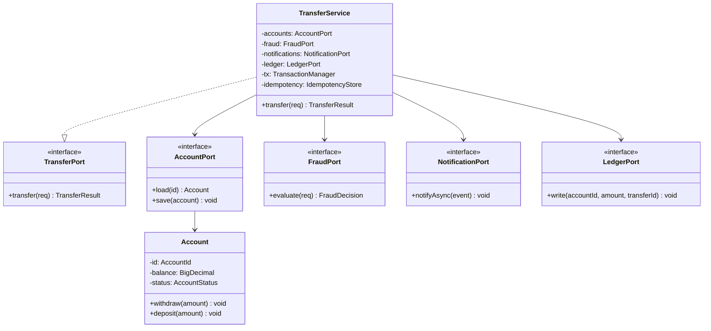
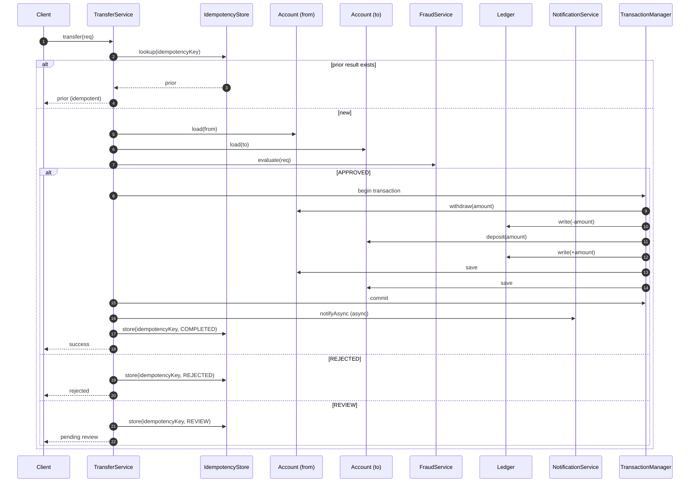
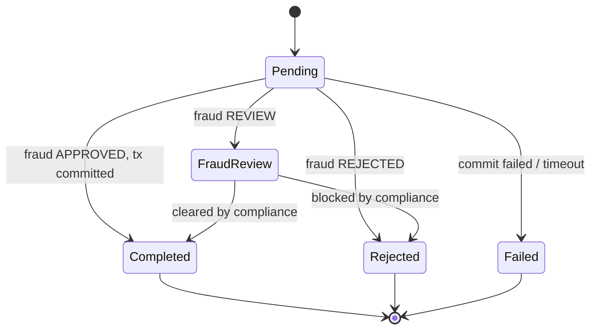

# Banking LLD — End-to-End

> The LLD method applied end-to-end to the Banking transfer flow. We start with the naive design, find its failure modes, name the forces, choose a better design, draw the UML, write the code, and document the trade-offs. This is the chapter where everything comes together.

## What you already know

From [[00-LLD-Method]]: the eight-step pipeline — Problem → Naive → Failure → Forces → Better → UML → Code → Trade-offs. This chapter walks all eight for the transfer flow.

From [[00-Banking-Case-Study]]: the invariants. Balance invariant, double-entry, atomicity, idempotency, no negative balances for savings, closed/frozen rules, auditability.

From [[02-Use-Cases]]: the use case we are designing. Main scenario plus extensions (idempotency hit, insufficient balance, fraud rejection, fraud review, fraud timeout, concurrent debit, commit failure).

From [[01-Design-Forces]]: the forces we will name in step 4. Correctness, atomicity, auditability, idempotency, latency, throughput, testability, maintainability.

From [[05-Architecture-Trade-offs]]: the architecture we will choose in step 5 — Hexagonal, mixed sync/async, single database, strong consistency for balance.

From the UML chapters ([[01-Class-Diagrams]] through [[05-Component-And-Deployment]]): the diagrams we will draw in step 6.

## Why this layer exists

The previous chapters taught the pieces: the method, the forces, the architectures, the trade-offs, the UML. This chapter assembles them into one concrete design. The point is not to introduce new concepts; it is to demonstrate the *method* in action, end-to-end, on a real problem.

After reading this chapter, you should be able to take any use case from [[02-Use-Cases]] and apply the same eight steps to produce a design.

## What is genuinely new here

- The full eight-step LLD applied to one problem.
- The concrete trade-off notes that the method produces.
- The Java code that implements the chosen design.
- The connection between the UML, the forces, and the code — every line of code is justified by a force, every force is visible in the UML.

## Concepts — the eight steps

The LLD method (see [[00-LLD-Method]]) defines an eight-step pipeline: Problem → Naive → Failure → Forces → Better → UML → Code → Trade-offs. The remaining sections of this chapter walk all eight for the transfer flow. **Banking application** covers steps 1–5; **Code / diagrams** covers steps 6–7; **Trade-offs** covers step 8.

## Banking application

### Step 1: Problem

Move money from account A to account B. The transfer must:

- Be atomic (debit + credit + ledger entries all happen, or none).
- Preserve the balance invariant (`balance == SUM(ledger_entries.amount)`).
- Preserve double-entry (two ledger entries that sum to zero).
- Be idempotent (a retry returns the same result).
- Respect account lifecycle (`ACTIVE` can send; `FROZEN` and `CLOSED` cannot).
- Respect balance limits (savings cannot go below zero; checking cannot go below `-overdraft_limit`).
- Be auditable (every state change logged).
- Be checked for fraud (no fraudulent transfer completes).
- Notify the customer asynchronously.

Source: [[00-Banking-Case-Study]], invariants 1-10. Use case: [[02-Use-Cases]].

### Step 2: Naive design

```java
public void transfer(Long from, Long to, BigDecimal amount) {
    Account a = accountRepo.findById(from);
    Account b = accountRepo.findById(to);
    a.setBalance(a.getBalance().subtract(amount));
    b.setBalance(b.getBalance().add(amount));
    accountRepo.save(a);
    accountRepo.save(b);
}
```

This is the design a junior engineer would write. It works for the happy path. It fails everywhere else.

### Step 3: Failure modes

| # | Failure | Cause | Effect |
|---|---|---|---|
| F1 | Lost update | Two concurrent transfers read balance=100, both write balance=80 | Balance ends at 80 instead of 60; money is created or destroyed |
| F2 | No audit trail | No ledger entry written | Invariant 6 violated; cannot reconstruct history |
| F3 | Not atomic | Crash between `save(a)` and `save(b)` | Money disappears |
| F4 | Not idempotent | Retry calls `transfer` again | Money moves twice |
| F5 | No validation | Status, balance, fraud not checked | Frozen/closed accounts transact; overdrafts exceeded; fraud succeeds |
| F6 | Tight coupling | Repo is concrete; no interface | Untestable; cannot swap implementations |
| F7 | No fraud check | FraudService not called | Fraudulent transfers complete |
| F8 | No notification | Customer never informed | Poor UX; compliance issue |

### Step 4: Design forces

| Force | Priority | Failure it addresses |
|---|---|---|
| Correctness | Critical | F1, F5 |
| Atomicity | Critical | F3 |
| Auditability | Critical | F2 |
| Idempotency | Critical | F4 |
| Validation | Critical | F5 |
| Fraud prevention | Critical | F7 |
| Testability | Important | F6 |
| Maintainability | Important | F6 |
| Latency | Important | — (will trade off against correctness) |
| Throughput | Important | — |
| Customer notification | Important | F8 |

The critical forces dominate the design. The important forces refine it. Latency is the force we will *sacrifice* — correctness is non-negotiable in banking.

### Step 5: Better design

Resolve each failure with a design choice:

- **F1 (lost update)**: wrap the whole flow in a serializable transaction. See [[05-Serializability]].
- **F2 (audit trail)**: add a `LedgerPort` that writes two ledger entries per transfer.
- **F3 (atomicity)**: the transaction manager guarantees commit or rollback.
- **F4 (idempotency)**: add an `IdempotencyStore` keyed by client-supplied idempotency key.
- **F5 (validation)**: move validation into the `Account` domain object (`withdraw` checks status and balance).
- **F6 (coupling)**: inject `AccountPort`, `FraudPort`, `NotificationPort`, `LedgerPort` as interfaces (DIP, Hexagonal).
- **F7 (fraud)**: call `FraudPort.evaluate()` before any state change.
- **F8 (notification)**: call `NotificationPort.notifyAsync()` after commit.

Architecture choice (from [[05-Architecture-Trade-offs]]): Hexagonal, mixed sync (fraud) and async (notification), single PostgreSQL database, serializable isolation for the transfer transaction.

## Code / diagrams

### Step 6: UML

The diagrams that capture the chosen design follow. UML is the visual code; the Java in step 7 is the executable code.

#### Class diagram



#### Sequence diagram



#### State diagram of the Transfer



### Step 7: Implementation

```java
// ===== Domain: Account and its rules =====
public abstract class Account {
    protected final AccountId id;
    protected BigDecimal balance;
    protected AccountStatus status;

    public void deposit(BigDecimal amount) {
        if (amount.signum() <= 0) throw new IllegalArgumentException("amount must be positive");
        if (status != AccountStatus.ACTIVE && status != AccountStatus.FROZEN) {
            throw new IllegalStateTransitionException("deposit not allowed in state " + status);
        }
        this.balance = this.balance.add(amount);
    }

    public void withdraw(BigDecimal amount) {
        if (amount.signum() <= 0) throw new IllegalArgumentException("amount must be positive");
        if (status != AccountStatus.ACTIVE) {
            throw new IllegalStateTransitionException("withdraw not allowed in state " + status);
        }
        if (!canWithdraw(amount)) {
            throw new InsufficientFundsException("insufficient funds in " + id);
        }
        this.balance = this.balance.subtract(amount);
    }

    protected abstract boolean canWithdraw(BigDecimal amount);

    public AccountId id() { return id; }
    public BigDecimal balance() { return balance; }
    public AccountStatus status() { return status; }
}

public final class CheckingAccount extends Account {
    private final BigDecimal overdraftLimit;

    @Override
    protected boolean canWithdraw(BigDecimal amount) {
        return balance.subtract(amount).compareTo(overdraftLimit.negate()) >= 0;
    }
}

public final class SavingsAccount extends Account {
    @Override
    protected boolean canWithdraw(BigDecimal amount) {
        return balance.subtract(amount).compareTo(BigDecimal.ZERO) >= 0;
    }
}

// ===== Ports =====
public interface AccountPort {
    Account load(AccountId id);
    void save(Account account);
}
public interface FraudPort {
    FraudDecision evaluate(TransferRequest req);
}
public interface NotificationPort {
    void notifyAsync(TransferEvent event);
}
public interface LedgerPort {
    void write(AccountId accountId, BigDecimal amount, TransferId transferId);
}
public interface IdempotencyStore {
    Optional<TransferResult> lookup(IdempotencyKey key);
    void store(IdempotencyKey key, TransferResult result);
}
public interface TransactionManager {
    <T> T inTransaction(Supplier<T> work);
}

// ===== Use case =====
public final class TransferService implements TransferPort {
    private final AccountPort accounts;
    private final FraudPort fraud;
    private final NotificationPort notifications;
    private final LedgerPort ledger;
    private final IdempotencyStore idempotency;
    private final TransactionManager tx;

    public TransferService(AccountPort accounts, FraudPort fraud,
                           NotificationPort notifications, LedgerPort ledger,
                           IdempotencyStore idempotency, TransactionManager tx) {
        this.accounts = accounts;
        this.fraud = fraud;
        this.notifications = notifications;
        this.ledger = ledger;
        this.idempotency = idempotency;
        this.tx = tx;
    }

    @Override
    public TransferResult transfer(TransferRequest req) {
        // F4: idempotency
        Optional<TransferResult> prior = idempotency.lookup(req.idempotencyKey());
        if (prior.isPresent()) return prior.get();

        // F5: load and implicitly validate (Account.withdraw will check status + balance)
        Account from = accounts.load(req.from());
        Account to   = accounts.load(req.to());

        // F7: fraud check — synchronous, before any state change
        FraudDecision decision = fraud.evaluate(req);

        TransferResult result = switch (decision) {
            case APPROVED -> executeTransfer(from, to, req);
            case REJECTED -> TransferResult.rejected("fraud rejected");
            case REVIEW   -> TransferResult.pendingReview();
        };

        // F4: store idempotency
        idempotency.store(req.idempotencyKey(), result);

        // F8: async notification
        if (result.isCompleted()) {
            notifications.notifyAsync(new TransferEvent(req, result));
        }
        return result;
    }

    private TransferResult executeTransfer(Account from, Account to, TransferRequest req) {
        // F1, F3: serializable transaction
        return tx.inTransaction(() -> {
            // F5: validation happens inside withdraw/deposit
            from.withdraw(req.amount());
            to.deposit(req.amount());

            // F2: ledger entries — double-entry
            ledger.write(req.from(), req.amount().negate(), req.transferId());
            ledger.write(req.to(),   req.amount(),         req.transferId());

            accounts.save(from);
            accounts.save(to);
            return TransferResult.completed();
        });
    }
}

// ===== Adapter: JDBC-driven AccountPort =====
public final class JdbcAccountRepository implements AccountPort {
    private final JdbcTemplate jdbc;

    @Override
    public Account load(AccountId id) {
        return jdbc.queryForObject(
            "SELECT id, iban, balance, status, type, overdraft_limit, interest_rate " +
            "FROM accounts WHERE id = ? FOR UPDATE",  // pessimistic lock to prevent F1
            (rs, n) -> mapAccount(rs), id.value());
    }

    @Override
    public void save(Account account) {
        jdbc.update("UPDATE accounts SET balance = ?, status = ? WHERE id = ?",
            account.balance(), account.status().name(), account.id().value());
    }

    private Account mapAccount(ResultSet rs) throws SQLException {
        String type = rs.getString("type");
        return switch (type) {
            case "CHECKING" -> new CheckingAccount(
                new AccountId(rs.getLong("id")),
                rs.getBigDecimal("balance"),
                AccountStatus.valueOf(rs.getString("status")),
                rs.getBigDecimal("overdraft_limit"));
            case "SAVINGS" -> new SavingsAccount(
                new AccountId(rs.getLong("id")),
                rs.getBigDecimal("balance"),
                AccountStatus.valueOf(rs.getString("status")),
                rs.getBigDecimal("interest_rate"));
            default -> throw new IllegalStateException("unknown account type: " + type);
        };
    }
}
```

## Trade-offs

### Step 8: Trade-offs as design artifacts

Each trade-off is documented as a design artifact (see [[08-Trade-offs-Everywhere]]):

```text
Trade-off 1: Serializable isolation vs latency
  Axis: Correctness vs latency
  Position: Serializable
  Force: Banking correctness is non-negotiable
  Cost: ~10-30% latency overhead vs read-committed
  Revisit when: average transfer latency exceeds 500ms

Trade-off 2: Synchronous fraud check vs async
  Axis: Coupling vs latency (and correctness vs eventual consistency)
  Position: Synchronous
  Force: A fraudulent transfer that completes and is reversed is more expensive
         than the latency of a sync fraud check
  Cost: TransferService cannot complete if FraudService is down
  Mitigation: 200ms timeout; on timeout, transfer is PENDING, not rejected
  Revisit when: FraudService uptime > 99.99% AND latency > 500ms

Trade-off 3: Async notification vs sync
  Axis: Latency vs consistency
  Position: Async (publish to broker)
  Force: Customer can tolerate a delayed email; cannot tolerate a wrong balance
  Cost: Notification may be delayed or lost (if broker fails)
  Mitigation: Broker is replicated; consumer is idempotent; DLQ for failed sends

Trade-off 4: Hexagonal architecture vs layered
  Axis: Isolation vs ceremony
  Position: Hexagonal
  Force: Domain is long-lived (decades); technology changes (DB, broker, frameworks)
  Cost: More interfaces, more files, more wiring code
  Revisit when: never — the isolation is the value

Trade-off 5: Single database vs database-per-service
  Axis: Coupling vs operational complexity
  Position: Single database with private schemas per component
  Force: We are not yet at the scale where sharding or per-service databases pay off
  Cost: Components share a database; schema changes must be coordinated
  Revisit when: a single component's write load dominates the database, OR
                a component needs a different data model (e.g., document store for
                notification templates)
```

These trade-offs are the most important output of the LLD. The code will change; the trade-offs document *why* the code is shaped the way it is, so future engineers can evaluate whether the shape still fits.

### The meta-trade-off

The trade-off of doing LLD at all: **time spent in LLD vs time spent in code**. More LLD upfront = less rework, but LLD has diminishing returns. The right amount for the transfer flow: a few hours of force analysis, half a day of UML, a day of implementation, an hour of trade-off documentation. For a simpler use case (e.g., "view balance"), the right amount might be ten minutes — sketch the design on a whiteboard, write the code, document one trade-off (cache vs no cache).

## What can go wrong

- **Skipping steps.** If you skip step 3 (failure modes), you do not know what the design must survive. If you skip step 8 (trade-offs), the next engineer will rewrite the design without understanding it.
- **Forces without priority.** A flat list of forces is useless. Rank them.
- **Naive design that is a strawman.** Take the naive design seriously; only then can you find real failure modes.
- **UML that does not match code.** If the UML and the code disagree, one is wrong. Reconcile before shipping.
- **Trade-offs that are not documented.** Code without trade-off notes is a black box. Future engineers will assume the design was arbitrary.
- **Trade-offs that are never revisited.** Constraints change. The trade-off notes should say *when* to revisit, and someone should check periodically.

The method scales with the problem. Use it fully for the riskiest use cases; use it lightly for the routine ones. The discipline is in *knowing which is which* — and that comes from experience with both.

## Forward links

- [[00-LLD-Method]] — the method, formalized.
- [[01-Design-Forces]] — the force analysis that drives step 4.
- [[05-Architecture-Trade-offs]] — the architecture choices that drive step 5.
- [[06-UML-For-Banking]] — the UML diagrams in step 6.
- [[00-ACID]] — what the transaction in step 7 actually guarantees.
- [[05-Serializability]] — why serializable isolation is chosen for F1.
- [[04-Enterprise-Patterns]] — Repository, Unit of Work, Idempotency Store as the patterns in step 7.
- [[00-Schema-Design]] and [[04-Banking-Schema]] — the schema this code runs against.
- [[09-Banking-Transaction-Walkthrough]] — the transaction flow in detail.
- [[00-Banking-Case-Study]] — the invariants this design respects.
