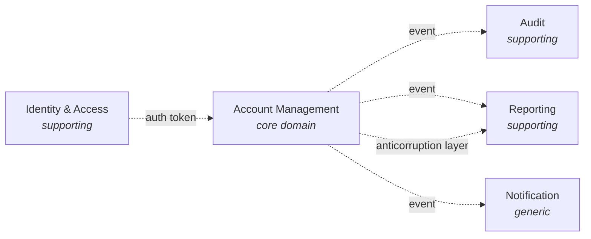

# Domain-Driven Design — What DDD Is

> Domain-Driven Design is not a framework, not a methodology, and not a set of patterns. It is a discipline: keep the model of the problem at the center of the code, and keep the language of the problem at the center of the team's conversations.

## What you already know

From [[03-Domain-Concepts]]: we extracted the nouns and verbs of the banking domain. From [[04-Responsibilities]]: we assigned those verbs to classes via CRC cards. From [[03-Dependency-As-Root-Concept]] and [[06-Coupling-and-Cohesion]]: dependencies should point toward stability, and a module is cohesive when it owns one invariant.

You already have the raw material. DDD is the discipline of *organizing* that material so the model — not the database, not the framework, not the UI — drives the code.

## Why this layer exists

A common failure mode, especially in teams that grew up on relational databases and CRUD frameworks:

> The schema is designed first. The classes are generated from the schema (or are thin wrappers over rows). The behavior lives in services that operate on those wrappers. The "domain model" is the table diagram.

This is **database-driven design**. It works for CRUD applications — admin screens, simple record management, configuration UIs. It fails for complex domains: banking, healthcare, logistics, insurance, telecommunications billing, supply chain. In those domains, the *rules* are the value, not the data. The data is just the residue of the rules.

When you database-drive a complex domain:

- Invariants get scattered across triggers, services, and stored procedures. No single place owns "the rules."
- The vocabulary in code drifts from the vocabulary the business uses (`AccountRecord`, `CustTran`, `TxnLog` instead of `Account`, `Customer`, `Transfer`).
- Behavior piles into services because the entities are too anemic to carry it (see [[05-Anemic-vs-Rich-Models]]).
- Refactoring is terrifying because every change threatens a schema migration.

DDD exists to flip this. The domain model — expressed in code, in the same language the business uses — drives the design. The database is an implementation detail of persistence. The UI is an adapter on the model. The framework is plumbing.

## What is genuinely new here

Two ideas:

1. **Strategic vs tactical DDD.** Strategic DDD is about boundaries — *where* do models live, *how* do they talk to each other, *what* is in scope. Tactical DDD is about building blocks — *what kinds* of objects make up a model. Most teams learn tactical DDD (entities, value objects, aggregates) and skip strategic DDD (bounded contexts, context maps). That is backwards. Strategic DDD does the heavy lifting; tactical DDD is just vocabulary for the result.

2. **Ubiquitous language.** The same words — exactly the same words — used by domain experts in conversation, in code, in tests, in the UI, in the database. No synonyms. No translations. The code reads like the business talks. This is the single highest-leverage discipline in DDD, and it is free.

## Concepts

### The domain model as the central artifact

The domain model is a *software representation of the rules of the business*. Not the data — the rules. The data is a snapshot of the rules' effects.

A banking domain model is not "the `accounts` table." It is the set of objects, methods, and invariants that capture: what an account is, what operations are legal in which lifecycle states, what a transfer means, what consistency must hold between balance and ledger entries, who can authorize what.

The model lives in code. The schema persists it. The schema is *not* the model.

### Strategic vs tactical DDD

**Strategic DDD** answers:

- What are the bounded contexts? Where does one model end and another begin? (See [[03-Bounded-Contexts]].)
- How do contexts relate? Shared kernel? Customer-supplier? Anticorruption layer? (See [[03-Bounded-Contexts]].)
- What is the ubiquitous language for each context?
- What is the core domain (the part that gives you competitive advantage) versus supporting (necessary but not differentiating) versus generic (buy, don't build)?

**Tactical DDD** answers:

- Is this thing an entity or a value object? (See [[01-Entities-Value-Objects]].)
- What is the aggregate boundary? (See [[02-Aggregates]].)
- Should this be a domain event? (See [[04-Domain-Events]].)
- Should this behavior live on the entity or in a service? (See [[05-Anemic-vs-Rich-Models]].)

Strategic comes first. A perfectly modeled aggregate inside the wrong bounded context is still wrong.

### Ubiquitous language

If the business says "transfer" and the code says `TransactionRequest`, that is a leak. The next engineer will translate in their head every time they read the code, and eventually they will translate wrong.

The rule:

> If the business has a word for it, use that word. If the business does not have a word for it, ask whether the concept is real before inventing one.

(See [[03-Domain-Concepts]] for the banking glossary. That glossary is the seed of the ubiquitous language.)

### DDD vs database-driven design

| Question | Database-driven | DDD |
|---|---|---|
| What comes first? | The schema | The model |
| Where do invariants live? | Triggers, constraints, services | Entity methods, aggregate invariants |
| What is the vocabulary? | Tables, columns, joins | Domain nouns and verbs |
| What is the unit of consistency? | A row | An aggregate |
| What does the code read like? | DTOs and services | Sentences in the domain language |

### When DDD is worth it (and when it is overkill)

DDD shines when:

- The domain has *real* rules — non-trivial invariants, lifecycle constraints, multi-step workflows.
- The domain is *complex* — many entities, many relationships, many edge cases.
- The business logic is *the product* — banking, healthcare, insurance, logistics, billing.
- The team has *access to domain experts* — DDD without experts degrades into DDD-flavored guessing.

DDD is overkill when:

- The application is CRUD with light validation — admin screens, configuration, simple record management.
- The domain is *not complex* — a to-do list, a blog, a contact form.
- The business logic is mostly UI orchestration — read a row, show it, edit it, save it.
- There is no access to domain experts — you are guessing, and DDD does not improve guesses.

A surprising number of internal business applications are CRUD. A surprising number of "real" systems have a CRUD core and a complex edge. Use DDD on the edge, CRUD on the core. The two can coexist in the same codebase.

## Banking application

Banking is the canonical DDD domain. The rules *are* the product:

- Accounts have lifecycles (PENDING → ACTIVE → FROZEN → CLOSED), and the lifecycle gates which operations are legal.
- Transfers must be atomic — both ledger entries or neither.
- Balances must equal the sum of ledger entries — always, even under concurrent transfers.
- Closed accounts cannot transact; frozen accounts cannot withdraw.
- Every monetary movement is auditable and immutable.

These are not database constraints. They are domain rules. They belong in the domain model, expressed in the ubiquitous language. The schema persists them; the database *also* enforces some of them (defense in depth — see [[02-Domain-Check-Constraints]] and [[03-Triggers-As-Constraints]]), but the *primary* expression is in code.

The bounded contexts for banking:

- **Account Management** — the core domain. Account, Customer, Transfer, LedgerEntry, balance invariants.
- **Identity & Access** — authentication, authorization, login sessions. "Account" here means a login, not a financial container.
- **Audit** — who did what, when, against what entity. Append-only event log.
- **Reporting** — derived views of account activity for statements, regulators, dashboards.
- **Notification** — outbound email/SMS/push.

The core domain is Account Management. Identity, Audit, Reporting, and Notification are supporting or generic. The team's energy should disproportionately go to the core.

## Code/diagrams

A DDD-flavored code skeleton for the transfer flow — notice the vocabulary:

```java
// The model speaks the domain's language.
public final class Transfer {
    private final TransferId id;
    private final AccountId source;
    private final AccountId destination;
    private final Money amount;
    private TransferStatus status;

    public void execute(AccountRepository accounts, Ledger ledger) {
        if (status != TransferStatus.PENDING) {
            throw new IllegalStateException("Transfer already executed");
        }
        Account src = accounts.find(source).orElseThrow();
        Account dst = accounts.find(destination).orElseThrow();

        src.debit(amount);
        dst.credit(amount);
        ledger.append(LedgerEntry.debit(src.id(), amount));
        ledger.append(LedgerEntry.credit(dst.id(), amount));

        this.status = TransferStatus.COMPLETED;
    }
}
```

Compare to database-driven style:

```java
// Anemic. Reads like plumbing, not banking.
public class TransferService {
    public void doTransfer(Long fromId, Long toId, BigDecimal amount) {
        var from = accountDao.findById(fromId);
        var to = accountDao.findById(toId);
        from.setBalance(from.getBalance().subtract(amount));
        to.setBalance(to.getBalance().add(amount));
        accountDao.save(from);
        accountDao.save(to);
        txnLogDao.insert(new TxnLog(fromId, toId, amount.negate()));
        txnLogDao.insert(new TxnLog(toId, fromId, amount));
    }
}
```

The first reads like banking. The second reads like plumbing. They might compile to similar SQL. They are not the same code.

Strategic picture — bounded contexts and their relationships:



Each arrow is a translation, not a shared class. See [[03-Bounded-Contexts]] for the patterns.

## What can go wrong

- **DDD cargo-cult.** A team reads the blue book, applies entities, value objects, and aggregates to a CRUD admin screen, and gets a 3x larger codebase with no benefit. DDD on a simple domain *adds* complexity. Use it where the domain is already complex.
- **Tactical without strategic.** Perfect aggregates, perfect value objects — all inside one giant bounded context that mixes Account-as-financial-container with Account-as-login. The model is internally consistent and globally incoherent.
- **Ubiquitous language drift.** The glossary is written once, the team uses different words for two years, and the glossary becomes fiction. The language must be maintained as a living artifact.
- **Domain experts are absent.** DDD without experts is just DDD-flavored guessing. The patterns do not substitute for understanding.
- **Modeling every noun as an entity.** Many nouns are value objects or attributes. Modeling `Address` as an entity with a surrogate key makes the code worse, not better. See [[01-Entities-Value-Objects]].
- **Database-driven "DDD".** The team calls their anemic DTOs "entities," wraps them in repositories, and calls the result DDD. The model is still the schema. The behavior is still in services. Nothing was gained.

## Trade-offs

- **Modeling effort vs shipping speed.** DDD takes time up front — conversations with experts, glossary maintenance, bounded context maps. In a complex domain, this pays back. In a simple domain, it does not.
- **Rich models vs testability.** Rich domain models are expressive but harder to unit-test in isolation (you need to construct realistic aggregates). Anemic models are easier to test but lose expressiveness. See [[05-Anemic-vs-Rich-Models]].
- **Ubiquitous language vs technical vocabulary.** Sometimes the business's word is misleading or overloaded. Insisting on it can confuse engineers. Most of the time, though, the business's word is right and the engineer's instinct to rename is the mistake.
- **Bounded context granularity.** Too coarse: one giant context, no isolation. Too fine: a distributed monolith, every cross-context call is a network hop. See [[03-Bounded-Contexts]].
- **Core vs supporting investment.** Spending equal effort on the core domain and on notification plumbing is a misallocation. The core deserves disproportionate attention.

## Forward links

- [[01-Entities-Value-Objects]] — the first tactical building block.
- [[02-Aggregates]] — the consistency boundary.
- [[03-Bounded-Contexts]] — the strategic center of DDD.
- [[04-Domain-Events]] — decoupling producers from consumers.
- [[05-Anemic-vs-Rich-Models]] — the trade-off that defines the model's flavor.
- [[06-Banking-Domain-Model]] — the full banking model in one place.
- [[04-Enterprise-Patterns]] — Repository, Unit of Work, Domain Events as enterprise patterns.
- [[00-ER-Modeling]] — where the domain model meets the data model.
- [[00-ORM-Impedance-Mismatch]] — where the model and the schema disagree, and how the ORM bridges (or fails to bridge) the gap.
