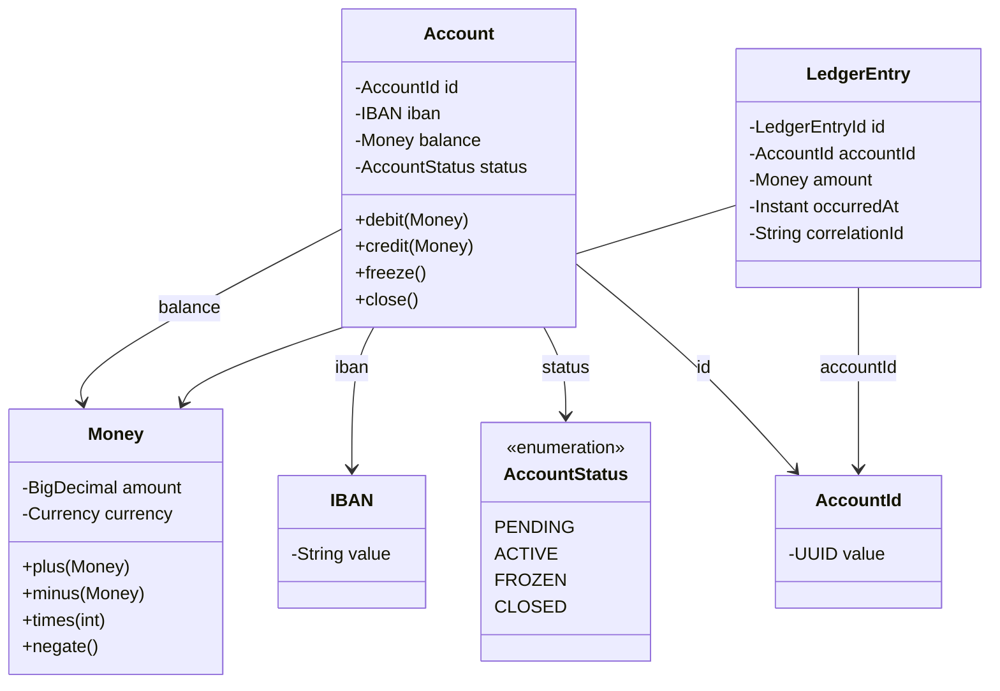

# Entities and Value Objects

> The two foundational building blocks of a domain model. The distinction sounds academic — *identity vs no identity* — but it is the single most consequential classification in DDD. Get it wrong and your code is verbose, your schema is bloated, and your equality semantics are incoherent.

## What you already know

From [[05-Identity-State-Lifecycle]]: identity is the answer to "is this the same X I saw before?" and it comes in three flavors — object, logical, surrogate. From [[04-Abstraction-and-Models]]: an abstraction is selective forgetting for a purpose. From [[07-Composition-vs-Inheritance]]: composition is looser than inheritance, and the same trade-off reappears at the schema layer.

This chapter applies those foundations to a single question: *for each noun in the domain, does it have identity?* The answer determines whether it is an entity or a value object, and that determines its implementation, its persistence, and its equality semantics.

## Why this layer exists

Without a clear entity/value distinction, teams default to modeling every noun as an entity with a surrogate primary key. This produces:

- `Address` entities with `id BIGSERIAL` and a `customer_id` foreign key — even though the same address used by two customers should be one address, and nobody cares whether this `Address` row is "the same one" as another row with identical fields.
- `Money` entities with `id` and columns `amount, currency` — even though `Money(100, EUR)` is `Money(100, EUR)`, full stop, and we never need to track "this specific five-euro note" through the system.
- Verbose equality: `equals()`/`hashCode()` defined via `id`, which is null until persist, which breaks `HashSet` for unpersisted entities.

The entity/value distinction reverses these. Most nouns in a domain are *values*. Only a few are *entities*. Treating values as values — immutable, compared by attribute, no identity — makes code shorter, equality correct, and persistence cleaner.

## What is genuinely new here

The classification test:

> *If I threw this object away and made an identical one, would anyone care?*

- If **yes** — it has identity, it is an entity. (Account, Customer, Transfer.)
- If **no** — it has no identity, it is a value object. (Money, Address, IBAN, DateRange.)

And one design rule that follows:

> *Value objects are immutable. Always. Without exception.*

## Concepts

### Entity

An entity is an object defined by its **identity**, not by its attribute values. Two entities with the same attributes but different identities are different entities. Two entities with the same identity but different attributes are the same entity, just at different points in time.

Entities have:

- An identity (logical or surrogate — see [[05-Identity-State-Lifecycle]]).
- A lifecycle (state changes over time).
- Mutable state (with care — only through methods that protect invariants).
- Equality based on identity, not attributes.

Examples in banking: `Account`, `Customer`, `Transfer`, `LedgerEntry`. Each `Account` has an identity (its IBAN, or a surrogate id) that persists across changes to its balance, status, and owner.

### Value object

A value object is defined by its **attribute values**. Two value objects with the same attributes are the same value. There is no "this specific `Money(100, EUR)`" — there is just `Money(100, EUR)`, and any code holding `Money(100, EUR)` is interchangeable with any other code holding `Money(100, EUR)`.

Value objects have:

- No identity.
- No lifecycle (they are created, used, discarded; never modified).
- Immutable state.
- Equality based on attributes.

Examples in banking: `Money`, `IBAN`, `Address`, `AccountStatus` (an enum, which is a degenerate value object), `Currency`, `DateRange`.

### The test, applied

| Noun | "Throw it away and make an identical one — anyone care?" | Classification |
|---|---|---|
| Account | Yes — that is *my* account; the bank must keep *this* account's history | Entity |
| Customer | Yes — the customer's KYC, history, and relationship are tied to *this* customer | Entity |
| Transfer | Yes — a specific transfer has a timestamp, an idempotency key, and is part of an audit trail | Entity |
| LedgerEntry | Yes — it is an immutable historical record; you cannot recreate it (the timestamp would differ) | Entity |
| Money | No — `Money(100, EUR)` is `Money(100, EUR)` | Value |
| IBAN | No — `GB29 NWBK 6016 1331 9268 19` is that IBAN; any reference to it is the same | Value |
| Address | No — two customers at the same address have the same address | Value |
| AccountStatus | No — `ACTIVE` is `ACTIVE` | Value (enum) |
| Currency | No — `EUR` is `EUR` | Value (enum) |

Notice that `LedgerEntry` is an entity even though it is *immutable*. Immutability does not make something a value object. Identity does. A `LedgerEntry` has identity because it is a specific historical record at a specific timestamp; recreating it later produces a different entry (the timestamp would differ). This is a common confusion — clarify it once and never again.

### Why value objects are immutable

Three reasons:

1. **They have no identity to track changes through.** If `Money(100, EUR)` becomes `Money(50, EUR)`, it is not "the same Money, mutated" — it is a different value. There is no `Money` to mutate.
2. **They are shared freely.** Two accounts can both hold a reference to `Money(100, EUR)`. If one could mutate it, the other would see the mutation — silent aliasing bugs.
3. **They are thread-safe by construction.** No synchronization needed for read-only objects.

Immutability means value objects create new instances on "change":

```java
Money m = new Money(new BigDecimal("100"), Currency.EUR);
Money doubled = m.times(2);   // returns new Money(200, EUR); m is unchanged
```

This sounds wasteful. In practice, the JVM allocates short-lived objects cheaply; modern GC handles them efficiently. The clarity gains outweigh the allocation cost.

### Java records for value objects

Java 21 records are purpose-built for value objects:

```java
public record Money(BigDecimal amount, Currency currency) {
    public Money {
        Objects.requireNonNull(amount);
        Objects.requireNonNull(currency);
        if (amount.signum() < 0) {
            // Money itself can be negative (an overdraft is a negative balance),
            // but reject NaN, infinite, or malformed values here if needed.
        }
        // Always normalize scale to the currency's minor units.
        amount = amount.setScale(currency.minorDigits(), RoundingMode.UNNECESSARY);
    }
    public Money plus(Money other) {
        ensureSameCurrency(other);
        return new Money(amount.add(other.amount), currency);
    }
    public Money minus(Money other) {
        ensureSameCurrency(other);
        return new Money(amount.subtract(other.amount), currency);
    }
    public Money times(int factor) {
        return new Money(amount.multiply(BigDecimal.valueOf(factor)), currency);
    }
    public Money negate() {
        return new Money(amount.negate(), currency);
    }
    private void ensureSameCurrency(Money other) {
        if (currency != other.currency) {
            throw new IllegalArgumentException(
                "Currency mismatch: " + currency + " vs " + other.currency);
        }
    }
}
```

A record gives you:

- `equals` and `hashCode` based on all fields (value semantics) — for free.
- An immutable carrier (fields are final).
- A compact constructor for validation and normalization.
- A readable `toString`.

Contrast with the old entity-style approach: a mutable `Money` class with setters for `amount` and `currency`, no validation, and equality based on object identity. That class would compile. It would also be wrong.

### The IBAN value object

```java
public record IBAN(String value) {
    public IBAN {
        Objects.requireNonNull(value);
        String normalized = value.replaceAll("\\s+", "").toUpperCase();
        if (!isValid(normalized)) {
            throw new IllegalArgumentException("Invalid IBAN: " + value);
        }
        value = normalized;
    }
    private static boolean isValid(String iban) {
        // Length and checksum validation per ISO 13616.
        // Country code, check digits, BBAN.
        return iban.matches("[A-Z]{2}[0-9]{2}[A-Z0-9]{1,30}")
            && mod97Check(iban) == 1;
    }
    private static int mod97Check(String iban) {
        String rearranged = iban.substring(4) + iban.substring(0, 4);
        StringBuilder numeric = new StringBuilder();
        for (char c : rearranged.toCharArray()) {
            numeric.append(Character.isDigit(c) ? c : (c - 'A' + 10));
        }
        return new java.math.BigInteger(numeric.toString())
            .mod(java.math.BigInteger.valueOf(97)).intValue();
    }
}
```

Key point: the *entire* validation lives in the value object. There is no `IbanValidator` service. There is no `@Iban` annotation with a `ConstraintValidator`. There is just `IBAN`, and you cannot construct an invalid one. This is what "rich model" means for a value object — see [[05-Anemic-vs-Rich-Models]].

### The entity, by contrast

```java
public final class Account {
    private final AccountId id;        // identity — never changes
    private final IBAN iban;           // logical identity — value object
    private Money balance;             // mutable state — protected by methods
    private AccountStatus status;      // lifecycle — value object (enum)

    public Account(AccountId id, IBAN iban, Money openingBalance) {
        this.id = Objects.requireNonNull(id);
        this.iban = Objects.requireNonNull(iban);
        this.balance = Objects.requireNonNull(openingBalance);
        this.status = AccountStatus.PENDING;
    }

    public void debit(Money amount) {
        ensureCanTransact();
        balance = balance.minus(amount);
    }

    public void credit(Money amount) {
        ensureCanTransact();
        balance = balance.plus(amount);
    }

    private void ensureCanTransact() {
        if (status != AccountStatus.ACTIVE && status != AccountStatus.FROZEN) {
            throw new IllegalStateException("Account is " + status);
        }
    }

    // Equality based on identity.
    @Override public boolean equals(Object o) {
        return o instanceof Account other && this.id.equals(other.id);
    }
    @Override public int hashCode() { return id.hashCode(); }
}
```

Notice:

- The identity (`id`) is final — it never changes after construction.
- The mutable state (`balance`, `status`) changes only through methods that protect invariants.
- Equality is based on `id`, not on the mutable state. Two `Account` objects with the same `id` are equal even if one has a different balance (e.g., loaded at different times).
- The value objects (`Money`, `IBAN`, `AccountStatus`) are immutable; you never see `setBalance(new BigDecimal(...))`.

## Banking application

In the banking domain:

**Entities**: `Account`, `Customer`, `Transfer`, `LedgerEntry`, `Statement`.

**Value objects**: `Money`, `IBAN`, `Currency`, `AccountStatus`, `Address`, `DateRange`, `TransferStatus`, `CustomerId`, `AccountId` (yes — even the identity reference is a value object; see below).

**Identity-as-value-object pattern**: the `AccountId` and `CustomerId` types are interesting. They wrap a `UUID` or `Long` but have no behavior. They exist to make the type system enforce that you cannot pass an `AccountId` where a `CustomerId` is expected. They are value objects because two `AccountId` with the same underlying value are the same id — there is no "this specific `AccountId` object."

```java
public record AccountId(UUID value) {
    public AccountId { Objects.requireNonNull(value); }
    public static AccountId generate() { return new AccountId(UUID.randomUUID()); }
}
public record CustomerId(UUID value) {
    public CustomerId { Objects.requireNonNull(value); }
    public static CustomerId generate() { return new CustomerId(UUID.randomUUID()); }
}
```

This tiny pattern pays dividends: the compiler catches `transfer(customerId, accountId)` called as `transfer(accountId, customerId)`. See [[01-Primary-Foreign-Keys]] for the schema equivalent.

## Code/diagrams

The full picture in one diagram:



Notice that value objects (`Money`, `IBAN`, `AccountStatus`, `AccountId`) appear as fields of entities. This is the typical pattern — entities compose value objects; value objects do not reference entities (with rare exceptions like `AccountId`, which is a value object that *names* an entity without holding a reference to it).

## What can go wrong

- **Modeling every noun as an entity.** `Address`, `Money`, `DateRange` get surrogate IDs and become tables. The schema bloats. Equality becomes identity-based and breaks for transient objects.
- **Modeling every entity as a value object.** "Account is just a tuple of (IBAN, balance, status)." False — an account has a history. Two accounts with the same IBAN, balance, and status at one moment in time are not the same account; one might have just been debited.
- **Mutable value objects.** A `Money` with `setAmount(BigDecimal)`. Aliasing bugs follow. Always make value objects immutable.
- **Validation outside the value object.** An `IbanValidator` service. The value object becomes a dumb data bag. Validation belongs *inside* the constructor — see [[05-Anemic-vs-Rich-Models]].
- **Equality based on mutable state.** An `Account.equals` that compares `balance` and `status`. Two snapshots of the same account loaded moments apart would be unequal. `HashSet` would lose them. Use identity for entity equality.
- **Identity in `hashCode` for unpersisted entities.** Using `id.hashCode()` when `id` is null until persist. Use a fallback to `System.identityHashCode(this)` or use a generated id at construction time. See [[05-Identity-State-Lifecycle]].
- **Mixing value object equality with entity equality.** A `LedgerEntry` modeled as a value object (compared by attributes) breaks deduplication: two entries with the same amount and timestamp are different entries.

## Trade-offs

- **Records vs classes.** Java records are perfect for value objects but cannot be used for entities (records are immutable; entities are mutable). Use `final class` with `final` fields for entities, `record` for value objects.
- **Validation in constructor vs factory.** Constructor validation is simplest but rejects invalid input with an exception. Factory methods (`Money.parse("100 EUR")`) can return `Optional<Money>` or throw. Choose based on whether invalid input is exceptional or expected.
- **Identifier value objects vs primitives.** `AccountId(UUID)` vs raw `UUID`. The wrapper adds a class but gives type safety. For internal code, the wrapper is almost always worth it. For ORM-mapped entities, the wrapper requires a JPA `@Convert` — see [[06-Hibernate-JPA]].
- **Value object with reference to entity.** Usually avoided — it couples the value to the entity's lifecycle. The exception is *identity references* (`AccountId`), which name an entity without referencing it. This is the basis for the aggregate reference pattern in [[02-Aggregates]].

## Forward links

- [[02-Aggregates]] — clusters of entities and value objects that form one consistency boundary.
- [[03-Bounded-Contexts]] — the same noun can be an entity in one context and a value object in another.
- [[05-Anemic-vs-Rich-Models]] — value objects should always be rich; entities can be either.
- [[06-Banking-Domain-Model]] — the full banking domain model with entities and value objects in place.
- [[00-ER-Modeling]] — how entities and value objects translate to ER concepts.
- [[01-ER-to-Relational]] — value objects usually become embedded columns, not separate tables.
- [[00-ORM-Impedance-Mismatch]] — the value-object-to-table translation is one of the canonical mismatches.
- [[05-Identity-State-Lifecycle]] — the foundational identity concepts entities rely on.
- [[07-Composition-vs-Inheritance]] — entities compose value objects; this is the composition-over-inheritance pattern applied to the domain model.
