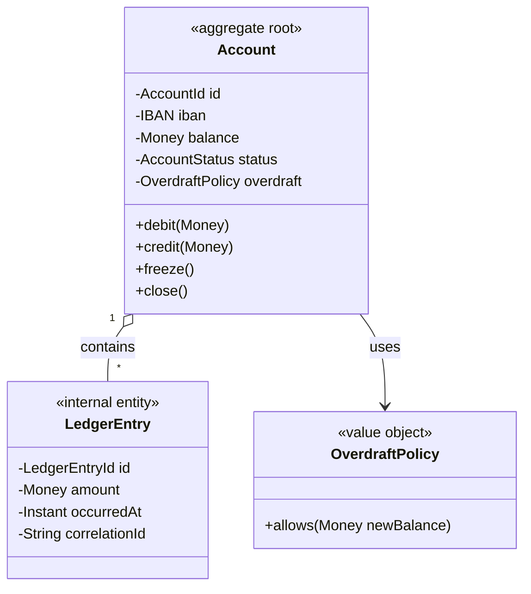
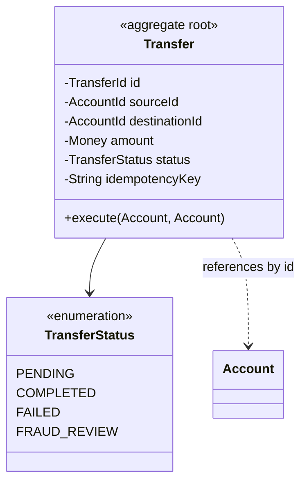
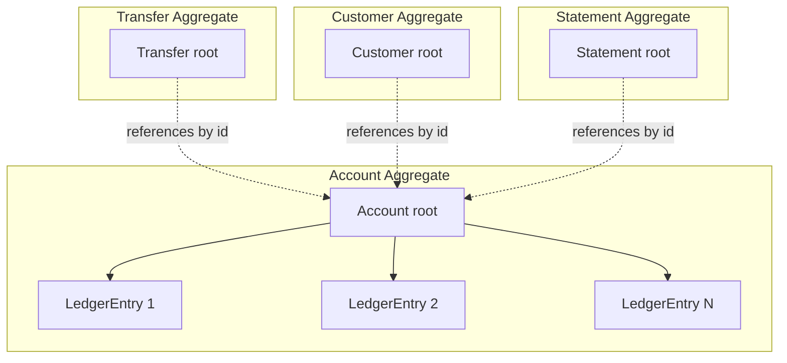

# Aggregates

> An aggregate is a cluster of objects treated as a single unit for data changes. The aggregate root is the only entry point. Inside the boundary, invariants hold strongly; across boundaries, they hold eventually. Aggregates are the answer to "how big should a transaction be?" and "what is the unit of consistency in a domain model?"

## What you already know

From [[01-Entities-Value-Objects]]: entities have identity and mutable state protected by invariants; value objects are immutable and have no identity. From [[06-Coupling-and-Cohesion]]: a module is cohesive when it owns one invariant. From [[00-ACID]] (preview): transactions guarantee atomicity, consistency, isolation, durability — but only for the operations inside them.

The aggregate concept unifies these. An aggregate is *the smallest cluster of objects that owns one invariant and can be made consistent in a single transaction*.

## Why this layer exists

Without aggregates, every entity is a free-floating object. The `Account` knows its balance; the `LedgerEntry` knows its amount; nothing enforces that the balance equals the sum of the entries. To make a deposit, you write code in a service that:

1. Loads the `Account`.
2. Loads its `LedgerEntry`s.
3. Computes the new balance.
4. Inserts a new `LedgerEntry`.
5. Updates the `Account`'s balance.

If anything fails between steps 3 and 5, the invariant is broken. If two threads run this simultaneously, the balance can be wrong. If a developer forgets step 4, the books don't balance. Every invariant becomes the responsibility of *whatever service happens to be running*, and there is no single place that says "this is how a deposit works."

Aggregates fix this by:

- Drawing a **boundary** around the objects that must be consistent together.
- Naming one entity the **root** — the only object the outside world can reference directly.
- Forcing all mutations to go through the root's methods, where the invariant is enforced.
- Making the boundary the **unit of transaction** — one aggregate, one transaction.

## What is genuinely new here

Three rules, and one consequence:

1. **The aggregate root is the only entry point.** Outside code holds references to the root, never to internal entities.
2. **An aggregate is consistent at the end of every transaction.** Invariants hold inside the boundary; there is no "partial consistency."
3. **Modify one aggregate per transaction.** If you need to modify two aggregates, use a saga, a process manager, or a domain event — never a single transaction across two roots.

The consequence: **aggregates are smaller than you think.** Most teams make aggregates too big. Smaller aggregates mean smaller transactions, less locking, less contention, more concurrency. The rule of thumb: when in doubt, split.

## Concepts

### The aggregate root

The root is an entity. It is the only member of the aggregate that outside code can hold a reference to. Internal entities (children) are accessed only through the root. The root's methods are the only way to mutate the aggregate's state.

```java
// Aggregate root
public final class Account {
    private final AccountId id;
    private final IBAN iban;
    private Money balance;
    private AccountStatus status;
    private final List<LedgerEntry> entries = new ArrayList<>();

    // Public mutating methods — the only entry points.
    public void debit(Money amount) { ... }
    public void credit(Money amount) { ... }
    public void freeze() { ... }

    // Internal state is never exposed mutably.
    public List<LedgerEntry> entries() {
        return Collections.unmodifiableList(entries);
    }
}
```

Outside code:

```java
Account acc = accountRepository.find(accountId).orElseThrow();
acc.debit(Money.euros(100));
accountRepository.save(acc);
```

The outside code never touches `entries` directly. It calls `debit`, which is the *only* way to add a ledger entry, update the balance, and check the status — all atomically, in one method.

### Consistency boundary

The aggregate boundary defines what is *strongly* consistent. Inside the boundary, invariants hold at the end of every transaction. Outside the boundary, invariants hold *eventually*.

For `Account` + its `LedgerEntry` children:

- **Strong invariant**: `balance == sum(entries.amount)`. This holds inside the `Account` aggregate because `debit` and `credit` update both atomically.
- **Eventual invariant**: "the customer's total balance across all their accounts equals the sum of all their accounts' balances." This crosses aggregate boundaries — it holds *eventually*, through events or queries, not in a single transaction.

### The "one aggregate per transaction" rule

This is the rule that draws the most debate. The strict DDD formulation:

> Modify one aggregate instance per transaction. If you need to modify two, use a domain event or a saga.

Why? Because a transaction that spans two aggregates must lock both. If both are popular (say, the source and destination of a transfer), the lock contention is severe. Worse, if the two aggregates live in different databases or different services, a single transaction is impossible — distributed transactions are expensive and fragile (see [[07-Distributed-Transactions]], [[08-Two-Phase-Commit]]).

The pragmatic interpretation: *prefer* one aggregate per transaction. When you must cross, do it with eventual consistency and idempotency, not with a distributed transaction.

### Aggregate references

Aggregates reference each other by *identity*, not by object reference. This is critical for distributed systems and for keeping transactions small.

```java
// Bad: holds a direct reference to another aggregate root
public final class Transfer {
    private Account source;      // Don't do this.
    private Account destination;
}

// Good: holds identity references
public final class Transfer {
    private final AccountId sourceId;
    private final AccountId destinationId;
    private final Money amount;
}
```

The `Transfer` aggregate references `Account` aggregates by their identity. To actually move money, the `TransferService` loads each `Account` separately, mutates each within its own transaction boundary, and coordinates via a saga or domain events.

### Aggregate size guidelines

The rule: **smaller is better.** Reasons:

- Smaller aggregates mean smaller transactions, less locking, more concurrency.
- Smaller aggregates load faster (less eager fetching).
- Smaller aggregates are easier to reason about and test.
- Smaller aggregates fit more naturally into a single database row or a small cluster.

Counter-pressure: aggregates must be *big enough to enforce their invariants*. If the invariant requires two entities to be consistent in one transaction, they must be in the same aggregate.

The test:

> *If two entities must be consistent in the same transaction, they are one aggregate. If they can be consistent eventually, they are separate aggregates.*

### Aggregate invariants

An invariant is a rule that must always hold. Examples:

- `Account.balance == sum(Account.entries.amount)`.
- `Account.balance >= -overdraftLimit` for checking; `>= 0` for savings.
- `Account.status` transitions follow the lifecycle state machine.
- `Transfer` produces exactly two ledger entries (one debit, one credit) that sum to zero.
- `LedgerEntry` is immutable.

Each invariant has a natural home — the aggregate that owns it. The `Account` aggregate owns the balance invariant. The `Transfer` aggregate owns the "two entries that sum to zero" invariant.

## Banking application

The banking domain has two primary aggregates:

### 1. The `Account` aggregate



The `Account` is the root. `LedgerEntry` instances are internal — they are entities (they have identity and lifecycle — they are created, never modified), but they are *children* of the `Account`. Outside code never references a `LedgerEntry` directly; it always goes through the `Account`.

Operations:

```java
public final class Account {
    public void debit(Money amount) {
        ensureCanWithdraw();
        overdraft.ensureAllowed(balance.minus(amount));
        this.balance = balance.minus(amount);
        this.entries.add(LedgerEntry.debit(amount, clock.instant()));
        // Invariant check (defensive)
        assert invariantHolds();
    }

    public void credit(Money amount) {
        ensureCanDeposit();
        this.balance = balance.plus(amount);
        this.entries.add(LedgerEntry.credit(amount, clock.instant()));
        assert invariantHolds();
    }

    private boolean invariantHolds() {
        Money computed = entries.stream()
            .map(LedgerEntry::amount)
            .reduce(Money.zero(balance.currency()), Money::plus);
        return computed.equals(balance);
    }
}
```

### 2. The `Transfer` aggregate



The `Transfer` aggregate owns the "two ledger entries, sum to zero, both accounts updated or neither" invariant. But notice: the `Transfer` does *not* own the two `Account` aggregates. It references them by identity. The `execute` method takes the two loaded `Account` aggregates as arguments and mutates them.

This is where the "one aggregate per transaction" rule bends. A transfer *must* update two accounts atomically. There are two ways to handle this:

**Option A: One transaction across two aggregates.** Acceptable when both accounts are in the same database. The transaction locks both, mutates both, commits. This violates the strict "one aggregate per transaction" rule but is pragmatic for a single-database banking system.

**Option B: Saga with compensating actions.** Debit the source in one transaction; publish `TransferDebited`; on receipt, credit the destination in another transaction; publish `TransferCompleted`. If the credit fails, publish `TransferRolledBack` to compensate. This is the only option when the accounts are in different databases or services.

The choice is a trade-off — see [[08-Trade-offs-Everywhere]] and [[00-ACID]]. Banking typically uses Option A for same-database transfers and Option B for cross-bank or cross-service transfers.

### Aggregate map for banking



Each box is a transaction boundary. Inside a box, strong consistency. Across boxes, eventual consistency (via domain events — see [[04-Domain-Events]]).

## What can go wrong

- **Aggregate too big.** A `Customer` aggregate that contains all the customer's accounts, each with all their ledger entries. Loading a customer loads thousands of entries. Every transaction locks the entire customer. Split: `Customer` is one aggregate; `Account` is another; they reference each other by identity.
- **Aggregate too small.** Splitting `Account` and its `LedgerEntry`s into separate aggregates breaks the balance invariant — you cannot update both in one transaction. They must be one aggregate.
- **Direct references across aggregates.** `Transfer` holds a direct `Account` reference instead of `AccountId`. Lazy loading pulls the entire account into the transfer's transaction; locking the account locks the transfer; the transaction boundary becomes unclear.
- **Public setters on the root.** `Account.setBalance(Money)`. The invariant is no longer enforced — any code can bypass `debit`/`credit` and write any balance. All mutations must go through behavior-named methods.
- **Cross-aggregate transactions everywhere.** Every operation spans three aggregates; transactions lock three roots; throughput collapses. Either redesign the boundaries, or accept the eventual-consistency penalty.
- **Loading the whole aggregate when you need a slice.** Loading the full `Account` with all `LedgerEntry`s just to display the current balance. Use a read model or projection (see [[04-Enterprise-Patterns]] on CQRS).
- **Invariants checked but not enforced.** A `validate()` method that returns `true/false` and is sometimes forgotten. Invariants should be enforced in the mutating methods themselves, ideally with `assert` at the end as a tripwire.
- **Anemic root.** The `Account` is just a data bag; `AccountService` does the debit and credit logic. The aggregate boundary exists on paper but not in code. See [[05-Anemic-vs-Rich-Models]].

## Trade-offs

- **Aggregate size vs invariant strength.** Bigger aggregates enforce stronger invariants but lock more. Smaller aggregates allow more concurrency but require eventual consistency for cross-aggregate invariants. The trade-off is fundamental — see [[00-ACID]] and [[04-Eventual-Consistency]].
- **One transaction vs saga.** One transaction is simpler and stronger; a saga is more scalable but adds complexity (compensation, idempotency, eventual consistency). Choose based on whether the two aggregates share a database.
- **Reference by identity vs by object.** Identity references keep transactions small and aggregates independent, but require an extra load when you need the actual entity. Object references are convenient but blur the transaction boundary.
- **Eager vs lazy loading of children.** Eager loading simplifies reasoning but loads data you may not need. Lazy loading risks the N+1 problem (see [[03-N-plus-1-Problem]]). The aggregate pattern usually prefers eager loading within the boundary and read models for cross-aggregate queries.
- **Domain model purity vs ORM practicality.** A pure aggregate has no persistence concerns. JPA entities have annotations, lazy loading proxies, and detached state. The tension is real — see [[00-ORM-Impedance-Mismatch]] and [[06-Hibernate-JPA]].

## Forward links

- [[00-ACID]] — the transactional foundation aggregates rely on.
- [[04-Domain-Events]] — how aggregates communicate across boundaries.
- [[04-Domain-Events]] — same topic, same chapter group.
- [[05-Anemic-vs-Rich-Models]] — an aggregate with an anemic root is not really an aggregate.
- [[06-Banking-Domain-Model]] — the full banking aggregate map.
- [[04-Enterprise-Patterns]] — Repository (loads/saves aggregates) and Unit of Work (transactional boundary).
- [[00-Schema-Design]] — aggregates inform schema design but are not the same as tables.
- [[00-ORM-Impedance-Mismatch]] — the aggregate-to-table translation is a core ORM challenge.
- [[07-Distributed-Transactions]] and [[08-Two-Phase-Commit]] — when aggregates cross service boundaries.
- [[01-Concurrency-Anomalies]] — what happens when two transactions touch the same aggregate.
