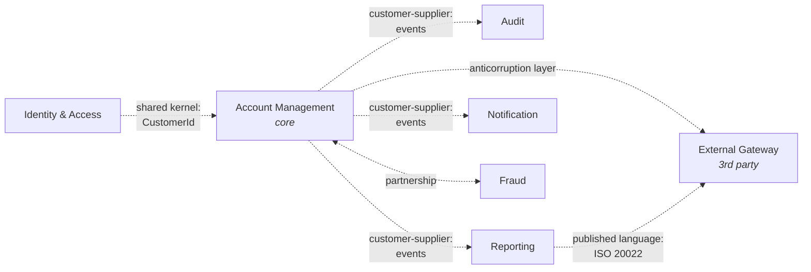
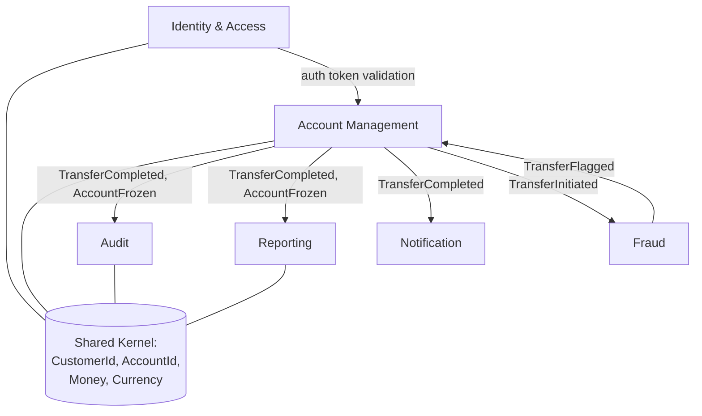
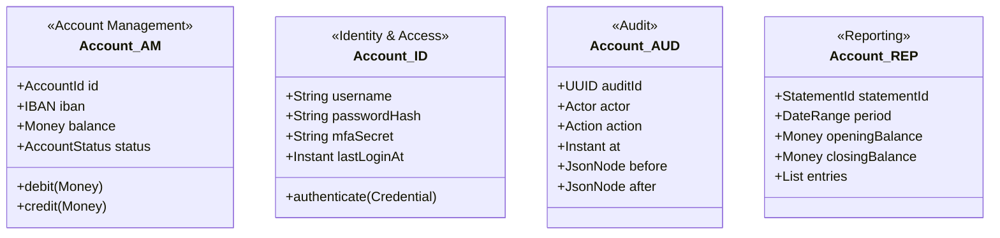

# Bounded Contexts

> A bounded context is a boundary within which a model is consistent. The same word can mean different things in different contexts; the same entity can have different attributes; the same operation can have different rules. Inside a context, terms have one meaning. Across contexts, meaning is translated, not shared.

## What you already know

From [[03-Domain-Concepts]]: the same word can mean different things — "Account" in identity vs accounting vs reporting. From [[03-Dependency-As-Root-Concept]]: dependencies should point toward stability; coupling across models creates ripples. From [[06-Coupling-and-Cohesion]]: a bounded context is a high-cohesion module at the domain layer, and contexts communicate via translation, not by sharing classes.

This chapter formalizes the *strategic* side of DDD — the part most teams skip, and the part that does the most heavy lifting.

## Why this layer exists

Without bounded contexts, every team contributes to one giant model. The model tries to be everything to everyone:

- The authentication team needs `Account` to mean a login credential.
- The banking team needs `Account` to mean a financial container.
- The audit team needs `Account` to mean a record of actions.
- The reporting team needs `Account` to mean a row in a statement.

The result: one `Account` class with fields for login, balance, audit trail, and statement formatting. The class has 50 fields. Every change to one team's needs ripples into the others. Tests break for unrelated reasons. New team members cannot learn the model because it has no coherent meaning.

This is the **large ball of mud** at the domain layer. The cure is not better code; it is *boundaries*. Draw a line around each context; inside that line, the model is consistent and cohesive; across the line, models talk to each other through explicit translations.

## What is genuinely new here

- A **bounded context** is a consistency boundary for a model, not a deployment boundary.
- The same noun can be a different entity in different contexts — and that is correct, not a problem to fix.
- **Context mapping** is the discipline of naming how contexts relate (shared kernel, customer-supplier, conformist, anticorruption layer, open-host service, published language).
- Bounded contexts *often* map to microservices, but not always. A microservice can contain multiple contexts; a context can span multiple services. The two are orthogonal.

## Concepts

### One model per context

Inside a bounded context, the model is consistent. The ubiquitous language (see [[00-Domain-Modeling]]) has one meaning per term. Invariants are unambiguous.

Across contexts, the same term can mean different things — *legitimately*. Each context optimizes its model for its own purpose.

| Context | "Account" means | Key attributes | Operations |
|---|---|---|---|
| Account Management | A financial container | iban, balance, status, overdraft | debit, credit, freeze, close |
| Identity & Access | A login credential | username, passwordHash, mfaSecret, lastLogin | authenticate, resetPassword, lock |
| Audit | A record of an actor's actions | actorId, action, target, timestamp | record, query |
| Reporting | A row in a statement | statementId, period, openingBalance, closingBalance | render, export |

Each context has its own `Account` class (or whatever it calls it). They are *not* the same class. They share an identity (an `AccountId` that refers to the same real-world account) but they do not share a model.

### Context map patterns

Contexts do not exist in isolation; they relate. The patterns:

1. **Shared kernel** — two contexts share a small, explicitly-bounded subset of the model. The shared subset is owned jointly; changes require coordination. Useful when two contexts genuinely need the same concept (e.g., `Money`, `Currency`).

2. **Customer-supplier** — one context (the supplier) provides a service or model that another (the customer) depends on. The supplier prioritizes the customer's needs. The dependency points from customer to supplier.

3. **Conformist** — like customer-supplier, but the supplier does not prioritize the customer. The customer conforms to whatever the supplier provides, even if it is inconvenient. Common when integrating with an external system you cannot change (e.g., a third-party payment gateway).

4. **Anticorruption layer (ACL)** — a translation layer between two contexts. The downstream context translates the upstream's model into its own. Protects the downstream from upstream changes. Critical when integrating with legacy or external systems.

5. **Open-host service** — one context exposes a public API (often REST or gRPC) that any other context can use. The API is the published contract; the internal model can change freely.

6. **Published language** — a standardized, documented information exchange language (e.g., ISO 20022 for banking, HL7 for healthcare, FIX for trading). Often paired with an open-host service.

7. **Partnership** — two contexts jointly coordinate, with no upstream/downstream relationship. Common between teams in the same organization that depend on each other.

8. **Separate ways** — two contexts do not integrate at all. They each solve their problem independently. Sometimes the right answer; not every system needs to be integrated.

### How contexts map to microservices

The rule:

> A bounded context is a *modeling* boundary. A microservice is a *deployment* boundary. They are correlated but not identical.

Patterns:

- **1 context = 1 service.** The cleanest case. The service owns its database, its model, its API. Most common in greenfield microservice architectures.
- **1 context = N services.** A single context is split into multiple services for scaling or deployment reasons. E.g., the Account Management context split into a `accounts-command` service (writes) and a `accounts-query` service (reads) — CQRS at the service level.
- **N contexts = 1 service.** A monolith contains multiple bounded contexts. The contexts are still separated by module boundaries (packages or modules within the monolith), even though they deploy together. This is the *modular monolith* pattern — an excellent starting point for most systems.

The mistake is to assume "we are doing microservices, so each one is a bounded context." A microservice without a coherent bounded context is just a distributed ball of mud.

### Context map visualization



Each line is a deliberate integration pattern, not an accidental shared class.

## Banking application

Banking decomposes into these bounded contexts:

### 1. Account Management (core domain)

The heart of the system. `Account`, `Customer`, `Transfer`, `LedgerEntry`, `Money`, `IBAN`. Owns the balance invariant, the lifecycle state machine, the transfer flow. This is where the team's best engineers should spend most of their time.

### 2. Identity & Access (supporting)

`User`, `Credential`, `Session`, `Role`, `Permission`. Handles authentication, authorization, password reset, MFA. References `CustomerId` (a shared kernel) but has its own model — an "Account" here means a login, not a financial container.

### 3. Audit (supporting)

`AuditEvent`, `Actor`, `Action`, `Target`, `Timestamp`. Append-only log of every state change. Subscribes to domain events from Account Management (and others). Never modifies Account Management's model; it reads events and writes its own projections.

### 4. Reporting (supporting)

`Statement`, `BalanceSnapshot`, `TransactionSummary`. Generates customer-facing statements and regulator-facing reports. Reads from Account Management's events or views; never writes to it.

### 5. Notification (generic)

`Notification`, `Channel` (email, SMS, push), `Template`. Sends messages triggered by events. Buy, don't build — there are many good notification platforms.

### 6. Fraud (supporting)

`FraudRule`, `RiskScore`, `ReviewCase`. Evaluates transfers for suspicious patterns. May use ML models. Communicates with Account Management via events (asynchronous) or via an open-host service (synchronous).

### Context map for banking



The shared kernel is small and deliberate: identity types and monetary types. Everything else is translated through events or APIs.

### Anticorruption layer example

When Account Management integrates with an external payment gateway (e.g., SWIFT), the gateway has its own model: `BIC`, `Message`, `Field50K`, `Field71G`. These leak into Account Management and pollute the model.

The cure: an ACL that translates between the gateway's model and Account Management's model.

```java
// Account Management's model — clean, ubiquitous language.
public record TransferInstruction(AccountId source, AccountId destination,
                                  Money amount, String reference) {}

// The external gateway's model — different vocabulary.
public record SwiftMessage(String bic, String field50K, String field71G,
                           String amountField, String currencyField) {}

// The anticorruption layer — translation only.
public final class SwiftAcl {
    public SwiftMessage toSwift(TransferInstruction instr,
                                Account src, Account dst) {
        return new SwiftMessage(
            dst.bic(),
            formatField50K(dst.owner()),
            formatField71G(instr.reference()),
            instr.amount().amount().toPlainString(),
            instr.amount().currency().code());
    }

    public TransferInstruction fromSwift(SwiftMessage msg) {
        // Translate back, rejecting messages that don't fit our model.
        // ...
    }
}
```

The ACL is the *only* code that knows about SWIFT's model. Account Management itself stays clean.

### Same word, different model

Notice how "Account" appears in three contexts, with different attributes:



Each is a valid model in its context. Forcing them into one class would be a mistake.

## Code/diagrams

A modular monolith decomposition by bounded context (recommended starting point):

```text
com.bank/
  accountmanagement/        <- Account Management context
    model/
      Account.java
      Transfer.java
      LedgerEntry.java
      Money.java
      IBAN.java
    application/
      TransferService.java
      AccountService.java
    infrastructure/
      JpaAccountRepository.java
      JpaTransferRepository.java
  identity/                 <- Identity & Access context
    model/
      User.java
      Credential.java
      Session.java
    application/
      AuthService.java
  audit/                    <- Audit context
    model/
      AuditEvent.java
      Actor.java
    application/
      AuditListener.java   <- subscribes to events
  reporting/
    model/
      Statement.java
    application/
      StatementService.java
  notification/
    ...
  sharedkernel/             <- shared kernel: types and only types
    CustomerId.java
    AccountId.java
    Money.java              <- or import from a shared library
    Currency.java
```

Each package is a bounded context. The shared kernel package is small and owned jointly. Cross-package references go through public APIs or event subscriptions, not through internal types.

## What can go wrong

- **One context for everything.** A single model that tries to be all things to all teams. The large ball of mud. Split.
- **Contexts too fine.** Every entity is its own context. The system becomes a distributed monolith — every operation is a network call. Group cohesive entities.
- **Shared database instead of shared kernel.** Two contexts share a database table. They are now tightly coupled through the schema; changes to one break the other. Either merge the contexts, or split the schema and integrate via API.
- **Anticorruption layer skipped.** "We'll just use their model directly." Six months later, the external system's changes are breaking your code, and your model is full of their vocabulary. Always use an ACL for external integrations.
- **Ubiquitous language drift across contexts.** Two contexts use the same word for different things and don't realize it. The context map should make the differences explicit.
- **Microservice per context, blindly.** Each context becomes a microservice, even when they share a database and deploy together. Operational complexity explodes. Start with a modular monolith; extract services only when deployment pressure demands it.
- **No context map.** Integration patterns are ad hoc. Some are customer-supplier, some are shared database, some are direct calls — but nobody wrote it down. New engineers spend months figuring out the actual relationships.
- **Partnership without coordination.** Two contexts are "partners" but neither team coordinates with the other. Changes break each other. Partnership requires ongoing communication; if you can't commit to that, demote to customer-supplier.

## Trade-offs

- **Context granularity.** Coarse: fewer translations, simpler integration, but larger models that try to be too many things. Fine: cleaner models, but more integration overhead and a distributed monolith risk. Aim for one context per cohesive business capability.
- **Shared kernel vs translation.** Sharing a small kernel is convenient but creates a coupling that requires coordination. Translation is decoupled but verbose. The rule: share only what is genuinely common (identity types, money) and translate the rest.
- **Synchronous vs asynchronous integration.** Sync (RPC, REST) gives immediate response but tight coupling and availability coupling. Async (events) gives loose coupling but eventual consistency. Banking uses sync for queries and auth checks; async for notifications, audit, reporting.
- **Modular monolith vs microservices.** Modular monolith: faster to build, easier to refactor, single deployment. Microservices: independent deployment, independent scaling, but distributed system complexity. Default to modular monolith; extract when forced.
- **Open-host service vs direct integration.** Open-host: stable public API, multiple consumers, versioning burden. Direct: simpler for one consumer, brittle for many. Use open-host when you have 3+ consumers or expect them.

## Forward links

- [[04-Domain-Events]] — how contexts communicate asynchronously.
- [[06-Banking-Domain-Model]] — the full banking context map.
- [[04-Enterprise-Patterns]] — Repository, Unit of Work, and CQRS as cross-context patterns.
- [[02-Layered-Architecture]] and [[03-Hexagonal-Architecture]] — how bounded contexts sit inside an architectural style.
- [[05-Architecture-Trade-offs]] — modular monolith vs microservices trade-offs.
- [[09-Object-Model-vs-Data-Model]] — bounded contexts at the model layer vs schema layer.
- [[04-Partitioning-And-Sharding]] — when a context grows beyond one database.
- [[00-CAP-PACELC]] — distributed consistency across contexts.
- [[00-Banking-Case-Study]] — the banking invariants that the contexts must collectively enforce.
