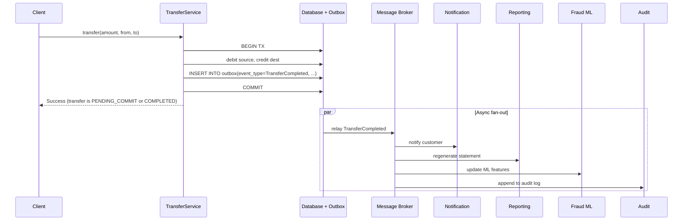

# Domain Events

> A domain event is something that happened in the domain that domain experts care about. Events are past-tense, immutable, and publishable. They are the decoupling mechanism between aggregates and between bounded contexts — the way the producer of a fact tells the world about it without knowing who consumes the fact.

## What you already know

From [[03-Dependency-As-Root-Concept]]: a dependency exists when a change in one place can force a change elsewhere; the cure is to reduce or invert. From [[04-Abstraction-and-Models]]: every abstraction exists to reduce or invert a dependency. From [[02-Aggregates]]: aggregates communicate across boundaries by identity, not by direct reference.

A domain event is the natural extension: an aggregate produces a fact about itself and *publishes* it. Anyone interested subscribes. The producer does not know the consumers exist. The dependency is inverted — consumers depend on the event contract, not on the producer.

## Why this layer exists

Without events, the producer must call every consumer directly:

```java
public void executeTransfer(Transfer t) {
    accountRepository.debit(t.source(), t.amount());
    accountRepository.credit(t.destination(), t.amount());
    notificationService.notifyTransferCompleted(t);     // direct call
    statementService.regenerateStatements(t);            // direct call
    fraudService.updateMlFeatures(t);                    // direct call
    auditService.recordTransfer(t);                      // direct call
    marketingService.updateCustomerEngagement(t);        // direct call
}
```

Every new consumer requires a change to the producer. The producer knows about every consumer's API. If any consumer is down, the transfer fails. The producer is coupled to every downstream concern.

Events flip this. The producer publishes one fact — `TransferCompleted` — and walks away. Each consumer subscribes independently. Adding a consumer requires no change to the producer. Removing a consumer requires no change. The producer's availability does not depend on the consumers'.

This is the **dependency inversion** principle (see [[05-DIP]]) applied at the integration layer: the producer depends on an abstraction (the event contract), and the consumers depend on the same abstraction. Neither knows about the other.

## What is genuinely new here

- An event is **past-tense** and **immutable**. `TransferCompleted` describes something that *already happened*. You cannot un-complete a transfer; you can only compensate for it (with another event, like `TransferReversed`).
- Events have a **named contract** — a type, a payload, a version. Consumers depend on the contract; producers must not break it.
- Events **decouple** producers from consumers in three dimensions: time (consumers can run later), availability (consumers can be down), and knowledge (producers don't know who consumes).
- **Eventual consistency is a consequence**, not a goal. When you publish an event instead of calling a service, the consumer runs later. The system is eventually consistent with respect to the consumer's view.

## Concepts

### Anatomy of a domain event

```java
public record TransferCompleted(
    UUID eventId,           // unique id of this event occurrence
    Instant occurredAt,     // when the fact happened in the domain
    TransferId transferId,  // the entity the event is about
    AccountId sourceId,
    AccountId destinationId,
    Money amount,
    String idempotencyKey   // for consumer-side deduplication
) implements DomainEvent {}
```

Every event has:

- An **event id** — a unique identifier for *this occurrence* (not for the entity). Used for deduplication by consumers.
- An **occurred-at timestamp** — when the fact happened in the domain. Not when the event was published (which may be later).
- A **subject** — the entity or aggregate the event is about, referenced by identity (see [[02-Aggregates]]).
- A **payload** — the data the consumer needs. Keep it minimal; consumers can fetch more from the source if needed.
- An **idempotency key** or **correlation id** — for tracing and for consumer-side deduplication.

Events are immutable. They are past-tense. They do not contain commands ("do this") — they contain facts ("this happened").

### Event vs command

This distinction trips up many teams:

- A **command** is a request to do something: `TransferMoney`, `FreezeAccount`, `CloseAccount`. Commands are imperative, may be rejected, and are sent to a specific recipient.
- An **event** is a fact about something that happened: `TransferCompleted`, `AccountFrozen`, `AccountClosed`. Events are past-tense, cannot be rejected (they already happened), and are published to anyone interested.

| | Command | Event |
|---|---|---|
| Tense | Imperative (`TransferMoney`) | Past (`TransferCompleted`) |
| Rejected? | Can be | Cannot be — it already happened |
| Recipient | Specific | Anyone listening |
| Direction | Caller → handler | Producer → unknown consumers |
| Effect | Causes change | Notifies of change |

A common pattern: a command causes a state change; the state change produces an event. `TransferMoney` (command) → `Transfer` aggregate mutates → `TransferCompleted` (event) published.

### Event publishing patterns

Three levels of sophistication:

#### 1. In-process events (synchronous, single JVM)

The simplest case. The producer publishes to an in-memory event bus; subscribers in the same process receive the event synchronously or via a thread pool.

```java
public interface DomainEventPublisher {
    void publish(DomainEvent event);
}

public final class InMemoryEventPublisher implements DomainEventPublisher {
    private final Map<Class<?>, List<Consumer<?>>> handlers = new ConcurrentHashMap<>();

    public <T extends DomainEvent> void subscribe(Class<T> type, Consumer<T> handler) {
        handlers.computeIfAbsent(type, k -> new CopyOnWriteArrayList<>())
                .add(handler);
    }

    @Override public void publish(DomainEvent event) {
        handlers.getOrDefault(event.getClass(), List.of())
                .forEach(h -> ((Consumer<DomainEvent>) h).accept(event));
    }
}
```

Pros: trivial, fast, no infrastructure. Cons: not durable (crash = lost events), no cross-process consumers, no retry.

#### 2. Transactional outbox + message broker (durable, asynchronous)

The robust pattern. The producer writes the event to an `outbox` table *in the same transaction* as the state change. A separate process (the "outbox poller" or "CDC relay") reads the outbox and publishes to a message broker (Kafka, RabbitMQ, SQS). Consumers subscribe to the broker.

```sql
-- Same transaction as the account update
INSERT INTO accounts (id, iban, balance, status) VALUES (...);
INSERT INTO outbox (event_id, event_type, payload, occurred_at, published)
VALUES ('...', 'TransferCompleted', '{...}', NOW(), false);
```

The outbox guarantees the event is published *if and only if* the state change committed. A separate relay publishes and marks `published = true`. This is the **transactional outbox pattern** — see [[04-Enterprise-Patterns]] for the full treatment.

Pros: durable, at-least-once delivery, decoupled across processes. Cons: more infrastructure, ordering challenges, idempotency required on the consumer side.

#### 3. Event sourcing (events are the source of truth)

The most aggressive pattern: the system stores events as the primary record. State is derived by replaying events. `Account.balance` is not stored; it is computed from the stream of `AccountCredited` and `AccountDebited` events.

Pros: full audit trail by construction, time travel (replay to any point), perfect event log. Cons: complexity, snapshotting required for performance, schema evolution is hard. See [[04-Enterprise-Patterns]] for more.

Most banking systems use pattern 2 (transactional outbox). Pattern 3 is overkill for most, but a few high-stakes domains (some exchanges, some ledgers) use it.

### Eventual consistency as a consequence

When you publish an event instead of calling a service synchronously, the consumer runs later. The producer's view of the world and the consumer's view diverge temporarily:

- Producer commits the transfer.
- Producer publishes `TransferCompleted`.
- (some milliseconds later) Consumer receives the event.
- Consumer updates its view.

During the gap, the consumer's view is stale. This is **eventual consistency** — the system is *eventually* consistent, but not at any given instant. See [[04-Eventual-Consistency]] for the full treatment.

For some consumers, eventual consistency is fine: notifications can be delayed by seconds; statements can be regenerated in a batch. For others, it is not: the balance displayed to a customer immediately after a transfer must be strongly consistent — that is a query against the source, not a consumer's view.

### Idempotency

Events are typically delivered **at-least-once**: the broker may redeliver an event if it isn't sure the consumer acknowledged. Consumers must be idempotent — processing the same event twice must produce the same result as processing it once.

```java
public final class NotificationConsumer {
    private final Set<UUID> processedEvents = ConcurrentHashMap.newKeySet();

    public void onTransferCompleted(TransferCompleted event) {
        if (!processedEvents.add(event.eventId())) {
            return; // already processed
        }
        notificationService.sendTransferNotification(event.transferId());
    }
}
```

In production, the deduplication set is usually a database table or a Redis set with TTL, not an in-memory map (which is lost on restart).

## Banking application

Banking events fall into a few categories:

### Lifecycle events

- `AccountOpened(customerId, accountId, iban, openingBalance)`
- `AccountFrozen(accountId, reason, frozenAt)`
- `AccountUnfrozen(accountId, unfrozenAt)`
- `AccountClosed(accountId, closedAt)`

### Transaction events

- `TransferInitiated(transferId, sourceId, destinationId, amount)`
- `TransferCompleted(transferId, sourceId, destinationId, amount, occurredAt)`
- `TransferFailed(transferId, reason)`
- `TransferReversed(transferId, reversalReason, reversedAt)`
- `DepositCompleted(accountId, amount)`
- `WithdrawalCompleted(accountId, amount)`

### Threshold events

- `BalanceLowThresholdReached(accountId, balance, threshold)` — a savings account dropped below a minimum.
- `OverdraftUsed(accountId, balance, overdraftLimit)` — a checking account went into overdraft.
- `LargeTransferDetected(transferId, amount)` — a transfer exceeded a reporting threshold.

### Risk events

- `FraudRuleTriggered(transferId, ruleId, riskScore)`
- `AccountFlaggedForReview(accountId, reason)`

### The transfer flow with events



Each consumer:

- Runs independently.
- Can be down without blocking the transfer.
- Can be added or removed without changing `TransferService`.
- Sees the event exactly once (or at-least-once, with idempotency).

### Event schema evolution

Events are contracts. Once published, they cannot be silently changed. Strategies:

- **Add fields with defaults.** Adding `currency` to `TransferCompleted` is safe if old consumers ignore the new field.
- **Never remove or rename fields.** Removing `idempotencyKey` breaks consumers who use it.
- **Version the event type.** `TransferCompletedV1`, `TransferCompletedV2`. Consumers handle both during the migration period.
- **Use a published language.** For cross-organization events (e.g., ISO 20022 banking messages), use a standard schema.

## Code/diagrams

### Event definition (Java 21 records)

```java
public sealed interface DomainEvent permits TransferCompleted, AccountFrozen, BalanceLowThresholdReached {
    UUID eventId();
    Instant occurredAt();
}

public record TransferCompleted(
    UUID eventId, Instant occurredAt,
    TransferId transferId, AccountId sourceId, AccountId destinationId,
    Money amount, String idempotencyKey
) implements DomainEvent {}

public record AccountFrozen(
    UUID eventId, Instant occurredAt,
    AccountId accountId, String reason, Instant frozenUntil
) implements DomainEvent {}

public record BalanceLowThresholdReached(
    UUID eventId, Instant occurredAt,
    AccountId accountId, Money balance, Money threshold
) implements DomainEvent {}
```

The sealed interface gives exhaustive pattern matching in consumers:

```java
public final class AuditConsumer {
    public void handle(DomainEvent event) {
        switch (event) {
            case TransferCompleted tc -> audit.transferCompleted(tc);
            case AccountFrozen af     -> audit.accountFrozen(af);
            case BalanceLowThresholdReached bl -> audit.balanceLow(bl);
        }
    }
}
```

### Transactional outbox in code

```java
public final class JpaTransferService {
    private final AccountRepository accounts;
    private final EntityManager em;
    private final Clock clock;

    @Transactional
    public void execute(TransferId id) {
        Transfer t = em.find(Transfer.class, id);
        Account src = em.find(Account.class, t.sourceId());
        Account dst = em.find(Account.class, t.destinationId());

        src.debit(t.amount());
        dst.credit(t.amount());
        t.markCompleted();

        // Write the event in the same transaction as the state change.
        em.persist(new OutboxEntry(
            UUID.randomUUID(),
            "TransferCompleted",
            new TransferCompleted(
                UUID.randomUUID(), clock.instant(),
                t.id(), t.sourceId(), t.destinationId(),
                t.amount(), t.idempotencyKey()
            )
        ));
    }
}
```

The outbox entry is committed atomically with the state change. A separate relay publishes it to the broker — see [[04-Enterprise-Patterns]].

## What can go wrong

- **Events as commands in disguise.** Naming an event `SendNotification` instead of `TransferCompleted`. Now the producer knows a notification should be sent; the decoupling is lost. Events are past-tense facts, not requests.
- **Events with too much payload.** Embedding the entire `Account` state in `TransferCompleted`. Consumers depend on the full shape; any change to `Account` breaks them. Keep payloads minimal; let consumers fetch what they need.
- **Events with too little payload.** Only `transferId`. Every consumer must call back to the producer to learn what happened. This reintroduces coupling through the back door. Include enough that consumers can act without a callback.
- **No outbox (events published after commit).** If the publish happens after the transaction commits, a crash between commit and publish loses the event. The outbox pattern is the standard fix.
- **No idempotency on consumers.** At-least-once delivery means duplicates. Consumers that aren't idempotent will double-count, double-notify, or double-charge. Always deduplicate by event id.
- **Synchronous event handling.** Publishing an event and then blocking on the consumer's response. This reintroduces temporal coupling and defeats the purpose. If you need a synchronous response, use a command, not an event.
- **Event versioning ignored.** Schema evolves, no versioning strategy, old consumers break silently. Plan for evolution from day one.
- **Event storms.** Every state change produces an event; every event triggers three handlers that each produce more events. The system becomes a cascade of cascades. Be selective: emit events that domain experts care about, not every internal state change.
- **Long-running consumers.** A consumer that does heavy work synchronously blocks the broker. Offload heavy work to a worker pool; keep the broker handler fast.

## Trade-offs

- **Sync vs async.** Sync (direct call): immediate, simple, but tightly coupled. Async (event): decoupled, scalable, but eventually consistent and harder to reason about. Default to async for cross-context integration; sync for same-context internal calls.
- **At-least-once vs exactly-once.** At-least-once is what most brokers deliver; requires consumer-side idempotency. Exactly-once is rare, expensive, and often illusory (it usually means "exactly-once in effect" via idempotency). Plan for at-least-once.
- **Event payload size.** Fat events (full state): consumers don't need callbacks, but break on schema change. Thin events (just ids): consumers must fetch, reintroducing coupling. Medium events (the data the consumer needs to act): usually right.
- **Event sourcing vs transactional outbox.** Sourcing: full audit, time travel, but complexity. Outbox: simpler, but state and event log can drift. Most systems should use outbox; only consider sourcing when audit is the primary requirement.
- **In-process vs broker.** In-process: trivial, fast, but no durability or cross-process. Broker: durable, cross-process, but infrastructure. Use in-process for same-context internal events (e.g., triggering a projector in the same service); broker for cross-context.

## Forward links

- [[02-Aggregates]] — aggregates produce events when their state changes.
- [[03-Bounded-Contexts]] — events are the primary cross-context integration mechanism.
- [[06-Banking-Domain-Model]] — the full catalog of banking events.
- [[04-Enterprise-Patterns]] — transactional outbox, event sourcing, CQRS.
- [[00-ACID]] — the transactional foundation the outbox relies on.
- [[04-Eventual-Consistency]] — the consequence of decoupled consumers.
- [[03-Dependency-As-Root-Concept]] — events invert the producer-consumer dependency.
- [[00-CAP-PACELC]] — the consistency/availability trade-off at the system level.
- [[07-Distributed-Transactions]] — events as the alternative to distributed transactions.
- [[00-Banking-Case-Study]] — the transfer flow that produces `TransferCompleted`.
