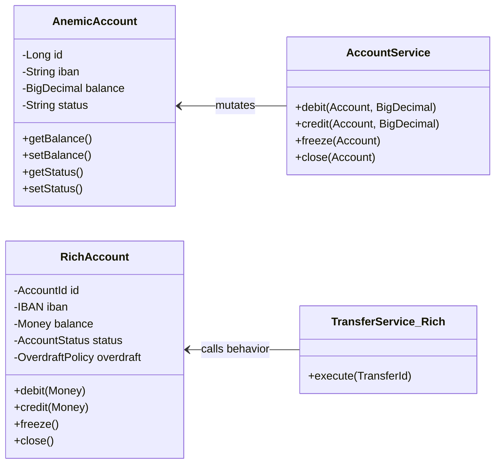

# Anemic vs Rich Models

> The choice between anemic and rich domain models is the choice of where behavior lives. In an anemic model, entities are data bags and services hold the behavior. In a rich model, entities hold both state and the behavior that protects their invariants. The right answer is not universal — it depends on the domain and the invariant. But the default in complex domains is rich, and the reason is cohesion.

## What you already know

From [[04-Responsibilities]]: the rule is *whoever owns the invariant owns the responsibility for enforcing it*. From [[06-Coupling-and-Cohesion]]: a module is cohesive when it owns one invariant, and the test for cohesion is *shared invariant*, not "relatedness." From [[02-Aggregates]]: the aggregate root is the only entry point for mutations, and the root's methods enforce the invariants.

This chapter makes the choice explicit and shows the same domain modeled both ways, side by side.

## Why this layer exists

Anemia creeps in by default. Frameworks encourage it:

- JPA entities are POJOs with getters and setters. The framework populates them, the framework persists them. Behavior has nowhere obvious to live, so it goes into services.
- Spring's `@Service` stereotype puts behavior in services by convention. Entities are "data," services are "logic."
- DTOs are everywhere; entities look like DTOs with annotations.

The result is `AccountService.debit(account, amount)` instead of `account.debit(amount)`. The entity is a passive record; the service knows the rules. This *works* — the code runs — but it has costs:

- The invariant "balance == sum(ledger_entries)" is enforced in the service, not in the entity. Anyone with an `Account` reference and a `LedgerEntry` repository can break the invariant.
- The entity has no behavior to test in isolation. Every test must construct the service and its dependencies.
- The ubiquitous language leaks: `AccountService.debit(account, amount)` reads like plumbing, not banking. `account.debit(amount)` reads like banking.
- Behavior scatters. `debit` logic lives in `AccountService`; `freeze` logic lives in `AccountLifecycleService`; `close` logic lives in `AccountClosureService`. There is no single place to look for "what an account does."

A rich model reverses this. The behavior lives on the entity that owns the invariant. Services orchestrate; entities do the work.

## What is genuinely new here

- Anemia is not a sin. It is a trade-off. In some domains (CRUD admin screens, simple report forms), anemia is correct.
- In complex domains with real invariants (banking, healthcare, insurance), anemia is wrong — not aesthetically, but functionally. The invariants cannot be enforced reliably when behavior is scattered.
- The rule: **behavior goes on the entity that owns the invariant.** Everything else is orchestration, which goes in services.

## Concepts

### Anemic model

```java
// Anemic Account — a data bag
public class Account {
    private Long id;
    private String iban;
    private BigDecimal balance;
    private String status;
    private BigDecimal overdraftLimit;
    // ... getters and setters for everything
}

// Service holds the behavior
public class AccountService {
    public void debit(Account account, BigDecimal amount) {
        if (!"ACTIVE".equals(account.getStatus()) && !"FROZEN".equals(account.getStatus())) {
            throw new IllegalStateException("Cannot debit " + account.getStatus());
        }
        BigDecimal newBalance = account.getBalance().subtract(amount);
        if (newBalance.compareTo(account.getOverdraftLimit().negate()) < 0) {
            throw new IllegalStateException("Overdraft exceeded");
        }
        account.setBalance(newBalance);
    }
    public void credit(Account account, BigDecimal amount) { ... }
    public void freeze(Account account) { ... }
    public void close(Account account) { ... }
}
```

The `Account` class is a struct with getters and setters. All rules live in `AccountService`. The invariant is *enforced by the service* — but nothing stops another piece of code from calling `account.setBalance(...)` directly and breaking it.

### Rich model

```java
// Rich Account — behavior + state together
public final class Account {
    private final AccountId id;
    private final IBAN iban;
    private Money balance;
    private AccountStatus status;
    private final OverdraftPolicy overdraft;
    private final List<LedgerEntry> entries = new ArrayList<>();

    // No public setters. Mutations go through behavior-named methods.

    public void debit(Money amount) {
        ensureCanWithdraw();
        overdraft.ensureAllowed(balance.minus(amount));
        balance = balance.minus(amount);
        entries.add(LedgerEntry.debit(amount, clock.instant()));
    }

    public void credit(Money amount) {
        ensureCanDeposit();
        balance = balance.plus(amount);
        entries.add(LedgerEntry.credit(amount, clock.instant()));
    }

    public void freeze() {
        if (status != AccountStatus.ACTIVE) {
            throw new IllegalStateException("Only ACTIVE accounts can be frozen");
        }
        status = AccountStatus.FROZEN;
    }

    public void close() {
        if (status == AccountStatus.CLOSED) return;
        if (balance.isNegative()) {
            throw new IllegalStateException("Cannot close an account in overdraft");
        }
        status = AccountStatus.CLOSED;
    }

    private void ensureCanWithdraw() {
        if (status != AccountStatus.ACTIVE) {
            throw new IllegalStateException("Cannot withdraw from " + status + " account");
        }
    }
    private void ensureCanDeposit() {
        if (status == AccountStatus.CLOSED) {
            throw new IllegalStateException("Cannot deposit into CLOSED account");
        }
    }
}

// Service orchestrates — does NOT contain domain rules
public final class TransferService {
    private final AccountRepository accounts;

    public void execute(Transfer t) {
        Account src = accounts.find(t.sourceId()).orElseThrow();
        Account dst = accounts.find(t.destinationId()).orElseThrow();
        src.debit(t.amount());    // rule lives in Account
        dst.credit(t.amount());   // rule lives in Account
        accounts.save(src);
        accounts.save(dst);
    }
}
```

The `Account` class owns its invariants. The `TransferService` orchestrates — it loads, calls behavior, saves — but it does not know the rules. You cannot break the balance invariant without going through `debit` or `credit`.

### The test for placement

For any piece of behavior, ask:

> *Does this behavior protect an invariant owned by this entity?*

- If yes, the behavior belongs on the entity.
- If no, the behavior belongs in a service.

Examples:

| Behavior | Owner of invariant? | Belongs on |
|---|---|---|
| `account.debit(amount)` — updates balance, adds ledger entry | Yes — Account owns balance | Account |
| `account.freeze()` — transitions status | Yes — Account owns lifecycle | Account |
| `transfer.execute()` — moves money across two accounts | Yes — Transfer owns atomicity | Transfer |
| `transferService.execute(transfer)` — loads, calls, saves | No — orchestrates | TransferService |
| `notificationService.send(transferCompleted)` | No — separate concern | NotificationService |
| `fraudService.evaluate(transfer)` | No — separate bounded context | FraudService |
| `statementFormatter.format(account, period)` | No — presentation concern | StatementFormatter |
| `account.computeInterest()` — applies the daily interest | Yes — Account owns balance | Account |
| `interestPolicy.rateFor(account)` — pure calculation | No — strategy | InterestPolicy (strategy) |

The pattern: entities hold *invariants*; services hold *orchestration*; strategies hold *pure algorithms*.

### When anemia is right

Anemia is appropriate when:

- The domain is CRUD with light validation — admin screens, configuration forms, simple record management.
- There are no significant invariants — the entity is just a record of fields.
- The behavior is mostly UI or workflow orchestration — load, edit, save.
- The "rules" are simple data constraints (`NOT NULL`, `UNIQUE`, range checks) — these belong in the schema, not in entity methods.

Example: a `UserPreference` entity with `theme`, `language`, `timezone` fields. There is no invariant to protect beyond "these are valid enum values." An anemic model with `@Valid` annotations is correct here. Forcing a rich model adds ceremony without benefit.

### When anemia is wrong

Anemia is wrong when:

- The entity has *real* invariants — rules that must hold across multiple fields or across time.
- The entity has a lifecycle — state transitions that must be enforced.
- The behavior is *the point* of the entity — banking, accounting, healthcare, insurance, logistics.
- Multiple operations on the entity must be coordinated — debit must add a ledger entry, must check status, must enforce overdraft.

In banking, the `Account` is the canonical example. Its invariants — balance equals sum of ledger entries; status transitions are valid; closed accounts don't transact — are *the product*. Anemia scatters these rules across services; any code that bypasses the service breaks them. Rich modeling concentrates them where they cannot be bypassed.

## Banking application

The same `Account`, modeled anemically and richly, side by side.

### Anemic version

```java
@Entity
public class Account {
    @Id @GeneratedValue private Long id;
    private String iban;
    private BigDecimal balance;
    private String status;       // 'PENDING', 'ACTIVE', 'FROZEN', 'CLOSED'
    private BigDecimal overdraftLimit;
    // getters and setters ...
}

@Service
public class AccountService {
    public void debit(Long accountId, BigDecimal amount) {
        Account a = repo.findById(accountId).orElseThrow();
        if (!"ACTIVE".equals(a.getStatus())) {
            throw new IllegalStateException("Cannot debit");
        }
        BigDecimal newBal = a.getBalance().subtract(amount);
        if (newBal.compareTo(a.getOverdraftLimit().negate()) < 0) {
            throw new IllegalStateException("Overdraft exceeded");
        }
        a.setBalance(newBal);
        LedgerEntry e = new LedgerEntry();
        e.setAccountId(a.getId());
        e.setAmount(amount.negate());
        e.setOccurredAt(Instant.now());
        ledgerRepo.save(e);
        repo.save(a);
    }
    // credit, freeze, close, openAccount, ...
}
```

Reads like plumbing. The rule "active accounts only, overdraft enforced, ledger entry appended" is buried in service code.

### Rich version

```java
@Entity
public final class Account {
    @Id private AccountId id;
    @Embedded private IBAN iban;
    @Embedded private Money balance;
    @Enumerated(EnumType.STRING) private AccountStatus status;
    @Embedded private OverdraftPolicy overdraft;

    @OneToMany(cascade = ALL, orphanRemoval = false)
    private List<LedgerEntry> entries = new ArrayList<>();

    // No setters. Mutations go through behavior-named methods.

    public void debit(Money amount) {
        if (status != ACTIVE) throw new IllegalStateException("Not active");
        overdraft.ensureAllowed(balance.minus(amount));
        balance = balance.minus(amount);
        entries.add(LedgerEntry.debit(id, amount, clock.instant()));
    }

    public void credit(Money amount) {
        if (status == CLOSED) throw new IllegalStateException("Closed");
        balance = balance.plus(amount);
        entries.add(LedgerEntry.credit(id, amount, clock.instant()));
    }

    public void freeze() {
        if (status != ACTIVE) throw new IllegalStateException("Not active");
        status = FROZEN;
    }
}

@Service
public final class TransferService {
    public void execute(TransferId id) {
        Transfer t = transfers.find(id);
        Account src = accounts.find(t.sourceId());
        Account dst = accounts.find(t.destinationId());
        src.debit(t.amount());   // rule lives in Account
        dst.credit(t.amount());
        accounts.save(src);
        accounts.save(dst);
    }
}
```

Reads like banking. The rules are where the data is.

### Unit testing the rich model

```java
@Test void debit_reduces_balance_and_appends_ledger_entry() {
    Account acc = new Account(AccountId.generate(), IBAN.of("GB29..."),
                              Money.euros(100), AccountStatus.ACTIVE,
                              OverdraftPolicy.zero());

    acc.debit(Money.euros(30));

    assertThat(acc.balance()).isEqualTo(Money.euros(70));
    assertThat(acc.entries()).hasSize(1);
    assertThat(acc.entries().get(0).amount()).isEqualTo(Money.euros(-30));
}

@Test void debit_rejected_when_account_is_frozen() {
    Account acc = newFrozenAccount();

    assertThatThrownBy(() -> acc.debit(Money.euros(10)))
        .isInstanceOf(IllegalStateException.class);
}
```

No service, no repository, no database. The entity is testable in isolation because the behavior lives on it. This is the testing payoff of rich models.

### Unit testing the anemic model

```java
@Test void debit_reduces_balance_and_appends_ledger_entry() {
    Account a = new Account();
    a.setStatus("ACTIVE");
    a.setBalance(new BigDecimal("100"));
    a.setOverdraftLimit(BigDecimal.ZERO);

    accountService.debit(a, new BigDecimal("30"));

    assertThat(a.getBalance()).isEqualByComparingTo("70");
    verify(ledgerRepo).save(argThat(e -> e.getAmount().compareTo(new BigDecimal("-30")) == 0));
}
```

The test needs the service, the ledger repository (mocked), and the entity. The behavior is not testable in isolation.

## Code/diagrams



The left side has behavior in the service; the right side has behavior in the entity. Both compile. Both work. Only the right side is testable in isolation and enforces its invariants universally.

## What can go wrong

- **Anemia in a complex domain.** Banking with `AccountService.debit(account, amount)`. Invariants scattered; bypass-able; untestable.
- **Rich model in a CRUD domain.** A `UserPreference` entity with `setTheme()` and `validateTheme()` methods — pure ceremony. Use an enum and a `@Valid` annotation.
- **Setters on a rich entity.** `Account.setBalance()` exists "for the ORM." Now the invariant is bypassable. Use field-level access for the ORM and remove setters; or use a private no-arg constructor for the ORM and expose only behavior.
- **Service doing entity work.** `AccountService.debit()` computing the new balance and overdraft check. Move the logic to `Account.debit()`.
- **Entity doing service work.** `Account.sendNotification()` — accounts shouldn't send notifications. Move to a service.
- **Domain logic in validators.** An `AccountValidator` that checks overdraft rules. The validator runs *before* the entity is constructed; the entity is still anemic. Move the rules into the entity's methods.
- **Rich model with no invariant tests.** Rich models are testable in isolation — but only if you write the tests. An untested rich model is no safer than an anemic one.
- **Anemia defended as "Spring convention."** Spring's `@Service` and JPA entities make anemia easy. Easy is not correct. The framework supports rich models too — see [[06-Hibernate-JPA]].

## Trade-offs

- **Rich is more cohesive but harder to wire.** Rich entities need their dependencies (clocks, policies) injected. JPA entities can't be Spring beans. Solutions: pass dependencies as method arguments, use factories, or use a domain layer separate from JPA entities (see [[03-Hexagonal-Architecture]]).
- **Rich is more testable but more code.** Rich entities have methods; methods have tests. Anemic entities have getters; getters don't. The test count goes up; the bug count goes down.
- **Anemia is simpler to start but harder to evolve.** Anemic models are quick to scaffold. As rules accumulate, services bloat and invariants scatter. The first sprint is faster; the tenth is slower.
- **Anemia fits ORMs better.** JPA wants POJOs with getters and setters. Rich entities fight the framework. The trade-off is real — see [[00-ORM-Impedance-Mismatch]].
- **Service granularity differs.** Anemic models need many services (one per entity cluster). Rich models need fewer services (orchestration only). Code size is similar; the location of rules differs.
- **Team familiarity.** Teams used to anemia will resist rich models. Teams used to rich models will find anemia alarming. The transition is gradual; start with the entities that have the strongest invariants.

## Forward links

- [[00-Domain-Modeling]] — DDD discipline that favors rich models for complex domains.
- [[02-Aggregates]] — aggregates only work if the root is rich; an anemic root is not an aggregate.
- [[06-Banking-Domain-Model]] — the full banking domain model, rich throughout.
- [[04-Enterprise-Patterns]] — Repository and Unit of Work patterns work with both, but richer models use them more cleanly.
- [[00-ORM-Impedance-Mismatch]] — the framework pressure toward anemia.
- [[06-Hibernate-JPA]] — practical techniques for rich models under JPA.
- [[03-Hexagonal-Architecture]] and [[04-Clean-Architecture]] — architectural styles that keep the domain rich and the framework at the edges.
- [[04-Responsibilities]] — the rule that decides where behavior goes.
- [[06-Coupling-and-Cohesion]] — the cohesion test that anemia fails for invariant-bearing entities.
