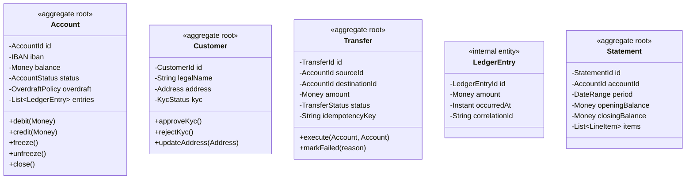
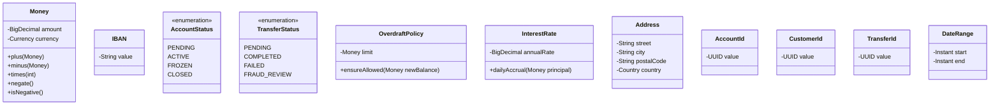
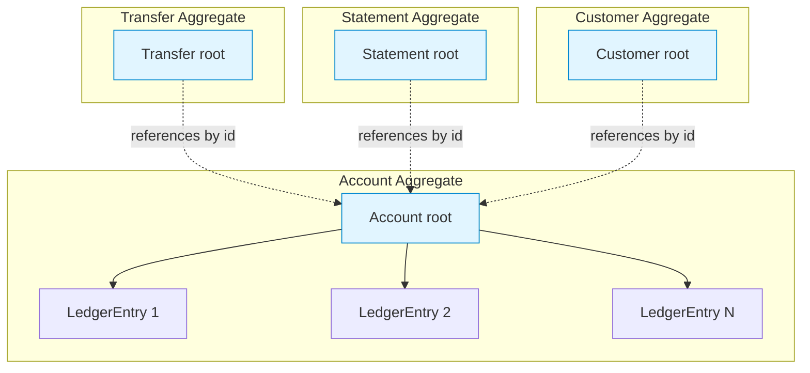
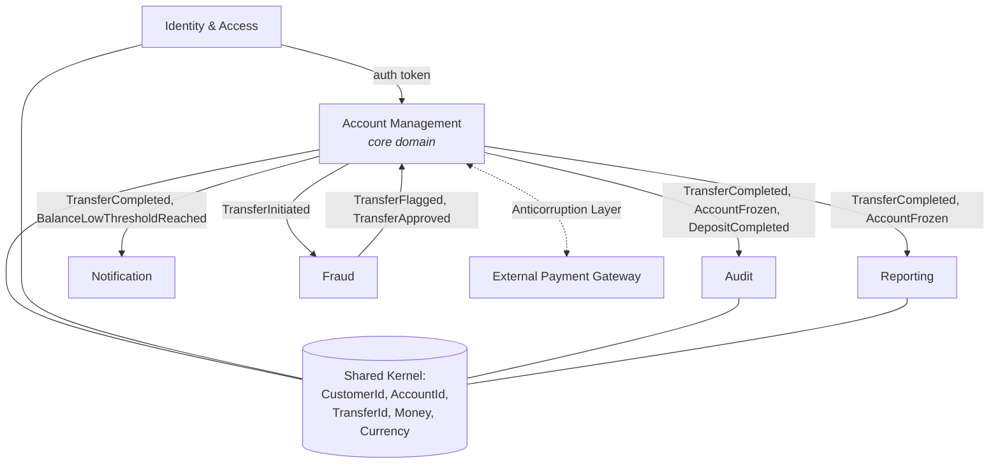
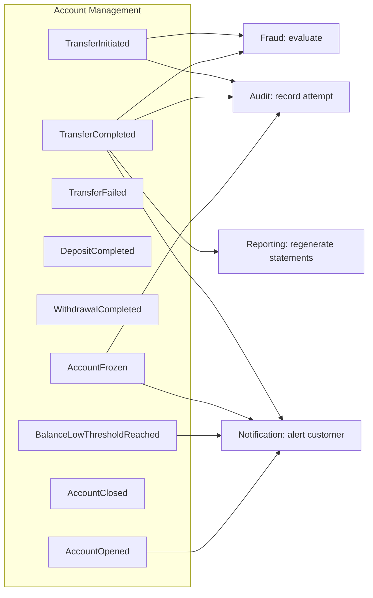
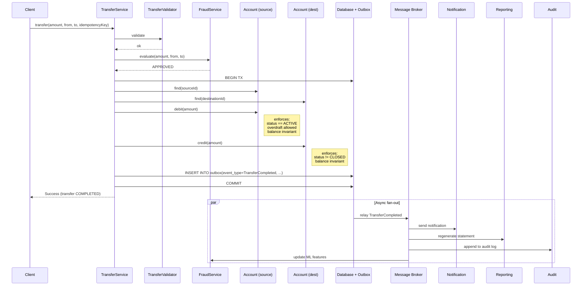

# Banking Domain Model — End-to-End DDD

> The complete banking domain model in one place: ubiquitous language, entities, value objects, aggregates, bounded contexts, and domain events. This is the model the rest of the vault's banking chapters refer back to — and the model that the schema in [[04-Banking-Schema]] will persist.

## What you already know

From [[00-Domain-Modeling]] through [[05-Anemic-vs-Rich-Models]]: the tactical building blocks (entities, value objects, aggregates), the strategic decomposition (bounded contexts), the integration mechanism (domain events), and the modeling posture (rich, with behavior on the entity that owns the invariant).

From [[00-Banking-Case-Study]]: the ten invariants the system must enforce, and the entities we will discover. From [[03-Domain-Concepts]]: the ubiquitous-language glossary. From [[04-Responsibilities]]: the rule "whoever owns the invariant owns the responsibility for enforcing it."

This chapter assembles everything into one coherent model.

## Why this layer exists

The previous chapters taught the building blocks in isolation. A real domain model is not a pile of isolated blocks — it is a *system* of them: aggregates that reference each other by identity, events that flow between contexts, value objects that wrap every primitive, a ubiquitous language that runs through every name.

This chapter exists to show the assembled model so you can see:

- How the building blocks fit together.
- Where the trade-offs were made.
- How the model maps (and does not map) to the schema in [[04-Banking-Schema]].
- How the transfer flow — the system's most important use case — plays out end to end.

## What is genuinely new here

Nothing new conceptually. The new thing is the *synthesis*: a complete, opinionated, end-to-end banking domain model with every decision made and defended. This is the model you will see in code, in schema, in SQL, and in transactions for the rest of the vault.

## Concepts

### Ubiquitous language (banking glossary)

The model speaks the same language as the business. Every class name, every method, every event matches a term a banker would use.

| Term | Meaning |
|---|---|
| Customer | A person or organization that owns one or more Accounts |
| Account | A financial container owned by a Customer, holding a Money balance |
| CheckingAccount | An Account that permits overdraft up to an OverdraftLimit |
| SavingsAccount | An Account that accrues Interest and does not permit overdraft |
| LedgerEntry | An immutable record of a single monetary movement against an Account |
| Transfer | A request to move Money from one Account to another, producing two LedgerEntries |
| Balance | The Money sum of all LedgerEntries for an Account |
| OverdraftLimit | The maximum negative Money balance permitted on a CheckingAccount |
| InterestRate | The annual rate at which a SavingsAccount accrues Interest |
| AccountStatus | One of: PENDING, ACTIVE, FROZEN, CLOSED |
| TransferStatus | One of: PENDING, COMPLETED, FAILED, FRAUD_REVIEW |
| Statement | A periodic summary of an Account's activity |
| Notification | A message to be sent to a Customer |

If a class name does not appear in this glossary, it is plumbing (Repository, Service, Mapper) and lives outside the domain model.

### Entities (have identity)



### Value objects (no identity, immutable)



Notice: even the *identity references* (`AccountId`, `CustomerId`, `TransferId`) are value objects. They wrap a `UUID` and provide type safety — you cannot pass a `CustomerId` where an `AccountId` is expected. See [[01-Entities-Value-Objects]] for the rationale.

### Aggregates and boundaries

The five aggregates of the Account Management context:



Each box is a transaction boundary. Inside, strong consistency. Across, eventual consistency via events.

The rules for these aggregates:

| Aggregate | Root | Internal entities | Invariants owned |
|---|---|---|---|
| Account | `Account` | `LedgerEntry` | `balance == sum(entries.amount)`; status transitions; overdraft; closed/frozen rules |
| Customer | `Customer` | (none) | KYC lifecycle; address validity |
| Transfer | `Transfer` | (none) | produces exactly two ledger entries summing to zero; idempotency |
| Statement | `Statement` | `LineItem` | opening + entries == closing |
| LedgerEntry | (cannot be a root) | — | immutability |

Note that `LedgerEntry` is an *internal* entity of the `Account` aggregate. Outside code never references a `LedgerEntry` directly; it always goes through the `Account`. This is what makes the balance invariant enforceable.

### Bounded contexts



The Account Management context is the core. The others are supporting (Audit, Reporting, Fraud) or generic (Notification). The shared kernel is small — identity types and money — and owned jointly.

### Domain events



Each event has a payload, an id, an occurred-at timestamp, and an idempotency key. Each is published via the transactional outbox pattern (see [[04-Domain-Events]]).

## Banking application

### The transfer flow end to end



Every aggregate stays within its boundary. The transaction touches two `Account` aggregates (same database, so we accept the cross-aggregate transaction — see [[02-Aggregates]] for the trade-off). Events publish asynchronously to all downstream contexts.

### Java code — the full Account aggregate

```java
public final class Account {
    private final AccountId id;
    private final IBAN iban;
    private final CustomerId ownerId;
    private Money balance;
    private AccountStatus status;
    private final OverdraftPolicy overdraft;
    private final InterestRate interestRate;   // null for checking
    private final List<LedgerEntry> entries = new ArrayList<>();
    private final Clock clock;

    // Factory — accounts are created PENDING
    public static Account open(CustomerId owner, IBAN iban, Money openingDeposit,
                               OverdraftPolicy overdraft, InterestRate rate, Clock clock) {
        if (openingDeposit.isNegative()) {
            throw new IllegalArgumentException("Opening deposit cannot be negative");
        }
        Account a = new Account(AccountId.generate(), iban, owner,
                                openingDeposit, AccountStatus.PENDING,
                                overdraft, rate, clock);
        if (!openingDeposit.isZero()) {
            a.entries.add(LedgerEntry.credit(a.id, openingDeposit, clock.instant()));
        }
        return a;
    }

    public void activate() {
        if (status != AccountStatus.PENDING) {
            throw new IllegalStateException("Only PENDING accounts can be activated");
        }
        status = AccountStatus.ACTIVE;
    }

    public void debit(Money amount) {
        ensureCanWithdraw();
        overdraft.ensureAllowed(balance.minus(amount));
        balance = balance.minus(amount);
        entries.add(LedgerEntry.debit(id, amount, clock.instant()));
        assert invariantHolds();
    }

    public void credit(Money amount) {
        ensureCanDeposit();
        balance = balance.plus(amount);
        entries.add(LedgerEntry.credit(id, amount, clock.instant()));
        assert invariantHolds();
    }

    public void freeze() {
        if (status != AccountStatus.ACTIVE) {
            throw new IllegalStateException("Only ACTIVE accounts can be frozen");
        }
        status = AccountStatus.FROZEN;
    }

    public void unfreeze() {
        if (status != AccountStatus.FROZEN) {
            throw new IllegalStateException("Only FROZEN accounts can be unfrozen");
        }
        status = AccountStatus.ACTIVE;
    }

    public void close() {
        if (status == AccountStatus.CLOSED) return;
        if (balance.isNegative()) {
            throw new IllegalStateException("Cannot close an account in overdraft");
        }
        status = AccountStatus.CLOSED;
    }

    public void accrueDailyInterest() {
        if (interestRate == null || status != AccountStatus.ACTIVE) return;
        Money accrual = interestRate.dailyAccrual(balance);
        if (!accrual.isZero()) {
            balance = balance.plus(accrual);
            entries.add(LedgerEntry.interest(id, accrual, clock.instant()));
            assert invariantHolds();
        }
    }

    private void ensureCanWithdraw() {
        if (status != AccountStatus.ACTIVE) {
            throw new IllegalStateException("Cannot withdraw from " + status + " account");
        }
    }
    private void ensureCanDeposit() {
        if (status == AccountStatus.CLOSED) {
            throw new IllegalStateException("Cannot deposit into CLOSED account");
        }
    }
    private boolean invariantHolds() {
        Money computed = entries.stream()
            .map(LedgerEntry::amount)
            .reduce(Money.zero(balance.currency()), Money::plus);
        return computed.equals(balance);
    }

    // Getters (no setters) ...
}
```

This single class encodes seven of the ten banking invariants:

1. Balance equals sum of ledger entries (`invariantHolds()`).
2. No negative balances for savings (no overdraft policy means `OverdraftPolicy.zero()` rejects any negative balance).
3. Closed accounts cannot transact (`ensureCanDeposit`, `ensureCanWithdraw`).
4. Frozen accounts cannot withdraw (`ensureCanWithdraw`).
5. Lifecycle transitions are valid (`activate`, `freeze`, `unfreeze`, `close` all check current status).
6. Account cannot be closed in overdraft (`close` rejects negative balance).
7. Immutability of ledger entries (the `entries` list is appended to, never mutated in place; `LedgerEntry` itself is immutable).

The remaining three invariants — atomic transfers, double-entry, idempotency — live in the `Transfer` aggregate and the `TransferService`.

### Java code — the Transfer aggregate

```java
public final class Transfer {
    private final TransferId id;
    private final AccountId sourceId;
    private final AccountId destinationId;
    private final Money amount;
    private final String idempotencyKey;
    private TransferStatus status;
    private final Instant createdAt;

    public void execute(Account source, Account destination) {
        if (status != TransferStatus.PENDING) {
            throw new IllegalStateException("Transfer already " + status);
        }
        if (!source.id().equals(sourceId) || !destination.id().equals(destinationId)) {
            throw new IllegalArgumentException("Account mismatch");
        }
        // Double-entry: debit and credit the same amount, summing to zero.
        source.debit(amount);
        destination.credit(amount);
        status = TransferStatus.COMPLETED;
    }

    public void markFailed(String reason) {
        if (status != TransferStatus.PENDING) {
            throw new IllegalStateException("Cannot fail a " + status + " transfer");
        }
        status = TransferStatus.FAILED;
    }
}
```

### Java code — the TransferService (orchestration only)

```java
@Service
@Transactional
public final class JpaTransferService {
    private final AccountRepository accounts;
    private final TransferRepository transfers;
    private final FraudService fraud;
    private final Outbox outbox;
    private final Clock clock;

    public TransferResult transfer(TransferRequest req) {
        // Idempotency: check if a transfer with this key already exists
        Optional<Transfer> existing = transfers.findByIdempotencyKey(req.idempotencyKey());
        if (existing.isPresent()) {
            return TransferResult.of(existing.get());
        }

        Transfer t = new Transfer(TransferId.generate(), req.source(), req.destination(),
                                  req.amount(), req.idempotencyKey(), clock.instant());
        transfers.save(t);

        FraudDecision decision = fraud.evaluate(t);
        if (decision == FraudDecision.REJECTED) {
            t.markFailed("Fraud rejected");
            return TransferResult.rejected(t);
        }
        if (decision == FraudDecision.REVIEW) {
            return TransferResult.pendingReview(t);
        }

        Account src = accounts.find(t.sourceId()).orElseThrow();
        Account dst = accounts.find(t.destinationId()).orElseThrow();
        t.execute(src, dst);

        accounts.save(src);
        accounts.save(dst);
        transfers.save(t);

        // Publish the event in the same transaction.
        outbox.publish(new TransferCompleted(
            UUID.randomUUID(), clock.instant(),
            t.id(), t.sourceId(), t.destinationId(),
            t.amount(), t.idempotencyKey()
        ));

        return TransferResult.completed(t);
    }
}
```

The service orchestrates — load, evaluate fraud, execute, save, publish. Every domain rule lives in an aggregate. This is what "rich model + thin orchestration" looks like.

## What can go wrong

- **An aggregate that owns too much.** A `Customer` aggregate containing all accounts and all ledger entries. Loading one customer loads thousands of entries. Split.
- **A value object modeled as an entity.** `Money` with a surrogate id and a `money` table. Equals by id, not by amount+currency. The whole point of `Money` is lost.
- **An internal entity exposed.** `account.getEntries().add(...)` from outside the aggregate. The balance invariant is bypassable. The list must be unmodifiable.
- **Events published outside the transaction.** A crash between commit and publish loses the event. Always use the outbox.
- **Cross-aggregate transaction without justification.** Every operation spans three aggregates and locks three roots. Either redesign the boundaries or accept the eventual-consistency penalty.
- **Plumbing names leaking into the domain.** `TransferService`, `AccountRepository` are fine. `TransferStrategyFactoryImpl`, `AccountDtoMapperHelper` are not — they pollute the ubiquitous language.
- **Validating in the service instead of the entity.** `TransferService.validate(t)` checking the transfer rules. The entity becomes anemic. Move the validation into `Transfer`'s constructor and methods.

## Trade-offs

- **Cross-aggregate transactions vs sagas.** Same-database transfers can use one transaction; cross-database transfers need a saga. Banking typically uses both, depending on the transfer type.
- **Rich model vs ORM friction.** JPA wants POJOs with setters; rich models want final fields and behavior. The friction is real — see [[00-ORM-Impedance-Mismatch]].
- **Aggregate size.** `Account` + `LedgerEntry` is one aggregate; the alternative (separate `LedgerEntry` aggregate) breaks the balance invariant in a single transaction.
- **Event payload size.** Fat events decouple consumers from the producer; thin events require callbacks and reintroduce coupling.
- **Synchronous fraud check vs asynchronous.** Synchronous blocks the transfer until fraud decides; asynchronous allows the transfer to proceed and reverse if fraud flags it later. Banking usually chooses synchronous for high-value transfers and asynchronous for low-value ones.
- **Single currency vs multi-currency.** The model above assumes single currency. Multi-currency requires an `ExchangeRate` value object, a conversion policy, and decisions about which currency the ledger records. Out of scope here, but the model extends cleanly.

## Forward links

- [[04-Banking-Schema]] — how this model is persisted as tables and columns.
- [[02-Banking-ER]] — the ER diagram for the same model.
- [[07-Banking-ORM-Mapping]] — the Hibernate mapping for the entities above.
- [[09-Banking-SQL]] — the SQL queries that operate on this model.
- [[09-Banking-Transaction-Walkthrough]] — how the transfer flow plays out at the transaction layer.
- [[05-Banking-Performance-Tuning]] — how to make this model fast.
- [[05-Banking-Distributed-Design]] — how this model decomposes across services.
- [[00-ORM-Impedance-Mismatch]] — where this model and the schema disagree.
- [[03-Hexagonal-Architecture]] — how to keep this model framework-agnostic.
- [[00-Banking-Case-Study]] — the invariants this model enforces.
