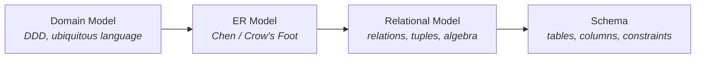
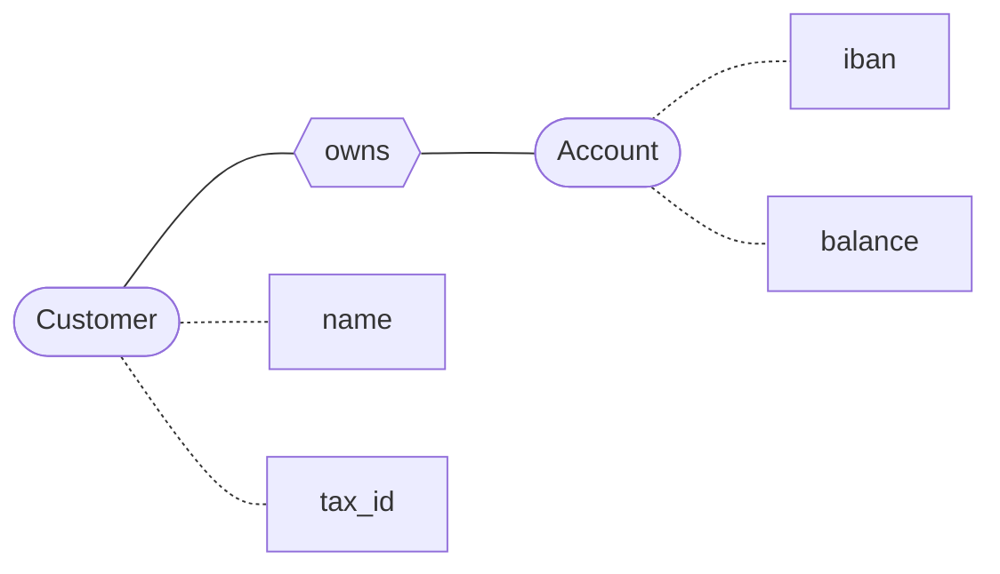
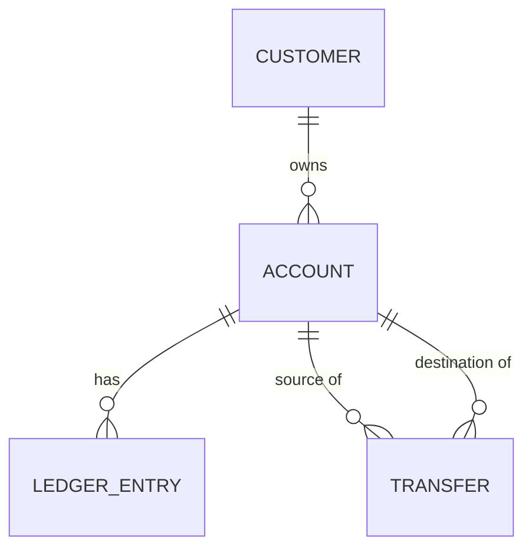
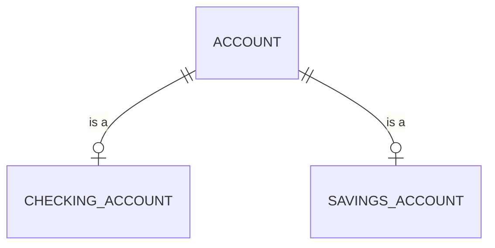
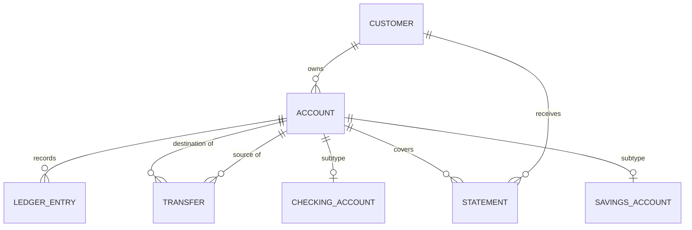

# ER Modeling — The Conceptual Bridge

> The Entity-Relationship model (Peter Chen, 1976) is the conceptual layer between the domain model and the relational schema. It describes what exists in the world (entities), what is known about each (attributes), and how they relate (relationships) — without committing to tables, columns, or foreign keys. ER is the picture you draw before you decide how to store anything.

## What you already know

From [[01-Entities-Value-Objects]]: entities have identity and mutable state; value objects are immutable and have no identity. From [[05-Identity-State-Lifecycle]]: identity has three flavors (object, logical, surrogate). From [[04-Abstraction-and-Models]]: an abstraction is selective forgetting for a purpose, and the abstraction ladder runs from requirements down to physical schema.

The ER model sits on that ladder between the domain model (a software representation of business rules) and the relational schema (a concrete collection of tables). Its purpose is to capture *what exists and how it relates* before we commit to *how to store it*.

## Why this layer exists

Relational theory (Codd, 1970) gave us the mathematical foundation: relations as sets of tuples, algebra, normalization. But Codd's model is about *structure* — it tells you what a relation is, not what relations you should have. Walk up to a database engineer and say "design me a banking schema" and Codd's theory says nothing about whether to have one `accounts` table or two, whether transfers should reference accounts by id or by IBAN, whether to model inheritance as one table or three.

Chen's ER model (1976) filled that gap. It is a *conceptual* modeling language:

- **Entities** are the things that exist in the domain (Account, Customer, Transfer).
- **Attributes** are the facts about those entities (iban, balance, status).
- **Relationships** are the associations between entities (Customer *owns* Account, Transfer *moves money from* Account *to* Account).
- **Cardinalities** describe how many of each participate (a Customer owns one or more Accounts; an Account is owned by exactly one Customer).

The ER model is *deliberately lossy*: it doesn't say anything about storage, indexes, foreign keys, or SQL. It is a picture you can show to a domain expert and have them validate: "yes, that's how our world works." Once the picture is agreed, you translate it down to a relational schema (see [[01-ER-to-Relational]]).

The chain is:



Each arrow is a translation. Each translation loses some information and adds some commitment. The ER model is the bridge between "what the business means" and "what the database stores."

## What is genuinely new here

- ER is **conceptual**; relational is **logical**; schema is **physical**. They are three different layers, and conflating them is the source of much confusion.
- ER came *before* relational as a modeling discipline — not historically (Codd was 1970, Chen was 1976) but *conceptually*: you draw the ER diagram first, then translate it to relations.
- ER entities *do not always* map one-to-one to relational tables. An entity can become multiple tables (e.g., an entity with a multi-valued attribute); multiple entities can collapse into one table (e.g., a one-to-one relationship modeled as a single table).
- The ER model is the **right place to think about cardinalities and optionality** — not the schema. By the time you are writing `FOREIGN KEY`, you should already know whether the relationship is one-to-many and whether the FK is nullable.

## Concepts

### The original Chen notation

Chen's 1976 notation:

- **Entities** are rectangles.
- **Attributes** are ovals, connected to their entity by a line.
- **Relationships** are diamonds, connected to the participating entities.
- **Cardinality** is annotated on the lines: `1:1`, `1:N`, `M:N`.



In Chen's notation, "owns" is a diamond — a first-class relationship with its own attributes (e.g., `owned_since`). This is more expressive than the relational model, where a relationship is just a foreign key.

### Crow's foot notation

Modern tools (and Mermaid's `erDiagram`) use crow's foot notation, which drops the diamond and annotates the line ends:

- `||` means "exactly one."
- `|o` means "zero or one."
- `}o` means "zero or many."
- `}|` means "one or many."



Crow's foot is more compact and is what you will see in most modern tools. Chen's notation is more expressive for relationships with attributes, but is rarely used in practice.

### Entities, attributes, relationships, cardinalities

**Entity** — a thing in the domain that has independent existence. Like a DDD entity (see [[01-Entities-Value-Objects]]), it has identity. Examples: `Customer`, `Account`, `Transfer`.

**Attribute** — a fact about an entity. Examples: `Customer.name`, `Account.iban`, `Account.balance`.

- *Simple attribute*: atomic (e.g., `balance`).
- *Composite attribute*: composed of sub-parts (e.g., `Address = street + city + postalCode + country`). In the relational model, this becomes either four columns or one composite type.
- *Multi-valued attribute*: can have multiple values (e.g., `Customer.phoneNumbers`). The relational model cannot represent this directly — it requires a child table (see [[01-ER-to-Relational]]).
- *Derived attribute*: computable from others (e.g., `Account.balance` derived from `SUM(ledger_entries.amount)`). The relational model stores it as a column (denormalized) or computes it via a view (normalized).

**Relationship** — an association between entities. Examples: `Customer owns Account`, `Transfer moves money from Account to Account`.

**Cardinality** — the "how many" of a relationship:

- **One-to-one (1:1)**: each `A` is associated with at most one `B`, and vice versa. Example: `Customer 1:1 CustomerProfile`.
- **One-to-many (1:N)**: each `A` is associated with zero or more `B`s; each `B` is associated with at most one `A`. Example: `Customer 1:N Account`.
- **Many-to-many (M:N)**: each `A` is associated with zero or more `B`s, and vice versa. Example: `Account M:N Statement` (an account appears on many statements; a statement includes many accounts — well, actually a statement is for one account, so this is 1:N. Better example: `Customer M:N Branch` if a customer can bank at multiple branches.)

**Optionality** — whether participation is mandatory or optional:

- *Mandatory*: every `A` must have a `B` (e.g., every `Account` must have a `Customer`).
- *Optional*: an `A` may have no `B` (e.g., a `Customer` may have no `Accounts` yet).

### ER vs relational vs schema — three layers

| Layer | Vocabulary | Concern | Example |
|---|---|---|---|
| Conceptual (ER) | Entities, attributes, relationships, cardinalities | What exists and how it relates | "A Customer owns one or more Accounts" |
| Logical (relational) | Relations, tuples, attributes, keys, FDs | Mathematical structure; normalization | `accounts(customer_id FK, iban PK, balance)` |
| Physical (schema) | Tables, columns, types, indexes, storage | Implementation | `CREATE TABLE accounts (...) WITH (fillfactor=90)` |

The same fact lives at all three layers but is expressed differently. Conflating layers is the most common modeling mistake — e.g., deciding indexes while still drawing the ER diagram (you haven't even chosen tables yet), or designing entities with storage types in mind (the ER layer should not care whether `iban` is `TEXT` or `VARCHAR(34)`).

### ER entities vs domain entities — not always 1:1

A common confusion: "an ER entity is the same as a DDD entity." Mostly yes, but with important divergences:

| Situation | Domain model | ER model |
|---|---|---|
| Entity with multi-valued attribute | `Customer.phoneNumbers: List<String>` | `Customer` entity + `PhoneNumber` weak entity (multi-valued attribute becomes a child entity in ER) |
| Value object with no identity | `Money` value object | Often not an ER entity at all — it becomes attributes (composite or flat) of the entity that owns it |
| Entity with lifecycle | `Account` with status transitions | `Account` entity with a `status` attribute; the lifecycle is not directly modeled |
| Relationship with attributes | Method calls between aggregates | A relationship entity (diamond in Chen, an associative entity in crow's foot) |
| Inheritance | `CheckingAccount extends Account` | Modeled as a subtype relationship; the translation to relational is lossy (see below) |

The ER model and the domain model disagree most on:

- **Value objects.** DDD treats `Money`, `IBAN`, `Address` as first-class value objects. ER typically demotes them to attributes (simple or composite) of the entity that owns them. Sometimes they become weak entities (e.g., `Address` as a separate entity if it has its own attributes).
- **Inheritance.** DDD models it as class extension. ER models it as a subtype/supertype relationship. The relational schema has three options (STI, CTI, Concrete) — see [[07-Composition-vs-Inheritance]] and [[01-ER-to-Relational]].
- **Aggregates.** DDD has the concept of an aggregate boundary. ER has no direct equivalent — an aggregate becomes a cluster of entities, but the boundary itself is not represented.
- **Events.** DDD has domain events. ER has no equivalent — events become entities (`TransferEvent`, `AuditEvent`) with timestamps, but they are not first-class.

These mismatches are the seed of [[00-ORM-Impedance-Mismatch]].

### Weak entities

A weak entity is an entity that cannot exist without another entity. Its identity depends on its parent. Example: a `LedgerEntry` is meaningless without an `Account`; its identity is `(account_id, sequence_number)` or `(account_id, timestamp)`, not a global id.

In Chen notation, weak entities are double-rectangles, and their identifying relationship is a double-diamond. In crow's foot, they look like any other entity, but their primary key includes the parent's foreign key.

Weak entities correspond to DDD's *internal entities* inside an aggregate (see [[02-Aggregates]]) — the `LedgerEntry` inside the `Account` aggregate. Both disciplines recognize that some entities cannot stand alone.

### Subtypes and inheritance in ER

ER can model inheritance:



`Account` is the supertype; `CheckingAccount` and `SavingsAccount` are subtypes. Each subtype has the supertype's attributes plus its own.

But ER doesn't dictate *how* this becomes tables. That is the relational layer's job, and it has three options (STI, CTI, Concrete) — each with different trade-offs. See [[01-ER-to-Relational]] and [[07-Composition-vs-Inheritance]].

## Banking application

The banking domain model from [[06-Banking-Domain-Model]] translates to ER as follows:

| Domain model element | ER model element |
|---|---|
| `Account` entity (aggregate root) | `Account` entity |
| `Customer` entity (aggregate root) | `Customer` entity |
| `Transfer` entity (aggregate root) | `Transfer` entity |
| `LedgerEntry` (internal entity of `Account`) | `LedgerEntry` weak entity, identified by `(account_id, sequence)` |
| `Statement` entity | `Statement` entity |
| `Money` value object | Composite attribute of `Account.balance`, `LedgerEntry.amount`, etc. (or a weak entity if you want to track currency separately) |
| `IBAN` value object | Simple attribute of `Account` |
| `Address` value object | Composite attribute of `Customer` |
| `AccountStatus` enum | Simple attribute of `Account` |
| `CheckingAccount extends Account` | Subtype relationship |
| `Customer owns Account` (relationship) | 1:N relationship, mandatory on Account side |
| `Transfer from Account to Account` | Two relationships: `Transfer *—1 Account (source)`, `Transfer *—1 Account (destination)` |
| `Account has LedgerEntry` | 1:N relationship, mandatory on LedgerEntry side (weak entity) |
| `TransferCompleted` event | (No ER equivalent; becomes an `Event` entity if stored) |

The relationships and cardinalities, in crow's foot:



Notice:

- `CUSTOMER ||--o{ ACCOUNT` means a Customer owns zero or more Accounts (the `o` on the Account side means "optional"; the Customer could have no accounts yet). Each Account is owned by exactly one Customer (the `||`).
- `ACCOUNT ||--o{ LEDGER_ENTRY` means an Account has zero or more LedgerEntries; each LedgerEntry belongs to exactly one Account.
- `ACCOUNT ||--o{ TRANSFER` appears twice — once for source, once for destination. A transfer has exactly one source and exactly one destination; an account can be the source of many transfers and the destination of many.
- `ACCOUNT ||--o| CHECKING_ACCOUNT` is the subtype relationship: an Account is optionally a CheckingAccount (`o|`), and a CheckingAccount is exactly one Account (`||`).

### The ER diagram in plain English

- A **Customer** owns one or more **Accounts**. Each Account is owned by exactly one Customer.
- An **Account** has many **LedgerEntries**. Each LedgerEntry belongs to exactly one Account.
- A **Transfer** moves money from one Account (the source) to another Account (the destination). A Transfer has exactly one source and one destination; an Account can be the source of many Transfers and the destination of many.
- An **Account** is either a **CheckingAccount** or a **SavingsAccount** (subtype). Each subtype instance is exactly one Account.
- A **Customer** receives **Statements**. A Statement covers one Account.

This paragraph is the ER model, expressed in English. The diagram is the same content in pictures. The relational schema (next chapter) is the same content in tables.

## Code/diagrams

A more detailed ER diagram with attributes:

```mermaid
erDiagram
    CUSTOMER {
        UUID customer_id PK
        string legal_name
        string tax_id
        string email
        address address "composite"
        string kyc_status
    }
    ACCOUNT {
        UUID account_id PK
        string iban UK
        UUID customer_id FK
        money balance "composite"
        string status
    }
    CHECKING_ACCOUNT {
        UUID account_id PK_FK
        money overdraft_limit "composite"
    }
    SAVINGS_ACCOUNT {
        UUID account_id PK_FK
        decimal interest_rate
    }
    LEDGER_ENTRY {
        UUID entry_id PK
        UUID account_id FK
        money amount "composite"
        timestamp occurred_at
        string correlation_id
    }
    TRANSFER {
        UUID transfer_id PK
        UUID source_account_id FK
        UUID destination_account_id FK
        money amount "composite"
        string status
        string idempotency_key UK
        timestamp created_at
    }
    STATEMENT {
        UUID statement_id PK
        UUID account_id FK
        date period_start
        date period_end
        money opening_balance "composite"
        money closing_balance "composite"
    }

    CUSTOMER ||--o{ ACCOUNT : "owns"
    CUSTOMER ||--o{ STATEMENT : "receives"
    ACCOUNT ||--o{ LEDGER_ENTRY : "records"
    ACCOUNT ||--o{ TRANSFER : "source of"
    ACCOUNT ||--o{ TRANSFER : "destination of"
    ACCOUNT ||--o{ STATEMENT : "covered by"
    ACCOUNT ||--o| CHECKING_ACCOUNT : "is a"
    ACCOUNT ||--o| SAVINGS_ACCOUNT : "is a"
```

Notice how the value objects (`Money`, `Address`, `IBAN`) appear as composite or simple attributes — they are *not* entities in the ER model. This is one of the key differences from the domain model.

## What can go wrong

- **Conflating layers.** Designing ER entities with storage types ("`iban` is a `VARCHAR(34)`"). The ER layer should be type-agnostic; storage types belong in the schema layer.
- **Modeling value objects as entities.** Making `Money` or `Address` an entity with a surrogate id. Bloats the schema with extra tables and joins. Most value objects should be attributes.
- **Modeling multi-valued attributes as columns.** `Customer.phone1`, `Customer.phone2`, `Customer.phone3`. Hits a wall when the customer has a fourth phone number. Use a child entity (`PhoneNumber`).
- **Missing cardinalities.** "Customer has Accounts" — but how many? Mandatory or optional? The cardinality is the most important fact in a relationship; don't leave it implicit.
- **Forgetting optionality.** A `Transfer` has a source and destination — both mandatory. But a `Customer` might have no `Accounts` yet — optional. The schema's `NOT NULL` constraints follow from these decisions.
- **Subtypes without strategy.** Drawing `Account` with `CheckingAccount` and `SavingsAccount` subtypes without thinking about how they become tables. See [[01-ER-to-Relational]].
- **Modeling inheritance where composition fits.** `Manager extends Employee` in ER — when the manager role is temporary and an employee can be many roles. Model as a relationship, not a subtype.
- **Treating ER as the schema.** Drawing the ER diagram and then `CREATE TABLE`-ing it directly without going through the relational layer (normalization, FDs, keys). This produces unnormalized schemas.
- **No weak entities.** Modeling `LedgerEntry` with a global surrogate key, ignoring that its identity is naturally `(account_id, sequence)`. Weak-entity modeling is sometimes more accurate.

## Trade-offs

- **Chen vs crow's foot.** Chen is more expressive (relationships are first-class); crow's foot is more compact and is the de facto standard. Use crow's foot for everyday work; reach for Chen when relationships have their own attributes.
- **ER vs UML class diagrams.** ER models data; UML class diagrams model data + behavior. For a database-centric design, ER is enough. For an application-centric design, UML is richer. Most teams use UML for the domain model and ER for the data model.
- **Entities vs attributes.** Should `Address` be an entity, a composite attribute, or four separate columns? Depends on whether addresses are shared (entity), grouped (composite), or queried individually (separate columns). The trade-off is normalization vs query convenience — see [[10-Normalization-Trade-offs]].
- **Subtypes vs separate entities.** Model `CheckingAccount` and `SavingsAccount` as subtypes of `Account`, or as two separate entities with no relationship? Subtypes preserve shared attributes and invariants; separate entities are simpler but duplicate schema.
- **Weak entities vs strong entities with surrogate keys.** A `LedgerEntry` weak entity identified by `(account_id, sequence)` is more meaningful; the same data with a global `UUID` surrogate key is easier to reference. Choose based on whether the entry is ever referenced independently of its account.

## Forward links

- [[01-ER-to-Relational]] — the translation rules from ER to relational tables.
- [[02-Banking-ER]] — the full banking ER diagram.
- [[00-Relational-Model]] — the layer ER translates to.
- [[02-Keys-Superkeys-Candidate-Keys]] — how ER entities' identities become primary keys.
- [[00-Schema-Design]] — the layer below relational.
- [[01-Primary-Foreign-Keys]] — how ER relationships become foreign keys.
- [[07-Composition-vs-Inheritance]] — the three inheritance strategies ER subtypes translate to.
- [[00-ORM-Impedance-Mismatch]] — where the ER/domain/relational layers disagree.
- [[01-Entities-Value-Objects]] — how DDD entities and value objects map to ER.
- [[00-Banking-Case-Study]] — the banking domain that the ER model describes.
- [[03-Domain-Concepts]] — the ubiquitous language that the ER entities should reflect.
