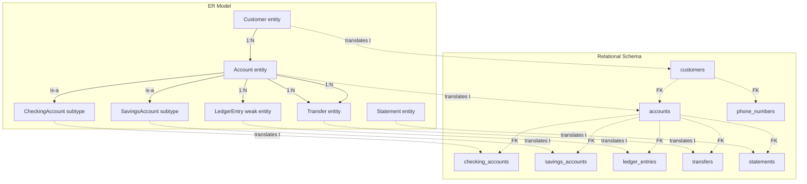

# ER to Relational — The Translation Rules

> Translating an ER model to a relational schema is mostly mechanical, but it has lossy parts. Entities become tables, attributes become columns, relationships become foreign keys or junction tables. But subtypes have no single translation, multi-valued attributes need a child table, and composite attributes must be flattened. Knowing the rules — and where they break — is the difference between a clean schema and a tangled one.

## What you already know

From [[00-ER-Modeling]]: the ER model captures entities, attributes, relationships, and cardinalities. From [[00-Relational-Model]] (preview): a relational schema is a set of relations (tables), each with attributes (columns) and tuples (rows), constrained by keys and functional dependencies. From [[05-Identity-State-Lifecycle]]: logical identity becomes a `UNIQUE` constraint; surrogate identity becomes a `PRIMARY KEY`.

This chapter is the translation manual.

## Why this layer exists

Many engineers skip ER and go straight to SQL `CREATE TABLE` statements. The result is a schema that conflates conceptual decisions (what entities exist? how do they relate?) with physical decisions (what type is the column? what index?). When the schema needs to change, the conceptual decisions are buried in physical syntax and impossible to recover.

The translation rules exist to make the conceptual-to-logical step *explicit*:

1. Each entity becomes a relation.
2. Each simple attribute becomes a column.
3. Each multi-valued attribute becomes a child relation.
4. Each composite attribute becomes a set of columns.
5. Each many-to-one relationship becomes a foreign key on the "many" side.
6. Each many-to-many relationship becomes a junction relation.
7. Each one-to-one relationship becomes a foreign key on either side (plus a `UNIQUE` constraint).
8. Each weak entity becomes a relation with a composite primary key including the parent's key.
9. Each subtype becomes one of three inheritance strategies (STI, CTI, Concrete) — a deliberate trade-off.

Each rule has a lossy edge. Knowing them is the difference between a schema you can evolve and one you cannot.

## What is genuinely new here

- The translation is *mechanical for most entities and attributes* but *deliberate for subtypes and multi-valued attributes*. The mechanical parts you can do in your sleep; the deliberate parts are where design happens.
- The ER model has *more expressive power* than the relational model. Subtypes, multi-valued attributes, and relationships-with-attributes have no direct relational equivalent. The translation always loses something.
- The cases where ER has no relational equivalent are exactly the cases that produce the ORM impedance mismatch (see [[00-ORM-Impedance-Mismatch]]).

## Concepts

### Rule 1: Entity → Table

Each strong entity becomes a table. The entity's identifier becomes the table's primary key.

```
ER: Account (accountId, iban, balance, status)
Relational:
    accounts(account_id PK, iban UNIQUE, balance, status)
```

### Rule 2: Simple attribute → Column

Each simple attribute becomes a column. The column's type is chosen at the schema layer (not the ER layer). Optional attributes become nullable columns; mandatory attributes become `NOT NULL`.

```
ER: Customer.name (simple, mandatory)
Relational: customers(..., legal_name TEXT NOT NULL, ...)
```

### Rule 3: Composite attribute → Columns

A composite attribute is flattened into multiple columns, one per sub-attribute. There is no "Address" column; there are `street`, `city`, `postal_code`, `country` columns.

```
ER: Customer.address = (street, city, postal_code, country)
Relational:
    customers(..., street TEXT, city TEXT, postal_code TEXT, country TEXT, ...)
```

Alternatively, if the database supports composite types (PostgreSQL does), you can keep the composite as a single column of a user-defined type. This is closer to the ER model but is a trade-off — composite types are harder to query and index. Most schemas flatten.

### Rule 4: Multi-valued attribute → Child table

This is the first lossy translation. The relational model is based on *first normal form* (1NF): every column holds a single atomic value. A multi-valued attribute violates 1NF and must become its own table.

```
ER: Customer.phoneNumbers (multi-valued)
Relational:
    customers(customer_id PK, ...)
    phone_numbers(customer_id FK, phone_number, PRIMARY KEY (customer_id, phone_number))
```

The child table's primary key is the combination of the parent's primary key and the multi-valued attribute. This is the same pattern as a weak entity (Rule 8).

### Rule 5: Many-to-one relationship → Foreign key

A many-to-one (or one-to-many) relationship becomes a foreign key on the "many" side, pointing to the "one" side.

```
ER: Customer 1:N Account  (a Customer owns many Accounts; an Account is owned by one Customer)
Relational:
    accounts(account_id PK, customer_id FK REFERENCES customers(customer_id), ...)
```

The FK goes on the "many" side (Account) pointing to the "one" side (Customer). This is the standard pattern; it is the source of the dependency direction discussed in [[03-Dependency-As-Root-Concept]] — `accounts` depends on `customers`, not vice versa.

Optionality: if the relationship is mandatory (every Account must have a Customer), the FK is `NOT NULL`. If optional, it is nullable.

### Rule 6: Many-to-many relationship → Junction table

A many-to-many relationship cannot be expressed as a single foreign key. It becomes a *junction table* (also called an *associative table* or *link table*) with two foreign keys, one to each side.

```
ER: Customer M:N Branch  (a Customer can bank at multiple Branches; a Branch serves many Customers)
Relational:
    customers(customer_id PK, ...)
    branches(branch_id PK, ...)
    customer_branches(customer_id FK, branch_id FK, PRIMARY KEY (customer_id, branch_id))
```

The junction table's primary key is the combination of both foreign keys. If the relationship has its own attributes (e.g., `customer_since`), they become columns on the junction table.

### Rule 7: One-to-one relationship → Foreign key with UNIQUE

A one-to-one relationship is modeled as a foreign key on either side, with a `UNIQUE` constraint to enforce the "one" side.

```
ER: Customer 1:1 CustomerProfile
Relational (option A — FK on the dependent side):
    customers(customer_id PK, ...)
    customer_profiles(customer_id PK FK REFERENCES customers(customer_id), bio, avatar_url, ...)
```

Here `customer_profiles.customer_id` is both the primary key (ensuring one profile per customer) and a foreign key (ensuring the customer exists). This is the cleanest pattern.

Alternatively, the FK can be on either side with a `UNIQUE` constraint, but using it as the PK of the dependent table is the standard approach.

### Rule 8: Weak entity → Table with composite key

A weak entity is one whose identity depends on a parent entity. It becomes a table whose primary key includes the parent's primary key.

```
ER: Account 1:N LedgerEntry (weak — a LedgerEntry is identified by (account_id, sequence))
Relational:
    accounts(account_id PK, ...)
    ledger_entries(account_id FK, sequence, amount, occurred_at,
                   PRIMARY KEY (account_id, sequence))
```

Alternatively, you can give the weak entity its own surrogate primary key:

```
    ledger_entries(entry_id PK, account_id FK, amount, occurred_at, ...)
```

This is the modern style — a global surrogate key (`UUID` or `BIGSERIAL`) for every table, including weak entities. It is easier for ORM tools and for referencing entries from other tables, but it loses the natural identity `(account_id, sequence)`. The choice is a trade-off:

- *Composite key*: meaningful, enforces uniqueness per account, but harder to reference from elsewhere.
- *Surrogate key*: easy to reference, but the natural identity must be enforced by a separate `UNIQUE` constraint.

Most modern schemas use surrogate keys everywhere and add `UNIQUE` constraints where natural identity matters. See [[05-Identity-State-Lifecycle]] for the broader discussion.

### Rule 9: Subtype → STI, CTI, or Concrete

This is the most consequential translation. ER subtypes have no single relational equivalent; you must choose one of three strategies, each with different trade-offs (see [[07-Composition-vs-Inheritance]] for the full treatment).

```
ER:
    Account (accountId, iban, balance, status)
    CheckingAccount IS-A Account (overdraftLimit)
    SavingsAccount IS-A Account (interestRate)
```

**Option A: Single Table Inheritance (STI)**

```sql
CREATE TABLE accounts (
    account_id UUID PRIMARY KEY,
    account_type TEXT NOT NULL,         -- discriminator: 'CHECKING' or 'SAVINGS'
    iban TEXT UNIQUE NOT NULL,
    balance NUMERIC(18,2) NOT NULL,
    status TEXT NOT NULL,
    overdraft_limit NUMERIC(18,2),      -- only for CHECKING
    interest_rate NUMERIC(5,4)          -- only for SAVINGS
);
```

- Pros: one table, one query, polymorphic queries trivial, no joins.
- Cons: sparse columns (many `NULL`s), subtype-specific constraints cannot be `NOT NULL`, schema changes affect all subtypes.

**Option B: Class Table Inheritance (CTI)**

```sql
CREATE TABLE accounts (
    account_id UUID PRIMARY KEY,
    account_type TEXT NOT NULL,
    iban TEXT UNIQUE NOT NULL,
    balance NUMERIC(18,2) NOT NULL,
    status TEXT NOT NULL
);
CREATE TABLE checking_accounts (
    account_id UUID PRIMARY KEY REFERENCES accounts(account_id),
    overdraft_limit NUMERIC(18,2) NOT NULL
);
CREATE TABLE savings_accounts (
    account_id UUID PRIMARY KEY REFERENCES accounts(account_id),
    interest_rate NUMERIC(5,4) NOT NULL
);
```

- Pros: subtype-specific columns can be `NOT NULL`, no sparse columns, clean per-subtype schema.
- Cons: polymorphic queries need `JOIN` or `UNION`, more tables, more complex inserts.

**Option C: Concrete Table Inheritance**

```sql
CREATE TABLE checking_accounts (
    account_id UUID PRIMARY KEY,
    iban TEXT UNIQUE NOT NULL,
    balance NUMERIC(18,2) NOT NULL,
    status TEXT NOT NULL,
    overdraft_limit NUMERIC(18,2) NOT NULL
);
CREATE TABLE savings_accounts (
    account_id UUID PRIMARY KEY,
    iban TEXT UNIQUE NOT NULL,
    balance NUMERIC(18,2) NOT NULL,
    status TEXT NOT NULL,
    interest_rate NUMERIC(5,4) NOT NULL
);
```

- Pros: each table self-contained, simple per-subtype queries.
- Cons: shared columns duplicated, polymorphic queries hard (`UNION ALL`), shared invariants must be enforced in multiple places, IBAN uniqueness must be enforced across both tables (impossible with a plain `UNIQUE` — needs a parent table or a trigger).

The choice depends on:

- How often do you query across subtypes? (Often → STI; rarely → Concrete.)
- How different are the subtypes? (Similar → STI; very different → CTI.)
- How important is `NOT NULL` on subtype-specific fields? (Important → CTI; not → STI.)

Banking typically uses STI for accounts (subtypes are similar, polymorphic queries are common) and CTI for entities with very different subtype structures (rare). Concrete is usually wrong because it breaks shared invariants.

### Rule 10: Relationship with attributes → Junction table with extra columns

In Chen's ER notation, a relationship can have its own attributes. In the relational model, this becomes a junction table with the relationship's attributes as columns.

```
ER: Customer OWNS Account (relationship, with attribute: owned_since)
Relational:
    accounts(account_id PK, customer_id FK, ...)
    -- if we want to record owned_since, we can put it on accounts
    -- (since each account has exactly one owner)
    accounts(account_id PK, customer_id FK, owned_since DATE, ...)
```

For many-to-many relationships with attributes, the junction table holds the attributes:

```
ER: Customer M:N Branch (relationship, with attribute: customer_since)
Relational:
    customer_branches(customer_id FK, branch_id FK, customer_since DATE,
                      PRIMARY KEY (customer_id, branch_id))
```

## Banking application

The banking ER model from [[00-ER-Modeling]] and [[02-Banking-ER]] translates to the following relational schema. We use CTI for the account subtypes (the more normalizable choice; STI is also defensible — see [[04-Banking-Schema]] for the actual choice made).

```sql
-- Strong entities
CREATE TABLE customers (
    customer_id UUID PRIMARY KEY,
    legal_name TEXT NOT NULL,
    tax_id TEXT UNIQUE NOT NULL,
    email TEXT UNIQUE NOT NULL,
    -- Address composite attribute, flattened:
    street TEXT,
    city TEXT,
    postal_code TEXT,
    country TEXT,
    kyc_status TEXT NOT NULL CHECK (kyc_status IN ('PENDING', 'APPROVED', 'REJECTED')),
    created_at TIMESTAMPTZ NOT NULL DEFAULT NOW()
);

-- Account (supertype)
CREATE TABLE accounts (
    account_id UUID PRIMARY KEY,
    iban TEXT UNIQUE NOT NULL,
    customer_id UUID NOT NULL REFERENCES customers(customer_id),
    -- Money composite attribute, flattened into amount + currency:
    balance_amount NUMERIC(18,2) NOT NULL,
    balance_currency CHAR(3) NOT NULL DEFAULT 'EUR',
    status TEXT NOT NULL CHECK (status IN ('PENDING', 'ACTIVE', 'FROZEN', 'CLOSED')),
    account_type TEXT NOT NULL CHECK (account_type IN ('CHECKING', 'SAVINGS')),
    opened_at TIMESTAMPTZ NOT NULL DEFAULT NOW()
);

-- CheckingAccount (subtype, CTI)
CREATE TABLE checking_accounts (
    account_id UUID PRIMARY KEY REFERENCES accounts(account_id),
    -- OverdraftLimit composite attribute, flattened:
    overdraft_limit_amount NUMERIC(18,2) NOT NULL,
    overdraft_limit_currency CHAR(3) NOT NULL DEFAULT 'EUR'
);

-- SavingsAccount (subtype, CTI)
CREATE TABLE savings_accounts (
    account_id UUID PRIMARY KEY REFERENCES accounts(account_id),
    interest_rate NUMERIC(5,4) NOT NULL
);

-- LedgerEntry (weak entity, modern surrogate key style)
CREATE TABLE ledger_entries (
    entry_id UUID PRIMARY KEY,
    account_id UUID NOT NULL REFERENCES accounts(account_id),
    -- Money composite attribute, flattened:
    amount NUMERIC(18,2) NOT NULL,    -- can be negative (debit) or positive (credit)
    currency CHAR(3) NOT NULL DEFAULT 'EUR',
    occurred_at TIMESTAMPTZ NOT NULL,
    correlation_id TEXT,              -- groups entries from the same transfer
    -- Natural identity (account_id, sequence) — enforced via unique constraint
    sequence_in_account BIGINT NOT NULL,
    UNIQUE (account_id, sequence_in_account)
);

-- Transfer (strong entity)
CREATE TABLE transfers (
    transfer_id UUID PRIMARY KEY,
    source_account_id UUID NOT NULL REFERENCES accounts(account_id),
    destination_account_id UUID NOT NULL REFERENCES accounts(account_id),
    amount NUMERIC(18,2) NOT NULL,
    currency CHAR(3) NOT NULL DEFAULT 'EUR',
    status TEXT NOT NULL CHECK (status IN ('PENDING', 'COMPLETED', 'FAILED', 'FRAUD_REVIEW')),
    idempotency_key TEXT UNIQUE NOT NULL,
    created_at TIMESTAMPTZ NOT NULL DEFAULT NOW(),
    CHECK (source_account_id <> destination_account_id)
);

-- Statement (strong entity)
CREATE TABLE statements (
    statement_id UUID PRIMARY KEY,
    account_id UUID NOT NULL REFERENCES accounts(account_id),
    period_start DATE NOT NULL,
    period_end DATE NOT NULL,
    opening_balance_amount NUMERIC(18,2) NOT NULL,
    opening_balance_currency CHAR(3) NOT NULL,
    closing_balance_amount NUMERIC(18,2) NOT NULL,
    closing_balance_currency CHAR(3) NOT NULL,
    UNIQUE (account_id, period_start, period_end)
);

-- Multi-valued attribute: Customer has multiple phone numbers
CREATE TABLE phone_numbers (
    customer_id UUID NOT NULL REFERENCES customers(customer_id),
    phone_number TEXT NOT NULL,
    label TEXT,    -- 'HOME', 'WORK', 'MOBILE'
    PRIMARY KEY (customer_id, phone_number)
);
```

### Translation summary

| ER element | Relational element | Notes |
|---|---|---|
| `Customer` entity | `customers` table | Strong entity |
| `Customer.address` composite attribute | `street, city, postal_code, country` columns | Flattened |
| `Customer.phoneNumbers` multi-valued attribute | `phone_numbers` child table | 1NF requires this |
| `Account` entity (supertype) | `accounts` table | With discriminator `account_type` |
| `CheckingAccount` subtype | `checking_accounts` table | CTI |
| `SavingsAccount` subtype | `savings_accounts` table | CTI |
| `Money` composite value object | `balance_amount, balance_currency` columns | Flattened |
| `Account 1:N LedgerEntry` (weak entity) | `ledger_entries` table with `account_id` FK | Surrogate PK + natural `UNIQUE` |
| `Customer 1:N Account` (relationship) | `accounts.customer_id` FK | Many side holds the FK |
| `Transfer *—1 Account (source)` | `transfers.source_account_id` FK | |
| `Transfer *—1 Account (destination)` | `transfers.destination_account_id` FK | |
| `Customer 1:N Statement` | `statements.account_id` (via account) | Indirect through account |
| `Account 1:N Statement` | `statements.account_id` FK | |
| `LedgerEntry` immutability | No `UPDATE`/`DELETE` allowed (enforced via triggers or app policy) | See [[03-Triggers-As-Constraints]] |

## Code/diagrams

The translation in picture form:



## What can go wrong

- **STI chosen when subtypes are very different.** Sparse rows, many `NULL`s, `NOT NULL` constraints impossible for subtype-specific fields. Choose CTI.
- **CTI chosen when polymorphic queries are common.** Every "list all accounts" query becomes a `UNION ALL` of three tables. Choose STI.
- **Concrete chosen for entities with shared invariants.** IBAN uniqueness cannot be enforced across `checking_accounts` and `savings_accounts` without a parent table. Either add a parent (becomes CTI) or use STI.
- **Multi-valued attribute modeled as columns.** `phone1, phone2, phone3`. Breaks when the customer has a fourth phone. Always use a child table.
- **Composite attribute modeled as JSON.** `address JSONB`. Convenient, but loses column-level constraints and indexing. Use JSONB when the structure is variable; use columns when it is fixed.
- **Foreign key on the wrong side.** `customers.account_id` instead of `accounts.customer_id`. Forces one customer per account (wrong cardinality), and you cannot have a customer with multiple accounts.
- **Missing `UNIQUE` on one-to-one.** A FK without `UNIQUE` allows multiple children per parent — a one-to-many, not one-to-one.
- **Junction table missing composite primary key.** A many-to-many with two separate FKs and no composite PK allows duplicate pairs.
- **Weak entity with global surrogate key but no natural `UNIQUE` constraint.** `(account_id, sequence)` uniqueness is lost; duplicate sequence numbers can be inserted.
- **Relationship attributes on the wrong table.** `owned_since` on `customers` instead of `accounts` — breaks when the customer owns multiple accounts with different ownership dates.
- **Forgetting the `CHECK` constraint `source <> destination` on transfers.** The DB allows self-transfers, which produce zero-sum ledger entries that look like real activity.

## Trade-offs

- **STI vs CTI vs Concrete.** The biggest inheritance trade-off. See [[07-Composition-vs-Inheritance]] for the full table.
- **Composite key vs surrogate key for weak entities.** Composite: meaningful, enforces natural identity. Surrogate: easy to reference, requires `UNIQUE` for natural identity. Modern style favors surrogate + `UNIQUE`.
- **Flatten composite attribute vs use composite type.** Flattened: column-level constraints, easy to index, verbose. Composite type: compact, but harder to query. Default to flatten.
- **Multi-valued attribute as child table vs JSONB array.** Child table: normalizable, queryable, but requires a join. JSONB: compact, but loses 1NF and many constraints. Use child table for structured data; JSONB for unstructured.
- **One-to-one as FK+UNIQUE vs shared PK.** FK+UNIQUE: simple, but allows the dependent to be optional. Shared PK (dependent's PK is also FK): enforces mandatory, but requires inserting in the right order.
- **Nullable FK vs `NOT NULL` FK.** Nullable: optional relationship, allows orphans. `NOT NULL`: mandatory relationship, but harder to insert in the right order (parent must exist first).
- **Denormalized balance vs computed via view.** Stored `balance` column: fast reads, must be kept in sync (triggers or app logic). Computed via view: always correct, but slow for large ledgers. Banking stores denormalized — see [[02-Denormalization-For-Reads]].

## Forward links

- [[02-Banking-ER]] — the full ER diagram this chapter translates.
- [[04-Banking-Schema]] — the actual banking schema, with the trade-offs resolved.
- [[00-Relational-Model]] — the layer this chapter produces.
- [[02-Keys-Superkeys-Candidate-Keys]] — how ER identities become keys.
- [[06-1NF-2NF-3NF]] — the normalization that follows translation.
- [[07-BCNF]] — when the translation's choices need further decomposition.
- [[07-Composition-vs-Inheritance]] — the inheritance strategies in depth.
- [[00-Schema-Design]] — the layer below relational.
- [[01-Primary-Foreign-Keys]] — how the translated FKs are enforced.
- [[02-Domain-Check-Constraints]] — translating ER constraints to `CHECK`.
- [[00-ORM-Impedance-Mismatch]] — where the translation rules and the ORM disagree.
- [[00-SQL-From-Relational-Algebra]] — the SQL that operates on the translated schema.
