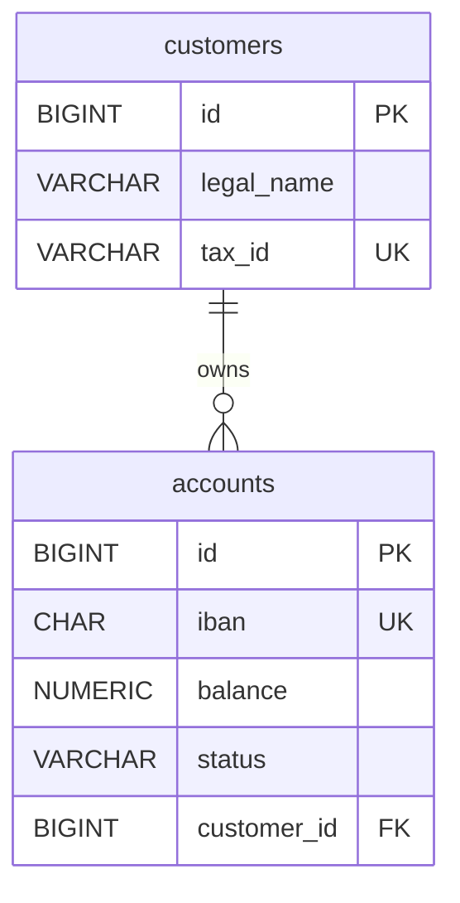

# Keys, Superkeys, Candidate Keys — Identity in a Relation

> Keys are how the relational model talks about identity. They are the formal version of what [[05-Identity-State-Lifecycle]] calls *logical* and *surrogate* identity. Get this vocabulary right and normalization, foreign keys, and query optimization all become consequences instead of memorized rules.

## What you already know

From [[00-Relational-Model]]: a relation is a set of tuples. Sets cannot have duplicates — but SQL tables can, unless we constrain them.

From [[05-Identity-State-Lifecycle]]: identity in object land is memory reference; in database land it is the primary key. We distinguished *logical* identity (IBAN, email — meaningful, possibly mutable) from *surrogate* identity (auto-increment, UUID — meaningless, stable).

From [[03-Dependency-As-Root-Concept]]: a foreign key is a dependency — "this row cannot exist without that row." The direction of the FK is the direction of the dependency.

## Why this layer exists

Without keys, a relation is just a bag of facts you cannot uniquely refer to. With keys:

- You can address a single tuple ("the account with `id = 1042`") and update or delete it without ambiguity.
- You can declare a foreign key that points *at* a specific tuple.
- You can reason about *functional dependencies* (next chapter) and hence about normalization.
- The query optimizer can use indexes (which are almost always built on keys) to estimate cardinalities.

Keys are the spine of the relational model. Every other formal concept leans on them.

## What is genuinely new

The formal hierarchy of key concepts: **superkey → candidate key → primary key / alternate key**, plus the orthogonal distinction **natural key vs. surrogate key**, plus the cross-relation concept **foreign key**. These are not synonyms — each has a precise definition.

## Concepts

### Superkey

A **superkey** of a relation $R$ is a set of attributes $K$ such that **no two distinct tuples of $R$ ever agree on all attributes in $K$**. Equivalently: $K \to$ all attributes of $R$ (functional dependency — see [[03-Functional-Dependencies]]).

A superkey may contain *extra* attributes that are not strictly necessary for uniqueness. For example, in `accounts`, `{id, iban}` is a superkey — it uniquely identifies a tuple — but `iban` alone is already sufficient, so `{id, iban}` is not *minimal*.

Every relation has at least one superkey: the set of all its attributes. (Trivially, if two tuples agreed on every attribute, they would be the same tuple, which a set forbids.)

### Candidate key

A **candidate key** is a *minimal* superkey — a superkey with the property that no proper subset of it is also a superkey.

In `accounts`:

- `{id}` is a candidate key (uniquely identifies; nothing to remove).
- `{iban}` is a candidate key (uniquely identifies; nothing to remove).
- `{id, iban}` is a superkey but **not** a candidate key (because `{id}` alone is sufficient).
- `{id, balance}` is a superkey (because `id` already determines everything) but not a candidate key.

Candidate keys are the "irreducible" identifiers of a relation. A relation may have several candidate keys. Each one *could* serve as the primary key.

### Primary key

A **primary key** is the candidate key the designer has *chosen* to be the principal identifier. There is exactly one per relation (in SQL: at most one `PRIMARY KEY` constraint per table). The choice is a *design decision*, not a mathematical property — any candidate key would work; we pick one for engineering reasons (stability, size, indexability).

The chosen primary key becomes the target of foreign keys from other relations.

### Alternate key

An **alternate key** (a.k.a. *alternate candidate key*) is any candidate key that was *not* chosen as the primary key. In SQL, alternate keys are declared with `UNIQUE` constraints.

In `accounts`: if `id` is the primary key, then `iban` is an alternate key — still unique, still enforced, but not the FK target.

### Natural key vs. surrogate key

This is an *orthogonal* classification — it describes *what kind of values* the key contains, not its formal status.

- A **natural key** has business meaning. Examples: IBAN, ISBN, email, tax ID. It exists in the world before it exists in the database.
- A **surrogate key** has no business meaning. It is generated by the system purely to be a stable identifier. Examples: `BIGSERIAL` auto-increment, UUID, ULID, Snowflake ID.

Engineering rule of thumb (from [[05-Identity-State-Lifecycle]]):

- Use a **surrogate key as the primary key** (stable, small, never changes, ideal FK target).
- Use a **natural key as an alternate key** (declared `UNIQUE`), so the business identity is enforced but does not ripple through FKs when it changes.

### Foreign key

A **foreign key** in relation $R_1$ is a set of attributes $K$ whose values are required to *match* the primary key (or any candidate key) of some other relation $R_2$. This is the relational model's expression of a dependency — see [[03-Dependency-As-Root-Concept]].

A foreign key says: "for every tuple in $R_1$ with FK value $v$, there must exist a tuple in $R_2$ whose PK is $v$." It is a *referential constraint* — see [[01-Primary-Foreign-Keys]].



### Composite key

A **composite key** is a candidate key consisting of two or more attributes. Example: in a `account_holders` junction table that links customers to accounts they co-own, the candidate key might be `(account_id, customer_id)` — neither column alone is unique, but the pair is. Composite keys are common in junction tables and in BCNF violations — see [[07-BCNF]].

## Banking application

In our banking system ([[00-Banking-Case-Study]]):

| Relation | Surrogate PK | Natural (alternate) keys | Foreign keys |
|---|---|---|---|
| `customers` | `id BIGINT` | `tax_id`, `email` | — |
| `accounts` | `id BIGINT` | `iban` | `customer_id → customers(id)` |
| `ledger_entries` | `id BIGINT` | `(account_id, entry_seq)` | `account_id → accounts(id)` |
| `transfers` | `id BIGINT` | `(idempotency_key, originator)` | `from_account_id`, `to_account_id → accounts(id)` |
| `account_holders` | (composite) `(account_id, customer_id)` | — | both columns are FKs |

Notice the design decisions:

- Every base table has a surrogate PK (`BIGSERIAL` or UUID). This is the FK target.
- Natural keys are declared `UNIQUE` but never used as FK targets. If `iban` changes (rare, but possible after a banking-sector reorganization), only the `accounts` row updates — no cascade to `ledger_entries` or `transfers`.
- The junction table `account_holders` has no surrogate PK of its own — its composite key is natural and sufficient. (Some teams add a surrogate `id` anyway, for ORM convenience; this is a trade-off against natural-key purity — see [[08-Trade-offs-Everywhere]].)
- `ledger_entries` has *two* candidate keys: `id` (surrogate, used for FKs in audit tables) and `(account_id, entry_seq)` (natural, used for the "next sequence number" logic). Either could have been the PK; the surrogate was chosen for FK convenience.

## Code

```sql
-- ANSI SQL: keys in the banking schema

CREATE TABLE customers (
    id        BIGINT      NOT NULL,
    tax_id    VARCHAR(32) NOT NULL,
    email     VARCHAR(255) NOT NULL,
    legal_name VARCHAR(255) NOT NULL,
    CONSTRAINT customers_pk PRIMARY KEY (id),
    CONSTRAINT customers_tax_id_uk UNIQUE (tax_id),
    CONSTRAINT customers_email_uk  UNIQUE (email)
);

CREATE TABLE accounts (
    id          BIGINT       NOT NULL,
    iban        CHAR(34)     NOT NULL,
    balance     NUMERIC(18,2) NOT NULL,
    status      VARCHAR(16)  NOT NULL,
    customer_id BIGINT       NOT NULL,
    CONSTRAINT accounts_pk PRIMARY KEY (id),              -- surrogate PK
    CONSTRAINT accounts_iban_uk UNIQUE (iban),            -- natural alternate key
    CONSTRAINT accounts_customer_fk FOREIGN KEY (customer_id)
        REFERENCES customers(id) ON DELETE RESTRICT,
    CONSTRAINT accounts_status_ck CHECK (status IN ('PENDING','ACTIVE','FROZEN','CLOSED'))
);

CREATE TABLE account_holders (
    account_id  BIGINT NOT NULL,
    customer_id BIGINT NOT NULL,
    role         VARCHAR(16) NOT NULL,    -- 'PRIMARY' | 'SECONDARY'
    CONSTRAINT account_holders_pk PRIMARY KEY (account_id, customer_id),  -- composite
    CONSTRAINT account_holders_account_fk  FOREIGN KEY (account_id)  REFERENCES accounts(id),
    CONSTRAINT account_holders_customer_fk FOREIGN KEY (customer_id) REFERENCES customers(id)
);
```

PostgreSQL-specific:

```sql
-- PostgreSQL: surrogate keys via BIGSERIAL (auto-increment) or UUID
CREATE TABLE customers (
    id BIGSERIAL PRIMARY KEY,           -- PostgreSQL auto-increments
    -- ...
);

-- Or, for distributed-systems-friendlier IDs:
CREATE EXTENSION IF NOT EXISTS pgcrypto;
CREATE TABLE customers (
    id UUID PRIMARY KEY DEFAULT gen_random_uuid(),
    -- ...
);
```

`BIGSERIAL` produces monotonic integers; `UUID v4` produces random IDs that fragment B-trees; `UUID v7` (or ULID, or Snowflake) is time-sortable and avoids the fragmentation problem. See [[03-B-Tree-Indexes]] and [[05-Identity-State-Lifecycle]].

## What can go wrong

- **Choosing a natural key as the primary key.** It works until the natural key changes (tax ID reassigned after a merger, email changed, IBAN re-issued). Every FK that points at it must cascade. The classic fix is to use a surrogate PK and a `UNIQUE` constraint on the natural key.
- **Choosing a mutable attribute as a key at all.** Even as an alternate key, a mutable "natural" key (e.g., `email`) causes pain: uniqueness violations on update, ORMs that confuse identity and equality. See [[05-Identity-State-Lifecycle]].
- **Composite keys that grow too large.** A 4-column composite key on a junction table is fine; the same key as the FK target in three other tables bloats every index. Denormalize to a surrogate `id` once the composite gets wide.
- **Forgetting that `UNIQUE` allows multiple NULLs** in standard SQL. If `(account_id, customer_id)` is `UNIQUE` but `customer_id` is nullable, two rows with the same `account_id` and `NULL` customer are not in conflict. Make FK columns `NOT NULL` if they participate in keys.
- **Cyclic FKs.** `accounts` references `customers`, `customers` references `accounts` (e.g., `primary_account_id`). SQL DDL cannot create both in one statement — one must be added later via `ALTER TABLE`. Cyclic dependencies are a code smell — see [[06-Coupling-and-Cohesion]] and [[03-Dependency-As-Root-Concept]].

## Trade-offs

- **Surrogate vs. natural primary key.** Surrogate wins on stability and FK efficiency; natural wins on readability and avoids an extra index. The standard compromise: surrogate PK + natural UNIQUE. Trade-off: one extra column and index per table.
- **Composite vs. surrogate keys on junctions.** Composite is more "pure" (the key *means* something); surrogate is more ORM-friendly and easier to reference. Trade-off: purity vs. convenience.
- **`ON DELETE CASCADE` vs. `RESTRICT`.** Cascade is convenient but can destroy data unexpectedly (deleting a customer cascades to all their accounts and all their ledger entries — usually wrong for banking). `RESTRICT` is safer: you must explicitly delete the children first. Banking rule: always `RESTRICT` on financial data; never `CASCADE`.
- **UUID vs. BIGSERIAL.** UUIDs work across distributed systems without coordination; BIGSERIAL is smaller, faster to index, and exposes insertion order (a leak). Trade-off: distributed-friendliness vs. storage/index efficiency.

## Forward links

- [[03-Functional-Dependencies]] — keys defined in terms of FDs.
- [[06-1NF-2NF-3NF]] — partial dependencies on composite candidate keys cause 2NF violations.
- [[07-BCNF]] — every determinant must be a candidate key.
- [[01-Primary-Foreign-Keys]] — schema-level enforcement.
- [[05-Identity-State-Lifecycle]] — identity across layers.
- [[00-Banking-Case-Study]] and [[04-Banking-Schema]] — concrete banking DDL.
- [[00-ER-Modeling]] and [[01-ER-to-Relational]] — keys in ER diagrams.
