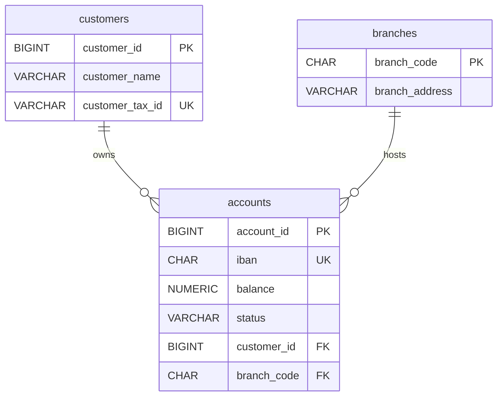

# 1NF, 2NF, 3NF — Codd's Original Normal Forms

> Normalization is the algorithm that turns a denormalized pile of columns into a set of well-formed relations. The first three normal forms — Codd's originals — eliminate the most common anomalies. The informal summary, "every non-key attribute depends on the key, the whole key, and nothing but the key, so help me Codd," is not a joke; it is the precise definition of 3NF compressed to a sentence.

## What you already know

From [[03-Functional-Dependencies]]: an FD $X \to Y$ says "same X implies same Y." The closure and attribute-closure algorithms let you compute all implied FDs and find candidate keys.

From [[02-Keys-Superkeys-Candidate-Keys]]: a candidate key is a minimal superkey. A composite candidate key has two or more attributes.

From [[06-Coupling-and-Cohesion]]: a relation is cohesive when it holds one fact type. Normalization is the formal test for that — a relation is in BCNF iff every non-trivial FD has a superkey as its determinant.

## Why this layer exists

Denormalized tables suffer from three classic anomalies:

- **Insertion anomaly**: you cannot insert a fact without also inserting another unrelated fact. (You cannot record that a new customer exists until they open an account, if customer data lives only inside the accounts table.)
- **Update anomaly**: updating one fact requires updating many rows. (If customer address lives in every order row, changing the address means updating every order.)
- **Deletion anomaly**: deleting one fact inadvertently deletes another. (Deleting the last account of a customer also deletes the customer, if customer data lived only in the account row.)

Each normal form targets a specific class of FD that causes these anomalies. The progression is monotonic: every relation in 3NF is also in 2NF, which is also in 1NF.

## What is genuinely new

Three normal forms, each defined formally as a constraint on the FDs of a relation:

- **1NF**: all attribute values are atomic.
- **2NF**: no non-prime attribute is partially dependent on a composite candidate key.
- **3NF**: no non-prime attribute is transitively dependent on a candidate key.

Plus the standard informal mnemonic and the decomposition procedure.

## Concepts

### First Normal Form (1NF)

A relation is in **1NF** iff every attribute's value is *atomic* — a single value from the attribute's domain, not a set, list, tuple, or nested relation.

"Atomic" is *purpose-relative*, not absolute. A date is atomic for most purposes but composite if you need to query by year. A string is atomic for most purposes but composite if you need to query individual characters. The test is: *does this attribute need to be split to support the queries we run?*

1NF violations:

- **Repeating groups**: a column like `phone1, phone2, phone3` (multiple columns of the same kind) — violates 1NF because the attribute "phone number" is not atomic; it has been spread across three columns. Fix: extract to a child table `customer_phones(customer_id, phone)`.
- **Comma-separated lists in a single column**: `phones = '+44..., +33..., +1...'` — same violation, worse form.
- **Nested tables**: an attribute whose value is a relation (some systems support this; the model forbids it for 1NF).

SQL's `ARRAY` and `JSONB` types technically violate 1NF. They are useful for unstructured or semi-structured data, but they break the algebra's set semantics. Use them sparingly; when you do, treat them as denormalization (see [[10-Normalization-Trade-offs]]).

### Second Normal Form (2NF)

A relation is in **2NF** iff it is in 1NF and **no non-prime attribute is partially dependent on any candidate key**.

- A **prime attribute** is an attribute that appears in *some* candidate key.
- A **non-prime attribute** is one that does not.
- A **partial dependency** on a composite key $K$ is an FD $X \to A$ where $X \subsetneq K$ and $A$ is non-prime.

2NF is only relevant when the relation has a *composite* candidate key. If all candidate keys are single-attribute, 2NF is automatic from 1NF.

Example violation: `account_holders(account_id, customer_id, customer_name, role)`. Candidate key: `(account_id, customer_id)`. FDs:

- `(account_id, customer_id) → role` (full dependency on the key — fine)
- `(account_id, customer_id) → customer_name` — but actually `customer_id → customer_name` (partial dependency on a *proper subset* of the key)

The partial dependency means `customer_name` is repeated for every account a customer holds. Fix: decompose into `account_holders(account_id, customer_id, role)` and `customers(id, customer_name, ...)`.

### Third Normal Form (3NF)

A relation is in **3NF** iff it is in 2NF and **no non-prime attribute is transitively dependent on a candidate key**.

A transitive dependency is an FD $K \to A$ that holds *because* $K \to B$ and $B \to A$ for some non-prime $B$ (i.e., $B$ is not a candidate key and not a subset of one).

Equivalently (the formal definition): for every non-trivial FD $X \to A$ in $R$, either (a) $X$ is a superkey of $R$, or (b) $A$ is a prime attribute (appears in some candidate key).

Example violation: `accounts(id, iban, balance, customer_id, customer_name)`. Candidate keys: `{id}`, `{iban}`. FDs:

- `{id} → {iban, balance, customer_id, customer_name}` — superkey determinant, fine.
- `{iban} → {id, balance, customer_id, customer_name}` — superkey determinant, fine.
- `{customer_id} → {customer_name}` — non-superkey determinant; `customer_name` is non-prime.

The transitive chain is `{id} → {customer_id} → {customer_name}`. Fix: decompose into `accounts(id, iban, balance, customer_id)` and `customers(id, customer_name)`.

### The informal mnemonic

> **Every non-key attribute must depend on the key, the whole key, and nothing but the key.**

- "the key" → 1NF/2NF: each non-key attribute depends on *some* key.
- "the whole key" → 2NF: no partial dependency on a composite key.
- "nothing but the key" → 3NF: no transitive dependency through a non-key attribute.
- "so help me Codd" → a joke, but also a reminder that BCNF tightens this further (see [[07-BCNF]]).

### The decomposition procedure

Given a relation $R$ with FDs $F$ not in 3NF:

1. Find a violating FD $X \to A$ (where $X$ is not a superkey and $A$ is non-prime).
2. Decompose $R$ into $R_1 = \pi_{X \cup A}(R)$ and $R_2 = R - A$ (i.e., drop $A$ from $R$).
3. Repeat for the resulting relations until all are in 3NF.

Each step removes one violating FD by extracting it into its own relation. The decomposition is *lossless* (the original can be reconstructed by joining $R_1$ and $R_2$ on $X$) and *dependency-preserving* for 3NF (all FDs can be checked in the decomposed schema without a join).

## Banking application

### The denormalized starting point

Imagine we started with one fat table before learning normalization:

```
denormalized_accounts(
    account_id, iban, balance, status,            -- account facts
    customer_id, customer_name, customer_tax_id,  -- customer facts
    branch_code, branch_address                   -- branch facts
)
```

FDs:

- `{account_id} → {iban, balance, status, customer_id, customer_name, customer_tax_id, branch_code, branch_address}` (account_id is a candidate key)
- `{iban} → {account_id, balance, status, customer_id, ...}` (iban is also a candidate key)
- `{customer_id} → {customer_name, customer_tax_id}` (transitive)
- `{branch_code} → {branch_address}` (transitive)

### Anomalies

- **Insertion**: cannot insert a customer who has no account yet (account_id would be NULL, breaking PK).
- **Update**: changing a customer's name requires updating every account row they own.
- **Deletion**: deleting the last account of a customer deletes the customer's record.

### Step-by-step decomposition

**Step 1: 1NF.** All attributes are already atomic. ✓

**Step 2: 2NF.** Candidate keys are `{account_id}` and `{iban}`, both single-attribute. No partial dependencies on composite keys possible. ✓

**Step 3: 3NF.** Two transitive dependencies:

- `{customer_id} → {customer_name, customer_tax_id}` — `customer_id` is not a superkey of `denormalized_accounts`.
- `{branch_code} → {branch_address}` — `branch_code` is not a superkey.

Decompose:

- Extract `customers(customer_id, customer_name, customer_tax_id)`.
- Extract `branches(branch_code, branch_address)`.
- Leave `accounts(account_id, iban, balance, status, customer_id, branch_code)` with FKs to `customers` and `branches`.

### The result



Each anomaly is now resolved:

- Insertion: you can insert a customer without an account.
- Update: customer name changes touch exactly one row in `customers`.
- Deletion: deleting an account does not delete the customer.

## Code

```sql
-- The 3NF schema (final form)
CREATE TABLE customers (
    id             BIGINT NOT NULL,
    legal_name     VARCHAR(255) NOT NULL,
    tax_id         VARCHAR(32)  NOT NULL,
    CONSTRAINT customers_pk PRIMARY KEY (id),
    CONSTRAINT customers_tax_id_uk UNIQUE (tax_id)
);

CREATE TABLE branches (
    code        CHAR(6)     NOT NULL,
    address     VARCHAR(255) NOT NULL,
    CONSTRAINT branches_pk PRIMARY KEY (code)
);

CREATE TABLE accounts (
    id           BIGINT       NOT NULL,
    iban         CHAR(34)     NOT NULL,
    balance      NUMERIC(18,2) NOT NULL,
    status       VARCHAR(16)  NOT NULL,
    customer_id  BIGINT       NOT NULL,
    branch_code  CHAR(6)      NOT NULL,
    CONSTRAINT accounts_pk PRIMARY KEY (id),
    CONSTRAINT accounts_iban_uk UNIQUE (iban),
    CONSTRAINT accounts_customer_fk FOREIGN KEY (customer_id) REFERENCES customers(id),
    CONSTRAINT accounts_branch_fk   FOREIGN KEY (branch_code) REFERENCES branches(code),
    CONSTRAINT accounts_status_ck CHECK (status IN ('PENDING','ACTIVE','FROZEN','CLOSED'))
);
```

### Reconstructing the denormalized view (when you need it)

```sql
-- A view that reconstructs the original denormalized shape for reporting.
CREATE VIEW denormalized_accounts AS
SELECT a.id AS account_id, a.iban, a.balance, a.status,
       c.id AS customer_id, c.legal_name AS customer_name, c.tax_id AS customer_tax_id,
       b.code AS branch_code, b.address AS branch_address
FROM accounts a
JOIN customers c ON c.id = a.customer_id
JOIN branches  b ON b.code = a.branch_code;
```

This is denormalization *deliberately*, at the view layer, where it does not corrupt the source of truth. See [[07-Views-Materialized-Views]] and [[10-Normalization-Trade-offs]].

## What can go wrong

- **Mistaking 1NF for "single value per column."** Atomicity is purpose-relative. A `JSONB` column storing structured data may be 1NF-violating for some queries but acceptable for others. Document the choice.
- **Decomposing too aggressively.** Splitting a table along an FD that does not actually cause anomalies (e.g., splitting `{id} → {created_at}` into a separate table) adds joins for no benefit. Normalize when there is a real anomaly; otherwise leave it.
- **Losing dependency preservation.** Some decompositions (especially BCNF) cannot preserve all FDs. You then need triggers or application checks to enforce them. See [[07-BCNF]].
- **Forgetting that 2NF only applies to composite keys.** A relation with single-attribute keys is automatically in 2NF if it is in 1NF. Many textbooks confuse students by drilling 2NF on examples where it does not apply.
- **Confusing "in 3NF" with "fully normalized."** 3NF still allows some anomalies that BCNF catches — see [[07-BCNF]]. And BCNF is not the end; multi-valued and join dependencies need 4NF and 5NF — see [[08-4NF-5NF]].

## Trade-offs

- **Normalization vs. read performance.** Fully normalized schemas require joins to reconstruct denormalized views. For high-read workloads, denormalized views (or materialized views) can be essential. See [[10-Normalization-Trade-offs]] and [[02-Denormalization-For-Reads]].
- **Decomposition vs. transactional boundaries.** A highly normalized schema spreads one business concept across many tables, requiring multi-table transactions to keep consistent. This is the *aggregate boundary* problem in DDD — see [[02-Aggregates]].
- **Dependency preservation vs. BCNF.** Sometimes 3NF is as far as you can go while preserving FDs; BCNF may force you to use triggers. See [[07-BCNF]].
- **Atomicity vs. flexibility.** Strict 1NF forbids nested structures; modern SQL embraces them (`JSONB`, `ARRAY`). The trade-off is queryability vs. schema flexibility.

## Forward links

- [[07-BCNF]] — the stricter normal form that catches overlapping candidate keys.
- [[08-4NF-5NF]] — multi-valued and join dependencies.
- [[09-DKNF]] — the "ultimate" normal form.
- [[10-Normalization-Trade-offs]] — when to stop normalizing.
- [[11-Banking-Normalization-Walkthrough]] — full end-to-end decomposition.
- [[01-Entities-Value-Objects]] and [[02-Aggregates]] — how aggregate boundaries inform decomposition decisions.
- [[04-Banking-Schema]] — the concrete SQL DDL.
- [[02-Denormalization-For-Reads]] — the deliberate counter-case.
