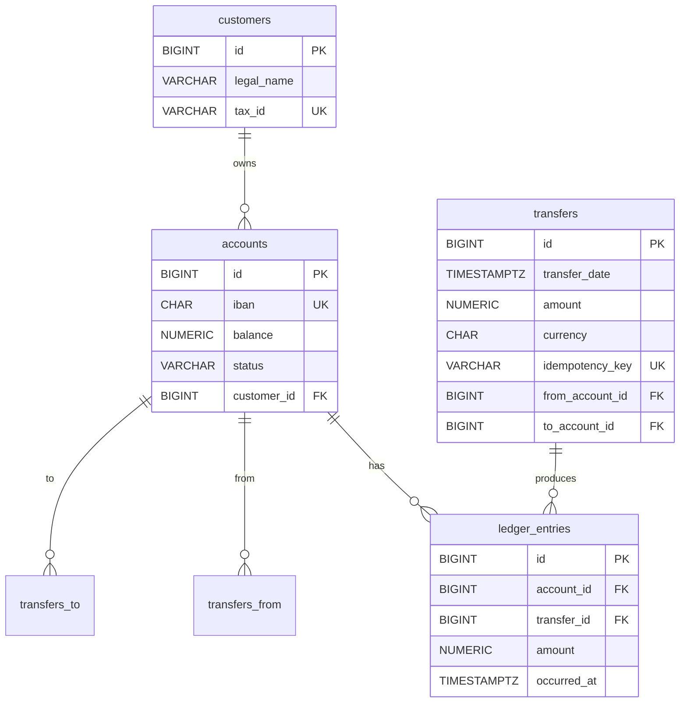

# Banking Normalization Walkthrough — End-to-End

> A complete normalization exercise: start with a denormalized banking "spreadsheet" (one fat table holding customer, account, ledger, and transfer data all flattened), discover the FDs, decompose step by step to BCNF, fix each anomaly as it appears, and arrive at the final schema. This is the worked example that ties [[06-1NF-2NF-3NF]] through [[10-Normalization-Trade-offs]] together.

## What you already know

From [[03-Functional-Dependencies]]: how to discover FDs, compute attribute closures, and identify candidate keys.

From [[06-1NF-2NF-3NF]]: the decomposition procedure, applied one violating FD at a time.

From [[07-BCNF]]: the strict form, and the rare case where 3NF is not enough.

From [[10-Normalization-Trade-offs]]: when to stop normalizing and start denormalizing read models.

From [[00-Banking-Case-Study]]: the invariants the banking system must enforce.

## Why this layer exists

Normalization theory is one thing; *doing* it on a real schema is another. The step from "I know what BCNF means" to "I can take a denormalized spreadsheet and produce a clean schema" is the step that separates a student from an engineer. This chapter is that step, worked end-to-end on the banking case.

## What is genuinely new

Nothing new conceptually — this chapter is a synthesis. The skill being practiced is:

1. Discovering FDs from a denormalized schema.
2. Identifying the candidate keys.
3. Walking through the normal forms in order, decomposing as you go.
4. Verifying losslessness and dependency preservation at each step.
5. Stopping at BCNF and adding denormalized read models deliberately.

## Concepts (recap)

The four-step procedure:

1. **Discover FDs.** From the domain (interview, requirements) and verify with data.
2. **Compute candidate keys.** Via attribute closure.
3. **Check each normal form in order.** 1NF → 2NF → 3NF → BCNF. Decompose on the first violation found; recurse.
4. **Verify.** Lossless join (the shared attribute is a candidate key of one of the projections) and dependency preservation (every FD can be checked in one of the resulting tables).

## Banking application — the denormalized starting point

Imagine the bank started as a spreadsheet, then was dumped into a single SQL table:

```
banking_spreadsheet(
    -- transfer facts
    transfer_id, transfer_date, amount, currency,
    idempotency_key,
    -- source account facts
    from_account_id, from_iban, from_balance_before, from_balance_after,
    from_customer_id, from_customer_name, from_customer_tax_id,
    -- destination account facts
    to_account_id, to_iban, to_balance_before, to_balance_after,
    to_customer_id, to_customer_name, to_customer_tax_id,
    -- ledger entries (two per transfer)
    debit_entry_id, debit_amount,
    credit_entry_id, credit_amount
)
```

This is what an analyst would build in Excel: one row per transfer, all relevant data packed into columns. It is terrible as a database schema, but it is a realistic starting point.

### The anomalies

- **Insertion**: cannot record a customer without a transfer; cannot record an account without a transfer; cannot record a ledger entry without both.
- **Update**: changing a customer's name requires updating every transfer row they participated in.
- **Deletion**: deleting a transfer deletes the customer, the account, and the ledger entries in one row.
- **Redundancy**: customer name, IBAN, and balance are repeated across every transfer row that touches the same account.

## Step 1: Discover the FDs

By interviewing the domain ([[00-Banking-Case-Study]]), we extract:

Customer facts:
- `{from_customer_id} → {from_customer_name, from_customer_tax_id}`
- `{to_customer_id} → {to_customer_name, to_customer_tax_id}`

Account facts:
- `{from_account_id} → {from_iban, from_customer_id}` (account belongs to one customer)
- `{from_iban} → {from_account_id, from_customer_id}` (IBAN is also a key)
- Similarly for `to_account_id` / `to_iban`.

Transfer facts:
- `{transfer_id} → {transfer_date, amount, currency, idempotency_key, from_account_id, to_account_id}`
- `{idempotency_key} → {transfer_id}` (idempotency key is also a key)

Ledger entry facts:
- `{debit_entry_id} → {debit_amount, from_account_id, transfer_id}`
- `{credit_entry_id} → {credit_amount, to_account_id, transfer_id}`

Balance facts:
- `{from_account_id, transfer_id} → {from_balance_before, from_balance_after}` (the balance around this transfer)
- Similarly for `to_account_id, transfer_id`.

### Candidate keys

The only attribute that uniquely identifies a row of `banking_spreadsheet` is `transfer_id` (and equivalently `idempotency_key`). So `{transfer_id}` is the only candidate key of the original spreadsheet.

Every other attribute is non-prime. This immediately signals many violations.

## Step 2: 1NF check

All attributes are atomic (no repeating groups, no lists). ✓

(If the spreadsheet had packed both ledger entries into one column like `debit_id/credit_id`, that would be a 1NF violation; we'd split into separate columns first.)

## Step 3: 2NF check

Candidate key `{transfer_id}` is single-attribute. No partial dependencies on composite keys are possible. ✓ (2NF is automatic from 1NF here.)

## Step 4: 3NF check — many violations

The relation has *many* transitive dependencies. Pick one and decompose.

### Decomposition 4a: Extract customers

The FD `{from_customer_id} → {from_customer_name, from_customer_tax_id}` has a non-superkey determinant. Decompose:

- $R_{customers}$ = `customers(id, legal_name, tax_id)` — both "from" and "to" customers.
- $R_{remaining}$ = the spreadsheet minus `from_customer_name`, `from_customer_tax_id`, `to_customer_name`, `to_customer_tax_id`.

The customer data is now in one table. Anomaly fixed: customer name changes touch one row.

### Decomposition 4b: Extract accounts

The FD `{from_account_id} → {from_iban, from_customer_id}` (and the symmetric `to_*` FDs) have non-superkey determinants. Decompose:

- $R_{accounts}$ = `accounts(id, iban, balance, status, customer_id)` — both "from" and "to" accounts.
- $R_{remaining}$ = the spreadsheet minus `from_iban`, `to_iban`, the balance columns.

The account data is now in one table. Anomaly fixed: account balance changes touch one row.

### Decomposition 4c: Extract ledger entries

The FDs `{debit_entry_id} → {debit_amount, from_account_id, transfer_id}` and `{credit_entry_id} → {credit_amount, to_account_id, transfer_id}` are non-superkey determinants. Decompose:

- $R_{ledger\_entries}$ = `ledger_entries(id, account_id, transfer_id, amount, occurred_at)`. Both debit and credit are rows in this table (distinguished by the sign of `amount`).
- $R_{remaining}$ = the spreadsheet minus `debit_entry_id`, `debit_amount`, `credit_entry_id`, `credit_amount`.

The ledger data is now in one immutable table. Anomaly fixed: ledger entries are first-class entities, not columns.

### Decomposition 4d: Extract balances_before / balances_after

The FDs `{from_account_id, transfer_id} → {from_balance_before, from_balance_after}` are problematic. The "balance before" and "balance after" are *denormalized* — they can be reconstructed from the ledger entries (running sum). Storing them is redundant.

Two choices:

1. **Drop them entirely** — compute on read. This is DKNF-pure but slow.
2. **Keep them as a denormalized column** — maintained by a trigger, with a reconciliation job.

For the source of truth, drop them. For the read model (a "transfer history" view), add them back via a view. See [[10-Normalization-Trade-offs]].

### After step 4: the remaining relation

After decompositions 4a-4d, what remains is:

```
transfers(
    transfer_id, transfer_date, amount, currency, idempotency_key,
    from_account_id, to_account_id
)
```

with FDs:

- `{transfer_id} → {transfer_date, amount, currency, idempotency_key, from_account_id, to_account_id}`
- `{idempotency_key} → {transfer_id}`

This relation is in 3NF (and BCNF). ✓

## Step 5: BCNF check

Each decomposed relation:

- `customers(id, legal_name, tax_id)`: FDs `{id} → {legal_name, tax_id}` and `{tax_id} → {id}`. Candidate keys: `{id}`, `{tax_id}`. Every determinant is a candidate key. ✓ BCNF.
- `accounts(id, iban, balance, status, customer_id)`: candidate keys `{id}`, `{iban}`. Every determinant (`{id}`, `{iban}`, `{customer_id}` — wait, `{customer_id} → ?` is not an FD here; one customer has many accounts). ✓ BCNF.
- `ledger_entries(id, account_id, transfer_id, amount, occurred_at)`: candidate key `{id}`. FD `{account_id, transfer_id} → ?` is not present (multiple entries per account per transfer are possible — the debit and the credit). ✓ BCNF.
- `transfers(transfer_id, transfer_date, amount, currency, idempotency_key, from_account_id, to_account_id)`: candidate keys `{transfer_id}`, `{idempotency_key}`. Every determinant is a candidate key. ✓ BCNF.

All decomposed relations are in BCNF. ✓

## Step 6: Verify losslessness and dependency preservation

**Losslessness**: each decomposition shared an attribute that was a candidate key of one of the resulting relations. For example, `transfers.from_account_id` is a foreign key to `accounts.id`; the join `transfers ⋈ accounts` on `from_account_id = id` reconstructs the account data losslessly. ✓

**Dependency preservation**: each original FD can be checked in one of the resulting tables:

- Customer FDs: in `customers` (enforced by PK and UNIQUE on `tax_id`).
- Account FDs: in `accounts` (enforced by PK and UNIQUE on `iban`).
- Ledger entry FDs: in `ledger_entries` (enforced by PK).
- Transfer FDs: in `transfers` (enforced by PK and UNIQUE on `idempotency_key`).
- Foreign keys: `accounts.customer_id → customers.id`, `ledger_entries.account_id → accounts.id`, `ledger_entries.transfer_id → transfers.id`, `transfers.from_account_id → accounts.id`, `transfers.to_account_id → accounts.id`. All declared as FK constraints.

No FDs were lost. ✓ (This is the case where BCNF is also dependency-preserving — the lucky case.)

## The final schema



## Code

```sql
-- Final BCNF banking schema (source of truth)

CREATE TABLE customers (
    id         BIGINT       NOT NULL,
    legal_name VARCHAR(255) NOT NULL,
    tax_id     VARCHAR(32)  NOT NULL,
    country    CHAR(2)      NOT NULL,
    CONSTRAINT customers_pk PRIMARY KEY (id),
    CONSTRAINT customers_tax_id_uk UNIQUE (tax_id)
);

CREATE TABLE accounts (
    id          BIGINT       NOT NULL,
    iban        CHAR(34)     NOT NULL,
    balance     NUMERIC(18,2) NOT NULL,
    status      VARCHAR(16)  NOT NULL,
    customer_id BIGINT       NOT NULL,
    CONSTRAINT accounts_pk PRIMARY KEY (id),
    CONSTRAINT accounts_iban_uk UNIQUE (iban),
    CONSTRAINT accounts_customer_fk FOREIGN KEY (customer_id) REFERENCES customers(id),
    CONSTRAINT accounts_status_ck CHECK (status IN ('PENDING','ACTIVE','FROZEN','CLOSED'))
);

CREATE TABLE transfers (
    id              BIGINT       NOT NULL,
    transfer_date   TIMESTAMPTZ  NOT NULL,
    amount          NUMERIC(18,2) NOT NULL,
    currency        CHAR(3)      NOT NULL,
    idempotency_key VARCHAR(64)  NOT NULL,
    from_account_id BIGINT       NOT NULL,
    to_account_id   BIGINT       NOT NULL,
    CONSTRAINT transfers_pk PRIMARY KEY (id),
    CONSTRAINT transfers_idempotency_uk UNIQUE (idempotency_key),
    CONSTRAINT transfers_from_fk FOREIGN KEY (from_account_id) REFERENCES accounts(id),
    CONSTRAINT transfers_to_fk   FOREIGN KEY (to_account_id)   REFERENCES accounts(id),
    CONSTRAINT transfers_no_self_ck CHECK (from_account_id <> to_account_id),
    CONSTRAINT transfers_amount_positive_ck CHECK (amount > 0)
);

CREATE TABLE ledger_entries (
    id          BIGINT       NOT NULL,
    account_id  BIGINT       NOT NULL,
    transfer_id BIGINT       NOT NULL,
    amount      NUMERIC(18,2) NOT NULL,    -- negative for debit, positive for credit
    occurred_at TIMESTAMPTZ  NOT NULL,
    CONSTRAINT ledger_entries_pk PRIMARY KEY (id),
    CONSTRAINT ledger_entries_account_fk  FOREIGN KEY (account_id)  REFERENCES accounts(id),
    CONSTRAINT ledger_entries_transfer_fk FOREIGN KEY (transfer_id) REFERENCES transfers(id)
);

-- Trigger-maintained denormalized column: accounts.balance (see 10-Normalization-Trade-offs)
CREATE OR REPLACE FUNCTION update_account_balance() RETURNS TRIGGER AS $$
BEGIN
    UPDATE accounts SET balance = balance + NEW.amount WHERE id = NEW.account_id;
    RETURN NEW;
END;
$$ LANGUAGE plpgsql;

CREATE TRIGGER maintain_account_balance
AFTER INSERT ON ledger_entries
FOR EACH ROW EXECUTE FUNCTION update_account_balance();

-- View that reconstructs the denormalized spreadsheet (for reporting only)
CREATE VIEW transfer_history AS
SELECT
    t.id AS transfer_id, t.transfer_date, t.amount, t.currency,
    fa.id AS from_account_id, fa.iban AS from_iban, fa.balance AS from_balance_after,
    fc.id AS from_customer_id, fc.legal_name AS from_customer_name,
    ta.id AS to_account_id, ta.iban AS to_iban, ta.balance AS to_balance_after,
    tc.id AS to_customer_id, tc.legal_name AS to_customer_name
FROM transfers t
JOIN accounts fa ON fa.id = t.from_account_id
JOIN accounts ta ON ta.id = t.to_account_id
JOIN customers fc ON fc.id = fa.customer_id
JOIN customers tc ON tc.id = ta.customer_id;
```

The view reconstructs the original spreadsheet's shape — but it is a *read model*, not the source of truth. The underlying tables are in BCNF.

## Anomaly audit

| Anomaly (original spreadsheet) | How the BCNF schema resolves it |
|---|---|
| Cannot insert a customer without a transfer | `customers` is independent; insert freely. |
| Cannot insert an account without a transfer | `accounts` is independent. |
| Updating a customer name updates many rows | `customers` has one row per customer. |
| Deleting a transfer deletes the customer | FKs prevent deletion of referenced customers; `ON DELETE RESTRICT` is the default. |
| Balance drift | `accounts.balance` is trigger-maintained; reconciliation job catches drift. |
| Ledger entries are not addressable | `ledger_entries` has its own PK; entries are first-class. |

## What can go wrong

- **Skipping the FD discovery step.** If you decompose without first listing the FDs, you guess. Wrong guesses produce schemas that look normalized but have hidden anomalies. Always start with FDs.
- **Stopping at 3NF when BCNF is needed.** In this walkthrough, 3NF and BCNF coincide for the final relations. In other schemas (see [[07-BCNF]]), they may not. Always check BCNF after 3NF.
- **Forgetting to verify losslessness.** A decomposition that is not lossless *loses data*. Always check that the join attribute is a candidate key of one of the projections.
- **Forgetting to verify dependency preservation.** A decomposition that loses FDs requires triggers. Document the lost FDs and the enforcement mechanism.
- **Denormalizing the source of truth.** The `balance` column is denormalized — but it is a denormalized *read model* on top of the normalized source (`ledger_entries`). The trigger and reconciliation job are the cost. Do not skip the reconciliation job.
- **Mixing concerns.** The original spreadsheet mixed customer, account, ledger, and transfer facts. The BCNF schema separates them. If you find yourself adding `customer_name` back to `accounts`, you are re-introducing the original anomaly. Resist — use a view instead.

## Trade-offs

- **Normalization vs. read performance.** The source-of-truth schema is fully normalized; reads require joins. For dashboards, add materialized views. See [[10-Normalization-Trade-offs]] and [[02-Denormalization-For-Reads]].
- **Denormalized `balance` column vs. computing on read.** The trigger-maintained `balance` is a deliberate denormalization for read speed. The cost is the trigger overhead on every ledger entry write. For high-volume ledgers, consider an async refresh instead.
- **Strong vs. eventual consistency for read models.** The trigger-maintained `balance` is strongly consistent (same transaction as the ledger entry). A materialized view is eventually consistent. Pick based on whether stale reads are tolerable.
- **Decomposition granularity vs. aggregate boundaries.** The BCNF schema has four base tables. Could it have more? Yes — we could decompose `accounts` into `accounts` + `account_status_history` (a separate table tracking status changes over time). The choice depends on whether the status history is a first-class concern (it is, for audit) or a derived one. See [[02-Aggregates]].

## Forward links

- [[04-Banking-Schema]] — the concrete SQL DDL in its final form, with all constraints, indexes, and triggers.
- [[09-Banking-SQL]] — the SQL queries against this schema.
- [[01-Primary-Foreign-Keys]] — the FK constraints in detail.
- [[02-Domain-Check-Constraints]] — the CHECK constraints.
- [[03-Triggers-As-Constraints]] — the trigger maintaining `balance`.
- [[07-Views-Materialized-Views]] — the denormalized read models.
- [[02-Denormalization-For-Reads]] — the deliberate denormalization patterns.
- [[10-Normalization-Trade-offs]] — the trade-off space this walkthrough instantiates.
- [[00-Banking-Case-Study]] — the invariants the schema enforces.
- [[02-Aggregates]] — the aggregate boundaries that align with the table decomposition.
