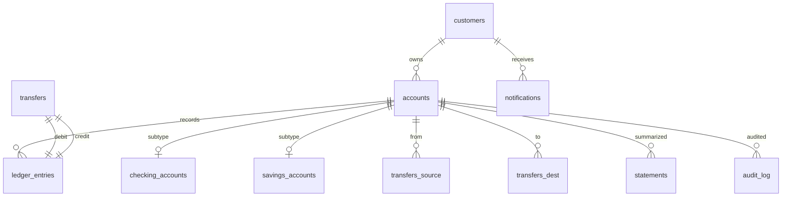

# Schema Design

> The schema is where the relational model meets reality. Up to this point we have been thinking about relations, tuples, normal forms, and functional dependencies. Now we choose concrete names, types, and constraints that programmers will type and the database will enforce for the lifetime of the system.

## What you already know

From [[04-Abstraction-and-Models]]: an abstraction is selective forgetting for a purpose. A schema is an abstraction over the bank's real operations — it keeps what we need to enforce the invariants from [[00-Banking-Case-Study]] and discards the rest. From [[03-Dependency-As-Root-Concept]]: dependencies point toward stability. The schema's foreign keys are dependencies; their direction should follow the direction of stability. From [[05-Identity-State-Lifecycle]]: every entity has logical and surrogate identity; the schema must choose how to represent both. From [[06-1NF-2NF-3NF]] and [[07-BCNF]]: every relation should describe one fact type, and every non-key attribute must depend on the whole key.

## Why this layer exists

The relational model is mathematical. It does not know what a "customer" is, what types are allowed in a column, or that two transfers with the same idempotency key are bugs. The schema layer exists to translate the model into a *concrete, enforceable contract*:

- Names that programmers, DBAs, and query planners all share.
- Types that constrain the shape of every value.
- Constraints that the database will refuse to violate, regardless of which application connects.
- Indexes that make the database's chosen access paths explicit.

Without the schema layer, the relational model is theory; with it, the model becomes a running system that other systems depend on.

## What is genuinely new here

The new idea is the **schema as a domain model enforced by the DBMS itself**. Class invariants live in code; only the application can violate them. Schema constraints live in the database; *no client can bypass them*. This is the strongest form of [[02-Encapsulation]] available to a persistence layer.

## Concepts

### Logical schema vs physical schema

- **Logical schema**: tables, columns, types, constraints, foreign keys. What the application sees. What an ER diagram describes.
- **Physical schema**: indexes, partitions, table spaces, fill factors, page layout. What the DBA tunes. What an EXPLAIN plan reveals.

The same logical schema can have many physical schemas. Changing the physical schema (adding an index) should never change query results — only their speed. Changing the logical schema (adding a column) almost always changes application code.

### The five components of a schema

A complete schema is **tables + columns + types + constraints + indexes**:

1. **Tables** — the relations.
2. **Columns** — the attributes, with names.
3. **Types** — the domains (NUMERIC, TEXT, TIMESTAMPTZ, UUID, …).
4. **Constraints** — PK, FK, UNIQUE, NOT NULL, CHECK, EXCLUDE.
5. **Indexes** — physical structures that make read patterns fast.

Forget any one of these and the schema is incomplete. A schema with no constraints is a spreadsheet; a schema with no indexes is correct but unusable at scale.

### Schema = domain model (forced into rows)

The vault's claim — repeated in [[01-Unified-Mental-Model]] — is that the schema *is* a domain model, just expressed in the relational vocabulary. Every table corresponds to a domain entity or value; every foreign key corresponds to a domain association; every CHECK corresponds to a domain invariant. The mapping is not one-to-one (see [[00-ORM-Impedance-Mismatch]]), but the *force* each schema element expresses is a domain force.

### Schema evolution and migrations

A schema is not designed once. It evolves. Every change is a **migration**: a controlled, versioned, ideally reversible edit to the schema. Migrations are expensive because:

- They take locks (an `ALTER TABLE` may block writes).
- They may rewrite data (adding a `NOT NULL` column with no default requires backfilling).
- They must be deployed in sync with application code.
- They cannot always be rolled back (a `DROP COLUMN` loses data).

Good schema design anticipates evolution: prefer additive changes, avoid `NOT NULL` on columns that might need a default later, separate volatile attributes into their own table, and keep types narrow enough that future values still fit. See [[01-DDL]] for the concrete patterns.

## Banking application

The Banking case study has these tables (full DDL in [[04-Banking-Schema]]):



Each table is in BCNF (see [[07-BCNF]]). Each constraint encodes a Banking invariant (see [[00-Banking-Case-Study]]). Each index serves a known query (see [[01-Indexing-Strategy]]).

The directional rule from [[03-Dependency-As-Root-Concept]] is visible: nothing references `ledger_entries`; `ledger_entries` references `accounts`; `accounts` references `customers`. The most stable, most queried, least-changed table (`customers`) is at the bottom of the dependency tree.

## Code — the smallest useful schema sketch

```sql
-- Generic ANSI SQL (with PostgreSQL types noted inline)

CREATE TABLE customers (
    id           BIGINT GENERATED ALWAYS AS IDENTITY PRIMARY KEY,  -- PostgreSQL: BIGSERIAL also works
    tax_id       TEXT      NOT NULL UNIQUE,                        -- logical identity
    legal_name   TEXT      NOT NULL,
    created_at   TIMESTAMPTZ NOT NULL DEFAULT now()                -- PostgreSQL: TIMESTAMPTZ
);

CREATE TABLE accounts (
    id            BIGINT GENERATED ALWAYS AS IDENTITY PRIMARY KEY,
    customer_id   BIGINT NOT NULL REFERENCES customers(id),
    iban          TEXT   NOT NULL UNIQUE,
    balance       NUMERIC(18,2) NOT NULL DEFAULT 0,
    status        TEXT   NOT NULL CHECK (status IN ('PENDING','ACTIVE','FROZEN','CLOSED')),
    opened_at     TIMESTAMPTZ NOT NULL DEFAULT now(),
    CONSTRAINT balance_non_negative CHECK (balance >= 0)   -- overridden for overdraft accounts in subtype table
);

CREATE TABLE ledger_entries (
    id            BIGINT GENERATED ALWAYS AS IDENTITY PRIMARY KEY,
    account_id    BIGINT NOT NULL REFERENCES accounts(id),
    amount        NUMERIC(18,2) NOT NULL CHECK (amount <> 0),
    occurred_at   TIMESTAMPTZ NOT NULL DEFAULT now(),
    idempotency_key TEXT UNIQUE
);

-- Index for the most common read pattern
CREATE INDEX idx_ledger_account_time ON ledger_entries (account_id, occurred_at DESC);
```

Notice what is here and what is missing: there is no `current_balance` denormalization, no `transfers` table, no subtype tables. Those come in [[04-Banking-Schema]]. This sketch is the *minimum* that enforces the invariants we have already stated.

## What can go wrong

- **Schema as afterthought.** Schema designed by the ORM's auto-DDL is a schema that no human chose. It enforces whatever the ORM happens to enforce (usually: almost nothing).
- **Constraints omitted because "the app will check."** Every constraint removed from the schema is a constraint that *any* client — a migration script, a maintenance query, a future service — can violate.
- **Premature optimization.** Adding denormalized columns before measuring read load. The result is two sources of truth and a sync bug waiting to happen.
- **Types too wide.** `TEXT` for everything hides intent; `NUMERIC(18,2)` for an interest rate loses precision. Pick types that match the domain.
- **No migration story.** A schema that cannot be changed safely is a schema that will not be changed at all — until a crisis forces a dangerous one.
- **Logical and physical schemas confused.** Indexing is a physical choice; it should not change query results. If adding or removing an index changes results, something else is broken (often a `UNIQUE` constraint masquerading as an index).

## Trade-offs

- **Strict constraints vs flexibility.** Tighter constraints catch bugs earlier but make legitimate exceptional cases harder. The rule: be strict on invariants the domain *requires* (balance can never be wrong); be lenient on attributes the domain merely *prefers*.
- **Normalized vs denormalized.** Normalized (see [[06-1NF-2NF-3NF]]) is easier to evolve and harder to make inconsistent. Denormalized (see [[02-Denormalization-For-Reads]]) is faster to read and harder to write. Default to normalized; denormalize only where measured load demands it.
- **Surrogate vs natural keys** (see [[05-Identity-State-Lifecycle]] and [[01-Primary-Foreign-Keys]]). Surrogate keys are stable and meaningless; natural keys are meaningful but mutable. The vault's pattern: surrogate PK + natural UNIQUE.
- **Inline vs out-of-band constraints.** A CHECK is inline and discoverable; a trigger is out-of-band and invisible. Use CHECK first; reach for triggers only when CHECK cannot express the rule (see [[03-Triggers-As-Constraints]]).
- **Schema-as-code vs ad-hoc DDL.** A migration tool (Flyway, Liquibase, sqitch) turns schema changes into versioned, reviewable artifacts. The alternative is a wiki page of "things we ran in production once."

## Forward links

- [[01-Primary-Foreign-Keys]] — the dependency direction in schema, formalized.
- [[02-Domain-Check-Constraints]] — declarative invariants.
- [[03-Triggers-As-Constraints]] — when declarative is not enough.
- [[04-Banking-Schema]] — full DDL for the Banking system.
- [[01-DDL]] — the SQL sub-language that creates and evolves schemas.
- [[00-ORM-Impedance-Mismatch]] — where the schema and the object model stop agreeing.
- [[01-Indexing-Strategy]] — turning the physical schema into fast access paths.
