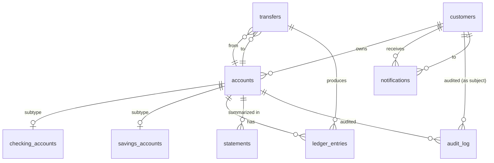

# Banking Schema — Full DDL

> The complete schema for the Banking case study. Every table, every constraint, every index, with comments explaining the design choice behind each. This is the artifact the next fifteen chapters will reference.

## What you already know

From [[00-Schema-Design]]: a schema is tables + columns + types + constraints + indexes, and it is the database's expression of the domain model. From [[01-Primary-Foreign-Keys]]: surrogate PKs, natural UNIQUEs, foreign keys that follow the direction of stability, and `ON DELETE RESTRICT` as the default. From [[02-Domain-Check-Constraints]]: every invariant the schema can express, it should — `NOT NULL`, `CHECK`, `UNIQUE`, partial unique indexes. From [[03-Triggers-As-Constraints]]: the small set of cross-row, cross-table, time-dependent rules that need triggers. From [[00-Banking-Case-Study]]: the ten invariants the system must enforce. From [[07-Composition-vs-Inheritance]]: the three ORM inheritance strategies, and why Class Table Inheritance (CTI) is the right choice for `Account` / `CheckingAccount` / `SavingsAccount`.

## Why this layer exists

Up to now the Banking system has been described as invariants, entities, and use cases. This file is where those descriptions become *executable*. Every later chapter — SQL, ORM mapping, indexes, transactions, performance — will refer back to specific tables and constraints defined here.

## What is genuinely new here

Nothing conceptually new. This is the *synthesis*: every constraint idea from the prior four files, applied to one consistent schema. The value is in seeing the whole picture at once — and in having a concrete artifact to point at when later chapters say "the accounts table."

## Concepts

The schema has nine tables, organized in three layers:



The dependency arrows all point downward (toward `customers` and `accounts`). Nothing references `ledger_entries`, `transfers`, `notifications`, or `audit_log` — those are leaves, written once and never updated. The most-stable table is `customers`; the most-changed table is `ledger_entries` (append-only). This is the dependency-direction-follows-stability rule from [[03-Dependency-As-Root-Concept]] made concrete.

## Banking application — the full DDL

```sql
-- ============================================================================
-- Banking schema — PostgreSQL 14+
-- All invariants from [[00-Banking-Case-Study]] are encoded as constraints
-- or triggers. See the comments for the invariant each element enforces.
-- ============================================================================

-- ----------------------------------------------------------------------------
-- customers: the root entity. Most stable. Referenced by everything.
-- Invariants encoded:
--   - tax_id is unique (natural identity)
--   - status is one of four lifecycle states
-- ----------------------------------------------------------------------------
CREATE TABLE customers (
    id            BIGINT GENERATED ALWAYS AS IDENTITY PRIMARY KEY,
    tax_id        TEXT NOT NULL,
    legal_name    TEXT NOT NULL,
    email         TEXT NOT NULL,
    status        TEXT NOT NULL CHECK (status IN ('PROSPECT','VERIFIED','FROZEN','CLOSED')),
    created_at    TIMESTAMPTZ NOT NULL DEFAULT now(),
    verified_at   TIMESTAMPTZ,

    -- Natural identity is unique among non-closed customers
    CONSTRAINT unique_active_tax_id UNIQUE (tax_id)
);

-- Partial unique index: a closed customer's tax_id may be reused later
-- (e.g., after a statutory retention period).
CREATE UNIQUE INDEX idx_customers_tax_id_active
    ON customers (tax_id)
    WHERE status <> 'CLOSED';

COMMENT ON TABLE customers IS
    'Root entity. Owns accounts. Status lifecycle drives KYC and transaction rules.';

-- ----------------------------------------------------------------------------
-- accounts: the financial container. Two subtypes via CTI.
-- Invariants encoded:
--   - iban is unique among non-closed accounts (invariant: external identity)
--   - status is one of four lifecycle states (invariant 8: closed cannot transact)
--   - balance >= -overdraft_limit (invariant 2: no negative beyond overdraft)
--   - account_type is CHECKING or SAVINGS (discriminator for CTI)
--   - closed_at is null until status = CLOSED
-- ----------------------------------------------------------------------------
CREATE TABLE accounts (
    id              BIGINT GENERATED ALWAYS AS IDENTITY PRIMARY KEY,
    customer_id     BIGINT NOT NULL REFERENCES customers(id) ON DELETE RESTRICT,
    iban            TEXT NOT NULL,
    account_type    TEXT NOT NULL CHECK (account_type IN ('CHECKING','SAVINGS')),
    status          TEXT NOT NULL CHECK (status IN ('PENDING','ACTIVE','FROZEN','CLOSED')),
    balance         NUMERIC(18,2) NOT NULL DEFAULT 0,
    overdraft_limit NUMERIC(18,2) NOT NULL DEFAULT 0,  -- 0 for savings; >0 only for checking
    currency        TEXT NOT NULL DEFAULT 'USD' CHECK (currency IN ('USD','EUR','GBP')),
    opened_at       TIMESTAMPTZ NOT NULL DEFAULT now(),
    closed_at       TIMESTAMPTZ,

    -- Invariant 2: balance respects the overdraft limit (savings: overdraft_limit=0)
    CONSTRAINT balance_within_limit CHECK (balance >= -overdraft_limit),
    -- closed_at is set iff status = CLOSED
    CONSTRAINT closed_at_consistency CHECK (
        (status = 'CLOSED'  AND closed_at IS NOT NULL)
        OR (status <> 'CLOSED' AND closed_at IS NULL)
    ),
    -- Savings accounts cannot have an overdraft
    CONSTRAINT savings_no_overdraft CHECK (
        account_type <> 'SAVINGS' OR overdraft_limit = 0
    )
);

-- Partial unique index: IBAN uniqueness only among non-closed accounts
CREATE UNIQUE INDEX idx_accounts_iban_active
    ON accounts (iban)
    WHERE status <> 'CLOSED';

-- Index for the most common read: "list accounts of a customer"
CREATE INDEX idx_accounts_customer ON accounts (customer_id);

COMMENT ON TABLE accounts IS
    'Account base table. CTI base for checking_accounts and savings_accounts.';

-- ----------------------------------------------------------------------------
-- checking_accounts: subtype with overdraft capability
-- CTI: account_id is both PK and FK to accounts(id)
-- ----------------------------------------------------------------------------
CREATE TABLE checking_accounts (
    account_id        BIGINT PRIMARY KEY REFERENCES accounts(id) ON DELETE CASCADE,
    overdraft_limit   NUMERIC(18,2) NOT NULL CHECK (overdraft_limit >= 0),
    overdraft_fee_rate NUMERIC(5,4) NOT NULL DEFAULT 0
);
COMMENT ON TABLE checking_accounts IS 'CTI subtype. Overdraft rules apply.';

-- ----------------------------------------------------------------------------
-- savings_accounts: subtype with interest accrual
-- ----------------------------------------------------------------------------
CREATE TABLE savings_accounts (
    account_id      BIGINT PRIMARY KEY REFERENCES accounts(id) ON DELETE CASCADE,
    interest_rate   NUMERIC(5,4) NOT NULL CHECK (interest_rate >= 0 AND interest_rate <= 1),
    interest_accrued NUMERIC(18,2) NOT NULL DEFAULT 0,
    last_accrual_at TIMESTAMPTZ
);
COMMENT ON TABLE savings_accounts IS 'CTI subtype. Daily interest accrual.';

-- ----------------------------------------------------------------------------
-- ledger_entries: the immutable history. The source of truth for balance.
-- Invariants encoded:
--   - amount is non-zero (invariant: meaningful entries only)
--   - amount is whole cents (precision)
--   - account_id references an existing account
--   - the referenced account must NOT be closed (trigger)
--   - idempotency_key is unique (invariant 7)
-- Invariants NOT encoded here (need triggers or app):
--   - balance == SUM(amount) (cross-row aggregate; enforced by app + trigger)
-- ----------------------------------------------------------------------------
CREATE TABLE ledger_entries (
    id              BIGINT GENERATED ALWAYS AS IDENTITY PRIMARY KEY,
    account_id      BIGINT NOT NULL REFERENCES accounts(id) ON DELETE RESTRICT,
    transfer_id     BIGINT REFERENCES transfers(id) ON DELETE SET NULL,  -- filled for transfers
    amount          NUMERIC(18,2) NOT NULL,
    occurred_at     TIMESTAMPTZ NOT NULL DEFAULT now(),
    idempotency_key TEXT NOT NULL,

    -- Amount cannot be zero
    CONSTRAINT amount_nonzero CHECK (amount <> 0),
    -- Whole-cents precision
    CONSTRAINT amount_whole_cents CHECK (amount * 100 = floor(amount * 100)),
    -- Idempotency: same key cannot be reused
    CONSTRAINT unique_ledger_idem UNIQUE (idempotency_key)
);

-- Hot read path: "give me the recent ledger for this account"
CREATE INDEX idx_ledger_account_time
    ON ledger_entries (account_id, occurred_at DESC);

-- Reporting path: "ledger entries in this date range"
CREATE INDEX idx_ledger_occurred_at
    ON ledger_entries (occurred_at);

COMMENT ON TABLE ledger_entries IS
    'Immutable history. The balance column on accounts is a denormalized sum of this table.';

-- ----------------------------------------------------------------------------
-- transfers: a request to move money. Produces two ledger entries.
-- Invariants encoded:
--   - amount is strictly positive
--   - from_account_id <> to_account_id (no self-transfers)
--   - idempotency_key is unique (invariant 7)
--   - status is one of four values
--   - completed transfers must have balanced ledger entries (trigger)
-- ----------------------------------------------------------------------------
CREATE TABLE transfers (
    id              BIGINT GENERATED ALWAYS AS IDENTITY PRIMARY KEY,
    from_account_id BIGINT NOT NULL REFERENCES accounts(id) ON DELETE RESTRICT,
    to_account_id   BIGINT NOT NULL REFERENCES accounts(id) ON DELETE RESTRICT,
    amount          NUMERIC(18,2) NOT NULL,
    currency        TEXT NOT NULL DEFAULT 'USD',
    status          TEXT NOT NULL CHECK (status IN ('PENDING','COMPLETED','FAILED','FRAUD_REVIEW')),
    idempotency_key TEXT NOT NULL,
    created_at      TIMESTAMPTZ NOT NULL DEFAULT now(),
    completed_at    TIMESTAMPTZ,

    CONSTRAINT transfer_amount_positive CHECK (amount > 0),
    CONSTRAINT transfer_no_self CHECK (from_account_id <> to_account_id),
    CONSTRAINT transfer_idem_unique UNIQUE (idempotency_key)
);

CREATE INDEX idx_transfers_from ON transfers (from_account_id, created_at DESC);
CREATE INDEX idx_transfers_to   ON transfers (to_account_id, created_at DESC);
CREATE INDEX idx_transfers_status_created ON transfers (status, created_at);

COMMENT ON TABLE transfers IS
    'A transfer request. Produces two ledger entries on completion. Idempotent by idempotency_key.';

-- ----------------------------------------------------------------------------
-- statements: periodic summaries. Read-mostly.
-- ----------------------------------------------------------------------------
CREATE TABLE statements (
    id           BIGINT GENERATED ALWAYS AS IDENTITY PRIMARY KEY,
    account_id   BIGINT NOT NULL REFERENCES accounts(id) ON DELETE RESTRICT,
    period_start DATE NOT NULL,
    period_end   DATE NOT NULL,
    opening_balance NUMERIC(18,2) NOT NULL,
    closing_balance NUMERIC(18,2) NOT NULL,
    interest_accrued NUMERIC(18,2) NOT NULL DEFAULT 0,
    generated_at TIMESTAMPTZ NOT NULL DEFAULT now(),

    CONSTRAINT statement_period_valid CHECK (period_end > period_start),
    -- One statement per (account, period)
    CONSTRAINT unique_statement_period UNIQUE (account_id, period_start, period_end)
);

CREATE INDEX idx_statements_account_period ON statements (account_id, period_end DESC);

COMMENT ON TABLE statements IS 'Periodic statement per account. Generated by a batch job.';

-- ----------------------------------------------------------------------------
-- notifications: outbound messages. Asynchronous; decoupled from transfers.
-- ----------------------------------------------------------------------------
CREATE TABLE notifications (
    id            BIGINT GENERATED ALWAYS AS IDENTITY PRIMARY KEY,
    customer_id   BIGINT NOT NULL REFERENCES customers(id) ON DELETE RESTRICT,
    channel       TEXT NOT NULL CHECK (channel IN ('EMAIL','SMS','PUSH')),
    template      TEXT NOT NULL,
    payload       JSONB NOT NULL,                 -- PostgreSQL: JSONB for flexible payload
    status        TEXT NOT NULL CHECK (status IN ('QUEUED','SENT','FAILED','SUPPRESSED')),
    created_at    TIMESTAMPTZ NOT NULL DEFAULT now(),
    sent_at       TIMESTAMPTZ
);

CREATE INDEX idx_notifications_status_created ON notifications (status, created_at);

COMMENT ON TABLE notifications IS 'Outbound message queue. Decoupled from transfers via event publishing.';

-- ----------------------------------------------------------------------------
-- audit_log: who changed what, when. Append-only.
-- ----------------------------------------------------------------------------
CREATE TABLE audit_log (
    id            BIGINT GENERATED ALWAYS AS IDENTITY PRIMARY KEY,
    table_name    TEXT NOT NULL,
    row_id        BIGINT NOT NULL,
    action        TEXT NOT NULL CHECK (action IN ('INSERT','UPDATE','DELETE')),
    changed_from  JSONB,                          -- PostgreSQL: JSONB for old row
    changed_to    JSONB,                          -- PostgreSQL: JSONB for new row
    changed_at    TIMESTAMPTZ NOT NULL DEFAULT now(),
    changed_by    TEXT  -- set via SET LOCAL app.user_id = '...'
);

CREATE INDEX idx_audit_table_row ON audit_log (table_name, row_id, changed_at DESC);

COMMENT ON TABLE audit_log IS 'Append-only audit trail. Populated by triggers on accounts and transfers.';

-- ============================================================================
-- Triggers (cross-row, cross-table, time-dependent rules)
-- See [[03-Triggers-As-Constraints]] for the full treatment of each.
-- ============================================================================

-- Trigger 1: closed accounts cannot receive ledger entries
CREATE OR REPLACE FUNCTION enforce_open_account_for_ledger()
RETURNS TRIGGER AS $$
BEGIN
    IF EXISTS (SELECT 1 FROM accounts WHERE id = NEW.account_id AND status = 'CLOSED') THEN
        RAISE EXCEPTION 'Account % is closed; ledger entries are not allowed',
            NEW.account_id USING ERRCODE = 'check_violation';
    END IF;
    RETURN NEW;
END;
$$ LANGUAGE plpgsql;

CREATE TRIGGER trg_ledger_no_closed_account
BEFORE INSERT OR UPDATE ON ledger_entries
FOR EACH ROW EXECUTE FUNCTION enforce_open_account_for_ledger();

-- Trigger 2: audit account status changes
CREATE OR REPLACE FUNCTION audit_account_status()
RETURNS TRIGGER AS $$
BEGIN
    IF OLD.status IS DISTINCT FROM NEW.status THEN
        INSERT INTO audit_log (table_name, row_id, action, changed_from, changed_to)
        VALUES ('accounts', NEW.id, 'UPDATE',
                jsonb_build_object('status', OLD.status),
                jsonb_build_object('status', NEW.status));
    END IF;
    RETURN NEW;
END;
$$ LANGUAGE plpgsql;

CREATE TRIGGER trg_audit_account_status
AFTER UPDATE OF status ON accounts
FOR EACH ROW
WHEN (OLD.status IS DISTINCT FROM NEW.status)
EXECUTE FUNCTION audit_account_status();

-- Trigger 3: a completed transfer must have balanced ledger entries
CREATE OR REPLACE FUNCTION enforce_transfer_balanced()
RETURNS TRIGGER AS $$
BEGIN
    IF NEW.status = 'COMPLETED' THEN
        IF NOT EXISTS (
            SELECT 1 FROM ledger_entries le
            WHERE le.transfer_id = NEW.id
            GROUP BY le.transfer_id
            HAVING SUM(le.amount) = 0 AND COUNT(*) = 2
        ) THEN
            RAISE EXCEPTION 'Transfer % is not balanced', NEW.id
                USING ERRCODE = 'check_violation';
        END IF;
    END IF;
    RETURN NEW;
END;
$$ LANGUAGE plpgsql;

CREATE CONSTRAINT TRIGGER trg_transfer_balanced
AFTER UPDATE ON transfers
FOR EACH ROW
DEFERRABLE INITIALLY DEFERRED
EXECUTE FUNCTION enforce_transfer_balanced();
```

## What can go wrong

- **CTI inserts are two-step.** Inserting a savings account means inserting into `accounts` and then `savings_accounts`. A failure between the two leaves an account with no subtype row. Wrap in a transaction (see [[06-Transactions-In-SQL]]).
- **The balance denormalization.** `accounts.balance` is a denormalized copy of `SUM(ledger_entries.amount)`. If they drift, you have a bug. The system needs a reconciliation job to verify equality periodically.
- **Overdraft logic split across two tables.** `accounts.overdraft_limit` defaults to 0 for savings; `checking_accounts.overdraft_limit` carries the real value. The CHECK on `accounts` enforces the invariant; the value is authoritative on the subtype. This is a deliberate trade-off: the invariant lives with the base table; the value lives with the subtype.
- **JSONB columns drift.** `notifications.payload` and `audit_log.changed_from/changed_to` are JSONB — flexible but untyped. Add application-level validation; consider a JSON schema check.
- **Triggers fire on bulk operations.** `COPY` and bulk `INSERT` pay per-row trigger costs. For migration loads, consider temporarily disabling triggers — but only inside a transaction that re-enables them.
- **Index bloat.** Every constraint creates an index; every index slows writes. The schema above has 13 indexes. Each one must earn its place (see [[01-Indexing-Strategy]]).

## Trade-offs

- **CTI vs STI for accounts.** CTI gives clean subtype constraints (interest rate NOT NULL on savings only); STI would force nullable columns. The cost of CTI is a two-step insert and a JOIN for polymorphic reads. See [[07-Composition-vs-Inheritance]].
- **Denormalized balance.** Storing `balance` on `accounts` makes reads O(1) but writes O(1)+trigger. Computing balance from `ledger_entries` makes reads O(N) but writes simpler. The vault's choice: denormalize for the hot path; reconcile periodically.
- **Idempotency key as UNIQUE.** Enforces invariant 7 at the cost of an index write per ledger entry. Worth it.
- **DEFERRABLE triggers.** The transfer-balanced trigger is deferred because it can only run after both entries are written. The cost: errors surface at commit, not at the failing statement. Document loudly.
- **JSONB for audit and notifications.** Flexible schema for evolving payloads; loses type safety. Worth the trade-off for low-criticality columns; would not use for balances.

## Forward links

- [[09-Banking-SQL]] — the SQL that operates on this schema (transfers, balance queries, batches).
- [[07-Banking-ORM-Mapping]] — how this schema maps to JPA entities.
- [[01-DDL]] — the language used to write this DDL.
- [[03-Triggers-As-Constraints]] — deeper treatment of the three triggers above.
- [[09-Banking-Transaction-Walkthrough]] — how a transfer flows through these tables under ACID.
- [[05-Banking-Performance-Tuning]] — how the indexes above are tuned for production load.
