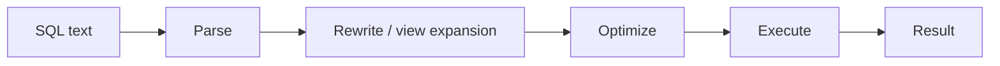

# SQL — From Relational Algebra

> SQL is the most successful declarative language ever built. It is also a flawed implementation of the relational model. Understanding both halves — what SQL inherits from algebra, and where it departs — is the difference between writing SQL and writing SQL *well*.

## What you already know

From [[04-Relational-Algebra]]: the relational model is built on a small set of operators — selection (σ), projection (π), join (⨝), union (∪), difference (−), rename (ρ), and the derived ones (intersection, division). These operators are closed over relations: the output of any operator is itself a relation, ready to be the input of the next. From [[01-Relations-Tuples-Attributes]]: a relation is a *set* of tuples; there are no duplicates, no order, no nulls. From [[04-Abstraction-and-Models]]: a query language is an abstraction — it lets you say *what* you want, not *how* to find it.

## Why this layer exists

Relational algebra is mathematically beautiful and practically unusable. You cannot type `σ_balance>1000_π_iban(accounts)` into a system and expect a useful answer. SQL exists to give the relational model a syntax that humans can write, optimizers can transform, and systems can execute. It is the *user-facing surface* of the relational model.

## What is genuinely new here

The new idea is **SQL as a (slightly unfaithful) implementation of the relational model**. The faithfulness matters: where SQL deviates from the model — bags instead of sets, NULLs, ordering — those deviations create the bugs and surprises that fill the rest of this chapter.

## Concepts

### The three sub-languages of SQL

SQL is not one language; it is three sub-languages sharing a syntax:

| Sub-language | Purpose | Verbs |
|---|---|---|
| **DDL** (Data Definition Language) | Define and evolve the schema | `CREATE`, `ALTER`, `DROP` (table, index, view, type) |
| **DML** (Data Manipulation Language) | Read and modify data | `SELECT`, `INSERT`, `UPDATE`, `DELETE`, `MERGE` |
| **DCL** (Data Control Language) | Manage access | `GRANT`, `REVOKE` |

A fourth sub-language, **TCL** (Transaction Control Language) — `BEGIN`, `COMMIT`, `ROLLBACK`, `SAVEPOINT` — is sometimes broken out separately. See [[06-Transactions-In-SQL]].

### The SQL standard

SQL is standardized by ANSI/ISO. The major revisions:

| Year | What it added |
|---|---|
| SQL-86 | First standard. Basic SELECT, INSERT, UPDATE, DELETE. |
| SQL-92 | `JOIN ... ON` syntax, schema manipulation, foreign keys. |
| SQL:1999 | Triggers, recursive queries (WITH RECURSIVE), regular expressions, BOOLEAN type. |
| SQL:2003 | Window functions, MERGE, XML type. |
| SQL:2008 | TRUNCATE, INSTEAD OF triggers. |
| SQL:2011 | Temporal tables (system-versioned). |
| SQL:2016 | JSON type, row pattern matching. |
| SQL:2019 | Multi-dimensional arrays. |
| SQL:2023 | Property graph queries (SQL/PGQ), JSON data type. |

PostgreSQL adheres to the standard closely, with extensions explicitly labeled (`RETURNING`, `ON CONFLICT`, `JSONB`, `GENERATED ALWAYS AS IDENTITY`). Where a feature is PostgreSQL-specific, this vault labels it.

### SELECT / FROM / WHERE maps to π / ⨝ / σ

The core of SQL is the `SELECT ... FROM ... WHERE` triple. It maps cleanly onto relational algebra:

| SQL clause | Algebra operator | What it does |
|---|---|---|
| `FROM A JOIN B ON ...` | `A ⨝_cond B` | Combine rows from two relations |
| `WHERE cond` | `σ_cond(...)` | Keep rows satisfying a predicate |
| `SELECT a, b, c` | `π_{a,b,c}(...)` | Keep only those columns |
| `GROUP BY k` plus aggregate | γ_k → agg(...) | Group and aggregate |
| `ORDER BY a` | (none — algebra has no order) | Sort the output |
| `DISTINCT` | δ(...) | Remove duplicates |

So a query like:

```sql
SELECT iban, balance
FROM accounts
WHERE balance > 1000;
```

is, in algebra, `π_{iban, balance}(σ_{balance > 1000}(accounts))`. The optimizer is free to apply σ before π (it usually does), because algebraic laws guarantee the result is identical. See [[04-Relational-Algebra]] and [[07-Cost-Based-Optimizer]].

### The three deviations from the model

SQL deviates from the relational model in three places. Each deviation has practical consequences.

#### 1. Bags, not sets

A relation is a *set* of tuples — duplicates are forbidden. SQL's `SELECT` returns a *bag* (multiset) — duplicates are allowed unless you write `SELECT DISTINCT`. This is a deliberate performance choice: deduplication requires sorting or hashing, which is expensive.

Consequence: `SELECT customer_id FROM accounts` may return the same customer_id many times. If you want one row per customer, you must either `DISTINCT` or `GROUP BY`.

#### 2. NULLs

The relational model has no NULL. Codd later proposed a three-valued logic (true, false, unknown); SQL adopted it, with results that surprise everyone the first time:

```sql
SELECT * FROM accounts WHERE balance = NULL;       -- returns nothing, ever
SELECT * FROM accounts WHERE balance <> NULL;      -- also returns nothing
SELECT * FROM accounts WHERE balance IS NULL;      -- the only correct way
```

`NULL = NULL` evaluates to *unknown*, not *true*. Arithmetic with NULL yields NULL. `COUNT(*)` counts NULLs; `COUNT(column)` does not. NULLs propagate through aggregates in non-obvious ways. The rule: prefer `NOT NULL` columns (see [[02-Domain-Check-Constraints]]); use NULL only when absence is genuinely meaningful.

#### 3. Ordering

Relations are unordered. SQL `SELECT` output is unordered *unless* you specify `ORDER BY`. A query without `ORDER BY` may return rows in different orders across runs — even within the same database — because the optimizer is free to choose any access path. Many bugs come from relying on "the order I happened to get once."

The rule: **if your application depends on order, your query must say so.** No exceptions.

### What SQL is good at — and bad at

| Good at | Bad at |
|---|---|
| Set operations (find all customers matching X) | Recursion (compute a tree traversal) |
| Aggregation (sum, count, average over groups) | Procedural logic (loop, branch) |
| Declarative joins (find related data) | String processing |
| Filtering and projection | Complex conditional logic (CASE helps, but limited) |
| Bulk updates (UPDATE ... WHERE) | Row-by-row logic |
| Aggregating across large data sets | Anything requiring "do X, then check, then maybe Y" |

When you find yourself fighting SQL — nested CASE expressions, repeated subqueries, row-by-row logic — the answer is usually one of:

- A window function (see [[05-Window-Functions]]).
- A CTE (see [[04-Subqueries-CTEs]]).
- A view (see [[07-Views-Materialized-Views]]).
- Or, in extreme cases, a stored procedure (see [[08-Stored-Procedures]]).

### The SQL processing pipeline

When you submit SQL, the database runs a pipeline:



The parser checks syntax. The rewriter expands views, simplifies constants, and applies algebraic identities. The optimizer chooses an access path (which indexes, which join order, which algorithms). The executor runs the plan. See [[06-Query-Processing-Pipeline]] for the full treatment.

## Banking application

Recall the Banking invariants from [[00-Banking-Case-Study]]. Each one becomes a SQL operation:

| Invariant | SQL expression |
|---|---|
| Balance == SUM(ledger_entries.amount) | `SELECT SUM(amount) FROM ledger_entries WHERE account_id = $1` |
| No negative balances (savings) | `CHECK (balance >= 0)` on the savings subtype |
| Double-entry (transfer's entries sum to zero) | Trigger (see [[03-Triggers-As-Constraints]]) |
| Closed accounts cannot transact | `WHERE status <> 'CLOSED'` in queries + trigger |
| Idempotent transfers | `INSERT ... ON CONFLICT (idempotency_key) DO NOTHING` (PostgreSQL) |

A simple SQL example to anchor the rest of the chapter:

```sql
-- Find customers whose total balance exceeds $100,000
SELECT c.id, c.legal_name, SUM(a.balance) AS total_balance
FROM customers c
JOIN accounts a ON a.customer_id = c.id
WHERE a.status = 'ACTIVE'
GROUP BY c.id, c.legal_name
HAVING SUM(a.balance) > 100000
ORDER BY total_balance DESC;
```

This single query exercises five algebraic operators (π, σ, ⨝, γ, sort) and shows off SQL's strengths: declarative, set-oriented, and aggregable. We will return to it in [[03-Select-Join-Group]].

## Code — the same query, three ways

SQL gives you multiple ways to express the same algebraic operation. This is a feature (flexibility) and a curse (inconsistency across teams). Three equivalent queries:

```sql
-- 1. SQL-92 JOIN syntax (preferred)
SELECT a.iban, a.balance
FROM accounts a
JOIN customers c ON c.id = a.customer_id
WHERE c.status = 'VERIFIED';

-- 2. Older comma syntax (avoid in new code)
SELECT a.iban, a.balance
FROM accounts a, customers c
WHERE a.customer_id = c.id
  AND c.status = 'VERIFIED';

-- 3. Subquery (when you need the customer filter first)
SELECT a.iban, a.balance
FROM accounts a
WHERE a.customer_id IN (
    SELECT id FROM customers WHERE status = 'VERIFIED'
);
```

All three are equivalent *as sets*. They may have different plans (the optimizer usually unifies them). The first is the modern style; the second is legacy; the third is sometimes clearer for filtering.

## What can go wrong

- **Treating SQL output as ordered without `ORDER BY`.** The order is unspecified; relying on it is a bug waiting for the next plan change.
- **Forgetting `DISTINCT` when you need a set.** A join that produces duplicate rows on one side will produce duplicate rows in the output.
- **NULL comparison bugs.** `WHERE balance != 0` excludes rows where `balance IS NULL`. If you want "all rows that are not zero," you need `WHERE balance <> 0 OR balance IS NULL`.
- **Bag semantics in subqueries.** `IN` and `EXISTS` behave differently under duplicates. Usually both work; occasionally one is dramatically faster.
- **Portability.** SQL written for one database may not work on another. PostgreSQL-specific features (`RETURNING`, `ON CONFLICT`, `JSONB`) need to be labeled.
- **Treating SQL like imperative code.** SQL is declarative. The order of clauses in the text does not determine the order of execution. The optimizer chooses.
- **Ignoring the standard.** A query that uses `LIMIT n` (PostgreSQL/MySQL) is non-standard; the standard is `FETCH FIRST n ROWS ONLY`. Both work; the standard form is portable.

## Trade-offs

- **Declarative vs procedural.** SQL is declarative: you say *what*, the optimizer says *how*. The trade-off: you give up control over execution, in exchange for the optimizer usually choosing better than you would. Occasionally the optimizer is wrong; see [[00-Query-Optimization-Strategy]].
- **Standard vs vendor extensions.** Standard SQL is portable; extensions are powerful. PostgreSQL's `JSONB` is non-standard but transformative for some workloads. The trade-off is portability vs expressiveness.
- **Sets vs bags.** `DISTINCT` gives correctness; omitting it gives speed. The right answer depends on whether duplicates are meaningful.
- **NULL vs sentinel values.** NULL is semantically clean (three-valued logic) but operationally painful. Sentinel values (`-1` for "no balance") are operationally simple but semantically wrong. Default to NULL when absence is meaningful; never use sentinels.
- **Expressive power vs plan stability.** A complex query may express the intent beautifully and produce wildly different plans across schema changes. A simpler, more verbose query may be more plan-stable. See [[08-Reading-EXPLAIN]].

## Forward links

- [[01-DDL]] — defining the schema SQL operates on.
- [[02-DML]] — modifying data.
- [[03-Select-Join-Group]] — the workhorses.
- [[04-Subqueries-CTEs]] — composition.
- [[05-Window-Functions]] — analysis SQL could not do before SQL:2003.
- [[06-Query-Processing-Pipeline]] — what happens after the parser.
- [[04-Relational-Algebra]] — the underlying math.
- [[00-ORM-Impedance-Mismatch]] — what happens when an object model meets SQL.
