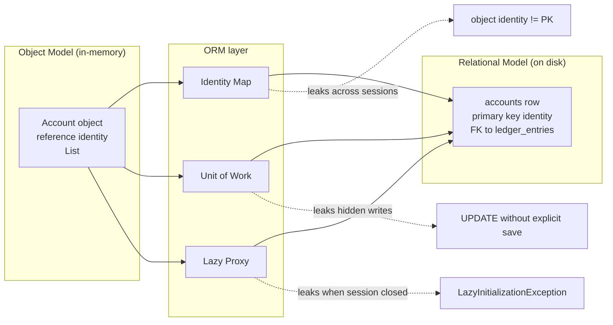

# ORM — The Object-Relational Impedance Mismatch

> Ted Neward called ORM "the Vietnam of Computer Science" — a quagmire you enter for good reasons, cannot win, and cannot leave. This chapter explains *why* the war is unwinnable: the object model and the relational model were built on different assumptions, and no library can paper over the difference without leaking. Every later chapter in this folder is a tour of the leaks — and the workarounds.

## What you already know

From [[03-Dependency-As-Root-Concept]]: a dependency exists when a change in one place can force a change in another. The object model and the relational model disagree about *which direction dependencies point*, *what identity is*, and *how change is tracked*.

From [[05-Identity-State-Lifecycle]]: object identity is a pointer; logical identity is a chosen attribute; surrogate identity is a generated key. The ORM's job is to make these three coincide — and they cannot fully coincide.

From [[07-Composition-vs-Inheritance]]: the three inheritance mapping strategies (Single Table, Class Table, Concrete Table) are the database expression of the inheritance-vs-composition trade-off. The mismatch is *structural*, not a bug.

From [[04-Abstraction-and-Models]]: every abstraction leaks. The ORM is an abstraction over SQL. The leaks are the entire reason this folder exists.

## Why this layer exists

Without an ORM, the developer writes two programs: an object model that captures business rules, and a SQL layer that persists them. The two are written in different languages, with different idioms, different error modes, and different testing strategies. They drift. The object model gains a field; the schema does not. The schema gains a column; the object model does not. Eventually the two disagree silently, and the disagreement is found in production at 3 a.m.

The ORM exists to *merge the two programs into one*. You describe the object model and the mapping together; the ORM generates the SQL. You think in objects; the database is fed SQL. That is the promise.

The promise cannot be fully kept, because the two models were designed by different communities to solve different problems. The ORM does not eliminate the mismatch; it makes it *manageable* — at the cost of needing you to understand exactly where and how it leaks.

## What is genuinely new here

The mismatch is not one problem. It is **a list of seven** independent structural disagreements between objects and relations. Each generates its own ORM features, its own failure modes, and its own workarounds. The list is the chapter.

## Concepts — the seven dimensions of mismatch

### 1. Identity

| Object model | Relational model |
|---|---|
| Two `Account` objects with the same `id` field can be different objects in memory (`==` is false) | Two rows with the same primary key *are the same row* |
| Identity is a pointer; cheap, ephemeral | Identity is a value; stable, shareable |

The ORM tries to make object identity coincide with primary key *within a session* (see [[01-Identity-Map]]). Across sessions, the guarantee disappears. This is the root cause of the `equals()` / `hashCode()` trap discussed in [[05-Identity-State-Lifecycle]]: if you use the surrogate `id` in `hashCode`, an unpersisted entity breaks every `HashSet` it touches.

### 2. Inheritance

| Object model | Relational model |
|---|---|
| `class SavingsAccount extends Account` | No inheritance. Tables have foreign keys, not "subtables." |
| Single inheritance, deep hierarchies, polymorphism | Flat relations, joins, no native polymorphism |

The relational model has no inheritance. Codd's model is sets of tuples; tuples do not have parents. The ORM must *translate* an inheritance hierarchy into one of three flat shapes (STI, CTI, Concrete), each with its own trade-offs — see [[07-Composition-vs-Inheritance]] for the schema view, and [[07-Banking-ORM-Mapping]] for the JPA `@Inheritance` annotation.

### 3. Associations (references vs foreign keys)

| Object model | Relational model |
|---|---|
| `Account` holds a `List<LedgerEntry> entries` | `ledger_entries.account_id BIGINT REFERENCES accounts(id)` |
| Bidirectional: `account.getEntries()` and `entry.getAccount()` | One foreign key; the "direction" exists only in queries |
| Object references are pointers — traversing is O(1) | Joins are how relations are traversed — O(N log N) or worse |

The object developer thinks "an account has its entries." The relational developer thinks "entries have an `account_id`." These are different statements, and the ORM must translate between them on every navigation. This is where the N+1 problem is born (see [[03-N-plus-1-Problem]]).

### 4. Collections

| Object model | Relational model |
|---|---|
| `List<LedgerEntry>` — ordered, indexed, may contain duplicates | A relation is a *set* — unordered, no duplicates |
| `Map<String, Account>` — keyed lookup | No map; a `WHERE` clause is the equivalent |
| Bags, sets, sorted sets, ordered lists — all distinct | One structure: a relation |

JPA exposes `@OneToMany` with `List`, `Set`, `Map` — but underneath, they are all "rows in a child table matched by a foreign key." Order is implemented by an `ORDER BY` clause, not by the list's index. Duplicates are impossible in a `Set` of entities only because they share the same primary key.

### 5. Transactions (in-memory unit of work vs database transactions)

| Object model | Relational model |
|---|---|
| A unit of work (see [[04-Unit-of-Work]]) accumulates changes in memory and flushes them at commit | A database transaction is a sequence of SQL statements bracketed by `BEGIN` and `COMMIT` |
| The object model has no concept of "transaction boundary" — that is the ORM's job | The database knows nothing about objects |

The ORM's `EntityManager` (or Hibernate `Session`) is a *Unit of Work*. It tracks which objects are dirty, and at flush time it issues the corresponding `UPDATE` statements. The developer says `account.deposit(100)`; the ORM figures out the SQL.

### 6. Data types

| Java type | SQL type | Mismatch |
|---|---|---|
| `enum AccountStatus` | `TEXT` or custom enum type | Order of values, case sensitivity, schema evolution |
| `BigDecimal money` | `NUMERIC(18,2)` | Scale, rounding, currency — see [[02-Domain-Check-Constraints]] |
| `Optional<T>` | NULLable column | `Optional` is not a value type; cannot be persisted directly |
| `Instant` / `LocalDateTime` | `TIMESTAMPTZ` / `TIMESTAMP` | Time zones are a database- and session-level setting |
| `record Money(...)` | composite columns or JSON | No native "value object"; ORM must embed or serialize |

Value objects (DDD) have no identity, but every row in a table is identified by its primary key. The ORM fakes value objects via `@Embeddable` — see [[06-Hibernate-JPA]] and [[07-Banking-ORM-Mapping]].

### 7. Concurrency

| Object model | Relational model |
|---|---|
| Single-threaded by default; concurrency is the developer's problem | Multi-session by default; isolation levels are a database concern |
| Optimistic locking via `@Version` | `SELECT ... FOR UPDATE`, MVCC snapshots |

The ORM hides the database's concurrency model behind object references. Two sessions loading the same account get two different objects; both modify; one commits; the other gets an `OptimisticLockException` on commit. This is the seam we exploit in [[07-Banking-ORM-Mapping]] with `@Version`.

## The three ORM inheritance strategies — reviewed from the ORM side

The same three strategies introduced in [[07-Composition-vs-Inheritance]] appear here as JPA annotations.

### Single Table Inheritance (STI) — `@Inheritance(strategy = SINGLE_TABLE)`

```java
@Entity
@Inheritance(strategy = InheritanceType.SINGLE_TABLE)
@DiscriminatorColumn(name = "account_type", discriminatorType = DiscriminatorType.STRING)
public abstract class Account { /* shared fields */ }

@Entity
@DiscriminatorValue("CHECKING")
public class CheckingAccount extends Account {
    private BigDecimal overdraftLimit;
}

@Entity
@DiscriminatorValue("SAVINGS")
public class SavingsAccount extends Account {
    private BigDecimal interestRate;
}
```

One table; a discriminator column picks the subtype; subtype-specific fields are nullable. Polymorphic queries are trivial (`SELECT a FROM Account a`). The cost: sparse rows, no `NOT NULL` on subtype fields, schema changes affect all subtypes.

### Class Table Inheritance (CTI) — `@Inheritance(strategy = JOINED)`

```java
@Entity
@Inheritance(strategy = InheritanceType.JOINED)
public abstract class Account { /* shared fields */ }

@Entity
@PrimaryKeyJoinColumn(name = "account_id")
public class CheckingAccount extends Account { /* checking-only fields */ }
```

One table per class; subtype tables hold a foreign key to the supertype table as their primary key. Loading a `CheckingAccount` requires a `JOIN` between `accounts` and `checking_accounts`. Cleanest schema, full `NOT NULL` support, slowest reads.

### Concrete Table Inheritance — `@Inheritance(strategy = TABLE_PER_CLASS)`

Each concrete subclass gets its own table; shared columns are duplicated. Polymorphic queries require `UNION ALL`. Rarely used in practice because of the duplication cost.

## What ORMs try to do — and why they leak

The ORM tries to give you an object model that *feels* like in-memory objects and *persists* like rows. It does this with three mechanisms:

1. **Identity Map** — same row → same object within a session ([[01-Identity-Map]]).
2. **Lazy loading** — associations are loaded on demand, via runtime-generated proxies ([[02-Lazy-Eager-Loading]]).
3. **Unit of Work** — the session tracks dirty objects and writes SQL at flush time ([[04-Unit-of-Work]]).

Each mechanism leaks:

- The Identity Map leaks across sessions: object identity != primary key once you cross a session boundary.
- Lazy loading leaks via the `LazyInitializationException` — you step outside a session and try to touch a proxy, and the ORM throws because the connection is gone.
- The Unit of Work leaks via "hidden writes" — you call `account.deposit(100)` and a `UPDATE accounts SET balance = ...` runs at flush, even though you never wrote SQL.

The leaks are *not* bugs. They are the inevitable consequence of trying to merge two models that disagree about identity, structure, and lifecycle. The lesson is not "ORMs are bad" — it is "you must understand the leaks to use an ORM well."

## Banking application

In the Banking case study ([[00-Banking-Case-Study]]), every dimension of the mismatch is exercised:

- **Identity**: `Account` has both a surrogate `id` (primary key) and a logical `iban` (unique). The ORM must treat them differently.
- **Inheritance**: `CheckingAccount` and `SavingsAccount` extend `Account`. We use `JOINED` (CTI) — see [[07-Banking-ORM-Mapping]] — because checking has `overdraft_limit` (NOT NULL) and savings has `interest_rate` (NOT NULL), and STI would force these to be nullable.
- **Associations**: `Account` → `List<LedgerEntry>` is bidirectional but lazy by default. Statements need eager loading; balance checks do not.
- **Collections**: `ledger_entries` is a *set* in schema (no duplicates), but a *list* in the entity (preserves insertion order via `@OrderColumn`).
- **Transactions**: a transfer is one Unit of Work: debit `Account` A, credit `Account` B, write two `LedgerEntry` rows, persist `Transfer` — all in one `EntityManager.commit()`.
- **Data types**: `Money` is a `@Embeddable` value object (`amount` + `currency`); `AccountStatus` is a Java enum mapped to a `TEXT` column.
- **Concurrency**: `Account` has `@Version` for optimistic locking; concurrent transfers race and one loses.

## Code — the seven mismatches in one snippet

```java
@Entity
@Inheritance(strategy = InheritanceType.JOINED)
public abstract class Account {

    @Id
    @GeneratedValue(strategy = GenerationType.IDENTITY)
    private Long id;                                   // surrogate identity (mismatch #1)

    @Column(unique = true, nullable = false)
    private String iban;                               // logical identity

    @Embedded
    private Money balance;                             // value object (mismatch #6)

    @Enumerated(EnumType.STRING)
    @Column(nullable = false)
    private AccountStatus status;                      // enum → TEXT (mismatch #6)

    @Version
    private Long version;                              // optimistic lock (mismatch #7)

    @OneToMany(mappedBy = "account", cascade = CascadeType.PERSIST)
    @OrderBy("occurredAt ASC")                         // collection order = ORDER BY (mismatch #4)
    private List<LedgerEntry> entries = new ArrayList<>();   // association (mismatch #3)
}
```

The corresponding SQL schema (PostgreSQL dialect) — see [[04-Banking-Schema]]:

```sql
CREATE TABLE accounts (
    id         BIGSERIAL PRIMARY KEY,
    iban       TEXT UNIQUE NOT NULL,
    balance_amount   NUMERIC(18,2) NOT NULL,
    balance_currency TEXT NOT NULL,
    status     TEXT NOT NULL,
    version    BIGINT NOT NULL DEFAULT 0
);
CREATE TABLE checking_accounts (
    account_id      BIGINT PRIMARY KEY REFERENCES accounts(id),
    overdraft_limit NUMERIC(18,2) NOT NULL
);
CREATE TABLE savings_accounts (
    account_id   BIGINT PRIMARY KEY REFERENCES accounts(id),
    interest_rate NUMERIC(5,4) NOT NULL
);
CREATE TABLE ledger_entries (
    id          BIGSERIAL PRIMARY KEY,
    account_id  BIGINT NOT NULL REFERENCES accounts(id),
    amount      NUMERIC(18,2) NOT NULL,
    occurred_at TIMESTAMPTZ NOT NULL
);
```

The structure of the object model and the structure of the schema are *related but not identical*. The ORM is the translation layer.

## Mermaid — the leak diagram



## What can go wrong

1. **Treating the ORM as "SQL with extra steps."** If you write queries as if you were writing SQL, you lose the object model's benefits and pay the ORM's overhead for nothing. Use the ORM for stateful work; reach for SQL/DTOs for read-heavy reporting ([[03-N-plus-1-Problem]]).

2. **Assuming the object graph is the data graph.** A 100-entity object graph is *not* a 100-row query. Lazy loading explodes it into 100+N queries.

3. **Ignoring the leak.** "I don't need to understand `@Version`; JPA handles it." Then you ship, two transfers race, one silently overwrites the other, and the balance invariant breaks ([[09-Banking-Transaction-Walkthrough]]).

4. **Using STI for a hierarchy with many subtype-specific fields.** Sparse rows, no `NOT NULL`, schema pain. Use `JOINED` instead.

5. **Bidirectional associations with one side unmaintained.** `account.addEntry(e)` without `e.setAccount(account)`. The in-memory graph and the persisted graph disagree until the next flush — and sometimes longer.

## Trade-offs

The mismatch is not solvable; it is *navigable*. Every choice trades one cost for another:

| Choice | Cost paid | Benefit gained |
|---|---|---|
| Use an ORM at all | Indirection, leaks, learning curve | Object-oriented persistence; less boilerplate |
| STI vs JOINED | Sparse rows vs extra JOINs | Simplicity vs schema cleanliness |
| Lazy vs Eager (see [[02-Lazy-Eager-Loading]]) | `LazyInitializationException` vs N+1 | Memory vs round-trips |
| `@Version` optimistic vs `SELECT FOR UPDATE` pessimistic | Retry on conflict vs blocking | Throughput vs predictability |
| Repository pattern (see [[05-Repository-Pattern]]) vs raw `EntityManager` | Indirection layer | Testability, domain purity |

The right answer is *deliberate*: pick the cost that fits the constraint, document the trade-off ([[08-Trade-offs-Everywhere]]), and revisit when the constraint changes.

## Forward links

- [[01-Identity-Map]] — Hibernate's solution to mismatch #1 within a session.
- [[02-Lazy-Eager-Loading]] — how the ORM implements associations (mismatch #3) and the cost of the leak.
- [[03-N-plus-1-Problem]] — the most famous consequence of mismatch #3.
- [[04-Unit-of-Work]] — mismatch #5 in detail.
- [[05-Repository-Pattern]] — abstraction that hides the ORM from the domain.
- [[06-Hibernate-JPA]] — practical JPA annotations and pitfalls.
- [[07-Banking-ORM-Mapping]] — the full Banking entity model with all seven mismatches reconciled.
- [[05-Identity-State-Lifecycle]] — the three flavors of identity.
- [[07-Composition-vs-Inheritance]] — the three inheritance mapping strategies from the schema side.
- [[04-Enterprise-Patterns]] — Identity Map, Unit of Work, Repository, CQRS as named patterns.
- [[00-Schema-Design]] and [[01-Primary-Foreign-Keys]] — the schema layer the ORM maps onto.
- [[06-Transactions-In-SQL]] and [[00-ACID]] — what the ORM wraps.
- [[06-Query-Processing-Pipeline]] — where the SQL Hibernate generates actually runs.
