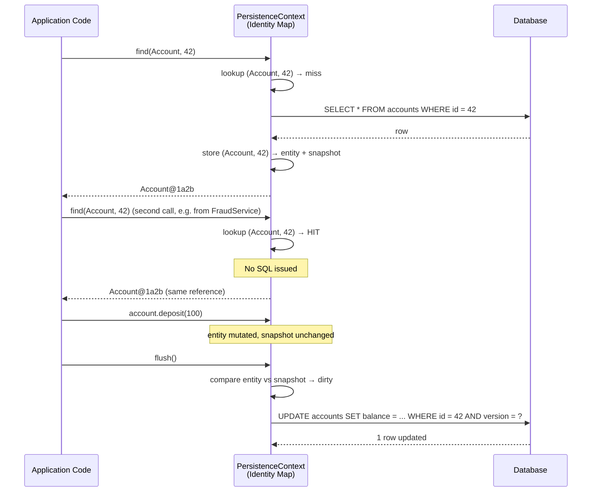

# Identity Map — One Row, One Object, Per Session

> The Identity Map is the ORM's answer to the first dimension of the impedance mismatch ([[00-ORM-Impedance-Mismatch]]): within a single session, loading the same database row twice returns the *same object reference*, not two equal-but-different copies. It is the pattern that makes object identity and primary key coincide — but only inside one session. Cross the session boundary and the guarantee evaporates.

## What you already know

From [[05-Identity-State-Lifecycle]]: object identity (`==`), logical identity (`iban`), and surrogate identity (`id`) are three different things. The conflict between them is the seed of the entire ORM problem.

From [[00-ORM-Impedance-Mismatch]]: mismatch #1 — two `Account` objects with the same `id` can be different objects in memory; two rows with the same primary key are the same row.

From [[04-Abstraction-and-Models]]: abstractions leak. The Identity Map is an abstraction over "the same row in the database"; it leaks when you leave the session.

## Why this layer exists

Without an Identity Map, the following code is a bug waiting to happen:

```java
Account a = em.find(Account.class, 42L);
Account b = em.find(Account.class, 42L);
a.deposit(100);
// What is b.getBalance()? 100? 0? undefined?
```

If `a` and `b` are two different objects, the deposit on `a` is invisible to `b`. You now have two in-memory copies of the same row, disagreeing about state. Whichever flushes last wins; the other update is lost silently. Worse, in a long business transaction you might load the same account many times (via different paths) and accumulate a small zoo of contradictory copies.

The Identity Map fixes this. Within a session, the ORM remembers every entity it has loaded, keyed by class and primary key. A second `find` returns the *same object reference*. There is one canonical `Account(42)` per session, and every part of the code that touches it agrees on its state.

## What is genuinely new here

The Identity Map is the pattern that makes **object identity equal primary key, within a session**. The mechanism is simple (a `Map<EntityKey, Object>` inside the persistence context). The consequences are not:

1. `equals()` and `hashCode()` must be written carefully — using the surrogate `id` is the standard trap.
2. Putting an entity into a `HashSet` *before* it has been persisted (and thus has no `id`) is a latent bug.
3. Across sessions, identity is lost — the same row loaded in two sessions yields two objects that are not `==`.

## Concepts

### The persistence context

Hibernate's `PersistenceContext` is the Identity Map. It is a `Map<EntityKey, Object>` where:

- The key is `(EntityName, Identifier)` — for example `("Account", 42L)`.
- The value is the entity instance itself.

When you call `em.find(Account.class, 42L)`, Hibernate does:

1. Look up `(Account, 42)` in the persistence context.
2. If found, return the cached instance — *no SQL is issued*.
3. If not found, issue `SELECT`, put the result in the map, return it.

A subsequent `em.find(Account.class, 42L)` issues **zero SQL**. This is sometimes called the "first-level cache" (a misleading name — see [[06-Hibernate-JPA]] for why it should be called the persistence context, not a cache).

### Entity key equality

The key insight: *within a session*, the following are equivalent:

```java
em.find(Account.class, 42L) == em.find(Account.class, 42L)   // true — same reference
em.find(Account.class, 42L).equals(em.find(Account.class, 42L))  // true (by any sane equals)
```

This is the *only* place in ORM-land where `==` works for entities. It works because the persistence context guarantees it. Once the session closes, that guarantee is gone.

### Cross-session behavior

```java
Account a;
Account b;
try (EntityManager em1 = emf.createEntityManager()) {
    a = em1.find(Account.class, 42L);
}
try (EntityManager em2 = emf.createEntityManager()) {
    b = em2.find(Account.class, 42L);
}
a == b            // false — different sessions, different objects
a.equals(b)       // depends entirely on how equals() is implemented
```

Two sessions, two persistence contexts, two objects. They represent the same row, but they are not the same object. Equality must be defined by *logical identity* — see [[05-Identity-State-Lifecycle]] for the recommended `equals/hashCode` pattern.

### Snapshot for dirty checking

The persistence context stores *two* references per entity: the entity itself, and a *snapshot* of its state taken at load time. At flush, Hibernate compares the two; if they differ, it issues an `UPDATE`. This is **dirty checking** — the mechanism behind the Unit of Work ([[04-Unit-of-Work]]).

### The detached state

When the session closes, the entity becomes *detached*. Its fields still hold the loaded values, but Hibernate no longer tracks changes. You can pass it across the network, mutate it, and later call `em.merge(detached)` to copy its state back into a new persistence context. `merge` does *not* reattach the original — it returns a new managed instance with the copied state. This is a frequent source of confusion.

## Banking application

In the Banking system ([[00-Banking-Case-Study]]), the transfer flow is the canonical case where the Identity Map matters:

```java
@Transactional
public void transfer(Long fromId, Long toId, Money amount) {
    Account from = em.find(Account.class, fromId);   // loads Account(fromId)
    Account to   = em.find(Account.class, toId);     // loads Account(toId)

    // Suppose from == to (transfer to self — should be rejected)
    if (from == to) {
        throw new IllegalArgumentException("cannot transfer to self");
    }

    // Suppose the fraud service loads the same accounts to inspect them
    fraudService.check(from, to);  // internally calls em.find(Account.class, fromId)

    from.debit(amount);
    to.credit(amount);
    em.persist(new LedgerEntry(from, amount.negate()));
    em.persist(new LedgerEntry(to,   amount));
}
```

Without the Identity Map:

- The fraud service, calling `em.find` inside the same transaction, would get a *different* `Account` object. It would inspect a stale copy. Worse, if it modified the account, the modification would not be visible to the transfer code.
- The `from == to` check would be wrong: two `find` calls for the same id would return two different objects, so the self-transfer check would silently fail.

With the Identity Map, both calls return the same reference. The fraud service sees the current state. The self-transfer check works. The two `debit`/`credit` calls operate on the canonical in-memory copy, which Hibernate will flush as one `UPDATE` per changed account.

## Code — the equals/hashCode trap

The classic mistake: use the surrogate `id` in `hashCode`.

```java
@Entity
public class Account {
    @Id @GeneratedValue
    private Long id;

    @Override
    public boolean equals(Object o) {
        if (this == o) return true;
        if (!(o instanceof Account a)) return false;
        return id != null && id.equals(a.id);
    }

    @Override
    public int hashCode() {
        return id == null ? 0 : id.hashCode();   // BUG
    }
}
```

The bug: when you create a new `Account` (id is null), put it in a `HashSet`, and then call `em.persist(account)`, Hibernate assigns an id. The `hashCode` changes. The `HashSet` can no longer find the account — it is in the wrong bucket.

```java
Set<Account> set = new HashSet<>();
Account a = new Account(iban);
set.add(a);
em.persist(a);            // assigns id=1, hashCode changes
set.contains(a);          // FALSE — bucket mismatch
```

The fix: use a *stable* field for `hashCode`. The logical identity (`iban`) is the natural choice — see [[05-Identity-State-Lifecycle]].

```java
@Override
public boolean equals(Object o) {
    if (this == o) return true;
    if (!(o instanceof Account a)) return false;
    if (iban == null || a.iban == null) return this == o;   // unpersisted → object identity
    return iban.equals(a.iban);
}

@Override
public int hashCode() {
    return iban == null ? System.identityHashCode(this) : iban.hashCode();
}
```

## SQL — what the Identity Map *avoids*

Without the Identity Map (e.g., raw JDBC), every "load this account" call hits the database:

```sql
-- called 3 times for the same account in one transfer flow
SELECT id, iban, balance, status, version FROM accounts WHERE id = 42;
SELECT id, iban, balance, status, version FROM accounts WHERE id = 42;
SELECT id, iban, balance, status, version FROM accounts WHERE id = 42;
```

With the Identity Map, only the first call issues SQL. The persistence context absorbs the rest. The bank's database does not see three identical queries — it sees one. See [[06-Query-Processing-Pipeline]] for what that one query goes through.

## Mermaid — the persistence context at work



## What can go wrong

1. **The detached entity trap.** You load an `Account` in one session, close the session, mutate the account, and expect the change to persist. It does not — the entity is detached. Either keep the session open through the mutation, or call `em.merge()`.

2. **`merge` returns a new instance.** `Account managed = em.merge(detached);` — `managed` is the new managed instance, not `detached`. Using `detached` after merge is a subtle bug.

3. **The `hashCode`-with-id trap.** As above. New entities in `HashSet`/`HashMap` get lost when persisted.

4. **Long sessions.** A session that lives for an entire web request accumulates every entity it touches. Memory grows. Worse, the snapshot for dirty checking stays in memory too. The Open Session In View pattern (see [[02-Lazy-Eager-Loading]]) is the canonical offender.

5. **`em.clear()` discards everything.** All entities become detached, the snapshot is lost. Use this when you want to free memory mid-transaction — but be careful: any subsequent `find` reloads from the database, *and* pending changes are lost.

6. **Cross-session caching by accident.** You put an entity into a static field "for caching." Now two sessions share an entity, but only one of them manages it. Mutations from the other session are lost. Use the second-level cache (see [[06-Hibernate-JPA]]) instead.

7. **Equality confusion in tests.** A test loads `Account(42)` in a setup session and an assertion session. The two objects are not `==`; if `equals` is broken, the assertion fails for the wrong reason.

## Trade-offs

| Choice | Cost | Benefit |
|---|---|---|
| Identity Map per session | Identity lost across sessions | Consistency within a session, no duplicate SQL |
| `equals` by logical identity | Mutable identity breaks `HashSet` if changed mid-set | Stable across sessions |
| `equals` by surrogate id | Unpersisted entities break `HashSet` | Simple, matches the database |
| `em.merge(detached)` vs re-`find` | Extra copy step | Avoids an extra SQL round-trip |
| Long session vs short session | Memory pressure vs re-attach cost | Open Session In View vs explicit service-layer sessions |

The Identity Map is a *correctness* mechanism first, a performance mechanism second. The performance gain (avoiding duplicate SQL) is welcome; the correctness gain (consistent in-memory state) is the reason it exists.

## Forward links

- [[00-ORM-Impedance-Mismatch]] — the dimension #1 mismatch the Identity Map addresses.
- [[05-Identity-State-Lifecycle]] — the three flavors of identity; the `equals/hashCode` pattern in full.
- [[04-Unit-of-Work]] — the persistence context is also the Unit of Work; the snapshot enables dirty checking.
- [[02-Lazy-Eager-Loading]] — the persistence context stores proxies; the Identity Map resolves them.
- [[06-Hibernate-JPA]] — practical pitfalls, including the "first-level cache" naming confusion.
- [[04-Enterprise-Patterns]] — Identity Map as a named enterprise pattern (Fowler).
- [[00-Banking-Case-Study]] — the transfer flow that depends on the Identity Map.
- [[08-Trade-offs-Everywhere]] — the equality trade-off is a special case.
- [[09-Banking-Transaction-Walkthrough]] — how identity interacts with isolation levels.
