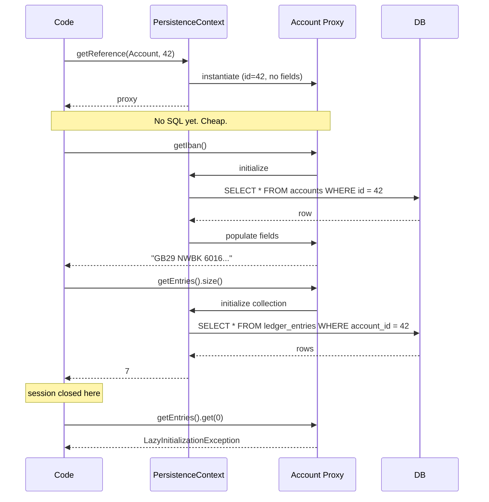

# Lazy and Eager Loading — The Proxy, the Fetch, and the Leaks

> An `Account` has potentially thousands of `LedgerEntry` rows. If Hibernate loaded them every time you loaded an account, the bank's database would melt. Lazy loading is the ORM's answer: load the entries only when (and if) the developer actually touches them. The mechanism is a runtime-generated proxy. The cost is a family of failure modes — most famously the `LazyInitializationException` and the N+1 problem ([[03-N-plus-1-Problem]]).

## What you already know

From [[00-ORM-Impedance-Mismatch]]: an `Account` object holds a `List<LedgerEntry>` (object reference, O(1) traversal), but the relational model holds `ledger_entries.account_id` (foreign key, traversal by `JOIN`). The ORM must translate one into the other.

From [[04-Abstraction-and-Models]]: every abstraction leaks. Lazy loading is an abstraction over "the entries are already loaded"; it leaks when you step outside a session.

From [[05-Identity-State-Lifecycle]]: object state lives in memory; persistent state lives in the database. Lazy loading is the seam between them.

## Why this layer exists

Without lazy loading, the ORM faces an impossible choice:

- **Load everything** — every `Account` pulls in its entries, each entry pulls in its transfer, each transfer pulls in its two accounts, each account pulls in its entries... The object graph explodes. Loading one account loads the entire database.
- **Load nothing but scalar fields** — the developer must manually call `em.find(LedgerEntry.class, ...)` for every association. The ORM is no longer an ORM.

Lazy loading is the third path: associations are loaded *on demand*. The first access to `account.getEntries()` triggers a SQL query; subsequent accesses return the cached list. If `getEntries()` is never called, no SQL is issued.

The benefit is twofold:

1. **Memory**: a list of 1,000 accounts does not pull in 1,000 × (their entries) = potentially millions of rows.
2. **Latency**: a balance check (`account.getBalance()`) does not pay the cost of loading 10 years of ledger history.

## What is genuinely new here

Two mechanisms and two failure modes:

1. **The proxy** — Hibernate generates a subclass of the entity at runtime (or uses a `List` wrapper for collections) that intercepts method calls and triggers a SQL query on first access.
2. **The fetch strategy** — `FetchType.LAZY` (default for `@OneToMany` and `@ManyToMany`) vs `FetchType.EAGER` (default for `@ManyToOne` and `@OneToOne`).
3. **The `LazyInitializationException`** — the proxy tries to load after the session has closed, and throws.
4. **The N+1 problem** — lazy loading inside a loop issues one query per parent; the symptom is a slow page; the diagnosis is many identical queries in the log.

## Concepts

### The proxy mechanism

When you call `em.find(Account.class, 42L)`, Hibernate *could* load the account and all its lazy associations. Instead, it does something cleverer: it returns a *proxy* — an instance of a Hibernate-generated subclass of `Account` that holds only the primary key. The proxy's fields are uninitialized.

```java
Account account = em.find(Account.class, 42L);
// account is actually an instance of Account_$$_javassist_3 (or similar)
// All fields except id are uninitialized.

account.getIban();           // triggers SQL: SELECT iban, balance, ... FROM accounts WHERE id = 42
account.getEntries().size(); // triggers SQL: SELECT * FROM ledger_entries WHERE account_id = 42
```

Wait — `em.find` returns a *fully initialized* entity (it issues the `SELECT` immediately). The proxy comes into play with `em.getReference()`:

```java
Account ref = em.getReference(Account.class, 42L);
// ref is a proxy. No SQL issued yet.
ref.getIban();   // NOW SQL is issued.
```

For *associations*, the mechanism is different. `@OneToMany` lazy loading uses a *collection wrapper* — Hibernate's `PersistentBag` (or `PersistentSet`/`PersistentList`) replaces your `ArrayList`/`HashSet`/`LinkedList`. The wrapper is empty until `size()`, `iterator()`, or any access method is called.

```java
account.getEntries().size();   // PersistentBag.size() → triggers SELECT
account.getEntries().isEmpty(); // same — wrapper triggers
```

### Fetch type defaults

| Annotation | Default fetch | Why |
|---|---|---|
| `@ManyToOne` | EAGER | The "many" side has one parent; loading it is one extra join, cheap. |
| `@OneToOne` | EAGER | Same — one extra row, often one join. |
| `@OneToMany` | LAZY | The "one" side may have many children; loading all is expensive. |
| `@ManyToMany` | LAZY | Same — potentially huge. |

These defaults are not random. They encode the cost asymmetry of cardinality: loading one parent of one child is cheap; loading all children of one parent is potentially unbounded.

### `JOIN FETCH` — explicit eager loading

The default fetch type is overridable per-query with `JOIN FETCH`:

```java
@Query("""
    SELECT a FROM Account a
    LEFT JOIN FETCH a.entries
    WHERE a.id = :id
    """)
Account findByIdWithEntries(@Param("id") Long id);
```

This issues a single SQL `LEFT JOIN` between `accounts` and `ledger_entries`, populating both the account and its entries in one round trip. This is the standard fix for the N+1 problem ([[03-N-plus-1-Problem]]).

### `@EntityGraph` — declarative eager loading

When a query has many optional eager paths, `JOIN FETCH` chains become unwieldy. JPA 2.1 introduced `@EntityGraph`:

```java
@EntityGraph(attributePaths = {"entries", "customer"})
@Query("SELECT a FROM Account a WHERE a.status = :status")
List<Account> findActiveWithEntries(@Param("status") AccountStatus status);
```

The entity graph tells Hibernate which associations to fetch eagerly, *without* putting the join in the JPQL string. Useful for reusing the same JPQL with different fetch profiles.

### `@BatchSize` — chunked lazy loading

When you load 100 accounts and then iterate `account.getEntries()`, naive lazy loading issues 100 SQL queries — one per account. `@BatchSize(size = 25)` tells Hibernate: when you must lazy-load the entries, load them for 25 accounts at once via `WHERE account_id IN (?, ?, ..., ?)`. The 100 queries collapse to 4.

```java
@OneToMany(mappedBy = "account")
@BatchSize(size = 25)
private List<LedgerEntry> entries = new ArrayList<>();
```

`@BatchSize` does not eliminate the N+1 problem; it amortizes it. The architectural fix is `JOIN FETCH` or DTO projection.

### The Open Session In View anti-pattern

Spring Boot's default `spring.jpa.open-in-view: true` keeps the Hibernate session open for the entire HTTP request. The motivation is to let the view (Thymeleaf template, JSON serializer) lazy-load associations without throwing `LazyInitializationException`.

The cost:

1. **Hidden SQL in the view layer.** A template that touches `account.getEntries()` triggers SQL *during rendering*. The DB call is invisible in the controller.
2. **Long transactions.** The session holds database resources for the entire request. Connection pool exhaustion under load.
3. **Wrong errors at wrong times.** A `LazyInitializationException` becomes a 500 in the middle of JSON serialization instead of a clean error in the service layer.

The cure: disable OSIV (`spring.jpa.open-in-view: false`), load eagerly what you need in the service layer (`JOIN FETCH` or DTO), and pass only fully-loaded data to the view. The error surfaces earlier, where you can handle it.

## Banking application

In the Banking case study ([[00-Banking-Case-Study]]), `Account.ledgerEntries` is the canonical lazy-loaded association. Different use cases need different fetch strategies:

```java
@Entity
public class Account {
    @Id @GeneratedValue
    private Long id;

    @OneToMany(mappedBy = "account", cascade = CascadeType.PERSIST)
    @OrderBy("occurredAt ASC")
    @BatchSize(size = 50)
    private List<LedgerEntry> entries = new ArrayList<>();   // LAZY by default

    // ...
}
```

| Use case | Fetch strategy | Why |
|---|---|---|
| Balance check (`GET /accounts/{id}/balance`) | Lazy (never touch `entries`) | Only `balance` column is needed; loading entries is wasted work. |
| Statement generation (`GET /accounts/{id}/statement`) | `JOIN FETCH` entries | All entries are needed; one SQL is better than N+1. |
| Bulk reporting (`SELECT a FROM Account a WHERE a.status = ACTIVE`) | `@BatchSize(50)` or DTO projection | 100 accounts × 100 entries each = 10,000 rows; `JOIN FETCH` would be a Cartesian explosion; batch is the right amortization. |
| Fraud check inside transfer | Lazy entries; only last 10 fetched via `@Query` | Full history is overkill; the query for "last 10 entries" is precise. |

The statement flow:

```java
@Service
public class StatementService {

    @Transactional(readOnly = true)
    public Statement buildStatement(Long accountId, YearMonth period) {
        Account account = accountRepository.findByIdWithEntriesForPeriod(accountId, period);
        //                              ^^^ JOIN FETCH in the repository
        return new Statement(account, account.getEntries());
        //                           ^^^ no SQL here — already loaded
    }
}

interface AccountRepository extends JpaRepository<Account, Long> {

    @Query("""
        SELECT DISTINCT a FROM Account a
        LEFT JOIN FETCH a.entries e
        WHERE a.id = :id AND (e.occurredAt IS NULL
                              OR (EXTRACT(YEAR  FROM e.occurredAt) = :year
                              AND EXTRACT(MONTH FROM e.occurredAt) = :month))
        """)
    Account findByIdWithEntriesForPeriod(@Param("id") Long id,
                                         @Param("year") int year,
                                         @Param("month") int month);
}
```

The `JOIN FETCH` ensures one round trip. The `DISTINCT` de-duplicates the parent rows (Hibernate would otherwise return the account N times, once per entry). See [[03-N-plus-1-Problem]] for the full diagnosis.

## Code — the three fetch strategies side by side

```java
// (1) Lazy default — no entries loaded
Account a1 = em.find(Account.class, 42L);
em.detach(a1);
a1.getEntries().size();
// → LazyInitializationException: could not initialize proxy - no Session

// (2) JOIN FETCH — entries loaded in one query
Account a2 = em.createQuery(
        "SELECT a FROM Account a LEFT JOIN FETCH a.entries WHERE a.id = :id", Account.class)
        .setParameter("id", 42L)
        .getSingleResult();
em.detach(a2);
a2.getEntries().size();   // works — already loaded

// (3) @EntityGraph — declarative fetch
EntityGraph<Account> graph = em.createEntityGraph(Account.class);
graph.addAttributeNodes("entries");
Map<String, Object> hints = Map.of("javax.persistence.fetchgraph", graph);
Account a3 = em.find(Account.class, 42L, hints);
```

## SQL — what Hibernate actually issues

```sql
-- (1) Lazy default:
SELECT id, iban, balance, status, version
  FROM accounts WHERE id = 42;
-- (entries NOT loaded; only on first access:)
SELECT id, account_id, amount, occurred_at
  FROM ledger_entries WHERE account_id = 42 ORDER BY occurred_at;

-- (2) JOIN FETCH:
SELECT a.id, a.iban, a.balance, a.status, a.version,
       e.id, e.account_id, e.amount, e.occurred_at
  FROM accounts a
  LEFT OUTER JOIN ledger_entries e ON e.account_id = a.id
  WHERE a.id = 42
  ORDER BY e.occurred_at;
```

The second query is one round trip; the first is two (or N+1 if done in a loop — see [[03-N-plus-1-Problem]]). The cost difference is enormous when N is large.

## Mermaid — the proxy lifecycle



## What can go wrong

1. **`LazyInitializationException`.** The most common ORM error. Symptom: "could not initialize proxy - no Session." Cause: the entity (or a lazy association) was touched after the session closed. Fixes: keep the session open through the use case, use `JOIN FETCH`, or use a DTO projection.

2. **N+1 queries.** Symptom: page that should take 50 ms takes 5,000 ms. Cause: a loop over a list of entities, each one lazy-loading an association. See [[03-N-plus-1-Problem]] for the full diagnosis and fix.

3. **The "where did this SQL come from?" bug.** OSIV means SQL can be issued from the template layer. A frontend developer adds `{{ account.entries }}` to a Thymeleaf template and the DB load triples. No service-layer code changed.

4. **`@ManyToOne` eager default backfires.** A `LedgerEntry` has `@ManyToOne Account` (eager by default). Loading 1,000 entries issues 1,000 joins — or worse, 1,000 secondary selects if Hibernate decides not to join. Mark the unwanted ones `LAZY` explicitly.

5. **`@OneToOne` lazy doesn't always work.** Because the owning side of a `@OneToOne` is *optional* (the column may be NULL), Hibernate cannot always build a proxy without knowing whether the row exists. The fix is bytecode enhancement (`hibernate-enhance-maven-plugin`) or `@LazyToOne(LazyToOneOption.NO_PROXY)`.

6. **Cartesian explosion with `JOIN FETCH` on multiple collections.** `JOIN FETCH a.entries JOIN FETCH a.transfers` on an account with 100 entries and 50 transfers returns 5,000 rows (the Cartesian product). Hibernate de-duplicates in memory, but the SQL is still huge. Use `@BatchSize` or multiple queries instead.

7. **Proxies break `instanceof`.** `if (account instanceof SavingsAccount)` fails when `account` is a proxy of the `Account` superclass. Hibernate's `Hibernate.unproxy(account)` returns the real instance.

## Trade-offs

| Axis | LAZY | EAGER |
|---|---|---|
| Memory per entity | Low (only scalars loaded) | High (full graph) |
| Round trips per access | N+1 if naive, 1 with `JOIN FETCH` | Always 1 |
| Risk of `LazyInitializationException` | Yes | No |
| Risk of Cartesian explosion | No (only what you ask for) | Yes (multi-collection fetch) |
| Default for `@OneToMany` / `@ManyToMany` | Yes | No |
| Default for `@ManyToOne` / `@OneToOne` | No | Yes |
| Predictability | Low (SQL depends on access pattern) | High (SQL is fixed) |

The right answer is *almost always lazy by default, eager by query*. Lazy is the safe baseline; eager is the explicit optimization for a known use case. The exception is `@ManyToOne` to a small, stable entity (like `Currency`) where eager is fine — those rows are tiny and the join is cheap.

## Forward links

- [[03-N-plus-1-Problem]] — the most famous consequence of lazy loading in a loop.
- [[00-ORM-Impedance-Mismatch]] — the association mismatch that lazy loading addresses.
- [[04-Unit-of-Work]] — the persistence context stores proxies; flush initializes them if dirty.
- [[05-Repository-Pattern]] — the repository is where `JOIN FETCH` belongs, not the controller.
- [[06-Hibernate-JPA]] — practical configuration, bytecode enhancement, OSIV setting.
- [[07-Banking-ORM-Mapping]] — the full Banking entity model with fetch strategies.
- [[04-Enterprise-Patterns]] — Lazy Load as a named pattern (Fowler).
- [[00-Query-Optimization-Strategy]] — the SQL generated goes through the optimizer; one good join beats N+1 selects.
- [[02-Use-Cases]] — which use case needs which fetch is a use-case-level decision.
- [[08-Trade-offs-Everywhere]] — the lazy/eager axis is a textbook trade-off.
