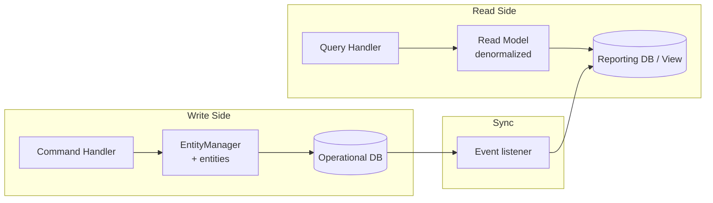
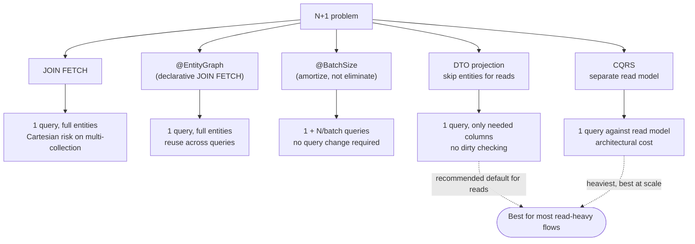

# The N+1 Problem — The ORM's Most Famous Trap

> The N+1 problem is the symptom that exposes the impedance mismatch most clearly: you write what looks like innocuous object code, the database sees a flood of identical queries, and the page takes 5,000 ms instead of 50. Every ORM developer meets N+1 within the first month of serious use. This chapter diagnoses it, lists the fixes in order of strength, and ends with the architectural cure: CQRS.

## What you already know

From [[02-Lazy-Eager-Loading]]: `@OneToMany` associations are lazy by default. The first access to `account.getEntries()` triggers a SQL query. Subsequent accesses are cached, *but* each new parent triggers its own query.

From [[00-ORM-Impedance-Mismatch]]: object references are O(1) to traverse; SQL joins are how relations are traversed. The ORM translates one into the other — and the translation can be catastrophically inefficient.

From [[05-Identity-State-Lifecycle]]: each entity has its own row; the ORM does not pre-load related rows unless told to.

## Why this layer exists

Without lazy loading, you pay an unbounded cost: loading one account loads its entries, each entry loads its transfer, the transfer loads its two accounts, and so on. Lazy loading solves that — but it introduces N+1: when you load *N* parents and then iterate, each iteration pays the lazy-load cost independently. The total is 1 query (for the parents) + N queries (one per parent's children) = N+1 queries.

The N+1 problem is the price of lazy loading. It is *not a bug* in the ORM; it is the direct consequence of the association mismatch. The ORM cannot know, in advance, that you are about to iterate. So it loads each association on demand — once per parent.

The fix is to *tell the ORM* that you will need the children, so it loads them in one query instead of N. There are several ways to tell it; the architectural way is to stop using entities for reads at all.

## What is genuinely new here

1. The **shape** of the N+1 problem (1 + N queries; the symptom is many identical `SELECT` statements in the log).
2. The **diagnosis** (enable SQL logging, count queries, look for `WHERE account_id = ?` repeated N times).
3. The **five fixes** — `JOIN FETCH`, `@EntityGraph`, `@BatchSize`, DTO projection, and CQRS — in order of strength.
4. The **architectural cure**: separate the read model from the write model so reads do not go through entities.

## Concepts

### The shape of N+1

```java
List<Account> accounts = em.createQuery(
        "SELECT a FROM Account a WHERE a.status = :status", Account.class)
        .setParameter("status", AccountStatus.ACTIVE)
        .getResultList();   // 1 query

for (Account a : accounts) {
    System.out.println(a.getIban() + " → " + a.getEntries().size());
    //                                ^^^ N queries, one per account
}
```

If there are 100 active accounts, the database sees:

```sql
-- 1 query for the parents
SELECT id, iban, balance, status, version FROM accounts WHERE status = 'ACTIVE';

-- 100 queries for the children
SELECT id, account_id, amount, occurred_at FROM ledger_entries WHERE account_id = 1;
SELECT id, account_id, amount, occurred_at FROM ledger_entries WHERE account_id = 2;
SELECT id, account_id, amount, occurred_at FROM ledger_entries WHERE account_id = 3;
-- ... 97 more
```

Total: 101 queries. Each is fast individually; the round-trip cost dominates. Network latency × 101 = unusable page load time.

### The diagnosis

Three tools to find N+1:

1. **SQL logging.** Set `spring.jpa.show-sql=true` (dev only — see [[06-Hibernate-JPA]] for why not in prod) or, better, use a connection pool with query logging (HikariCP + `DatasourceProxy`). Count the queries. If the count grows linearly with the result set size, you have N+1.

2. **Hibernate statistics.** `hibernate.generate_statistics=true` plus `SessionFactory.getStatistics()` exposes the query count, the fetch count, and the second-level cache hit rate. A page that issues 100 `load` events for `LedgerEntry` is the smoking gun.

3. **APM tools.** Datadog, New Relic, AppDynamics — they trace SQL spans and surface N+1 patterns automatically. Useful in production where you cannot enable `show-sql`.

### The five fixes

#### Fix 1 — `JOIN FETCH` (most direct)

Add `JOIN FETCH` to the query:

```java
@Query("""
    SELECT DISTINCT a FROM Account a
    LEFT JOIN FETCH a.entries
    WHERE a.status = :status
    """)
List<Account> findActiveWithEntries(@Param("status") AccountStatus status);
```

One SQL with a `LEFT OUTER JOIN`. The `DISTINCT` is needed because the join produces N rows per account (one per entry); Hibernate de-duplicates the parent entities in memory.

When it works: a single association, fetched for a known use case.
When it fails: multiple collections on the same parent (Cartesian explosion), or huge result sets (you load all entries when you wanted only the latest 10).

#### Fix 2 — `@EntityGraph` (declarative)

When you have several use cases that need different fetch profiles on the same entity, `JOIN FETCH` chains become unwieldy. JPA 2.1's `@EntityGraph` lets you declare the fetch plan separately:

```java
public interface AccountRepository extends JpaRepository<Account, Long> {

    @EntityGraph(attributePaths = "entries")
    @Query("SELECT a FROM Account a WHERE a.status = :status")
    List<Account> findActiveWithEntries(@Param("status") AccountStatus status);

    @EntityGraph(attributePaths = {"entries", "customer"})
    @Query("SELECT a FROM Account a WHERE a.status = :status")
    List<Account> findActiveWithEntriesAndCustomer(@Param("status") AccountStatus status);
}
```

Same JPQL, different fetch plan. Useful for reuse. Under the hood, Hibernate generates the same SQL as `JOIN FETCH`.

#### Fix 3 — `@BatchSize` (amortization)

`@BatchSize(size = 25)` does not eliminate N+1 — it amortizes it. When Hibernate lazy-loads entries for one account, it loads them for the next 24 accounts too, via `WHERE account_id IN (?, ?, ..., ?)`. The 101 queries collapse to 1 + ceil(100/25) = 5.

```java
@OneToMany(mappedBy = "account")
@BatchSize(size = 25)
private List<LedgerEntry> entries = new ArrayList<>();
```

When it works: you cannot easily change the query (e.g., the entity is loaded by a framework you do not control), but you can annotate the entity.
When it fails: when N is small (batching overhead) or when the entries per parent are huge (loading 25 × 1000 rows instead of 1 × 1000).

#### Fix 4 — DTO projection (skip the entity)

The strongest fix that does not require an architectural change: stop loading entities for reads. Load only the columns you need, projected into a DTO.

```java
public interface AccountSummary {
    Long getId();
    String getIban();
    BigDecimal getBalance();
    long getEntryCount();
}

@Query("""
    SELECT a.id AS id, a.iban AS iban, a.balance AS balance,
           COUNT(e) AS entryCount
    FROM Account a
    LEFT JOIN a.entries e
    WHERE a.status = :status
    GROUP BY a.id, a.iban, a.balance
    """)
List<AccountSummary> findActiveSummaries(@Param("status") AccountStatus status);
```

One query, one round trip, only the columns you need. No entities in memory, no dirty checking, no Identity Map overhead. This is the right choice for reporting, dashboards, list views — anywhere the data is read and shown, not mutated.

#### Fix 5 — CQRS (architectural cure)

The deepest fix: separate the read model from the write model entirely. Writes go through entities and the Unit of Work ([[04-Unit-of-Work]]); reads go through a denormalized read model — a view, a materialized view, a separate database, a search index — that is optimized for queries.



The write side is the ORM. The read side is whatever is fastest: a SQL view, a materialized view, a separate analytics database, an Elasticsearch index. The two are kept in sync by events emitted on write (the outbox pattern) or by ETL.

When CQRS is the right answer: the read load is much heavier than the write load; the read shape is very different from the write shape; you need different scaling for reads and writes.
When CQRS is overkill: simple CRUD where the entity *is* the read model.

See [[04-Enterprise-Patterns]] for CQRS as a named pattern, and [[02-Denormalization-For-Reads]] for the read-model side.

## Banking application — N+1 in the statement flow

The Banking system ([[00-Banking-Case-Study]]) has a clear N+1 trap: the monthly statement generation flow.

### Naive (N+1)

```java
@Service
public class StatementService {

    @Transactional(readOnly = true)
    public List<Statement> generateMonthlyStatements(YearMonth period) {
        List<Account> accounts = accountRepository.findByStatus(AccountStatus.ACTIVE);
        // 1 query — loads 100 accounts

        return accounts.stream().map(a -> {
            List<LedgerEntry> entries = a.getEntries().stream()
                .filter(e -> YearMonth.from(e.getOccurredAt()).equals(period))
                .toList();
            // ^^^ a.getEntries() triggers SELECT for EACH account
            return new Statement(a, entries);
        }).toList();
    }
}
```

100 accounts → 101 queries. Each statement load is fast; the round-trip cost dominates.

### Fix 1 — `JOIN FETCH`

```java
@Query("""
    SELECT DISTINCT a FROM Account a
    LEFT JOIN FETCH a.entries e
    WHERE a.status = :status
    """)
List<Account> findActiveWithEntries(@Param("status") AccountStatus status);
```

One query, a `LEFT JOIN`. The downside: all entries are loaded — including those outside the requested period. We filter in memory.

### Fix 2 — DTO projection (better for this use case)

```java
public interface StatementRow {
    Long getAccountId();
    String getIban();
    BigDecimal getEntryAmount();
    Instant getEntryOccurredAt();
}

@Query("""
    SELECT a.id AS accountId, a.iban AS iban,
           e.amount AS entryAmount, e.occurredAt AS entryOccurredAt
    FROM Account a
    LEFT JOIN a.entries e
    WHERE a.status = :status
      AND (e.occurredAt IS NULL
           OR (EXTRACT(YEAR FROM e.occurredAt) = :year
           AND  EXTRACT(MONTH FROM e.occurredAt) = :month))
    """)
List<StatementRow> findStatementRows(@Param("status") AccountStatus status,
                                     @Param("year") int year,
                                     @Param("month") int month);
```

One query, only the rows in the period. The application groups the flat result by `accountId` in memory. No entities, no Identity Map, no dirty checking. The fastest option.

### Fix 3 — CQRS (architectural)

For a heavy reporting workload (e.g., the bank generates millions of statements monthly), the right answer is a dedicated read model:

```sql
CREATE MATERIALIZED VIEW monthly_statements AS
SELECT a.id AS account_id,
       a.iban,
       DATE_TRUNC('month', e.occurred_at) AS period,
       SUM(e.amount) AS net_movement,
       COUNT(*) AS entry_count
FROM accounts a
LEFT JOIN ledger_entries e ON e.account_id = a.id
GROUP BY a.id, a.iban, DATE_TRUNC('month', e.occurred_at);

CREATE UNIQUE INDEX ON monthly_statements (account_id, period);
```

Refresh nightly. The statement service reads from the view; the write side keeps the entities and the operational tables. See [[07-Views-Materialized-Views]] and [[02-Denormalization-For-Reads]].

## Code — full naive vs fixed example

```java
// === NAIVE (N+1) ===
@Transactional(readOnly = true)
public List<Statement> naive() {
    List<Account> accounts = em.createQuery(
            "SELECT a FROM Account a WHERE a.status = 'ACTIVE'", Account.class)
            .getResultList();
    return accounts.stream()
            .map(a -> new Statement(a, a.getEntries()))   // N queries here
            .toList();
}

// === FIXED with JOIN FETCH ===
@Transactional(readOnly = true)
public List<Statement> fixedWithFetch() {
    List<Account> accounts = em.createQuery(
            "SELECT DISTINCT a FROM Account a " +
            "LEFT JOIN FETCH a.entries " +
            "WHERE a.status = 'ACTIVE'", Account.class)
            .getResultList();
    return accounts.stream()
            .map(a -> new Statement(a, a.getEntries()))   // no SQL — already loaded
            .toList();
}

// === FIXED with DTO projection ===
@Transactional(readOnly = true)
public List<Statement> fixedWithDto() {
    List<StatementRow> rows = em.createQuery(
            "SELECT new com.bank.dto.StatementRow(" +
            "  a.id, a.iban, e.amount, e.occurredAt) " +
            "FROM Account a LEFT JOIN a.entries e " +
            "WHERE a.status = 'ACTIVE'", StatementRow.class)
            .getResultList();
    return groupByAccount(rows);
}
```

## SQL — what the database actually sees

```sql
-- Naive: 1 + N queries
SELECT id, iban, balance, status, version FROM accounts WHERE status = 'ACTIVE';
SELECT id, account_id, amount, occurred_at FROM ledger_entries WHERE account_id = 1;
SELECT id, account_id, amount, occurred_at FROM ledger_entries WHERE account_id = 2;
-- ... 98 more

-- JOIN FETCH: 1 query
SELECT a.id, a.iban, a.balance, a.status, a.version,
       e.id, e.account_id, e.amount, e.occurred_at
FROM accounts a
LEFT OUTER JOIN ledger_entries e ON e.account_id = a.id
WHERE a.status = 'ACTIVE';

-- @BatchSize(25): 1 + ceil(N/25) queries
SELECT id, account_id, amount, occurred_at FROM ledger_entries
WHERE account_id IN (1,2,3,...,25);
SELECT id, account_id, amount, occurred_at FROM ledger_entries
WHERE account_id IN (26,27,...,50);
-- ... 3 more batches

-- DTO projection: 1 query, only needed columns
SELECT a.id, a.iban, e.amount, e.occurred_at
FROM accounts a
LEFT JOIN ledger_entries e ON e.account_id = a.id
WHERE a.status = 'ACTIVE';
```

## Mermaid — the five fixes ranked



## What can go wrong

1. **Forgetting `DISTINCT` after `JOIN FETCH`.** Without `DISTINCT`, Hibernate returns the parent once per child. A 100-account list with 10 entries each returns 1,000 rows — all 1,000 are `Account` instances, but 999 are duplicates of the 100. The Identity Map de-duplicates, but the wire traffic is huge.

2. **`JOIN FETCH` on multiple collections.** Two `LEFT JOIN FETCH` clauses on two collections on the same parent produce a Cartesian product. Use `@BatchSize` on the second, or split into two queries.

3. **`@BatchSize` too small.** `@BatchSize(size = 4)` with 100 parents → 25 queries. The default Hibernate batch size (no annotation) is 1 — i.e., no batching. Set it explicitly.

4. **DTO projection with constructor expressions.** `SELECT new com.bank.dto.X(...)` requires a matching constructor and the fully-qualified class name in JPQL. It works but is verbose; interface-based projections are cleaner.

5. **CQRS without an outbox.** If writes go to the operational DB and the read model is updated by a separate event handler, you need the outbox pattern — otherwise a crash between the write and the event publication leaves the read model stale. See [[04-Domain-Events]] and [[00-WAL-Logging]] for the mechanics.

6. **Treating CQRS as a default.** CQRS doubles the moving parts (two schemas, two paths, sync mechanism). Use it when the read load justifies it, not because "it's the modern way."

## Trade-offs

| Fix | Strength | Cost |
|---|---|---|
| `JOIN FETCH` | Strong (1 query) | Cartesian risk; full entities in memory |
| `@EntityGraph` | Strong (1 query, reusable) | Same as above, plus graph maintenance |
| `@BatchSize` | Medium (amortizes) | Still N/batch queries; only helps when you cannot change the query |
| DTO projection | Strong (1 query, no entities) | Verbose; lose entity behavior |
| CQRS | Strongest (separate model) | Architectural complexity; eventual consistency |

The right choice depends on the read pattern:

- **One use case, one association needed** → `JOIN FETCH`.
- **Many use cases, different fetch profiles** → `@EntityGraph`.
- **Cannot change the query (framework owns it)** → `@BatchSize`.
- **Read-heavy, no mutation needed** → DTO projection.
- **Read load dwarfs write load; different read shape** → CQRS.

## Forward links

- [[02-Lazy-Eager-Loading]] — lazy loading is what creates N+1; the fix is per-use-case eager.
- [[00-ORM-Impedance-Mismatch]] — N+1 is the symptom of the association mismatch.
- [[04-Enterprise-Patterns]] — CQRS as a named pattern.
- [[02-Denormalization-For-Reads]] — the read side of CQRS.
- [[07-Views-Materialized-Views]] — views and materialized views as read models.
- [[00-Query-Optimization-Strategy]] — what the database does with the one good query.
- [[06-Query-Processing-Pipeline]] — the SQL Hibernate generates runs through here.
- [[05-Repository-Pattern]] — the repository is where `JOIN FETCH` and DTOs belong.
- [[05-Architecture-Trade-offs]] — CQRS is an architecture-level trade-off.
- [[00-Banking-Case-Study]] — the statement flow that exhibits N+1.
