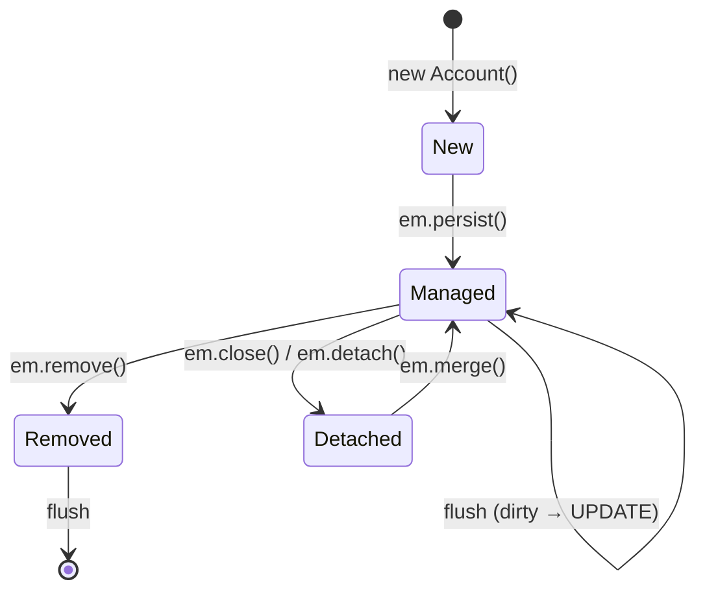

# Unit of Work — The Session Is the Transaction

> The Unit of Work pattern (Martin Fowler, *Patterns of Enterprise Application Architecture*) is the ORM's answer to mismatch #5 from [[00-ORM-Impedance-Mismatch]]: the object model has no concept of "transaction boundary," but the database does. The Unit of Work maintains a list of objects affected by a business transaction and coordinates the writing out of changes as a single atomic commit. Hibernate's `EntityManager` *is* a Unit of Work. The developer thinks in objects; the ORM figures out the SQL.

## What you already know

From [[00-ORM-Impedance-Mismatch]]: a database transaction is a sequence of SQL statements bracketed by `BEGIN` and `COMMIT`; an object model has no concept of "transaction." The Unit of Work is the bridge.

From [[01-Identity-Map]]: the persistence context stores loaded entities and their snapshots. The snapshot is the seed of dirty checking — and dirty checking is what makes the Unit of Work automatic.

From [[06-Transactions-In-SQL]] and [[00-ACID]]: a transaction is atomic, consistent, isolated, durable. The Unit of Work is the application-layer envelope that makes the A, C, and (with isolation) I real for objects.

## Why this layer exists

Without a Unit of Work, persisting a business operation looks like this:

```java
public void transfer(Long fromId, Long toId, BigDecimal amount) {
    Account from = jdbc.queryForObject("SELECT * FROM accounts WHERE id = ?", ...);
    Account to   = jdbc.queryForObject("SELECT * FROM accounts WHERE id = ?", ...);

    from.setBalance(from.getBalance().subtract(amount));
    to.setBalance(to.getBalance().add(amount));

    jdbc.update("UPDATE accounts SET balance = ? WHERE id = ?", from.getBalance(), from.getId());
    jdbc.update("UPDATE accounts SET balance = ? WHERE id = ?", to.getBalance(),   to.getId());
    jdbc.update("INSERT INTO ledger_entries (account_id, amount, occurred_at) VALUES (?, ?, ?)",
                from.getId(), amount.negate(), Instant.now());
    jdbc.update("INSERT INTO ledger_entries (account_id, amount, occurred_at) VALUES (?, ?, ?)",
                to.getId(),   amount,         Instant.now());
}
```

You write the SQL yourself. You decide the order. You decide what to insert, what to update, what to delete. You decide when to commit. The object model is just a place to hold values between queries; the persistence logic is duplicated for every operation.

The Unit of Work inverts this. You write:

```java
@Transactional
public void transfer(Long fromId, Long toId, Money amount) {
    Account from = em.find(Account.class, fromId);
    Account to   = em.find(Account.class, toId);

    from.debit(amount);
    to.credit(amount);

    em.persist(new LedgerEntry(from, amount.negate()));
    em.persist(new LedgerEntry(to,   amount));
    // No UPDATE, no INSERT for the accounts — the UoW figures it out.
}
```

The UoW tracks: `from` and `to` are managed, their state changed, two new `LedgerEntry` instances were registered. At commit, it issues the right SQL in the right order. The developer thinks in objects and domain operations; the UoW translates that to a transactional SQL batch.

## What is genuinely new here

1. The **Unit of Work** is the persistence context *as a write coordinator* (the Identity Map chapter [[01-Identity-Map]] treated it as a read coordinator).
2. **Dirty checking** — Hibernate snapshots each entity on load and compares on flush; the diff becomes the SQL.
3. The **flush-then-commit** two-step: `flush()` writes the SQL; `commit()` ends the transaction. They are different operations with different failure modes.
4. The **cost**: hidden writes, surprising flushes, performance unpredictability. The UoW is convenient; it is also opaque.

## Concepts

### The four states of an entity

| State | What it means | What happens on flush |
|---|---|---|
| **New / transient** | Created with `new`, not yet associated with a session | Nothing (unless `persist()` was called) |
| **Managed / persistent** | Loaded by the session, or `persist()` was called | SQL `INSERT` (if new) or `UPDATE` (if dirty) |
| **Detached** | Was managed, session closed | Nothing — changes are not tracked |
| **Removed** | `remove()` was called | SQL `DELETE` |

The state machine:



### The operations

| Method | What it does | UoW effect |
|---|---|---|
| `em.persist(entity)` | Registers a new entity | Schedules `INSERT` |
| `em.merge(entity)` | Copies a detached entity's state into a managed instance | Schedules `INSERT` or `UPDATE` on the managed copy |
| `em.remove(entity)` | Marks a managed entity for deletion | Schedules `DELETE` |
| `em.find(Class, id)` | Loads an entity, puts it in the UoW | Adds to Identity Map, takes snapshot |
| `em.flush()` | Writes all pending changes to the DB | Issues SQL; transaction is still open |
| `em.getTransaction().commit()` | Ends the transaction | Triggers a final flush, then `COMMIT` |
| `em.clear()` | Detaches everything | Discards snapshots; pending changes lost |
| `em.refresh(entity)` | Reloads from DB | Overwrites in-memory state |

### Dirty checking

When Hibernate loads an entity, it stores *two* things in the persistence context:

1. The entity instance itself (managed, mutable by the developer).
2. A snapshot of the entity's state at load time.

At flush, Hibernate walks every managed entity, compares its current state to the snapshot, and issues an `UPDATE` only for the ones that differ. The cost is O(managed entities) per flush — usually fine, but for a session that accumulates 10,000 entities, it is significant.

Hibernate 5+ optimizes dirty checking for entities annotated with `@DynamicUpdate` (only changed columns are written) and with bytecode enhancement (the entity reports its own dirty fields, no snapshot walk needed). Without these, every dirty entity gets a full-row `UPDATE`.

### Flush modes

| Mode | When flush happens |
|---|---|
| `AUTO` (default) | Before any query that might be affected by pending changes, and at commit |
| `COMMIT` | Only at commit |
| `MANUAL` | Only when you call `em.flush()` explicitly |

`AUTO` is safe but can issue surprising flushes — a `SELECT` mid-transaction triggers a flush if there are dirty entities. `COMMIT` is faster but risks stale reads if your query depends on unflushed changes. `MANUAL` gives full control but the developer is responsible for ordering.

### The flush-then-commit two-step

```java
em.getTransaction().begin();
try {
    account.deposit(100);
    em.persist(new LedgerEntry(account, 100));
    em.flush();   // SQL issued here: UPDATE accounts, INSERT ledger_entries
    // If the next line throws, the SQL is already committed to the DB transaction's
    // working set — but the COMMIT has not happened. A rollback will undo everything.
    riskyExternalCall();
    em.getTransaction().commit();   // COMMIT
} catch (Exception e) {
    em.getTransaction().rollback();
    throw e;
}
```

The distinction matters:

- `flush()` sends SQL to the database, but the database transaction is still open. A subsequent rollback undoes everything.
- `commit()` ends the transaction. After this, the changes are durable.

A common mistake: assuming `flush()` is the same as `commit()`. It is not. If your code throws between flush and commit, the rollback discards the flushed SQL. If your code calls an external service between flush and commit, the external service sees the change (if it queries the same database with a separate transaction, depending on isolation), but the change is not durable until commit.

### The ordering of SQL

The UoW does not necessarily issue SQL in the order you wrote it. Hibernate uses a fixed order:

1. All `INSERT`s for entities (in dependency order — parents before children).
2. All `UPDATE`s for entities.
3. All `DELETE`s for collections (if a collection was cleared).
4. All `INSERT`s and `UPDATE`s for collections.
5. All `DELETE`s for entities (children before parents).

This ordering avoids constraint violations: parent rows are inserted before child rows that reference them; child rows are deleted before parent rows. The developer does not need to think about this — until something goes wrong, at which point the SQL order in the log is the only clue.

## Banking application — the transfer flow as a Unit of Work

The transfer flow from [[00-Banking-Case-Study]] is the canonical UoW use case:

```java
@Service
public class TransferService {

    @PersistenceContext
    private EntityManager em;

    @Transactional
    public Transfer transfer(Long fromId, Long toId, Money amount, String idempotencyKey) {
        // 1. Idempotency check
        Transfer existing = em.createQuery(
                "SELECT t FROM Transfer t WHERE t.idempotencyKey = :k", Transfer.class)
                .setParameter("k", idempotencyKey)
                .getResultStream().findFirst().orElse(null);
        if (existing != null) return existing;

        // 2. Load accounts (managed — snapshots taken)
        Account from = em.find(Account.class, fromId);
        Account to   = em.find(Account.class, toId);

        // 3. Domain operations (mutate managed entities)
        from.debit(amount);
        to.credit(amount);

        // 4. Register new entities
        LedgerEntry debitEntry  = new LedgerEntry(from, amount.negate());
        LedgerEntry creditEntry = new LedgerEntry(to,   amount);
        em.persist(debitEntry);
        em.persist(creditEntry);

        // 5. Register the transfer itself
        Transfer transfer = new Transfer(from, to, amount, idempotencyKey);
        em.persist(transfer);

        // 6. (Optional) trigger flush before any external call
        em.flush();

        // 7. Method returns; @Transactional commits → final flush → COMMIT
        return transfer;
    }
}
```

The UoW issues, at commit:

```sql
INSERT INTO transfers (id, from_id, to_id, amount, idempotency_key, status, created_at)
VALUES (DEFAULT, 42, 17, 100.00, 'abc-123', 'COMPLETED', NOW());
INSERT INTO ledger_entries (id, account_id, amount, occurred_at)
VALUES (DEFAULT, 42, -100.00, NOW());
INSERT INTO ledger_entries (id, account_id, amount, occurred_at)
VALUES (DEFAULT, 17,  100.00, NOW());
UPDATE accounts SET balance = balance - 100.00, version = version + 1 WHERE id = 42 AND version = 5;
UPDATE accounts SET balance = balance + 100.00, version = version + 1 WHERE id = 17 AND version = 3;
```

Order: inserts first (parent `transfers`, then child `ledger_entries`), then updates to `accounts`. The `version` check on `accounts` is the optimistic lock — see [[07-Banking-ORM-Mapping]].

If anything throws between the method entry and the commit, the transaction rolls back. No partial state. The double-entry invariant holds. This is the ACID guarantee, expressed at the object layer.

## Code — the four states in action

```java
// New / transient
Account a = new Account("GB29...", Money.of(100, "GBP"));   // not in UoW

// Managed / persistent
em.persist(a);   // now managed; scheduled for INSERT at flush

// Detached
em.detach(a);    // snapshot discarded; further changes ignored
a.deposit(50);   // no SQL will be issued for this

// Re-managed via merge
Account managed = em.merge(a);   // merges state; schedules UPDATE
// Note: 'a' is still detached; 'managed' is the managed instance

// Removed
em.remove(managed);   // schedules DELETE at flush
```

## Mermaid — the flush pipeline

```mermaid
sequenceDiagram
    participant Code
    participant UoW as Unit of Work<br/>(persistence context)
    participant DB as Database

    Code->>UoW: find(Account, 42)
    UoW->>DB: SELECT (if not in Identity Map)
    DB-->>UoW: row
    UoW->>UoW: store entity + snapshot

    Code->>UoW: account.deposit(100)
    Note over UoW: entity mutated; snapshot unchanged

    Code->>UoW: persist(new LedgerEntry)
    UoW->>UoW: schedule INSERT

    Code->>UoW: flush()
    UoW->>UoW: dirty check: account differs from snapshot
    UoW->>DB: UPDATE accounts SET balance = ... WHERE id = 42 AND version = 5
    UoW->>DB: INSERT INTO ledger_entries ...
    DB-->>UoW: 1 row affected (each)
    Note over UoW: transaction still open; not yet committed

    Code->>UoW: commit()
    UoW->>DB: COMMIT
    DB-->>UoW: ok
    Note over UoW: persistence context cleared (or kept, depending on tx strategy)
```

## What can go wrong

1. **Hidden writes.** You call `account.setBalance(...)` in a service method. The `@Transactional` boundary triggers a flush. A `UPDATE` runs — you never wrote `em.update(account)`. The convenience is also a surprise: the SQL is invisible at the call site.

2. **Surprising flush before queries.** With `FlushModeType.AUTO`, a `SELECT` mid-transaction triggers a flush if there are dirty entities. The SQL order in the log is `UPDATE` then `SELECT`, even though the code reads "SELECT then mutate."

3. **`merge` is not `update`.** `em.merge(detached)` returns a *new managed instance*. The original `detached` is still detached. Code that mutates `detached` after `merge` loses changes.

4. **`persist` on an already-managed entity.** No-op (or, in some cases, an exception). `persist` is for *new* entities. For *existing* entities, the UoW handles persistence automatically — you just mutate and let dirty checking do its job.

5. **Long transactions.** A UoW that lives for an entire batch job accumulates millions of managed entities, each with a snapshot. Memory pressure, slow dirty checking, lock contention. The fix: process in batches, `em.flush()` and `em.clear()` between batches.

6. **`OptimisticLockException` at commit.** The `@Version` check fails — another transaction committed first. The whole UoW rolls back. The application must retry — see [[00-ACID]] and [[07-Banking-ORM-Mapping]].

7. **Calling external services inside the transaction.** An HTTP call inside `@Transactional` holds the DB connection (and the row locks) for the duration of the call. If the service is slow, the connection pool exhausts. Move external calls outside the transaction; use an outbox for side effects ([[04-Domain-Events]]).

8. **Self-invocation breaks `@Transactional`.** A Spring `@Transactional` method called from *another method in the same class* does not get the proxy — the transaction is silently skipped. This is a Spring-specific gotcha, but it bites everyone once.

## Trade-offs

| Axis | UoW (managed by ORM) | Manual SQL |
|---|---|---|
| Developer productivity | High — write objects, not SQL | Low — every operation is hand-written |
| SQL visibility | Low — generated, hidden | High — explicit |
| Performance predictability | Low — flushes surprise you | High — you control the order |
| Correctness under concurrency | High (with `@Version`) | Depends on the developer |
| Transactional correctness | High (atomic by construction) | Easy to forget a step |
| Testability | High (in-memory H2) | Medium (needs DB or heavy mocking) |

The UoW is the right default for *write* operations: a small number of entities, a business transaction, a clear commit boundary. It is the wrong default for *read* operations: report queries, list views, aggregations — there, DTO projection is better (see [[03-N-plus-1-Problem]]).

## Forward links

- [[01-Identity-Map]] — the persistence context *as a read coordinator* (this chapter treated it as write).
- [[00-ORM-Impedance-Mismatch]] — mismatch #5: transactions.
- [[05-Repository-Pattern]] — the repository wraps the UoW with a collection-like interface.
- [[06-Hibernate-JPA]] — practical `@Transactional` configuration, propagation, isolation.
- [[07-Banking-ORM-Mapping]] — `@Version` for optimistic locking, the transfer flow in full.
- [[04-Enterprise-Patterns]] — Unit of Work as a named pattern (Fowler).
- [[00-ACID]] — what the UoW's commit actually guarantees.
- [[02-Isolation-Levels]] and [[04-MVCC]] — what concurrent UoWs see.
- [[09-Banking-Transaction-Walkthrough]] — the full transaction walkthrough of the transfer flow.
- [[00-Query-Optimization-Strategy]] — the SQL the UoW generates runs through the optimizer.
