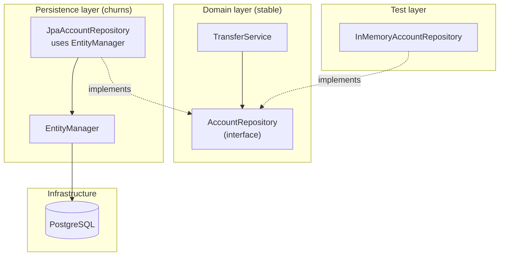

# Repository Pattern — The Domain's Interface to Persistence

> The Repository pattern (DDD, Fowler) mediates between the domain layer and the data mapping layer using a collection-like interface. The domain says "give me the account with this IBAN"; the repository knows whether that means a SQL `SELECT`, a cache hit, or a remote service call. The benefit is *dependency inversion*: the domain depends on an abstraction, not on Hibernate. The trap is leaky repositories that expose query DSLs through their method names — at which point the "abstraction" is just Hibernate wearing a hat.

## What you already know

From [[03-Dependency-As-Root-Concept]]: dependencies should point toward stability. The domain model is stable (it changes when the business changes); the persistence layer churns (schema migrations, ORM upgrades, query tuning). So the persistence layer should depend on the domain, not the other way around.

From [[05-DIP]]: the way to invert a dependency is to introduce an abstraction that both sides depend on. The Repository interface is that abstraction.

From [[04-Abstraction-and-Models]]: an abstraction is selective forgetting for a purpose. The Repository forgets the *persistence mechanism* (Hibernate? JDBC? a file? a remote service?) and preserves the *collection-like interface* the domain needs.

From [[04-Unit-of-Work]]: Hibernate's `EntityManager` is already a UoW. Why add another layer on top?

## Why this layer exists

Without a Repository, the domain service talks directly to the `EntityManager`:

```java
@Service
public class TransferService {

    @PersistenceContext
    private EntityManager em;   // direct dependency on Hibernate/JPA

    public void transfer(String fromIban, String toIban, Money amount) {
        Account from = em.createQuery(
                "SELECT a FROM Account a WHERE a.iban = :iban", Account.class)
                .setParameter("iban", fromIban)
                .getSingleResult();
        // ...
    }
}
```

Three problems:

1. **The domain depends on Hibernate.** A change of ORM (or even an ORM upgrade that changes JPQL syntax) ripples through the domain code. The domain is no longer stable.
2. **The domain is untestable in isolation.** Unit-testing `TransferService` requires either a real database (slow, brittle) or mocking `EntityManager` (mocking the ORM is famously painful — you end up mocking the query DSL).
3. **The query is in the service.** The JPQL string "SELECT a FROM Account a WHERE a.iban = :iban" is a persistence concern leaking into the domain. The service should say "find by IBAN"; the persistence layer should know how.

The Repository fixes all three:

```java
public interface AccountRepository {
    Account findByIban(String iban);
    Optional<Account> findById(Long id);
    void save(Account account);
}

@Service
public class TransferService {

    private final AccountRepository accounts;

    public TransferService(AccountRepository accounts) {
        this.accounts = accounts;   // depends on the abstraction
    }

    public void transfer(String fromIban, String toIban, Money amount) {
        Account from = accounts.findByIban(fromIban);   // domain language
        // ...
    }
}
```

The domain depends on `AccountRepository` (an interface it owns). The implementation `JpaAccountRepository` depends on the same interface (DIP). The Hibernate dependency is pushed to the edge; the domain is pure Java.

## What is genuinely new here

1. The Repository is a **collection-like interface** — `find`, `add`, `remove` — owned by the domain.
2. The Repository is the **seam** for testing (in-memory fakes) and for swapping persistence strategies.
3. Spring Data JPA's `JpaRepository` is a **partial** implementation of the pattern — it generates the implementation from an interface, but it leaks query DSL through method names.
4. The **anti-pattern**: repositories with method names like `findByNameAndStatusAndCreatedAtBetween` — that is not a collection interface; that is a SQL query wearing camelCase.
5. The **cure**: use Specifications, or move to CQRS, or just write the query in JPQL and name the method by intent (`findActiveAccountsOpenedIn(period)`).

## Concepts

### The collection metaphor

A Repository looks like an in-memory collection of aggregates:

```java
public interface AccountRepository {
    Account findByIban(String iban);                    // lookup by key
    Optional<Account> findById(Long id);
    List<Account> findByStatus(AccountStatus status);   // filter
    void save(Account account);                          // add or update
    void delete(Account account);                        // remove
}
```

The interface says nothing about SQL, Hibernate, tables, or columns. It says "I hold accounts; you can look them up, add them, remove them." The implementation can be:

- `JpaAccountRepository` — Hibernate-backed.
- `InMemoryAccountRepository` — a `HashMap<String, Account>` for tests.
- `RestAccountRepository` — calls a remote service.
- `CachingAccountRepository` — wraps another repository with a cache.

The domain service does not know and does not care. This is the dependency inversion in action — see [[05-DIP]].

### The aggregate boundary

A Repository serves one *aggregate root* (DDD — see [[02-Aggregates]]). An aggregate is a cluster of entities treated as a single consistency boundary. For Banking:

- `Account` is an aggregate root. Its repository loads/saves accounts.
- `LedgerEntry` is *not* an aggregate root — it is part of the `Account` aggregate. You do not have a `LedgerEntryRepository`; you load and save entries through the `Account`.

This rule prevents partial saves that violate invariants. If you could save a `LedgerEntry` without its `Account`, the balance invariant (`balance == SUM(entries.amount)`) could be violated. The aggregate boundary makes that impossible by construction.

### Spring Data JPA's `JpaRepository`

Spring Data JPA generates the implementation from an interface:

```java
public interface AccountRepository extends JpaRepository<Account, Long> {

    Optional<Account> findByIban(String iban);

    List<Account> findByStatusAndCreatedAtBetween(AccountStatus status,
                                                  Instant from,
                                                  Instant to);
}
```

Spring inspects the method name and synthesizes a JPA query. `findByIban` becomes `SELECT a FROM Account a WHERE a.iban = ?1`. This is enormously convenient — and the trap.

### The leaky method-name anti-pattern

`findByStatusAndCreatedAtBetween` is a SQL query in camelCase. It exposes:

- The field name (`status`, `createdAt`) — a persistence concern.
- The SQL operator (`Between`) — a query DSL.
- The cardinality (`List` vs `Optional`) — encoded in the return type.

The domain caller has to know which fields exist, which operators are available, and how to combine them. The "abstraction" has not hidden anything; it has just renamed Hibernate's query DSL. This is the leaky abstraction that [[04-Abstraction-and-Models]] warns about.

### The cure — name methods by intent

```java
public interface AccountRepository extends JpaRepository<Account, Long> {

    // Good — domain intent, not field-level query
    Optional<Account> findByIban(String iban);
    List<Account> findActiveAccountsOpenedDuring(Period period);
    List<Account> findFrozenAccounts();

    // Bad — query DSL leak
    // List<Account> findByStatusAndCreatedAtBetween(AccountStatus, Instant, Instant);
}
```

The good method names express *business intent* in domain language. The implementation (JPQL, criteria API, specification) lives behind the interface. A future change to the schema (renaming `createdAt` to `openedAt`) does not break the domain — only the repository implementation.

### Specifications — composable query fragments

When the domain genuinely needs flexible querying (e.g., a search screen with many optional filters), method-name queries break down — you cannot enumerate every combination. The Specification pattern (from DDD) provides composable predicates:

```java
public interface AccountRepository extends JpaRepository<Account, Long>, JpaSpecificationExecutor<Account> {

    // The defaultfindAll(Specification) is inherited — no method needed.
}

public class AccountSpecs {

    public static Specification<Account> hasStatus(AccountStatus status) {
        return (root, query, cb) -> cb.equal(root.get("status"), status);
    }

    public static Specification<Account> openedDuring(Period period) {
        return (root, query, cb) -> cb.between(
                root.get("createdAt"), period.start(), period.end());
    }

    public static Specification<Account> withMinBalance(Money min) {
        return (root, query, cb) -> cb.ge(root.get("balance").get("amount"), min.amount());
    }
}

// Usage:
List<Account> results = accountRepository.findAll(
        where(hasStatus(ACTIVE)).and(openedDuring(lastQuarter)).and(withMinBalance(Money.of(1000, "GBP"))));
```

The specifications are composable; the domain builds the query from domain-meaningful pieces. The persistence detail (`cb.equal`, `cb.between`) stays inside the spec classes.

### Or just use CQRS

If the read patterns are very flexible and very different from the write patterns, the Repository pattern is the wrong tool for the read side. Use CQRS ([[04-Enterprise-Patterns]], [[03-N-plus-1-Problem]]): repositories for writes; DTO projections and query services for reads. The domain owns the write model; the application layer owns the read model.

## Banking application

The Banking case study ([[00-Banking-Case-Study]]) has natural aggregate roots: `Account`, `Customer`, `Transfer`. Each gets a repository. `LedgerEntry` does not — it is part of the `Account` aggregate.

```java
// Domain-owned interface
public interface AccountRepository {
    Account findById(Long id);                         // for transfer flow
    Account findByIban(String iban);                   // for customer-facing APIs
    Account findByIdWithEntries(Long id);              // for statement flow
    List<Account> findActiveAccounts();                // for batch interest accrual
    void save(Account account);
}

// JPA implementation
@Repository
class JpaAccountRepository implements AccountRepository {

    @PersistenceContext
    private EntityManager em;

    @Override
    public Account findById(Long id) {
        return em.find(Account.class, id);
    }

    @Override
    public Account findByIban(String iban) {
        return em.createQuery("SELECT a FROM Account a WHERE a.iban = :iban", Account.class)
                .setParameter("iban", iban)
                .getSingleResult();
    }

    @Override
    public Account findByIdWithEntries(Long id) {
        return em.createQuery(
                "SELECT DISTINCT a FROM Account a LEFT JOIN FETCH a.entries WHERE a.id = :id",
                Account.class)
                .setParameter("id", id)
                .getSingleResult();
    }

    @Override
    public List<Account> findActiveAccounts() {
        return em.createQuery("SELECT a FROM Account a WHERE a.status = :status", Account.class)
                .setParameter("status", AccountStatus.ACTIVE)
                .getResultList();
    }

    @Override
    public void save(Account account) {
        if (account.getId() == null) em.persist(account);
        else em.merge(account);
    }
}

// In-memory fake for tests
class InMemoryAccountRepository implements AccountRepository {
    private final Map<Long, Account> store = new ConcurrentHashMap<>();
    private final Map<String, Account> byIban = new ConcurrentHashMap<>();
    private long nextId = 1;

    @Override public Account findById(Long id) { return store.get(id); }
    @Override public Account findByIban(String iban) { return byIban.get(iban); }
    // ...
    @Override public void save(Account account) {
        if (account.getId() == null) account.assignId(nextId++);
        store.put(account.getId(), account);
        byIban.put(account.getIban(), account);
    }
}
```

The transfer service depends on the abstraction:

```java
@Service
public class TransferService {

    private final AccountRepository accounts;
    private final TransferRepository transfers;

    public TransferService(AccountRepository accounts, TransferRepository transfers) {
        this.accounts = accounts;
        this.transfers = transfers;
    }

    @Transactional
    public Transfer transfer(String fromIban, String toIban, Money amount, String idempotencyKey) {
        Account from = accounts.findByIban(fromIban);   // domain language
        Account to   = accounts.findByIban(toIban);

        from.debit(amount);
        to.credit(amount);

        Transfer transfer = new Transfer(from, to, amount, idempotencyKey);
        transfers.save(transfer);

        return transfer;
    }
}
```

Testing is now trivial:

```java
@Test
void should_transfer_between_two_accounts() {
    InMemoryAccountRepository accounts = new InMemoryAccountRepository();
    accounts.save(new Account("GB1", Money.of(100, "GBP")));
    accounts.save(new Account("GB2", Money.of( 50, "GBP")));

    TransferService service = new TransferService(accounts, new InMemoryTransferRepository());

    service.transfer("GB1", "GB2", Money.of(30, "GBP"), "k1");

    assertThat(accounts.findByIban("GB1").getBalance()).isEqualTo(Money.of(70, "GBP"));
    assertThat(accounts.findByIban("GB2").getBalance()).isEqualTo(Money.of(80, "GBP"));
}
```

No database. No Hibernate. The test runs in 5 ms. This is the value of the Repository pattern: it makes the domain testable.

## Code — the Spring Data JPA version

```java
public interface AccountRepository extends JpaRepository<Account, Long> {

    Optional<Account> findByIban(String iban);

    @Query("""
        SELECT DISTINCT a FROM Account a
        LEFT JOIN FETCH a.entries
        WHERE a.id = :id
        """)
    Optional<Account> findByIdWithEntries(@Param("id") Long id);

    List<Account> findByStatus(AccountStatus status);
}
```

Spring generates the implementation at startup. Convenient — but remember: every method name is a tiny contract; the more methods you add, the more the interface drifts toward "a list of queries" rather than "a collection of accounts." Refactor when the drift becomes visible.

## Mermaid — the dependency inversion



The arrows point toward the domain. The domain owns the interface; everything else depends on it. This is DIP in action.

## What can go wrong

1. **Repositories for non-aggregate-roots.** `LedgerEntryRepository` is a code smell. Entries are part of the `Account` aggregate; load them through `Account`. A standalone `LedgerEntryRepository` invites partial saves that violate invariants.

2. **Method-name explosion.** `findByStatusAndCreatedAtBetweenAndBalanceGreaterThanAndCurrencyEquals` — a 60-character method name that exposes the schema. Use Specifications or write the JPQL explicitly with a domain-meaningful name.

3. **`save()` that always merges.** `em.merge(account)` is expensive (it loads the managed instance, copies state, returns a new managed instance). For entities you *know* are managed, you do not need to call `save` at all — the UoW dirty-checks and writes them. `save` should be `persist` for new entities and a no-op for managed ones.

4. **Repository as a SQL gateway.** Once the repository starts exposing query builders (`withCriteria(...)`, `withFetchProfile(...)`), it has stopped being an abstraction and started being a Hibernate facade. The domain should not see query builders.

5. **Generic repositories.** `Repository<T, ID>` for every entity type. Tempting for boilerplate reduction; problematic because every aggregate has different domain-meaningful queries. Generic repositories push query construction back into the service.

6. **Repositories in the wrong layer.** A controller that calls `accountRepository.findByIban(...)` directly has skipped the service layer. The service exists to enforce invariants and orchestrate; let it.

7. **Read-model pollution.** A single `Account` entity cannot serve both the write side (full state, invariants) and the read side (lightweight, denormalized). Trying to do both produces an entity that is good at neither. Use CQRS when the read load dominates.

## Trade-offs

| Choice | Cost | Benefit |
|---|---|---|
| Repository per aggregate | More interfaces | Clear boundaries, testable domain |
| Spring Data `JpaRepository` | Magic, leaky method names | Boilerplate eliminated |
| Specifications | Indirection | Composable queries, no method-name explosion |
| In-memory fakes | Maintenance (fake must match real behavior) | Fast unit tests |
| CQRS for reads | Architectural complexity | Optimized read model, no entity overhead |
| Generic `Repository<T, ID>` | Loss of domain intent | Less code |

The right answer depends on the project's stage. Early on, Spring Data `JpaRepository` with intent-named methods is fast and good enough. As the domain matures, refactor toward explicit interfaces owned by the domain. As read load grows, split reads off to CQRS.

## Forward links

- [[03-Dependency-As-Root-Concept]] — the principle the Repository inverts.
- [[05-DIP]] — the SOLID principle formalized.
- [[04-Enterprise-Patterns]] — Repository, UoW, CQRS as named patterns.
- [[02-Aggregates]] — the aggregate boundary that defines which entities get repositories.
- [[04-Unit-of-Work]] — the UoW the Repository wraps.
- [[01-Identity-Map]] — the persistence context the Repository abstracts.
- [[03-N-plus-1-Problem]] — `JOIN FETCH` and DTO projections belong in the Repository.
- [[06-Hibernate-JPA]] — Spring Data JPA practical configuration.
- [[07-Banking-ORM-Mapping]] — the Banking repositories in full.
- [[05-Anemic-vs-Rich-Models]] — repositories do not excuse anemic domain models.
- [[00-Banking-Case-Study]] — the aggregate roots of the Banking system.
- [[02-Use-Cases]] — each use case becomes a service method that uses repositories.
