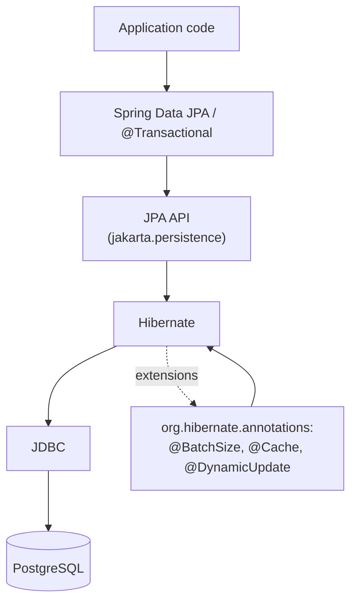

# Hibernate and JPA — Practical Annotation Reference and Pitfalls

> JPA (Jakarta Persistence API) is the standard; Hibernate is the implementation. This chapter is the practical reference: the annotations you will reach for daily, the configuration that makes them work, and the pitfalls that will bite you in your first six months. It is not exhaustive — the JPA spec runs to hundreds of pages — but it covers 90% of what a working developer needs, anchored to the Banking case study ([[00-Banking-Case-Study]]).

## What you already know

From [[00-ORM-Impedance-Mismatch]]: the seven dimensions of mismatch. JPA annotations are the levers you pull to reconcile each one.

From [[01-Identity-Map]]: the persistence context. JPA's `EntityManager` is the API for it.

From [[04-Unit-of-Work]]: the four entity states (new, managed, detached, removed). `persist`, `merge`, `remove`, `flush`, `commit` are the operations on them.

From [[02-Lazy-Eager-Loading]]: `FetchType.LAZY` and `FetchType.EAGER`, plus `JOIN FETCH`.

## Why this layer exists

The JPA spec exists so that you can write your entities once and run them on Hibernate, EclipseLink, OpenJPA, or any other compliant provider. The annotations are the contract; the implementation is pluggable. In practice, Hibernate dominates the Java ecosystem, and most developers learn "Hibernate annotations" without realizing which parts are spec and which are Hibernate-specific extensions.

This chapter draws the line where it matters. Sticking to spec annotations (`jakarta.persistence.*`) keeps your code portable. Reaching for Hibernate extensions (`org.hibernate.annotations.*`) unlocks features (batch fetching, dynamic update, fetch profiles) but ties you to Hibernate.

## What is genuinely new here

1. The **core annotations**: `@Entity`, `@Id`, `@GeneratedValue`, `@Column`, `@Table`.
2. The **association annotations**: `@OneToMany`, `@ManyToOne`, `@OneToOne`, `@ManyToMany`, `@JoinColumn`, `mappedBy`.
3. The **value-object mapping**: `@Embeddable`, `@Embedded`, `@ElementCollection`.
4. The **inheritance annotations**: `@Inheritance`, `@DiscriminatorColumn`, `@PrimaryKeyJoinColumn`.
5. The **concurrency annotation**: `@Version` for optimistic locking.
6. The **lifecycle hooks**: `@PrePersist`, `@PostPersist`, `@PreUpdate`, `@PostLoad`.
7. The **configuration**: `persistence.xml` / `application.yml`, the `EntityManager` lifecycle, `@Transactional`, the second-level cache, the statistics API.
8. The **pitfalls**: `LazyInitializationException`, the "first-level cache" naming confusion, the `equals/hashCode` trap, the OSIV controversy.

## Concepts — the annotation catalog

### Entity basics

```java
@Entity                                     // marks this class as persistent
@Table(name = "accounts")                   // table name (default: class name)
public class Account {

    @Id                                     // primary key
    @GeneratedValue(strategy = GenerationType.IDENTITY)
    @Column(name = "id")                    // column name (default: field name)
    private Long id;

    @Column(name = "iban", unique = true, nullable = false, length = 34)
    private String iban;

    @Column(name = "balance", precision = 18, scale = 2, nullable = false)
    private BigDecimal balance;

    @Enumerated(EnumType.STRING)            // store as TEXT, not ordinal
    @Column(name = "status", nullable = false)
    private AccountStatus status;

    @Version                                // optimistic locking
    private Long version;

    // getters, setters, equals, hashCode
}
```

Key choices:

- `GenerationType.IDENTITY` uses PostgreSQL's `BIGSERIAL`. Cheap, but disables JDBC batch inserts (Hibernate must `SELECT currval` after each insert).
- `GenerationType.SEQUENCE` uses a database sequence. Enables batch inserts. Default in Hibernate 6.
- `GenerationType.UUID` (Hibernate-specific) generates a UUID client-side. Useful for distributed systems.
- `@Enumerated(EnumType.STRING)` — *always* use STRING. `ORDINAL` breaks if you reorder the enum constants.
- `@Version` — every entity that can be concurrently modified should have one. See [[04-Unit-of-Work]] and [[07-Banking-ORM-Mapping]].

### Associations

```java
@Entity
public class Account {

    @Id @GeneratedValue
    private Long id;

    // Bidirectional one-to-many: Account has many LedgerEntries.
    @OneToMany(mappedBy = "account", cascade = CascadeType.PERSIST, orphanRemoval = true)
    @OrderBy("occurredAt ASC")
    private List<LedgerEntry> entries = new ArrayList<>();
}

@Entity
public class LedgerEntry {

    @Id @GeneratedValue
    private Long id;

    // The owning side: foreign key lives here.
    @ManyToOne(fetch = FetchType.LAZY)      // override the EAGER default
    @JoinColumn(name = "account_id", nullable = false)
    private Account account;

    private BigDecimal amount;
    private Instant occurredAt;
}
```

Rules of thumb:

- `mappedBy` goes on the *non-owning* side (the side without the foreign key).
- The owning side controls the foreign key. Setting `entry.setAccount(account)` issues the SQL update; `account.getEntries().add(entry)` does *not* (until flush, and only via cascade).
- `cascade = CascadeType.PERSIST` means: when you `em.persist(account)`, also persist its entries. Use sparingly — cascading `REMOVE` is dangerous (it can wipe a whole graph).
- `orphanRemoval = true` means: when an entry is removed from `account.getEntries()`, delete it from the database. Useful for parent-owned children.
- `@OrderBy` adds an `ORDER BY` clause to the generated SQL. The list is ordered in memory after loading.

### Value objects

```java
@Embeddable
public record Money(
        @Column(name = "amount", precision = 18, scale = 2, nullable = false)
        BigDecimal amount,

        @Column(name = "currency", length = 3, nullable = false)
        String currency
) {}

@Entity
public class Account {
    @Embedded
    private Money balance;
}
```

`@Embeddable` maps a value object (no identity, immutable) to columns in the owning entity's table. The `Money` becomes `balance_amount` and `balance_currency` columns on `accounts`. See [[01-Entities-Value-Objects]] for the DDD theory.

`@ElementCollection` maps a collection of value objects to a separate table:

```java
@Entity
public class Customer {
    @ElementCollection
    @CollectionTable(name = "customer_phones",
                     joinColumns = @JoinColumn(name = "customer_id"))
    private List<Phone> phones = new ArrayList<>();
}
```

Use sparingly — `@ElementCollection` does not support lazy loading well, and the collection is always fully replaced on update.

### Inheritance

```java
@Entity
@Inheritance(strategy = InheritanceType.JOINED)   // CTI
@DiscriminatorColumn(name = "account_type")
public abstract class Account { /* shared fields */ }

@Entity
@DiscriminatorValue("CHECKING")
@PrimaryKeyJoinColumn(name = "account_id")
public class CheckingAccount extends Account {
    private BigDecimal overdraftLimit;
}

@Entity
@DiscriminatorValue("SAVINGS")
@PrimaryKeyJoinColumn(name = "account_id")
public class SavingsAccount extends Account {
    private BigDecimal interestRate;
}
```

Three strategies (see [[07-Composition-vs-Inheritance]] and [[00-ORM-Impedance-Mismatch]]):

| Strategy | Tables | Polymorphic query | When to use |
|---|---|---|---|
| `SINGLE_TABLE` | 1 | Trivial (one SELECT) | Few subtype-specific fields |
| `JOINED` | 1 + N (one per subtype) | JOINs all tables | Many subtype-specific fields, NOT NULL constraints |
| `TABLE_PER_CLASS` | N (one per concrete subtype) | UNION ALL | Rarely — shared columns duplicated |

For Banking, `JOINED` is the right choice — see [[07-Banking-ORM-Mapping]].

### Lifecycle callbacks

```java
@Entity
public class Account {

    @PrePersist
    void onCreate() { this.createdAt = Instant.now(); }

    @PreUpdate
    void onUpdate() { this.updatedAt = Instant.now(); }

    @PostLoad
    void onLoad() { this.originalBalance = this.balance; }
}
```

Useful for audit timestamps and for snapshotting in-memory state. Avoid heavy logic in callbacks — they run inside Hibernate's flush pipeline and can surprise you.

## Configuration

### `application.yml` (Spring Boot)

```yaml
spring:
  jpa:
    hibernate:
      ddl-auto: validate            # never update in prod
    properties:
      hibernate:
        dialect: org.hibernate.dialect.PostgreSQLDialect
        format_sql: true
        default_batch_fetch_size: 25
        jdbc.batch_size: 30
        order_inserts: true
        order_updates: true
        generate_statistics: true   # dev/staging only
    show-sql: false                  # use a logger instead
  datasource:
    url: jdbc:postgresql://localhost:5432/banking
    hikari:
      maximum-pool-size: 20
      connection-timeout: 30000
```

Production rules:

- `ddl-auto: validate` (or `none`). Let Flyway or Liquibase manage the schema. `update` is for dev only.
- `show-sql: false`. The console output is unformatted and goes to stdout. Use `org.hibernate.SQL=DEBUG` in your logger to send it through SLF4J.
- `generate_statistics: false` in prod. The collection has overhead.
- `default_batch_fetch_size: 25` amortizes N+1 — see [[03-N-plus-1-Problem]].
- `jdbc.batch_size: 30` enables JDBC batch inserts/updates. Combined with `order_inserts: true`, Hibernate groups same-table inserts into one batch.
- `spring.jpa.open-in-view: false` — disable Open Session In View (see [[02-Lazy-Eager-Loading]]).

### `persistence.xml` (non-Spring)

```xml
<persistence xmlns="https://jakarta.ee/xml/ns/persistence" version="3.0">
    <persistence-unit name="bankingPU" transaction-type="RESOURCE_LOCAL">
        <provider>org.hibernate.jpa.HibernatePersistenceProvider</provider>
        <class>com.bank.Account</class>
        <class>com.bank.LedgerEntry</class>
        <properties>
            <property name="jakarta.persistence.jdbc.url" value="jdbc:postgresql://localhost/banking"/>
            <property name="jakarta.persistence.jdbc.user" value="bank"/>
            <property name="jakarta.persistence.jdbc.password" value="${DB_PASSWORD}"/>
            <property name="hibernate.hbm2ddl.auto" value="validate"/>
            <property name="hibernate.show_sql" value="false"/>
        </properties>
    </persistence-unit>
</persistence>
```

### The `EntityManager` lifecycle

In a non-Spring application:

```java
EntityManagerFactory emf = Persistence.createEntityManagerFactory("bankingPU");
EntityManager em = emf.createEntityManager();
em.getTransaction().begin();
try {
    // ... business logic ...
    em.getTransaction().commit();
} catch (Exception e) {
    em.getTransaction().rollback();
    throw e;
} finally {
    em.close();   // returns the connection to the pool
}
```

In Spring, `@Transactional` and `@PersistenceContext` handle this for you. The `EntityManager` is thread-safe when injected via `@PersistenceContext` (Spring gives each request its own).

### `@Transactional`

```java
@Service
public class TransferService {

    @Transactional
    public void transfer(...) { /* ... */ }

    @Transactional(readOnly = true)
    public Account getAccount(Long id) { /* ... */ }

    @Transactional(isolation = Isolation.SERIALIZABLE)
    public void transferCritical(...) { /* ... */ }

    @Transactional(propagation = Propagation.REQUIRES_NEW)
    public void auditLog(...) { /* ... */ }
}
```

- `readOnly = true` — Hibernate skips dirty checking; a small optimization. Also signals to the driver that the connection is read-only, which some databases use for routing.
- `isolation` — overrides the default isolation level. Use sparingly; most flows should use the database default.
- `propagation = REQUIRES_NEW` — suspends the outer transaction and starts a new one. Useful for audit logs that must persist even if the outer transaction rolls back. Expensive (two connections).

### The second-level cache

Hibernate has two caches:

| Cache | Scope | What it stores | Default |
|---|---|---|---|
| First-level (the persistence context) | Per session | Entities, snapshots | Always on |
| Second-level | Per `EntityManagerFactory` (cross-session) | Entities by `(class, id)` | Off |
| Query cache | Per `EntityManagerFactory` | Query results | Off (requires L2) |

The "first-level cache" is a misleading name — it is the persistence context, which is the Identity Map *and* the Unit of Work, not a cache. Calling `em.find` is *not* a cache lookup; it is the only correct way to load a managed entity within a session.

The second-level cache is a real cache. Enable it for entities that are read-heavy, change rarely, and are looked up by id frequently:

```yaml
spring:
  jpa:
    properties:
      hibernate:
        cache:
          use_second_level_cache: true
          use_query_cache: true
          region.factory_class: org.hibernate.cache.jcache.JCacheRegionFactory
```

```java
@Entity
@Cache(usage = CacheConcurrencyStrategy.READ_WRITE)
public class Currency { /* small, rarely changes, looked up constantly */ }
```

Do *not* L2-cache `Account` or `LedgerEntry`. They change too often; the cache invalidation cost exceeds the lookup savings.

### The statistics API

```java
Statistics stats = emf.getStatistics();
stats.setStatisticsEnabled(true);
// ... run a use case ...
System.out.println("Query count: " + stats.getQueryExecutionCount());
System.out.println("Entities loaded: " + stats.getEntityLoadCount());
System.out.println("L2 hits: " + stats.getSecondLevelCacheHitCount());
System.out.println("L2 misses: " + stats.getSecondLevelCacheMissCount());
```

Invaluable in dev for diagnosing N+1 ([[03-N-plus-1-Problem]]) and verifying the L2 cache is hitting.

## Banking application — putting it together

A minimal slice of the Banking entities:

```java
@Embeddable
public record Money(
        @Column(precision = 18, scale = 2, nullable = false) BigDecimal amount,
        @Column(length = 3, nullable = false) String currency
) {
    public static Money of(BigDecimal amount, String currency) {
        return new Money(amount.setScale(2, RoundingMode.HALF_EVEN), currency);
    }
}

@Entity
@Table(name = "accounts")
@Inheritance(strategy = InheritanceType.JOINED)
@DiscriminatorColumn(name = "account_type")
public abstract class Account {

    @Id @GeneratedValue(strategy = GenerationType.SEQUENCE)
    private Long id;

    @Column(unique = true, nullable = false, length = 34)
    private String iban;

    @Embedded
    private Money balance;

    @Enumerated(EnumType.STRING)
    @Column(nullable = false)
    private AccountStatus status;

    @Version
    private Long version;

    @OneToMany(mappedBy = "account", cascade = CascadeType.PERSIST, orphanRemoval = true)
    @OrderBy("occurredAt ASC")
    @BatchSize(size = 25)
    private List<LedgerEntry> entries = new ArrayList<>();

    @PrePersist
    void onCreate() { if (status == null) status = AccountStatus.PENDING; }

    // business methods: deposit, debit, credit, freeze, etc.
    public void debit(Money amount) {
        ensureCanWithdraw(amount);
        this.balance = Money.of(balance.amount().subtract(amount.amount()), balance.currency());
        this.entries.add(new LedgerEntry(this, amount.negate()));
    }

    // equals/hashCode using iban — see [[01-Identity-Map]]
}
```

See [[07-Banking-ORM-Mapping]] for the full mapping.

## Code — a Spring service using everything

```java
@Service
public class TransferService {

    @PersistenceContext
    private EntityManager em;

    @Transactional
    public Transfer transfer(Long fromId, Long toId, Money amount, String key) {
        Account from = em.find(Account.class, fromId);
        Account to   = em.find(Account.class, toId);

        if (from == null || to == null) throw new IllegalArgumentException("account not found");

        from.debit(amount);
        to.credit(amount);

        Transfer transfer = new Transfer(from, to, amount, key);
        em.persist(transfer);

        return transfer;
    }
}
```

No SQL. No JDBC. The `@Transactional` boundary triggers the flush, which issues the SQL. The `@Version` field on `Account` makes the concurrent-transfer case safe — see [[07-Banking-ORM-Mapping]] and [[00-ACID]].

## Mermaid — the JPA stack



The application should depend on `jakarta.persistence.*` where possible. Hibernate extensions are a deliberate trade: portability for power.

## What can go wrong

1. **`LazyInitializationException`.** The classic. Touched a lazy association outside the session. See [[02-Lazy-Eager-Loading]].

2. **"First-level cache" confusion.** The persistence context is *not* a cache you can configure or disable. It is the session. Calling `em.find` is not "checking the L1 cache first"; it is the canonical load operation that happens to short-circuit if the entity is already in the session.

3. **The `equals/hashCode` trap.** Using the surrogate `id` in `hashCode` breaks `HashSet` for new entities. See [[01-Identity-Map]] and [[05-Identity-State-Lifecycle]].

4. **`ddl-auto: update` in production.** Hibernate's schema update is conservative — it adds columns but does not drop or rename them. After a few migrations the production schema drifts from the entity model. Use Flyway or Liquibase.

5. **`show-sql: true` in production.** The output goes to stdout, not SLF4J, and includes parameter values. Performance overhead, potential PII leak. Use `org.hibernate.SQL=DEBUG` via SLF4J instead.

6. **OSIV left on.** `spring.jpa.open-in-view: true` (Spring Boot's default) keeps the session open for the entire HTTP request. SQL gets issued from the view layer. Turn it off.

7. **Cascading `REMOVE` on `@OneToMany`.** `em.remove(account)` then deletes every `LedgerEntry` associated — usually not what you want for an immutable ledger. Use `CascadeType.PERSIST`, not `CascadeType.ALL`.

8. **`@ManyToOne(fetch = EAGER)` (the default) on a fat parent.** Loading 1,000 ledger entries loads 1,000 accounts. Mark it `LAZY` explicitly.

9. **Forgetting `@Version`.** Concurrent writes silently overwrite each other. Every mutable entity that can be modified by two transactions should have a `@Version` field.

10. **Bidirectional association inconsistency.** `account.getEntries().add(e)` without `e.setAccount(account)`. The in-memory graph and the persisted graph disagree until flush — and the foreign key may be NULL. Add helper methods that maintain both sides:

```java
public void addEntry(LedgerEntry e) {
    this.entries.add(e);
    e.setAccount(this);
}
```

## Trade-offs

| Choice | Cost | Benefit |
|---|---|---|
| Spec-only annotations | Less power | Portability across providers |
| Hibernate extensions | Vendor lock-in | Batch fetching, dynamic update, fetch profiles |
| `IDENTITY` id generation | No batch inserts | Simple, matches `BIGSERIAL` |
| `SEQUENCE` id generation | Extra table (the sequence) | Batch inserts, allocation sizes |
| L2 cache on `Currency` | Invalidation cost (low — Currency rarely changes) | Avoids thousands of lookups |
| L2 cache on `Account` | Invalidation cost (high — every transfer changes a balance) | Not worth it |
| `@Transactional(readOnly = true)` | Slightly different semantics | Dirty-check skipped; connection marked read-only |
| OSIV on | Hidden SQL in view layer | No `LazyInitializationException` in templates |
| OSIV off | Must load eagerly in service | Explicit SQL, predictable errors |

The defaults are sensible for most projects. The trade-offs matter at the margins: high-throughput batch jobs, very large object graphs, very strict latency budgets. Reach for the Hibernate extensions only when you have measured a problem they fix.

## Forward links

- [[00-ORM-Impedance-Mismatch]] — every annotation reconciles a mismatch.
- [[01-Identity-Map]] — the persistence context behind `EntityManager`.
- [[02-Lazy-Eager-Loading]] — `FetchType`, `JOIN FETCH`, `@BatchSize`.
- [[03-N-plus-1-Problem]] — `default_batch_fetch_size`, statistics.
- [[04-Unit-of-Work]] — `@Transactional`, `persist/merge/remove/flush`.
- [[05-Repository-Pattern]] — Spring Data JPA's `JpaRepository`.
- [[07-Banking-ORM-Mapping]] — the full Banking entity model.
- [[00-Schema-Design]] and [[01-Primary-Foreign-Keys]] — what the annotations map to.
- [[02-Domain-Check-Constraints]] — what the schema enforces that JPA does not.
- [[00-ACID]] and [[02-Isolation-Levels]] — what `@Transactional(isolation = ...)` actually means.
- [[06-Query-Processing-Pipeline]] — the SQL Hibernate generates runs through here.
- [[05-Identity-State-Lifecycle]] — the equals/hashCode trap, in full.
