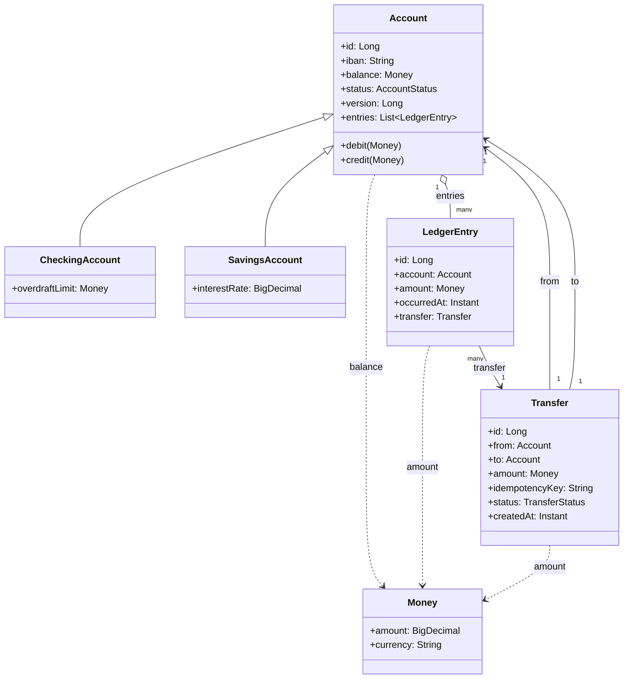

# Banking ORM Mapping — The Full End-to-End Model

> The capstone chapter of the ORM folder. Every concept from [[00-ORM-Impedance-Mismatch]] through [[06-Hibernate-JPA]] is applied to the Banking case study ([[00-Banking-Case-Study]]). By the end you will see: an `Account` hierarchy mapped with `JOINED` inheritance; a `Money` value object mapped with `@Embeddable`; a `LedgerEntry` collection mapped with `@OneToMany` and lazy loading; a `Transfer` aggregate with bidirectional `@ManyToOne` to two `Account`s; `@Version` for optimistic locking on concurrent transfers; the transfer flow implemented end-to-end; and the actual SQL Hibernate generates, annotated line by line.

## What you already know

From [[00-ORM-Impedance-Mismatch]]: the seven dimensions of mismatch — identity, inheritance, associations, collections, transactions, data types, concurrency.

From [[01-Identity-Map]]: same row → same object within a session; the `equals/hashCode` trap.

From [[02-Lazy-Eager-Loading]]: `@OneToMany` is lazy by default; `JOIN FETCH` is the per-query fix.

From [[03-N-plus-1-Problem]]: the statement flow is N+1-prone; DTO projection is the cure.

From [[04-Unit-of-Work]]: `@Transactional` is the transaction boundary; dirty checking is automatic.

From [[05-Repository-Pattern]]: the domain owns the interface; the implementation wraps `EntityManager`.

From [[06-Hibernate-JPA]]: the annotation catalog; the pitfalls.

From [[00-Banking-Case-Study]]: the ten invariants — balance, no negative savings, double-entry, immutability of ledger entries, atomic transfers, auditability, idempotency, lifecycle, concurrency.

## Why this layer exists

The previous seven chapters taught one concept at a time. Real systems do not have that luxury — every dimension of the mismatch appears simultaneously, and the design must reconcile all of them in a single coherent set of entities. This chapter is that reconciliation.

The Banking domain is the right case study because it exercises *every* mismatch:

- Identity: `Account` has both surrogate `id` and logical `iban`.
- Inheritance: `CheckingAccount` and `SavingsAccount` extend `Account`.
- Associations: `Account` ↔ `LedgerEntry` (one-to-many), `Transfer` ↔ `Account` (many-to-one, twice).
- Collections: ordered list of entries.
- Transactions: atomic transfer.
- Data types: `Money` (value object), `AccountStatus` (enum), `Instant` (timestamp).
- Concurrency: `@Version` for optimistic locking.

The mapping below is the answer to: "How do I write this in JPA without tripping any of the traps?"

## What is genuinely new here

Nothing — this is synthesis. Every annotation has been introduced in a previous chapter. What is new is *seeing them all together*, watching them cooperate to enforce the Banking invariants, and reading the SQL that Hibernate actually emits.

## Concepts — the entity model



## Code — the full entity model

### `Money` — value object

```java
package com.bank.domain;

import jakarta.persistence.*;
import java.math.BigDecimal;
import java.math.RoundingMode;
import java.util.Objects;

@Embeddable
public final class Money {
    @Column(name = "amount", precision = 18, scale = 2, nullable = false)
    private BigDecimal amount;

    @Column(name = "currency", length = 3, nullable = false)
    private String currency;

    protected Money() {}   // for JPA

    private Money(BigDecimal amount, String currency) {
        this.amount = Objects.requireNonNull(amount).setScale(2, RoundingMode.HALF_EVEN);
        this.currency = Objects.requireNonNull(currency);
    }

    public static Money of(BigDecimal amount, String currency) {
        return new Money(amount, currency);
    }

    public Money plus(Money other)    { ensureSameCurrency(other); return new Money(amount.add(other.amount), currency); }
    public Money minus(Money other)   { ensureSameCurrency(other); return new Money(amount.subtract(other.amount), currency); }
    public Money negate()             { return new Money(amount.negate(), currency); }
    public boolean isNegative()       { return amount.signum() < 0; }

    public BigDecimal amount()   { return amount; }
    public String currency()     { return currency; }

    private void ensureSameCurrency(Money other) {
        if (!currency.equals(other.currency))
            throw new IllegalArgumentException("Currency mismatch: " + currency + " vs " + other.currency);
    }

    @Override public boolean equals(Object o) {
        return o instanceof Money m && amount.equals(m.amount) && currency.equals(m.currency);
    }
    @Override public int hashCode() { return Objects.hash(amount, currency); }
    @Override public String toString() { return amount + " " + currency; }
}
```

`Money` is a *value object* — no identity, immutable, compared by value. `@Embeddable` makes it part of the owning entity's table. See [[01-Entities-Value-Objects]].

### `AccountStatus` — enum

```java
package com.bank.domain;

public enum AccountStatus {
    PENDING, ACTIVE, FROZEN, CLOSED
}
```

Stored as `TEXT` via `@Enumerated(EnumType.STRING)`. Never use `ORDINAL` — reordering the constants would silently corrupt the database.

### `Account` — aggregate root

```java
package com.bank.domain;

import jakarta.persistence.*;
import java.math.BigDecimal;
import java.time.Instant;
import java.util.*;

@Entity
@Table(name = "accounts")
@Inheritance(strategy = InheritanceType.JOINED)
@DiscriminatorColumn(name = "account_type", discriminatorType = DiscriminatorType.STRING, length = 10)
public abstract class Account {

    @Id
    @GeneratedValue(strategy = GenerationType.SEQUENCE, generator = "account_seq")
    @SequenceGenerator(name = "account_seq", sequenceName = "account_id_seq", allocationSize = 50)
    private Long id;

    @Column(name = "iban", unique = true, nullable = false, length = 34)
    private String iban;

    @Embedded
    private Money balance;

    @Enumerated(EnumType.STRING)
    @Column(name = "status", nullable = false)
    private AccountStatus status;

    @Version
    @Column(name = "version", nullable = false)
    private Long version;

    @Column(name = "created_at", nullable = false, updatable = false)
    private Instant createdAt;

    @OneToMany(mappedBy = "account", cascade = {CascadeType.PERSIST, CascadeType.MERGE}, orphanRemoval = false)
    @OrderBy("occurredAt ASC")
    @BatchSize(size = 25)
    private List<LedgerEntry> entries = new ArrayList<>();

    @PrePersist
    void onCreate() {
        if (createdAt == null) createdAt = Instant.now();
        if (status == null) status = AccountStatus.PENDING;
        if (version == null) version = 0L;
    }

    protected Account() {}

    protected Account(String iban, Money openingBalance) {
        this.iban = Objects.requireNonNull(iban);
        this.balance = Objects.requireNonNull(openingBalance);
        this.status = AccountStatus.PENDING;
    }

    // === Business operations ===

    public void deposit(Money amount) {
        ensureCanReceive(amount);
        this.balance = balance.plus(amount);
        this.entries.add(new LedgerEntry(this, amount, null));
    }

    public void debit(Money amount) {
        ensureCanWithdraw(amount);
        this.balance = balance.minus(amount);
        this.entries.add(new LedgerEntry(this, amount.negate(), null));
    }

    public void credit(Money amount) { deposit(amount); }

    public void freeze()    { ensureActive();  this.status = AccountStatus.FROZEN; }
    public void unfreeze()  { ensureFrozen();  this.status = AccountStatus.ACTIVE; }
    public void close()     { ensureActiveOrFrozen(); this.status = AccountStatus.CLOSED; }

    // === Invariants ===

    protected void ensureCanReceive(Money amount) {
        if (status == AccountStatus.CLOSED)
            throw new IllegalStateException("Account " + iban + " is closed");
        if (amount.isNegative())
            throw new IllegalArgumentException("Amount must be positive");
    }

    protected void ensureCanWithdraw(Money amount) {
        if (status != AccountStatus.ACTIVE)
            throw new IllegalStateException("Account " + iban + " cannot withdraw (status=" + status + ")");
        if (amount.isNegative())
            throw new IllegalArgumentException("Amount must be positive");
    }

    protected abstract boolean isWithinOverdraft(Money newBalance);

    private void ensureActive()         { if (status != AccountStatus.ACTIVE)  throw new IllegalStateException("Not active"); }
    private void ensureFrozen()         { if (status != AccountStatus.FROZEN)  throw new IllegalStateException("Not frozen"); }
    private void ensureActiveOrFrozen() { if (status != AccountStatus.ACTIVE && status != AccountStatus.FROZEN)
                                              throw new IllegalStateException("Not active or frozen"); }

    // === equals / hashCode using logical identity ===

    @Override
    public boolean equals(Object o) {
        if (this == o) return true;
        if (!(o instanceof Account a)) return false;
        if (iban == null || a.iban == null) return false;   // unpersisted → not equal
        return iban.equals(a.iban);
    }

    @Override
    public int hashCode() {
        return iban == null ? 0 : iban.hashCode();   // stable; see [[01-Identity-Map]]
    }

    // getters omitted
}
```

### `CheckingAccount` and `SavingsAccount` — subtypes

```java
@Entity
@Table(name = "checking_accounts")
@DiscriminatorValue("CHECKING")
@PrimaryKeyJoinColumn(name = "account_id")
public class CheckingAccount extends Account {

    @Column(name = "overdraft_limit", precision = 18, scale = 2, nullable = false)
    private BigDecimal overdraftLimit;

    protected CheckingAccount() {}

    public CheckingAccount(String iban, Money openingBalance, Money overdraftLimit) {
        super(iban, openingBalance);
        this.overdraftLimit = overdraftLimit.amount();
    }

    @Override
    protected void ensureCanWithdraw(Money amount) {
        super.ensureCanWithdraw(amount);
        Money newBalance = balance().minus(amount);
        if (!isWithinOverdraft(newBalance))
            throw new IllegalStateException("Exceeds overdraft limit");
    }

    @Override
    protected boolean isWithinOverdraft(Money newBalance) {
        return newBalance.amount().compareTo(overdraftLimit.negate()) >= 0;
    }
}

@Entity
@Table(name = "savings_accounts")
@DiscriminatorValue("SAVINGS")
@PrimaryKeyJoinColumn(name = "account_id")
public class SavingsAccount extends Account {

    @Column(name = "interest_rate", precision = 5, scale = 4, nullable = false)
    private BigDecimal interestRate;

    protected SavingsAccount() {}

    public SavingsAccount(String iban, Money openingBalance, BigDecimal interestRate) {
        super(iban, openingBalance);
        this.interestRate = interestRate;
    }

    @Override
    protected boolean isWithinOverdraft(Money newBalance) {
        return !newBalance.isNegative();   // savings accounts cannot go below zero
    }
}
```

### `LedgerEntry` — immutable child

```java
@Entity
@Table(name = "ledger_entries")
public final class LedgerEntry {

    @Id
    @GeneratedValue(strategy = GenerationType.SEQUENCE, generator = "ledger_seq")
    @SequenceGenerator(name = "ledger_seq", sequenceName = "ledger_entry_id_seq", allocationSize = 100)
    private Long id;

    @ManyToOne(fetch = FetchType.LAZY)
    @JoinColumn(name = "account_id", nullable = false)
    private Account account;

    @Embedded
    private Money amount;

    @Column(name = "occurred_at", nullable = false)
    private Instant occurredAt;

    @ManyToOne(fetch = FetchType.LAZY)
    @JoinColumn(name = "transfer_id")
    private Transfer transfer;

    @PrePersist
    void onPrePersist() { if (occurredAt == null) occurredAt = Instant.now(); }

    protected LedgerEntry() {}

    LedgerEntry(Account account, Money amount, Transfer transfer) {
        this.account = Objects.requireNonNull(account);
        this.amount = Objects.requireNonNull(amount);
        this.transfer = transfer;
    }

    // getters omitted; no setters — ledger entries are immutable
}
```

### `Transfer` — aggregate root for the transfer operation

```java
@Entity
@Table(name = "transfers", uniqueConstraints = @UniqueConstraint(columnNames = "idempotency_key"))
public class Transfer {

    @Id
    @GeneratedValue(strategy = GenerationType.SEQUENCE, generator = "transfer_seq")
    @SequenceGenerator(name = "transfer_seq", sequenceName = "transfer_id_seq", allocationSize = 50)
    private Long id;

    @ManyToOne(fetch = FetchType.LAZY, optional = false)
    @JoinColumn(name = "from_account_id", nullable = false)
    private Account from;

    @ManyToOne(fetch = FetchType.LAZY, optional = false)
    @JoinColumn(name = "to_account_id", nullable = false)
    private Account to;

    @Embedded
    private Money amount;

    @Column(name = "idempotency_key", nullable = false, length = 64)
    private String idempotencyKey;

    @Enumerated(EnumType.STRING)
    @Column(name = "status", nullable = false)
    private TransferStatus status;

    @Column(name = "created_at", nullable = false, updatable = false)
    private Instant createdAt;

    @Version
    private Long version;

    @PrePersist
    void onCreate() {
        if (createdAt == null) createdAt = Instant.now();
        if (status == null) status = TransferStatus.PENDING;
    }

    protected Transfer() {}

    public Transfer(Account from, Account to, Money amount, String idempotencyKey) {
        if (from == to) throw new IllegalArgumentException("Cannot transfer to self");
        this.from = Objects.requireNonNull(from);
        this.to = Objects.requireNonNull(to);
        this.amount = Objects.requireNonNull(amount);
        this.idempotencyKey = Objects.requireNonNull(idempotencyKey);
    }

    void markCompleted() { this.status = TransferStatus.COMPLETED; }
    void markRejected()  { this.status = TransferStatus.REJECTED; }
}
```

### The repository

```java
public interface AccountRepository {
    Optional<Account> findById(Long id);
    Optional<Account> findByIdWithEntries(Long id);
    Optional<Account> findByIban(String iban);
    List<Account> findActiveAccounts();
    void save(Account account);
}

@Repository
class JpaAccountRepository implements AccountRepository {

    @PersistenceContext
    private EntityManager em;

    @Override public Optional<Account> findById(Long id) {
        return Optional.ofNullable(em.find(Account.class, id));
    }

    @Override public Optional<Account> findByIdWithEntries(Long id) {
        try {
            return Optional.of(em.createQuery(
                    "SELECT DISTINCT a FROM Account a LEFT JOIN FETCH a.entries WHERE a.id = :id",
                    Account.class)
                    .setParameter("id", id)
                    .getSingleResult());
        } catch (NoResultException e) { return Optional.empty(); }
    }

    @Override public Optional<Account> findByIban(String iban) {
        return em.createQuery("SELECT a FROM Account a WHERE a.iban = :iban", Account.class)
                .setParameter("iban", iban)
                .getResultStream()
                .findFirst();
    }

    @Override public List<Account> findActiveAccounts() {
        return em.createQuery("SELECT a FROM Account a WHERE a.status = :status", Account.class)
                .setParameter("status", AccountStatus.ACTIVE)
                .getResultList();
    }

    @Override public void save(Account account) {
        if (account.getId() == null) em.persist(account);
        else em.merge(account);
    }
}
```

### The transfer service — end to end

```java
@Service
public class TransferService {

    private final AccountRepository accounts;
    private final TransferRepository transfers;

    public TransferService(AccountRepository accounts, TransferRepository transfers) {
        this.accounts = accounts;
        this.transfers = transfers;
    }

    @Transactional(isolation = Isolation.READ_COMMITTED)
    public Transfer transfer(String fromIban, String toIban, Money amount, String idempotencyKey) {
        // 1. Idempotency check — see [[00-ACID]] and [[09-Banking-Transaction-Walkthrough]]
        transfers.findByIdempotencyKey(idempotencyKey).ifPresent(t -> {
            return;   // (Java cannot return-from-lambda; in practice use Optional or imperative check)
        });

        // 2. Load accounts
        Account from = accounts.findByIban(fromIban)
                .orElseThrow(() -> new IllegalArgumentException("Unknown source account"));
        Account to   = accounts.findByIban(toIban)
                .orElseThrow(() -> new IllegalArgumentException("Unknown destination account"));

        // 3. Domain operations (mutate managed entities; dirty checking will issue UPDATE)
        from.debit(amount);
        to.credit(amount);

        // 4. Persist the Transfer
        Transfer transfer = new Transfer(from, to, amount, idempotencyKey);
        transfers.save(transfer);

        // 5. Flush before any external call
        // em.flush();   // optional — explicit

        // 6. Method returns; @Transactional triggers final flush + COMMIT
        transfer.markCompleted();
        return transfer;
    }
}
```

### The statement service — N+1 fixed

```java
@Service
public class StatementService {

    private final AccountRepository accounts;

    public StatementService(AccountRepository accounts) { this.accounts = accounts; }

    @Transactional(readOnly = true)
    public Statement buildStatement(Long accountId, YearMonth period) {
        Account account = accounts.findByIdWithEntries(accountId)
                .orElseThrow(() -> new IllegalArgumentException("Unknown account"));

        List<LedgerEntry> periodEntries = account.getEntries().stream()
                .filter(e -> YearMonth.from(e.getOccurredAt().atZone(ZoneOffset.UTC)).equals(period))
                .toList();

        return new Statement(account, periodEntries);
    }

    @Transactional(readOnly = true)
    public List<StatementRow> bulkStatementRows(YearMonth period) {
        // DTO projection — one query, no N+1
        return accounts.findStatementRows(period);   // see repository
    }
}
```

## SQL — what Hibernate actually generates

### Transfer flow

```sql
-- (1) Idempotency check
SELECT t.id, t.from_account_id, t.to_account_id, t.amount, t.currency,
       t.idempotency_key, t.status, t.created_at, t.version
  FROM transfers t
 WHERE t.idempotency_key = $1
 LIMIT 1;

-- (2) Load source account (only columns from accounts; subtype table not joined yet)
SELECT a.id, a.iban, a.balance_amount, a.balance_currency, a.status, a.version, a.created_at, a.account_type
  FROM accounts a
 WHERE a.iban = $1;

-- (3) Once we know it's a CheckingAccount, load the subtype row
SELECT c.account_id, c.overdraft_limit
  FROM checking_accounts c
 WHERE c.account_id = $1;

-- (4) Same for destination
SELECT a.id, a.iban, a.balance_amount, a.balance_currency, a.status, a.version, a.created_at, a.account_type
  FROM accounts a
 WHERE a.iban = $2;
SELECT s.account_id, s.interest_rate
  FROM savings_accounts s
 WHERE s.account_id = $2;

-- (5) At flush: persist the new Transfer
INSERT INTO transfers (id, from_account_id, to_account_id, amount, currency, idempotency_key, status, created_at, version)
VALUES (DEFAULT, $1, $2, $3, $4, $5, 'PENDING', $6, 0);

-- (6) Persist the two new LedgerEntry rows (cascade = PERSIST)
INSERT INTO ledger_entries (id, account_id, amount, currency, occurred_at, transfer_id)
VALUES (DEFAULT, $1, $2, $3, $4, $5);
INSERT INTO ledger_entries (id, account_id, amount, currency, occurred_at, transfer_id)
VALUES (DEFAULT, $1, $2, $3, $4, $5);

-- (7) Update the source account — note the @Version check
UPDATE accounts
   SET balance_amount = $1, version = $2
 WHERE id = $3 AND version = $4;

-- (8) Update the destination account
UPDATE accounts
   SET balance_amount = $1, version = $2
 WHERE id = $3 AND version = $4;

-- (9) Update the Transfer status to COMPLETED
UPDATE transfers SET status = 'COMPLETED', version = $1 WHERE id = $2 AND version = $3;

-- (10) COMMIT
COMMIT;
```

If another transaction commits an update to the same account between (2) and (7), the `version` check fails:

```sql
-- Expected version = 5, actual = 6 → 0 rows updated
UPDATE accounts SET balance_amount = $1, version = 6 WHERE id = $3 AND version = 5;
-- Hibernate: 0 rows affected → throws OptimisticLockException
```

The transfer rolls back. The application retries (or surfaces the conflict to the user). The balance invariant holds. See [[00-ACID]] and [[09-Banking-Transaction-Walkthrough]].

### Statement flow — naive vs fixed

```sql
-- NAIVE (N+1)
SELECT a.id, a.iban, a.balance_amount, a.balance_currency, a.status, a.version, a.created_at, a.account_type
  FROM accounts WHERE id = $1;
SELECT e.id, e.account_id, e.amount, e.currency, e.occurred_at, e.transfer_id
  FROM ledger_entries e WHERE e.account_id = $1 ORDER BY e.occurred_at;
-- (only one account here, so N+1 is just 2 queries; for 100 accounts, 101)

-- FIXED (JOIN FETCH)
SELECT a.id, a.iban, a.balance_amount, a.balance_currency, a.status, a.version, a.created_at, a.account_type,
       e.id, e.account_id, e.amount, e.currency, e.occurred_at, e.transfer_id
  FROM accounts a
  LEFT OUTER JOIN ledger_entries e ON e.account_id = a.id
 WHERE a.id = $1
 ORDER BY e.occurred_at;

-- FIXED (DTO projection for bulk)
SELECT a.id, a.iban, e.amount, e.currency, e.occurred_at
  FROM accounts a
  LEFT JOIN ledger_entries e ON e.account_id = a.id
 WHERE a.status = 'ACTIVE'
   AND EXTRACT(YEAR  FROM e.occurred_at) = $1
   AND EXTRACT(MONTH FROM e.occurred_at) = $2;
```

See [[03-N-plus-1-Problem]] for the full diagnosis and [[06-Query-Processing-Pipeline]] for what the planner does with each of these.

## Mermaid — the transfer sequence

```mermaid
sequenceDiagram
    participant C as Client
    participant TS as TransferService
    participant AR as AccountRepository
    participant EM as EntityManager
    participant DB as PostgreSQL

    C->>TS: transfer(from, to, amount, key)
    TS->>AR: findByIdempotencyKey(key)
    AR->>EM: createQuery
    EM->>DB: SELECT FROM transfers WHERE idempotency_key = ?
    DB-->>EM: empty
    EM-->>AR: Optional.empty()
    AR-->>TS: not found

    TS->>AR: findByIban(from)
    AR->>EM: find
    EM->>DB: SELECT FROM accounts WHERE iban = ?
    DB-->>EM: row (CHECKING)
    EM->>DB: SELECT FROM checking_accounts WHERE account_id = ?
    DB-->>EM: row
    EM-->>AR: CheckingAccount (managed)
    AR-->>TS: from

    TS->>AR: findByIban(to)
    AR-->>TS: to (SavingsAccount, managed)

    TS->>TS: from.debit(amount)   [mutates entity; dirty]
    TS->>TS: to.credit(amount)    [mutates entity; dirty]

    TS->>TS: new Transfer(...)
    TS->>AR: transfers.save(transfer)
    AR->>EM: persist(transfer)   [scheduled]

    Note over TS: @Transactional boundary

    TS->>EM: flush (implicit at commit)
    EM->>DB: INSERT INTO transfers ...
    EM->>DB: INSERT INTO ledger_entries ... (×2)
    EM->>DB: UPDATE accounts SET balance, version WHERE id=? AND version=?
    EM->>DB: UPDATE accounts SET balance, version WHERE id=? AND version=?

    alt Version mismatch
        DB-->>EM: 0 rows
        EM-->>TS: OptimisticLockException
        TS-->>C: retry / 409
    else OK
        EM->>DB: COMMIT
        DB-->>EM: ok
        EM-->>TS: Transfer (managed, id assigned)
        TS-->>C: Transfer (COMPLETED)
    end
```

## What can go wrong

1. **`@Version` forgotten on a mutable entity.** Concurrent transfers silently overwrite each other. The `balance` invariant breaks.

2. **`equals/hashCode` using `id`.** The persistence context survives; `HashSet` breaks for new entities. See [[01-Identity-Map]].

3. **Bidirectional inconsistency.** `from.debit(amount)` adds a `LedgerEntry` to `from.entries`, but the entry's `account` field is set in the constructor. If you add the entry to the list *and* forget to set `account` in the constructor, the foreign key is null at flush. The code above does it correctly via `new LedgerEntry(this, ...)`.

4. **STI chosen for inheritance.** `overdraft_limit` and `interest_rate` would be nullable; the schema would not enforce that every `CheckingAccount` has an overdraft limit. `JOINED` is the right choice — see [[00-ORM-Impedance-Mismatch]].

5. **OSIV left on.** The statement flow's lazy loading might accidentally work in dev (because the session is still open in the controller) and break in prod (where OSIV is off and the controller calls `account.getEntries()` after the service method returns). The fix: `JOIN FETCH` in the repository, always.

6. **`@Transactional` on the wrong layer.** If the controller is `@Transactional` and the service is not, the transaction spans the entire HTTP request (OSIV equivalent). Transactions belong on the service.

7. **`em.merge(account)` everywhere.** `merge` is expensive (Hibernate loads the managed instance, copies state, returns a new instance). For entities you *know* are managed (loaded in this session, mutated, flushed at commit), do not call `save` at all — dirty checking handles it.

8. **`orphanRemoval = true` on `entries`.** Removing an entry from the list would delete it from the database. Ledger entries are immutable — never delete. The code above correctly sets `orphanRemoval = false`.

9. **`CascadeType.REMOVE` on `entries`.** Removing an account would delete every entry. Disaster. The code uses `CascadeType.PERSIST` and `CascadeType.MERGE` only.

10. **Forgetting to flush before external calls.** If the transfer service publishes an event between `transfers.save(transfer)` and the commit, the event listener in another transaction will not see the transfer (it is not committed yet). Use the outbox pattern — see [[04-Domain-Events]].

## Trade-offs

The full Banking mapping makes these trade-offs explicit:

| Choice | What we gave up | What we got |
|---|---|---|
| `JOINED` inheritance | Extra `SELECT` per subtype on load | NOT NULL on subtype fields; clean schema |
| `@Version` optimistic locking | Retry on conflict | No blocking; scales well |
| `@SequenceGenerator` with `allocationSize = 50` | Gaps in id sequence | Batch inserts enabled |
| `Money` as `@Embeddable` (not an entity) | Cannot query Money directly without going through owner | Value semantics; no identity; immutable |
| `LedgerEntry` not aggregate-root | Cannot load entries without their account | Balance invariant enforced via Account |
| Lazy `entries` by default + `@BatchSize(25)` | N+1 risk if used wrong | Memory bounded; explicit fetch when needed |
| `orphanRemoval = false` on entries | Stale entries must be filtered, not deleted | Immutability preserved |
| DTO projection for statement reads | Extra classes; no entity behavior | One query; no dirty checking; fast |

Every line of the entity code is a trade-off. The design document for a real banking system should write these down — see [[08-Trade-offs-Everywhere]].

## Forward links

- [[00-ORM-Impedance-Mismatch]] — the seven mismatches, all reconciled above.
- [[01-Identity-Map]] — the `equals/hashCode` choice in `Account`.
- [[02-Lazy-Eager-Loading]] — the `@BatchSize` and `JOIN FETCH` choices.
- [[03-N-plus-1-Problem]] — the statement flow, naive vs fixed.
- [[04-Unit-of-Work]] — the `@Transactional` boundary and dirty checking.
- [[05-Repository-Pattern]] — the `AccountRepository` interface and its JPA implementation.
- [[06-Hibernate-JPA]] — every annotation used above.
- [[07-Composition-vs-Inheritance]] — why `JOINED` was the right choice.
- [[04-Banking-Schema]] — the SQL schema the entities map to.
- [[09-Banking-SQL]] — the SQL DML that the entities generate, end to end.
- [[00-ACID]] and [[09-Banking-Transaction-Walkthrough]] — what the `@Version` check guarantees.
- [[02-Isolation-Levels]] and [[04-MVCC]] — what two concurrent transfers see.
- [[06-Query-Processing-Pipeline]] and [[09-Banking-Query-Plans]] — what the planner does with the SQL above.
- [[00-Query-Optimization-Strategy]] and [[05-Banking-Performance-Tuning]] — how to make the queries fast.
- [[04-Domain-Events]] — the outbox pattern for the post-transfer notification.
- [[00-Banking-Case-Study]] — the invariants this mapping enforces.
- [[02-Use-Cases]] — each use case is implemented as a service method on top of these entities.
