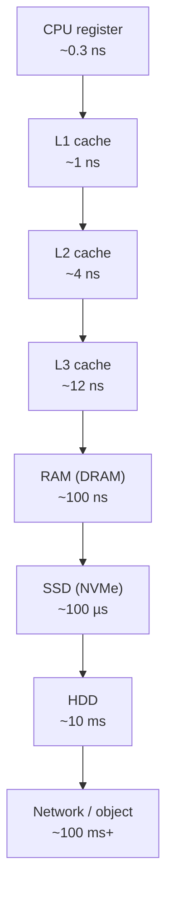

# The Storage Hierarchy

> The deepest layer of the vault: the physical reality that every SQL statement eventually becomes. This note grounds the rest of the Database Internals chapters. Every choice — page size, buffer pool, B-tree fan-out, join strategy, plan cost — is a reaction to one fact: *the gap between "in memory" and "on disk" is about 1000×*.

## What you already know

From [[08-Trade-offs-Everywhere]]: every decision is a trade-off, and the trade-offs you don't notice are the ones that hurt you. The storage hierarchy is the trade-off you inherited the moment you chose to use a database. From [[04-Abstraction-and-Models]]: a SQL `SELECT` hides how rows are stored. This chapter peers behind that abstraction.

## Why this layer exists

CPU speeds have grown by roughly six orders of magnitude over four decades. Storage latency has not. The result is a hardware reality that looks like this:

```
Level          Latency (approx)        Capacity         Cost / GB
─────────────────────────────────────────────────────────────────
CPU register   ~0.3 ns                 ~1 KB            ─
L1 cache       ~1 ns                   ~32 KB           ─
L2 cache       ~4 ns                   ~256 KB          ─
L3 cache       ~12 ns                  ~32 MB           ─
RAM (DRAM)     ~100 ns                 ~16-512 GB       $3
SSD (NVMe)     ~100 µs  (random read)  ~1-30 TB         $0.10
SSD (SATA)     ~150 µs                 ~1-8 TB          $0.10
HDD            ~10 ms   (random seek)  ~4-20 TB         $0.02
Network (LAN)  ~0.5 ms (RTT)           ─                ─
Object storage ~50-200 ms              ∞                $0.01
Tape (offline) ~minutes                ∞                $0.005
```



Each step down the hierarchy costs ~1000× more latency. The "memory wall" — the jump from RAM to SSD — is the cliff that databases are designed around. Everything else (pages, buffer pools, B-trees, WAL) is a reaction to that single cliff.

## What is genuinely new here

The **working set** concept. A database performs well only when the data it touches *fits in the cache layer above the wall*. The whole craft of database engineering is shaping access patterns so the working set stays in RAM.

## Concepts

### Random vs sequential I/O

On HDDs the gap is brutal: ~10 ms for a random seek vs ~100 MB/s sequential throughput (so a 4 KB page reads in ~40 µs once the head is in position — 250× faster). On SSDs the random/sequential gap is much smaller because there is no head to move (~100 µs random vs ~50 µs sequential for 4 KB), but it is not zero: SSDs still favor large sequential writes internally, both for the flash translation layer and for write-endurance reasons (write amplification).

Practical consequences:

- A full table scan on HDD is *vastly* faster than 1000 random index lookups, even if both touch the same number of bytes.
- On SSD, the same comparison is closer, but sequential scans still win for throughput.
- This is why PostgreSQL's planner has both `seq_page_cost` (default 1.0) and `random_page_cost` (default 4.0). On NVMe, you might lower `random_page_cost` to 1.1 or 2.0. On HDD it stays at 4.0+.

### Amdahl's law applied to I/O

If 50% of a query's time is disk I/O and you make disk 100× faster (SSD vs HDD), the query does not become 50× faster. It becomes ~2× faster, because the other 50% (CPU, lock waits, network) is unchanged. This is the most underappreciated lesson of database tuning: optimizing the dominant cost matters; optimizing a non-dominant cost is invisible.

Lesson: measure first. `EXPLAIN (ANALYZE, BUFFERS)` tells you whether a query is I/O-bound or CPU-bound — see [[08-Reading-EXPLAIN]].

### The working set

The working set is the set of pages the database actively touches over a short window. If it fits in `shared_buffers` (PostgreSQL's RAM cache, see [[02-Buffer-Pool]]), the system runs at RAM speed. If it does not, every read becomes a disk read and throughput collapses by ~1000×.

This is why "throw RAM at it" is the single most effective database tuning advice, up to the point where the working set is fully cached.

### Latency hiding vs latency elimination

Databases do both:

- **Hide**: prefetching (sequential scan reads ahead), parallel workers, async I/O, the buffer pool itself.
- **Eliminate**: indexes (avoid reading the whole table), materialized views (precompute), denormalization (avoid joins).

Every optimization in [[00-Query-Optimization-Strategy]] and [[01-Indexing-Strategy]] is one of these.

## Banking application

The Banking system's working set has two distinct regions:

1. **Active accounts**: the ~5% of accounts that transact today. Their pages — the `accounts` row, the recent `ledger_entries` pages, the corresponding B-tree leaf pages — are hot. They live in `shared_buffers`. A transfer is a few µs of CPU + RAM.
2. **Historical ledger**: the 95% of `ledger_entries` older than 30 days. Cold. Evicted from RAM. A statement query that scans six months of history touches many cold pages — disk I/O dominates.

This split drives several design choices:

- The denormalized `accounts.current_balance` column means *today's balance* is one row read (hot). We don't need to scan cold `ledger_entries` for it. (See [[02-Denormalization-For-Reads]].)
- Indexes on `ledger_entries(account_id, occurred_at DESC)` make the *recent* ledger fast (the leaf pages are hot), even though historical reads are slow.
- Partitioning `ledger_entries` by month (see [[04-Partitioning-And-Sharding]]) lets old partitions sit on cheap HDD or object storage while current partitions live on NVMe.

The storage hierarchy is *not* a uniform medium. The schema and indexes are designed so that hot data sits on the fast tier and cold data sits on the cheap tier — the same data model, two physical tiers.

## Code / diagrams

PostgreSQL exposes its place in the hierarchy via `pg_buffercache` (an extension) and the `BUFFERS` option to `EXPLAIN`:

```sql
EXPLAIN (ANALYZE, BUFFERS)
SELECT current_balance FROM accounts WHERE iban = 'GB29NWBK60161331926819';

-- Index Scan using accounts_iban_idx on accounts
--   Index Cond: (iban = 'GB29NWBK60161331926819'::text)
--   Buffers: shared hit=3
--   Planning Time: 0.12 ms
--   Execution Time: 0.04 ms
```

`shared hit=3` means three pages were read, all from the buffer pool — zero disk I/O. This is what "working set fits in RAM" looks like.

Contrast with a cold scan:

```sql
EXPLAIN (ANALYZE, BUFFERS)
SELECT SUM(amount) FROM ledger_entries WHERE occurred_at < '2023-01-01';

-- Aggregate
--   -> Seq Scan on ledger_entries
--      Filter: (occurred_at < '2023-01-01')
--      Buffers: shared read=48213
--      Execution Time: 1843 ms
```

`shared read=48213` means 48,213 pages were read from disk (because they were not in the buffer pool). This is what "working set does not fit in RAM" looks like. The same query repeated immediately would be much faster (now the pages are cached) — the gap between cold and warm is the storage hierarchy made visible.

A mental model of how PostgreSQL's data flows through the tiers:

```
[Disk: pages in .ibd/.bin files]
        │  read() syscall
        ▼
[OS page cache]   ←─ also a cache, distinct from shared_buffers
        │
        ▼
[PostgreSQL shared_buffers]   ←─ the working set lives here
        │
        ▼
[Backend private process memory]
        │
        ▼
[CPU L1/L2/L3 cache]
        │
        ▼
[CPU registers]
```

Two caches between disk and CPU: the OS page cache and PostgreSQL's `shared_buffers`. PostgreSQL uses *direct I/O only sparingly* — it relies on the OS page cache as a second-tier cache. This is why `shared_buffers` is typically only 25% of RAM, not 90%: the OS cache is doing useful work too.

## What can go wrong

- **OS cache pollution.** A nightly backup reading every file evicts the working set from the OS cache. PostgreSQL's `shared_buffers` survives, but a 25% buffer pool may not hold the working set alone. Mitigation: stream backups via `pg_basebackup`, not via file copy.
- **Double buffering waste.** The same page lives in both `shared_buffers` and the OS page cache. Wastes RAM but simplifies crash recovery. PostgreSQL has chosen this trade-off deliberately.
- **Wrong `random_page_cost`.** Leaving the default `4.0` on NVMe tells the planner that random reads are 4× as expensive as sequential reads. On NVMe the true ratio is ~1.1-2.0. The planner will then over-prefer sequential scans when an index would be faster. See [[07-Cost-Based-Optimizer]].
- **Working set drift.** A schema designed when the working set was 50 GB now faces 500 GB, but RAM has not grown. The system that was once "all in RAM" quietly becomes "all on disk," and latency jumps 1000× with no code change. The lesson: monitor cache hit ratio, not just CPU.
- **Swap.** If the OS swaps out PostgreSQL's `shared_buffers`, latency goes from 100 ns to 10 ms — a 100,000× regression. PostgreSQL should *never* swap. Disable swap or set `vm.swappiness=1`.

## Trade-offs

- **More RAM vs faster disk.** RAM is ~30× more expensive per GB than NVMe. If the working set fits in RAM, you don't need fast disk. If it doesn't, no amount of RAM saved will make HDD fast.
- **Bigger pages vs smaller pages.** PostgreSQL uses 8 KB pages. Larger pages (16 KB, 32 KB) improve sequential throughput and B-tree fan-out but waste RAM when access is sparse. PostgreSQL's 8 KB is a compromise inherited from BSD.
- **Direct I/O vs buffered I/O.** Direct I/O bypasses the OS cache (no double buffering, more RAM for `shared_buffers`) but loses the OS prefetcher. Most databases choose one — PostgreSQL chooses buffered.
- **Compression.** Compressing pages on disk shrinks the working set (more of it fits in RAM) at the cost of CPU. PostgreSQL's TOAST and `pglz` make this trade-off at the column level. See [[01-Pages-And-Files]].

## Forward links

- [[01-Pages-And-Files]] — how PostgreSQL lays out data on disk, in those 8 KB pages.
- [[02-Buffer-Pool]] — `shared_buffers` in depth.
- [[07-Cost-Based-Optimizer]] — how the planner turns these latencies into cost numbers.
- [[08-Reading-EXPLAIN]] — how to see the storage hierarchy in query output.
- [[04-Partitioning-And-Sharding]] — putting cold partitions on slow tiers.
- Back to [[08-Trade-offs-Everywhere]] — the meta-force that explains every choice above.
