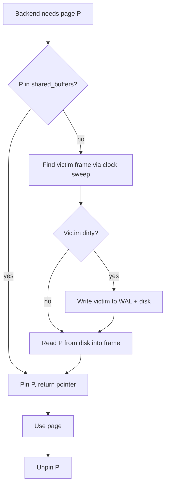

# The Buffer Pool

> The buffer pool is the database's cache — the layer that hides the 1000× latency cliff between RAM and disk. Everything else in this chapter (B-trees, joins, query plans) operates on the assumption that the pages it touches are *in* the buffer pool. When they are not, performance collapses.

## What you already know

From [[00-Storage-Hierarchy]]: the working set must fit in RAM, or the system runs at disk speed. From [[01-Pages-And-Files]]: the unit of I/O is the 8 KB page. The buffer pool is where those pages live when they are not on disk.

## Why this layer exists

Disk I/O is the most expensive thing a database does. The cheapest disk read is the one you don't do. The buffer pool exists to convert repeated disk reads into cheap memory reads — by keeping recently-used pages in RAM and only going to disk on a miss.

The buffer pool is also the *coordination point* for concurrency: it is where pages are pinned, latched, marked dirty, and eventually written back. Every backend process reads from the same shared buffer pool; PostgreSQL would not work otherwise.

## What is genuinely new here

The **eviction policy** — the algorithm that decides which page to kick out when the pool is full. The choice of eviction policy is the most consequential design decision in the buffer pool, and it is one of the few places where "the database's cache" diverges from "your application's cache."

## Concepts

### The page-read flow

Every read goes through the same flow:



The "find victim frame" step is the eviction policy. Pinned pages cannot be evicted. Dirty pages must be flushed (via WAL) before eviction.

### PostgreSQL's `shared_buffers`

A shared memory region of fixed size (set by `shared_buffers` in `postgresql.conf`, typically 25% of system RAM). It is divided into 8 KB frames, one per page. Every backend process maps this region into its address space.

Configuration:

```conf
#postgresql.conf
shared_buffers = 4GB          # typically 25% of RAM
effective_cache_size = 12GB   # hint to planner: includes OS cache
```

Note `effective_cache_size` is *not* an allocation — it is a hint to the planner about how much total cache (PostgreSQL + OS) is likely available. The planner uses it to decide between an index scan and a sequential scan. Get it wrong and the planner picks the wrong plan.

### Eviction policies

Several classic algorithms exist; PostgreSQL uses a variant called **clock sweep**.

#### LRU (Least Recently Used)

Evict the page whose most recent access is the oldest. Implementation: a doubly-linked list of pages; on access, move to head; on eviction, take from tail.

Pros: simple, good hit rate in practice.
Cons: every access requires a list mutation protected by a lock. At high concurrency, the LRU lock becomes a bottleneck.

#### Clock sweep (PostgreSQL's choice)

Arrange pages in a ring. Maintain a "clock hand" that points at a candidate. Each page has a `usage_count` (0-5 in PostgreSQL). On access, set `usage_count = 5` (mark "recently used"). On eviction:

```
while true:
    page = ring[clock_hand]
    if page.pinned:
        advance clock_hand
        continue
    if page.usage_count > 0:
        page.usage_count -= 1
        advance clock_hand
        continue
    return page  # found victim
```

A page must survive five sweeps before being evicted. This approximates LRU without a per-access list mutation — the only mutation is the `usage_count` byte, which is much cheaper to atomically update.

#### 2Q

Two queues: one for recently-seen pages, one for pages that survived the first queue and proved useful. Protects against a scan of cold pages flushing the working set. PostgreSQL's `usage_count` mechanism provides a similar protection (a cold page scanned once gets `usage_count=5`, but is still quickly demoted).

#### LRU-K

Evict based on the K-th most recent access, not just the most recent. More accurate than LRU but more memory. Used in some research databases; commercial DBs sometimes use it for hot-path indexes.

### Dirty pages and the background writer

When a backend modifies a page (e.g., an `UPDATE` writes a new tuple), the page in `shared_buffers` is marked **dirty**. Dirty pages cannot simply be evicted — they must be written to disk first, and (critically) their WAL records must be flushed first.

Two processes cooperate:

- **Background writer (`bgwriter`)** — periodically writes a few dirty pages to disk, so backends don't have to do it during query execution. Reduces latency spikes on eviction.
- **Checkpointer** — at each checkpoint, ensures all dirty pages are flushed to disk up to a specific WAL position. After a checkpoint, recovery can start from that position. See [[02-Checkpoints]].

The WAL-before-data rule: a page can only be written to disk *after* the WAL records describing its changes have been flushed. This is the foundation of crash recovery — see [[00-WAL-Logging]].

### The WAL buffer

A separate small buffer (typically 64 MB / `wal_buffers = -1` auto-tuned) where WAL records accumulate before being flushed to `pg_wal/`. Smaller and simpler than the page buffer pool because WAL is append-only.

### Pin and unpin

A page is **pinned** while a backend is reading or modifying it. Pinned pages cannot be evicted. The pin count goes up on use, down on completion. If you ever see a backend blocked on `BufferPin` waits, another backend is holding a long pin (often a `VACUUM` or a long-running query).

### Double cache: shared_buffers + OS page cache

PostgreSQL uses *buffered I/O* — reads go through the OS page cache. So a page can exist in three places: shared_buffers, OS page cache, disk. This double-cache costs RAM but provides resilience: when a page is evicted from `shared_buffers`, it is still in the OS cache (so a subsequent read is fast). The trade-off is documented in [[00-Storage-Hierarchy]].

## Banking application

Consider a hot account — say, a corporate account that does 1,000 transfers a day. Its `accounts` row, recent `ledger_entries` pages, and the corresponding B-tree leaf pages are *pinned-frequency-5* in the buffer pool. Every transfer is a few µs of work — buffer hits, no disk I/O.

Now a cold account: a savings account that hasn't transacted in 6 months. When the customer finally logs in to check the balance:

1. The `accounts` page is not in `shared_buffers` (or has a low `usage_count`).
2. PostgreSQL reads it from disk (or, often, finds it in the OS cache).
3. The read takes ~100 µs instead of <1 µs.

This is invisible to the user — until a peak hour when many cold customers log in simultaneously and the buffer pool churns. Now *hot* account pages start getting evicted, and suddenly hot transfers slow down too. This is the classic cache-pollution problem.

Mitigations PostgreSQL uses:

- The `usage_count` mechanism gives hot pages a 5× longer life.
- The **buffer ring** strategy for sequential scans: instead of polluting the whole pool, a big scan uses a small ring of buffers (typically 32 KB or 256 KB) and recycles them. A full-table scan on `ledger_entries` for a report will not flush the working set.

What this means for the Banking system's capacity planning:

- The working set is roughly: `accounts` (small, ~1 GB for 10M accounts) + `transfers` recent 30 days (medium, ~10 GB) + `ledger_entries` recent 30 days (large, ~30 GB) + active index pages. Total ~50 GB.
- If `shared_buffers` is 16 GB and the OS gives another 32 GB cache, the working set fits. Buffer hit ratio is ~99%.
- When the bank grows 10×, the working set is 500 GB. RAM has not grown. Buffer hit ratio drops to ~80%. Latency jumps. Time to partition, archive, or shard — see [[04-Partitioning-And-Sharding]].

## Code / diagrams

Inspect the buffer pool in PostgreSQL:

```sql
-- Buffer hit ratio (high-level)
SELECT
  sum(blks_hit) AS hits,
  sum(blks_read) AS reads,
  round(sum(blks_hit) * 100.0 / nullif(sum(blks_hit) + sum(blks_read), 0), 2) AS hit_pct
FROM pg_stat_database;
--  hits   │  reads  │ hit_pct
-- ────────┼─────────┼─────────
--  982134 │   12301 │ 98.76

-- Per-table hit ratio
SELECT relname,
  heap_blks_read, heap_blks_hit,
  round(heap_blks_hit * 100.0 / nullif(heap_blks_hit + heap_blks_read, 0), 2) AS hit_pct
FROM pg_statio_user_tables
ORDER BY heap_blks_read DESC LIMIT 5;

-- What's in the buffer pool right now?
CREATE EXTENSION pg_buffercache;
SELECT
  count(*) AS total_buffers,
  count(*) FILTER (WHERE isdirty) AS dirty_buffers,
  count(*) FILTER (WHERE usagecount = 5) AS hot_buffers
FROM pg_buffercache;
--  total_buffers │ dirty_buffers │ hot_buffers
--  ──────────────┼───────────────┼────────────
--        524288  │          234  │      89213

-- Which relations are most cached?
SELECT c.relname, count(*) AS buffers, pg_size_pretty(count(*) * 8192) AS size
FROM pg_buffercache b
JOIN pg_class c ON c.relfilenode = b.relfilenode
GROUP BY c.relname
ORDER BY count(*) DESC LIMIT 5;
--            relname           │ buffers │   size
-- ─────────────────────────────┼─────────┼─────────
--  ledger_entries              │  142011 │ 1109 MB
--  ledger_entries_account_id_idx │ 87302 │ 682 MB
--  accounts                    │   4521  │ 35 MB
```

The hit ratio is the most-watched number in any database. Above 99% is healthy. Below 95% is a warning. Below 90% means the working set is bigger than RAM — you are now disk-bound.

## What can go wrong

- **Cache pollution.** A large sequential scan (e.g., an analytical report) flushes the working set. PostgreSQL's buffer-ring strategy for scans mitigates this, but a query that explicitly disables it (rare) or that uses many random index lookups can still pollute.
- **Wrong `shared_buffers` size.** Too small: working set doesn't fit, hit ratio drops. Too large: starves the OS page cache, which is also useful; checkpointer flushes become slow.
- **Wrong `effective_cache_size`.** If you set this too low, the planner will prefer sequential scans over index scans (thinking the index won't be cached). Too high, and it will pick index scans that turn out to be slow because the index isn't actually cached.
- **Long-running transactions.** A transaction that started 2 hours ago prevents `VACUUM` from reclaiming dead tuples; the table bloats; more pages are needed to hold the same data; the buffer pool can't hold them all. Long transactions are the silent killer of buffer pool performance.
- **Checkpoint spikes.** If checkpoints are too infrequent, each one writes a huge amount of data at once — I/O spikes, queries stall. Tune `checkpoint_timeout` and `max_wal_size` so checkpoints are smooth (see [[02-Checkpoints]]).
- **Buffer pin contention.** Rare in OLTP; more common with very long-running analytical queries that hold pins on many pages. Symptom: high `BufferPin` wait events.
- **Memory leaks in extensions.** C extensions that allocate per-backend memory can fragment the process address space over time. Restart backends with `pg_ctl restart` or use connection pooling to recycle them.

## Trade-offs

- **Buffer pool size vs OS cache size.** More RAM to `shared_buffers` means less to OS cache. The OS cache is broader (handles all file reads) but lacks database-aware eviction. PostgreSQL convention: ~25% of RAM to `shared_buffers`, leaving the rest to the OS.
- **LRU vs clock sweep.** LRU is more accurate; clock is cheaper under contention. PostgreSQL chose clock. The accuracy gap is bridged by the `usage_count` 5-level demotion.
- **Write-through vs write-back.** Write-back (dirty pages accumulate, flushed by bgwriter) gives throughput; write-through gives consistency at the cost of every update becoming a disk write. Databases universally use write-back plus WAL for durability.
- **Shared buffers vs private buffers.** PostgreSQL uses a single shared pool (good cache reuse, but latching overhead). Some databases use per-backend private caches (no latching, but cold per backend). Shared wins for OLTP.
- **Bigger pool vs more replicas.** At some point, scaling vertically (more RAM) is more expensive than scaling horizontally (a read replica). The crossover depends on your workload.

## Forward links

- [[03-B-Tree-Indexes]] — index pages flow through the buffer pool exactly like heap pages.
- [[00-WAL-Logging]] and [[02-Checkpoints]] — how dirty pages become durable.
- [[08-Reading-EXPLAIN]] — `BUFFERS` shows hit vs read per node.
- [[00-Query-Optimization-Strategy]] — when the working set fits, index scans win; when it doesn't, seq scans may be cheaper.
- Back to [[03-Dependency-As-Root-Concept]] — every query depends on its pages being available; the buffer pool is what makes that dependency cheap.
- Back to [[00-Banking-Case-Study]] — the working set concept here matches "active accounts vs historical ledger" from the case study.
