# The Query Processing Pipeline

> SQL is declarative: you say *what* you want. The database figures out *how*. That "how" is a multi-stage pipeline: parse → analyze → rewrite → plan → execute. This chapter walks each stage, ending at the Volcano model — the pull-based iterator architecture that every modern database executor uses.

## What you already know

From [[04-Abstraction-and-Models]]: there is a logical plan (relational algebra — the *what*) and a physical plan (operators + access paths — the *how*). From [[04-Relational-Algebra]]: SQL is sugar for relational algebra. From [[03-Dependency-As-Root-Concept]]: at execution time, each operator *depends on* the data its children produce.

## Why this layer exists

SQL is a high-level language. To execute it, the database must:

1. **Parse** the text into a structure it can reason about.
2. **Resolve names** — `accounts` could be a table, a view, or a CTE; figure out which.
3. **Rewrite** — expand views, inline CTEs (sometimes), apply rules.
4. **Plan** — translate the logical request into a physical execution strategy.
5. **Execute** — run the plan and return rows.

Each stage is a separate module with a clear contract. This separation lets the database cache plans (prepared statements), apply transformations (views), and reason about equivalence (the optimizer searches a space of equivalent plans).

## What is genuinely new here

Three things:

1. The **Volcano model** — the pull-based iterator architecture where each operator has a `next()` method.
2. The **logical/physical plan distinction** — and why it matters.
3. The **pipeline shape** itself — five stages, each producing a different data structure.

## Concepts

### Stage 1: Parser — SQL text → parse tree

The parser is generated by `bison`/`yacc` from a grammar. It does syntactic analysis only:

- Tokenizes the input (`SELECT`, `FROM`, `WHERE`, identifiers, literals).
- Builds a parse tree matching the grammar.

The parser does *no* semantic checks. It does not know whether `accounts` is a table. It only checks that `SELECT * FROM accounts WHERE x = 1` is grammatically valid SQL.

Output: a parse tree (a `SelectStmt` node).

### Stage 2: Analyzer / rewriter — parse tree → query tree

The analyzer does semantic analysis:

- Resolves table names against the catalog (`accounts` → relation OID 12345).
- Resolves column names against table schemas (`iban` → column 2 of `accounts`).
- Expands `*` into the explicit column list.
- Type-checks expressions (`amount + 1` requires `amount` to be numeric).
- Resolves function calls (`SUM(...)` → aggregate function OID).
- Resolves views: a query against a view is rewritten to query the underlying tables.

The rewriter applies transformation rules — most importantly, expanding views. If `account_balances` is a view defined as `SELECT id, current_balance FROM accounts`, then `SELECT * FROM account_balances` becomes `SELECT id, current_balance FROM accounts`.

Output: a query tree — a structure of `RangeVar`, `RangeTblEntry`, `TargetEntry`, `Expr` nodes. This is essentially a logical plan, but in PostgreSQL's internal representation.

### Stage 3: Planner / optimizer — query tree → plan tree

This is where the cost-based optimizer lives (see [[07-Cost-Based-Optimizer]]). The planner:

1. Translates the query tree into a **logical plan** — relational algebra operators (scan, filter, project, join, aggregate, sort).
2. Applies **equivalence rules** — e.g., push filters down through joins (`(A JOIN B) WHERE A.x=1` → `(A WHERE x=1) JOIN B`).
3. Enumerates **physical plans** — for each logical operator, choose a physical operator (Seq Scan vs Index Scan, NLJ vs Hash vs Merge).
4. Estimates **costs** for each candidate using statistics and the cost model.
5. Picks the **cheapest** plan.

Output: a plan tree of physical operators with cost estimates — what `EXPLAIN` displays.

### Stage 4: Executor — plan tree → rows

The executor runs the plan. PostgreSQL uses the **Volcano model** (also called the iterator model):

Each operator is an object with three methods:

- `open()` — initialize.
- `next()` — return the next tuple, or `EOF`.
- `close()` — release resources.

The executor calls `open()` on the root, then repeatedly calls `next()` until EOF, then `close()`.

Each operator's `next()` calls `next()` on its children to get input tuples. Data flows **pull-based** — the root pulls tuples up from the leaves.

```
                  ┌───────────────┐
                  │   Aggregate   │   ← root, called by client
                  │    next()     │
                  └───────┬───────┘
                          │ calls next()
                          ▼
                  ┌───────────────┐
                  │  Hash Join    │
                  │    next()     │
                  └───┬───────┬───┘
                      │       │
              next()  │       │  next()
                      ▼       ▼
            ┌──────────────┐  ┌──────────────┐
            │  Seq Scan    │  │  Index Scan  │
            │  accounts    │  │  transfers   │
            └──────────────┘  └──────────────┘
```

When the client asks for the first row:

1. Aggregate.next() → calls Hash Join.next().
2. Hash Join.next() → builds the hash table by repeatedly calling Seq Scan.next() until EOF; then probes by calling Index Scan.next().
3. Index Scan.next() → reads the first matching tuple from the index.
4. Hash Join.next() → probes the hash table, emits a match.
5. Aggregate.next() → accumulates, returns the first grouped row.

The control flow is *inverted*: the consumer asks the producer, not the producer pushing to the consumer. This is the Volcano model.

#### Advantages of the Volcano model

- **Low memory.** Only one tuple is in flight at a time (per operator). Pipelined execution — no need to materialize intermediate results.
- **Composability.** Any operator can be a child of any other. The interface is uniform: `next()`.
- **Lazy evaluation.** `LIMIT 10` only calls `next()` 10 times on its child — early termination is free.
- **Cursor support.** A client can fetch one row at a time without the executor computing the whole result.

#### Disadvantages of the Volcano model

- **Per-tuple overhead.** Each `next()` call is a virtual method dispatch (in C, a function pointer). For a 10-way join over 1M rows, that is 10M × 10 function calls. Modern CPUs do not like indirect calls.
- **Poor SIMD utilization.** One tuple at a time means no vectorization.
- **Alternative: vectorized execution.** Some databases (DuckDB, ClickHouse) use a vectorized model: `next()` returns a batch of 1024 tuples. Better CPU utilization. PostgreSQL is considering vectorized execution in future versions.

### Stage 5: Result delivery — rows → client

Rows are sent back to the client over the PostgreSQL wire protocol. The client can fetch all at once or use a cursor to fetch incrementally. The executor is still running during cursor fetches — the Volcano model supports this naturally.

### Logical plan vs physical plan

The **logical plan** is relational algebra: "scan A, filter, join with B, aggregate." It says nothing about *how* the scan happens (seq vs index) or *how* the join happens (NLJ vs Hash vs Merge).

The **physical plan** adds access paths and algorithms: "Seq Scan on A, Hash Join with B using a hash on B.id, Aggregate with HashAgg."

The optimizer's job is to find the cheapest physical plan for a given logical plan, considering equivalent logical rewrites (filter pushdown, join reordering, etc.).

`EXPLAIN` shows the physical plan. The logical plan is internal (you can see parts of it via `EXPLAIN VERBOSE` and trace flags).

## Banking application

Trace `SELECT * FROM ledger_entries WHERE account_id = $1` through the pipeline:

1. **Parser** — tokenizes `SELECT * FROM ledger_entries WHERE account_id = $1`. Builds a `SelectStmt` parse tree. The parser does not know what `ledger_entries` is.

2. **Analyzer** — looks up `ledger_entries` in the catalog → relation OID 16384. Expands `*` into the explicit column list (`id, account_id, amount, occurred_at, transfer_id, ...`). Resolves `$1` as a parameter of type bigint. Builds the query tree.

3. **Planner** — considers access paths:
   - Seq Scan on `ledger_entries`, filter `account_id = $1`. Estimated cost: 100000 (scan all 100K pages).
   - Index Scan on `ledger_entries_account_id_idx` with `account_id = $1`. Estimated cost: 50 (4 index pages + 2 heap pages).
   - Bitmap Index Scan + Bitmap Heap Scan. Estimated cost: 80.
   
   Picks the Index Scan (cheapest).

4. **Executor** — opens the Index Scan node. Each call to `next()`:
   - Descends the B-tree to find the first leaf with `account_id = $1`.
   - Returns the first matching `(key, ctid)`.
   - Follows the `ctid` to the heap page.
   - Returns the tuple.
   - On the next call, walks the leaf chain forward.

5. **Result** — rows are sent to the client as they are produced. The client sees a stream of `ledger_entries` rows.

The whole pipeline for this simple query runs in <1 ms. Most of that is the executor; parsing and planning are ~0.1 ms each (cached for prepared statements).

## Code / diagrams

```sql
-- See the plan the planner picked:
EXPLAIN SELECT * FROM ledger_entries WHERE account_id = 42;
-- Index Scan using ledger_entries_account_id_idx on ledger_entries
--   Index Cond: (account_id = 42)
--   Cost: 0.42..48.30 rows=10 width=128

-- See actual execution stats:
EXPLAIN (ANALYZE, BUFFERS)
  SELECT * FROM ledger_entries WHERE account_id = 42;
-- Index Scan using ledger_entries_account_id_idx on ledger_entries
--   Index Cond: (account_id = 42)
--   Buffers: shared hit=6
--   Execution Time: 0.08 ms

-- See the parse tree (debug):
SET debug_print_parse = on;
SET debug_print_plan = on;
SELECT * FROM ledger_entries WHERE account_id = 42;
-- (output goes to PostgreSQL log)
```

The parse/plan debug output is verbose but illuminating — it shows the intermediate structures the pipeline produces.

```mermaid
flowchart LR
    SQL[SQL text] --> P[Parser]
    P --> PT[Parse tree]
    PT --> A[Analyzer]
    A --> QT[Query tree]
    QT --> R[Rewriter]
    R --> QT2[Query tree - rewritten]
    QT2 --> PL[Planner/Optimizer]
    PL --> PLAN[Plan tree - physical]
    PLAN --> E[Executor]
    E --> ROWS[Row stream]
    ROWS --> C[Client]
```



## What can go wrong

- **Plan cache invalidation.** Prepared statements cache the plan. If statistics change drastically, the cached plan may be suboptimal. PostgreSQL uses "custom plans" vs "generic plans" — it re-plans the first few executions to learn parameter values, then may switch to a generic plan. Mis-judgments here cause slow parameterized queries.
- **Parser limits.** A query with 1000s of `IN` values can be slow to parse. Use arrays or temp tables instead.
- **View explosion.** A view joining 10 views, each joining 5 tables, can produce a query tree that the optimizer struggles with. Flatten views where possible, or use materialized views.
- **Optimizer timeouts.** For 10+ table joins, the optimizer may fall back to GEQO (genetic algorithm) — see [[07-Cost-Based-Optimizer]]. The resulting plan may be far from optimal.
- **Volcano overhead.** For OLAP queries over billions of rows, the per-tuple function call overhead is significant. Columnar stores (which use vectorized execution) can be 100× faster on the same hardware.
- **Cursor overhead.** A cursor that fetches one row at a time pays round-trip latency per row. Use `FETCH 1000` to batch.
- **Type coercion surprises.** The analyzer may silently coerce `account_id = '42'` (string) to `account_id = 42::bigint`. This works — but if the coercion prevents index use (e.g., on a function call), the plan degrades. Always parameterize with the right type.

## Trade-offs

- **Volcano vs vectorized.** Volcano is simple, composable, low-memory. Vectorized is fast but more complex. PostgreSQL chose Volcano; analytical engines chose vectorized.
- **Pull vs push.** Pull (Volcano) is the norm. Push-based execution (used in some streaming engines) is faster for certain pipelines but harder to compose.
- **Materialization vs streaming.** Volcano streams (one tuple at a time). Some operators (Sort, Hash) must materialize. The optimizer chooses materialization only when needed.
- **Plan caching vs adaptivity.** Cached plans are fast to start but can be wrong if data changes. Adaptive query processing (re-optimizing mid-execution) is more flexible but adds overhead.
- **Generic vs custom plans.** Generic plans ignore parameter values; custom plans use them. PostgreSQL's auto-tuning picks based on the first few executions.

## Forward links

- [[07-Cost-Based-Optimizer]] — the planner's cost model in depth.
- [[08-Reading-EXPLAIN]] — how to see this pipeline's output.
- [[09-Banking-Query-Plans]] — five realistic queries traced through.
- Back to [[04-Relational-Algebra]] — the logical plan is algebra.
- Back to [[04-Abstraction-and-Models]] — logical vs physical is abstraction layered.
- Back to [[03-Dependency-As-Root-Concept]] — Volcano is *pull-based dependency*: each operator depends on its children producing the next tuple.
