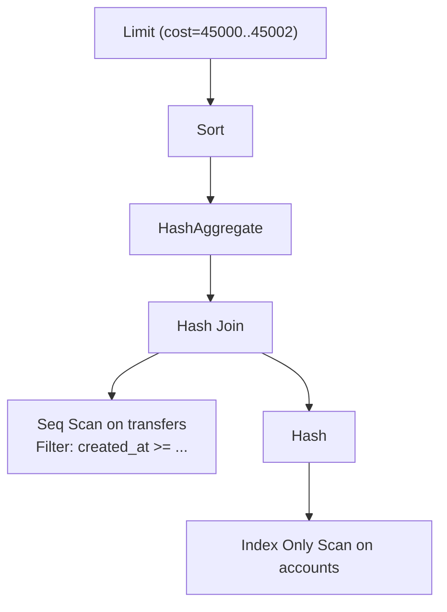

# Reading EXPLAIN

> `EXPLAIN` is the single most important tool in a PostgreSQL engineer's toolkit. It shows you what the planner intends to do. `EXPLAIN ANALYZE` runs the query and shows you what *actually* happened. The gap between intent and reality is where performance problems live.

## What you already know

From [[06-Query-Processing-Pipeline]]: the planner produces a plan tree of physical operators. From [[07-Cost-Based-Optimizer]]: each operator has a cost estimate and a row estimate. From [[05-Join-Algorithms]] and [[03-B-Tree-Indexes]]: the operators have names — Seq Scan, Index Scan, Hash Join, etc. `EXPLAIN` is the window into all of this.

## Why this layer exists

A SQL query is a *declaration*. The plan is the *implementation*. Without `EXPLAIN`, you are guessing at the implementation. With it, you can see:

- Which access path the planner picked (seq scan vs index scan).
- Which join algorithm was chosen.
- The estimated cost and row counts.
- The actual row counts and timings (with `ANALYZE`).
- The buffer hit/miss breakdown (with `BUFFERS`).

Tuning a query without `EXPLAIN` is like debugging without a stack trace — possible, but painful and slow.

## What is genuinely new here

The **syntax** of EXPLAIN output and the **red flags** that signal a problem. Reading EXPLAIN is a literacy skill: it has its own grammar, its own idioms, its own common failure patterns.

## Concepts

### Basic syntax

```sql
EXPLAIN SELECT * FROM accounts WHERE iban = 'GB29NWBK60161331926819';
```

Output:

```
                                QUERY PLAN
──────────────────────────────────────────────────────────────────────────
 Index Scan using accounts_iban_idx on accounts  (cost=0.42..8.04 rows=1 width=64)
   Index Cond: (iban = 'GB29NWBK60161331926819'::text)
```

Anatomy:

- `Index Scan` — the **node type** (what physical operator).
- `using accounts_iban_idx` — which index is used.
- `on accounts` — which table.
- `cost=0.42..8.04` — startup cost..total cost (see [[07-Cost-Based-Optimizer]]).
- `rows=1` — estimated number of rows this node will produce.
- `width=64` — estimated average row size in bytes.
- `Index Cond: ...` — the predicate applied at the index level.

### The tree

A plan is a tree. Indentation shows parent-child relationships:

```
Hash Join  (cost=10.00..1000.00 rows=1000 width=128)
  Hash Cond: (a.id = t.account_id)
  -> Seq Scan on accounts a  (cost=0.00..5.00 rows=100 width=64)
  -> Hash  (cost=8.00..8.00 rows=200 width=32)
        -> Seq Scan on transfers t  (cost=0.00..8.00 rows=200 width=32)
```

- `Hash Join` is the root.
- Its first child is `Seq Scan on accounts` (the probe side).
- Its second child is `Hash` (the build side), whose child is `Seq Scan on transfers`.

Data flows from leaves to root. The leftmost leaf is typically the first table scanned.

### EXPLAIN ANALYZE — actuals

```sql
EXPLAIN ANALYZE SELECT * FROM accounts WHERE iban = 'GB29NWBK60161331926819';
```

```
                              QUERY PLAN
──────────────────────────────────────────────────────────────────────────
 Index Scan using accounts_iban_idx on accounts
   (cost=0.42..8.04 rows=1 width=64) (actual time=0.020..0.022 rows=1 loops=1)
   Index Cond: (iban = 'GB29NWBK60161331926819'::text)
   Buffers: shared hit=4
 Planning Time: 0.110 ms
 Execution Time: 0.045 ms
```

Now we see:

- `(actual time=0.020..0.022 rows=1 loops=1)` — actual time (startup..total), actual row count, number of iterations.
- `Buffers: shared hit=4` — buffer pool hits (4 page reads, all from cache).
- `Planning Time` — how long the planner took.
- `Execution Time` — how long the executor took.

### Reading cost numbers

`cost=0.42..8.04`:

- `0.42` = **startup cost** — work done before the first tuple is produced. For a Seq Scan, this is 0 (just open the file and read). For a Sort, this is the full sort cost (no tuples until sorted).
- `8.04` = **total cost** — work to produce all tuples.

For a `LIMIT 10` query, the planner prefers plans with low startup cost — even if total cost is high — because the query will terminate after 10 rows.

### Reading row estimates

`rows=1` is the planner's estimate. `actual rows=1` is what really happened. When they differ by 10× or more, the planner was misled. Common causes:

- Stale statistics → run `ANALYZE`.
- Correlated columns → add extended statistics.
- Functions in predicates → add expression statistics.
- Parameterized queries → use custom plans.

### Reading width

`width=64` — average row size. Larger width means more bytes per row, which means more buffer reads and more network traffic. Watch for unexpected width growth (e.g., when you add a column to a `SELECT *`).

### The BUFFERS option

```sql
EXPLAIN (ANALYZE, BUFFERS) SELECT * FROM accounts WHERE iban = $1;
```

```
 Index Scan using accounts_iban_idx on accounts
   (actual time=0.020..0.022 rows=1 loops=1)
   Index Cond: (iban = $1)
   Buffers: shared hit=4
```

`Buffers: shared hit=4` — 4 page reads, all from the buffer pool (no disk I/O).

Variants:

- `shared hit=N` — pages found in `shared_buffers`.
- `shared read=N` — pages read from disk (or OS cache).
- `shared dirtied=N` — pages modified (need eventual write).
- `shared written=N` — pages written to disk during the query.
- `temp read=N` / `temp written=N` — temporary files (sorts, hash joins spilling).

A high `shared read` count means cold data — the working set doesn't fit. A high `temp read` means a sort or hash spilled to disk — raise `work_mem`.

### The VERBOSE option

```sql
EXPLAIN (VERBOSE) SELECT * FROM accounts WHERE iban = $1;
```

Adds schema-qualified names, full output column list, and expression details. Useful for understanding exactly what the planner is doing.

### The FORMAT option

```sql
EXPLAIN (FORMAT JSON) SELECT ...;   -- or YAML, or TEXT (default)
```

JSON/YAML formats are machine-parseable. Useful for monitoring tools.

### Common node types — a cheat sheet

| Node | What it does | When chosen |
|---|---|---|
| **Seq Scan** | Read every page of the table | No useful index, or matching rows are a large fraction |
| **Index Scan** | Look up via index, fetch heap tuple | Selective predicate on indexed column |
| **Index Only Scan** | Look up via index, no heap visit | All needed columns are in the index; visibility map says pages are all-visible |
| **Bitmap Index Scan + Bitmap Heap Scan** | Build a bitmap of matching CTIDs, then fetch heap pages in physical order | Selective but matches many rows (1000s), scattered across the table |
| **Hash Join** | Build hash on smaller side, probe with larger | Equality join, both sides unsorted, hash fits in memory |
| **Nested Loop** | For each outer row, look up matches in inner | Small outer + indexed inner; or inequality join |
| **Merge Join** | Sort both sides, walk in parallel | Both sides sorted (by index or by Sort node); equality or range join |
| **Sort** | Sort the input | `ORDER BY`, or feed into Merge Join / GroupAggregate |
| **Aggregate** | Compute aggregates (SUM, COUNT, etc.) | Aggregation; uses hash or sort |
| **HashAggregate** | Aggregate using a hash table | Group by unsorted column |
| **GroupAggregate** | Aggregate on sorted input | Group by sorted column |
| **Limit** | Stop after N rows | `LIMIT` clause |
| **Gather** | Collect results from parallel workers | Parallel query |
| **Gather Merge** | Collect sorted results from parallel workers | Parallel + `ORDER BY` |
| **Subquery Scan** | Wrap a subquery | Subquery in FROM |
| **CTE Scan** | Read a CTE | `WITH` clause; materialized by default |
| **Append** | Concatenate child scans | `UNION ALL`, partitioned tables |
| **Merge Append** | Concatenate sorted child scans | `UNION ALL` with `ORDER BY`, partitioned tables |
| **Unique** | Deduplicate sorted input | `SELECT DISTINCT` |
| **WindowAgg** | Compute window functions | `OVER (...)` |
| **Materialize** | Cache subplan output | Inner of Nested Loop that is iterated many times |
| **Result** | One-row result with no scan | `SELECT 1`, or short-circuit predicates (`WHERE false`) |

### Red flags

1. **Estimated rows off by 10× from actual.** Statistics problem.
2. **Seq Scan on a large table when you expected an index.** Statistics or `random_page_cost` issue; or the predicate is genuinely unselective.
3. **Nested Loop with a huge outer table.** Should probably be a Hash Join. Often a statistics problem — the planner thought the outer was small.
4. **Sort node spilling to disk** (`Sort Method: external merge Disk: 50000kB`). Raise `work_mem`.
5. **Hash Join with many batches** (`Buckets: 1024 Batches: 64 Memory Usage: 4096kB`). The build side didn't fit; raise `work_mem`.
6. **Bitmap Heap Scan with many heap pages.** The bitmap matched many rows — possibly an unselective predicate. Consider a more selective index.
7. **Sequential scans under a Gather.** Parallel workers scanning a huge table — fine if intended, but verify the parallelism is paying off.
8. **`Filter:` (not `Index Cond:`) on an index scan.** The index was used but the predicate couldn't be evaluated at the index level — usually a function on the column (`WHERE lower(email) = $1` without a matching expression index).
9. **Subplan pulled many times.** Subqueries in `SELECT` list (`SELECT ..., (SELECT ...)` — see [[04-Subqueries-CTEs]]) execute per outer row. Convert to a join.
10. **High `Execution Time` vs low `Planning Time`.** Plan is right, execution is just slow — true I/O or CPU bottleneck. Look at buffers.

## Banking application — five query plans

### Query 1: Point lookup by IBAN

```sql
EXPLAIN (ANALYZE, BUFFERS)
SELECT * FROM accounts WHERE iban = 'GB29NWBK60161331926819';
```

```
 Index Scan using accounts_iban_idx on accounts
   (cost=0.42..8.04 rows=1 width=64) (actual time=0.020..0.022 rows=1 loops=1)
   Index Cond: (iban = 'GB29NWBK60161331926819'::text)
   Buffers: shared hit=4
 Planning Time: 0.110 ms
 Execution Time: 0.045 ms
```

Reading: Index Scan, 1 row estimated and actual (good), 4 buffer hits (no disk I/O), 45 µs total. This is a fast query — the working set is in cache. Nothing to tune.

### Query 2: Range scan on ledger entries

```sql
EXPLAIN (ANALYZE, BUFFERS)
SELECT * FROM ledger_entries
WHERE account_id = 42 AND occurred_at >= '2024-01-01' AND occurred_at < '2024-02-01';
```

```
 Index Scan using ledger_entries_account_id_occurred_at_idx on ledger_entries
   (cost=0.56..245.30 rows=210 width=128) (actual time=0.030..1.230 rows=187 loops=1)
   Index Cond: ((account_id = 42) AND (occurred_at >= '2024-01-01') AND (occurred_at < '2024-02-01'))
   Buffers: shared hit=12 read=4
 Planning Time: 0.140 ms
 Execution Time: 1.420 ms
```

Reading: composite index used, 210 estimated vs 187 actual (close), 12 hits + 4 reads (most pages hot, a few cold). 1.4 ms total — fast. The `read=4` is the cold pages for the older January entries.

### Query 3: Join transfers and accounts for a customer statement

```sql
EXPLAIN (ANALYZE, BUFFERS)
SELECT t.id, t.amount, sa.iban AS source_iban, da.iban AS dest_iban
FROM transfers t
JOIN accounts sa ON t.source_account_id = sa.id
JOIN accounts da ON t.dest_account_id = da.id
WHERE sa.customer_id = 42
  AND t.created_at >= now() - interval '30 days';
```

```
 Nested Loop  (cost=2.10..820.30 rows=85 width=80) (actual time=0.080..3.450 rows=78 loops=1)
   Buffers: shared hit=215 read=8
   -> Index Scan using accounts_customer_id_idx on accounts sa
      (cost=0.42..8.50 rows=5 width=40) (actual time=0.020..0.080 rows=5 loops=1)
      Index Cond: (customer_id = 42)
      Buffers: shared hit=4
   -> Nested Loop  (cost=1.68..811.00 rows=17 width=56) (actual time=0.050..0.650 rows=16 loops=5)
      Buffers: shared hit=211 read=8
      -> Index Scan using transfers_source_account_id_created_at_idx on transfers t
         (cost=1.24..780.00 rows=17 width=40) (actual time=0.030..0.500 rows=16 loops=5)
         Index Cond: ((source_account_id = sa.id) AND (created_at >= (now() - '30 days'::interval)))
         Buffers: shared hit=180 read=8
      -> Index Scan using accounts_pkey on accounts da
         (cost=0.43..1.85 rows=1 width=40) (actual time=0.005..0.006 rows=1 loops=78)
         Index Cond: (id = t.dest_account_id)
         Buffers: shared hit=78
 Planning Time: 1.230 ms
 Execution Time: 3.580 ms
```

Reading: nested loop outer = 5 customer accounts (loops=5), inner = transfers for each (16 each = 78 total, close to estimated 85), innermost = destination accounts (1 per transfer). 215 buffer hits + 8 reads. 3.6 ms total — fast.

### Query 4: Aggregate daily balances

```sql
EXPLAIN (ANALYZE, BUFFERS)
SELECT occurred_at::date, SUM(amount)
FROM ledger_entries
WHERE account_id = 42 AND occurred_at >= '2024-01-01'
GROUP BY occurred_at::date
ORDER BY occurred_at::date;
```

```
 GroupAggregate  (cost=0.56..312.40 rows=30 width=16) (actual time=0.090..2.340 rows=30 loops=1)
   Group Key: ((occurred_at)::date)
   Buffers: shared hit=24 read=2
   -> Index Scan using ledger_entries_account_id_occurred_at_idx on ledger_entries
      (cost=0.56..312.00 rows=210 width=12) (actual time=0.030..1.500 rows=187 loops=1)
      Index Cond: ((account_id = 42) AND (occurred_at >= '2024-01-01'))
      Buffers: shared hit=24 read=2
 Planning Time: 0.180 ms
 Execution Time: 2.420 ms
```

Reading: the index scan produces rows already sorted on `occurred_at`, so `GroupAggregate` (not `HashAggregate`) is used. No explicit Sort node needed — the index ordering suffices. 2.4 ms total — fast.

### Query 5: Fraud-detection scan

```sql
EXPLAIN (ANALYZE, BUFFERS)
SELECT customer_id, SUM(amount) AS total
FROM transfers t JOIN accounts a ON t.source_account_id = a.id
WHERE t.created_at >= now() - interval '24 hours'
GROUP BY customer_id
HAVING SUM(amount) > 10000
ORDER BY total DESC LIMIT 100;
```

```
 Limit  (cost=45000..45002 rows=100 width=16) (actual time=420.30..420.45 rows=100 loops=1)
   Buffers: shared hit=42000 read=8000
   -> Sort  (cost=45000..45500 rows=10000 width=16) (actual time=420.20..420.40 rows=100 loops=1)
      Sort Key: total DESC
      Sort Method: top-N heapsort  Memory: 30kB
      Buffers: shared hit=42000 read=8000
      -> HashAggregate  (cost=44000..44500 rows=10000 width=16) (actual time=380.20..410.00 rows=8000 loops=1)
         Group Key: a.customer_id
         Buffers: shared hit=42000 read=8000
         -> Hash Join  (cost=10..42000 rows=200000 width=16) (actual time=0.50..350.00 rows=200000 loops=1)
            Hash Cond: (t.source_account_id = a.id)
            Buffers: shared hit=42000 read=8000
            -> Seq Scan on transfers t  (cost=0..40000 rows=200000 width=12) (actual time=0.01..200.00 rows=200000 loops=1)
               Filter: (created_at >= (now() - '24 hours'::interval))
               Buffers: shared read=8000
            -> Hash  (cost=5..5 rows=10000 width=12) (actual time=0.40..0.40 rows=10000 loops=1)
               Buckets: 16384  Batches: 1  Memory Usage: 600kB
               Buffers: shared hit=20
               -> Index Only Scan using accounts_pkey on accounts a  (cost=0..5 rows=10000 width=12) (actual time=0.01..0.30 rows=10000 loops=1)
                     Buffers: shared hit=20
 Planning Time: 1.500 ms
 Execution Time: 420.50 ms
```

Reading: this is a heavier query. 200K transfers in last 24 hours, joined to all 10K accounts, grouped, filtered, sorted, top 100. The planner chose:

- Seq Scan on `transfers` (200K rows = a meaningful fraction, seq scan wins).
- Hash Join with `accounts` (smaller side fits in memory).
- HashAggregate (grouping not pre-sorted).
- Sort with `top-N heapsort` (because of `LIMIT 100`, only top 100 needed).
- Limit.

420 ms total. 8000 disk reads (cold transfers data). This is the kind of query that benefits from an index on `transfers(created_at)` to avoid scanning 24 hours' worth; or from a materialized view that pre-aggregates daily totals.

## Code / diagrams

A mental model for the EXPLAIN tree:



Read from leaves up. Each node produces tuples that flow up to its parent.

## What can go wrong

- **Reading `EXPLAIN` without `ANALYZE`.** Cost estimates alone can mislead. Always use `ANALYZE` for tuning (but be aware it runs the query — side effects, locks, write load).
- **`ANALYZE` on a destructive query.** Don't `EXPLAIN ANALYZE` an `UPDATE` or `DELETE` you don't actually want to run. Wrap in a transaction and roll back: `BEGIN; EXPLAIN ANALYZE DELETE ...; ROLLBACK;`.
- **Ignoring `loops=N`.** A node with `loops=1000` and `actual time=0.01..0.02` is actually 10-20 ms total (per-loop time × loop count). Always multiply.
- **Comparing `cost` across queries.** Cost is unitless and only meaningful relative to other costs in the *same plan*. Don't compare plans by cost number.
- **Trusting `actual time` on a cold cache.** First run of `EXPLAIN ANALYZE` includes disk reads. Second run is faster (cached). Run twice; trust the second.
- **Ignoring `Planning Time`.** A 50 ms planning time is a problem for short queries. May indicate too many tables, or a need for prepared statements.
- **Forgetting `BUFFERS`.** Without `BUFFERS`, you can't tell if the query is I/O-bound or CPU-bound.

## Trade-offs

- **EXPLAIN vs EXPLAIN ANALYZE.** `EXPLAIN` is fast and safe but only shows estimates. `ANALYZE` runs the query — accurate but risky.
- **VERBOSE output vs readability.** More detail = more useful for debugging but harder to scan.
- **JSON vs TEXT format.** TEXT is human-friendly; JSON is machine-friendly. Some monitoring tools require JSON.
- **COST-based vs actual-time tuning.** Cost is what the planner uses; actual time is what you experience. Tune based on actual time, but understand *why* the planner picked its plan via cost.

## Forward links

- [[09-Banking-Query-Plans]] — five realistic Banking queries with full plan analysis.
- [[07-Cost-Based-Optimizer]] — what produces the numbers you're reading.
- [[00-Query-Optimization-Strategy]] — what to do when EXPLAIN reveals a problem.
- [[01-Indexing-Strategy]] — what to do when EXPLAIN shows a Seq Scan you didn't want.
- Back to [[03-Select-Join-Group]] — the SQL that produces these plans.
- Back to [[08-Trade-offs-Everywhere]] — every "should I use index X" decision is a trade-off EXPLAIN makes visible.
