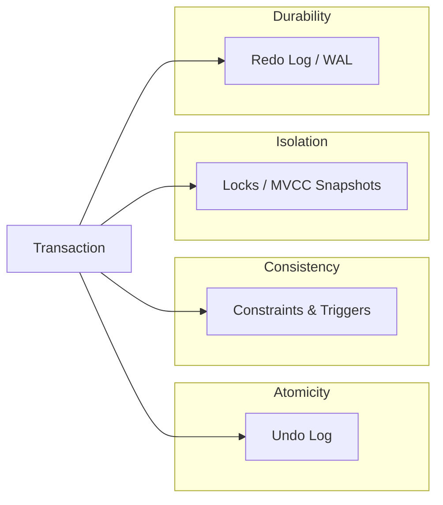
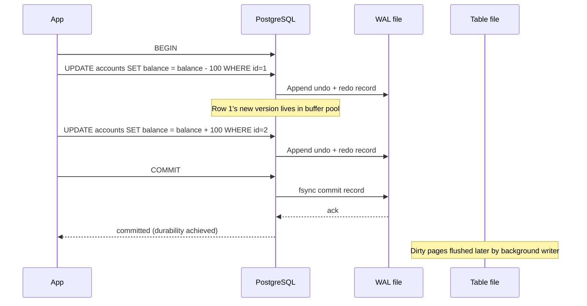

# ACID — The Four Properties of a Transaction

> The contract every transaction promises. Härder & Reuter (1983) gave the names; the ideas had been evolving for a decade before that. Learn the four properties precisely — most failures of "transactional" code come from a fuzzy understanding of just one of them.

## 1. What you already know

From [[08-Trade-offs-Everywhere]]: every design decision is a trade-off, and a transaction is the database's way of bundling multiple operations into a unit that obeys a particular trade-off (correctness over concurrency). From [[03-Dependency-As-Root-Concept]]: a single business operation (a transfer) touches several entities and several rows — those dependencies must all move together or not at all. From [[00-Banking-Case-Study]]: rule 5 — *atomic transfers* — is the canonical ACID requirement.

You also know, from [[06-Transactions-In-SQL]], that SQL exposes `BEGIN / COMMIT / ROLLBACK` as the user-facing handle for a transaction.

## 2. Why this layer exists

Without transactions, the database is just a pile of independent writes. Consider a transfer:

```sql
UPDATE accounts SET balance = balance - 100 WHERE id = 1;  -- debit
UPDATE accounts SET balance = balance + 100 WHERE id = 2;  -- credit
INSERT INTO ledger_entries(account_id, amount) VALUES (1, -100), (2, +100);
```

Three statements, four rows touched. Between any two of them the process can crash, another transaction can interleave, a constraint can fail. The database needs a *contract* that says: these statements form one unit; either all of them happen durably, or none of them do, and no other transaction sees them half-applied. That contract is ACID.

## 3. What is genuinely new

ACID is *four separate properties* that the database enforces *together* under the `BEGIN/COMMIT` umbrella. They are not one mechanism; they are four mechanisms (undo log, constraint checks, locks or snapshots, redo log) that happen to be exposed as a single SQL feature. The art of designing transactional code is knowing which property is doing the work for any given correctness requirement.

## 4. Concepts

### Atomicity — All or Nothing

> A transaction is an indivisible unit: either all of its effects happen, or none of them do.

If the transaction commits, every change persists. If it aborts — explicitly via `ROLLBACK`, implicitly via a crash, a constraint violation, a deadlock — every change is undone *as if it never ran*. The mechanism is the **undo log** (see [[01-ARIES]]): for every write the transaction records a *before-image* so the change can be reversed.

Atomicity is the property the application relies on when it wraps a transfer in `BEGIN/COMMIT`. The bank's rule 5 (atomic transfers) is enforced by Atomicity.

### Consistency — Transitions Preserve Invariants

> A transaction takes the database from one consistent state to another consistent state.

"Consistent state" means: all declared invariants hold. `NOT NULL`, `CHECK`, `UNIQUE`, foreign keys, triggers — all satisfied. If a transaction would leave the database in an inconsistent state, the database refuses to commit it (the constraint violation becomes the rollback trigger).

Consistency is a *joint* property: the application declares the invariants (schema, constraints — see [[00-Schema-Design]]); the database enforces them; the transaction's job is to make its changes in a way that, by commit time, the invariants hold again. The transfer's intermediate state (debit done, credit not yet) temporarily violates the conservation-of-money invariant; that's fine *inside* the transaction because Consistency is checked at commit.

### Isolation — Concurrent Transactions Appear Serial

> The result of executing transactions concurrently is the same as executing them serially in *some* order.

Isolation is the most subtle property. The full guarantee is called *serializability* (see [[05-Serializability]]). Real databases do not always provide full serializability by default — they offer *isolation levels* (see [[02-Isolation-Levels]]) that trade correctness for concurrency. The SQL standard defines four levels; PostgreSQL maps them to specific mechanisms (locks or MVCC snapshots).

Isolation is what makes rule 10 of the bank (concurrent transfers are safe) hold.

### Durability — Committed Data Survives Crashes

> Once a transaction commits, its effects survive subsequent crashes of the database process, the operating system, or the hardware.

Durability is enforced by the **write-ahead log** (WAL — see [[00-WAL-Logging]]): before commit is acknowledged to the client, the log record describing the commit is flushed to persistent storage. On crash recovery, the log is replayed to restore the committed state.

Durability has a latency cost: every commit must wait for an `fsync` of the WAL. This is the most expensive part of a transaction, and it is what `synchronous_commit = off` trades away for speed.

### The tensions

| Pair | Tension |
|---|---|
| Isolation vs Performance | Stronger isolation = more locks/conflicts/aborts = lower throughput |
| Durability vs Latency | Stronger durability = more `fsync`s = higher commit latency |
| Atomicity vs Availability | A long transaction holding locks reduces availability for others |
| Consistency vs Throughput | More constraints = more checks per write = lower throughput |

## 5. Banking application

The transfer is the canonical ACID example. Here is the Java service, written so that all four properties are visible:

```java
public final class TransferService {

    private final DataSource ds;

    public void transfer(long fromId, long toId, BigDecimal amount, String idemKey) {
        try (Connection c = ds.getConnection()) {
            c.setTransactionIsolation(Connection.TRANSACTION_SERIALIZABLE); // Isolation
            c.setAutoCommit(false);
            try (PreparedStatement idem = c.prepareStatement(
                    "SELECT 1 FROM transfers WHERE idempotency_key = ?")) {
                idem.setString(1, idemKey);
                if (idem.executeQuery().next()) return; // already done
            }

            // Debit + credit + ledger entries + transfer row, all in one transaction
            debit(c, fromId, amount);
            credit(c, toId, amount);
            insertLedgerEntries(c, fromId, toId, amount);
            insertTransfer(c, fromId, toId, amount, idemKey);

            c.commit();   // Atomicity + Durability boundary
            // If we reach here, all four rows are durable.
            // If any statement above threw, the try-with-resources rollback runs.
        } catch (SQLException e) {
            // Atomicity: nothing committed. The bank's balance invariant is intact.
            throw new RuntimeException(e);
        }
    }
}
```

What does each property do here?

- **Atomicity**: if `insertLedgerEntries` throws, the debit and credit are rolled back. No partial state.
- **Consistency**: if the credit would drive `account 2`'s balance above a `CHECK` limit, the constraint violation aborts the transaction. The debit is undone. The bank's invariants hold.
- **Isolation**: `SERIALIZABLE` guarantees that two concurrent transfers out of the same account behave as if one ran entirely before the other. No lost update.
- **Durability**: once `c.commit()` returns, the four rows survive a crash of the JVM, the database, or the host.

## 6. Code / diagrams

### The four mechanisms that implement ACID



### Transaction lifecycle (PostgreSQL)



Note the ordering: WAL is flushed *before* the table file. This is the **write-ahead rule** (see [[00-WAL-Logging]]) — the foundation of Durability.

### SQL demonstrating each property

```sql
-- Atomicity: ROLLBACK undoes everything
BEGIN;
UPDATE accounts SET balance = balance - 100 WHERE id = 1;
UPDATE accounts SET balance = balance || '+ invalid';  -- syntax/type error
ROLLBACK;  -- account 1's balance is restored

-- Consistency: CHECK constraint aborts the transaction
BEGIN;
-- Assume accounts has CHECK (balance >= -overdraft_limit)
UPDATE accounts SET balance = -1000000 WHERE id = 1;  -- violates CHECK
-- ERROR: new row for relation "accounts" violates check constraint
-- Transaction is now aborted; must ROLLBACK.

-- Isolation: two concurrent sessions see a consistent snapshot
-- Session A:                    -- Session B:
BEGIN ISOLATION LEVEL SERIALIZABLE;
SELECT balance FROM accounts WHERE id = 1;  -- returns 500
                                BEGIN ISOLATION LEVEL SERIALIZABLE;
                                UPDATE accounts SET balance = balance - 200 WHERE id = 1;
                                COMMIT;
SELECT balance FROM accounts WHERE id = 1;  -- still 500 (snapshot frozen at first read)
COMMIT;

-- Durability: synchronous_commit = on (the default) guarantees fsync
SET synchronous_commit = on;
BEGIN;
INSERT INTO ledger_entries(account_id, amount) VALUES (1, -100);
COMMIT;  -- when this returns, the insert is durable across crashes
```

## 7. What can go wrong

- **Treating ACID as one mechanism.** When a transfer misbehaves, the engineer who says "the transaction failed" cannot diagnose it. Was it a deadlock (Isolation), a CHECK violation (Consistency), a WAL write timeout (Durability), or a partial write that was rolled back (Atomicity)? Each has a different fix.
- **Implicit commits.** DDL statements in many databases (e.g., `CREATE TABLE` in MySQL) cause an implicit commit. Mixing DDL and DML in a transaction does not behave as the developer expects. PostgreSQL is the honourable exception: DDL is transactional.
- **Long-running transactions.** A transaction that holds locks or a snapshot for minutes starves other transactions, bloats the WAL, and prevents `VACUUM` from reclaiming dead tuples (see [[04-MVCC]]).
- **Disabling durability by accident.** `synchronous_commit = off` is sometimes set for "performance" without realising it trades away Durability for committed-but-not-yet-fsynced transactions.
- **Autocommit blindness.** JDBC's default `autoCommit = true` runs each statement in its own transaction. The transfer above without `setAutoCommit(false)` would commit after each `UPDATE` — Atomicity gone.

## 8. Trade-offs

- **Full ACID vs throughput.** A payment-network core demanding serializability + sync replication across regions might cap at 2,000 TPS. The same workload at READ COMMITTED with async replication might do 50,000 TPS — at the cost of permitting some anomalies and accepting small data loss on failover.
- **Durability vs latency.** `synchronous_commit = off` cuts commit latency from ~5 ms to <1 ms — but a crash within the next few milliseconds can lose committed transactions.
- **Isolation vs simplicity.** `SERIALIZABLE` is the simplest to reason about (everything behaves as if serial) but the most expensive. Lower levels are faster but require the developer to know which anomalies they tolerate.
- **Atomic transactions vs aggregate size.** A transaction that touches many rows is more atomic but more contended. See [[02-Aggregates]]: keeping the transaction's footprint equal to one aggregate is the practical rule.

## 9. Forward links

- [[01-Concurrency-Anomalies]] — what goes wrong when Isolation is weakened.
- [[02-Isolation-Levels]] — the SQL standard's spectrum of Isolation guarantees.
- [[04-MVCC]] — how PostgreSQL implements Isolation without locking readers.
- [[05-Serializability]] — the formal definition of "appears serial."
- [[00-WAL-Logging]] — the mechanism behind Durability.
- [[01-ARIES]] — the algorithm that combines Atomicity (undo) and Durability (redo) on crash recovery.
- [[04-Unit-of-Work]] — the ORM pattern that maps an application-level UoW to a database transaction.
- [[02-Buffer-Pool]] — dirty pages, eviction, and why WAL must precede them.
- [[00-CAP-PACELC]] — distributed systems relax ACID for availability.
