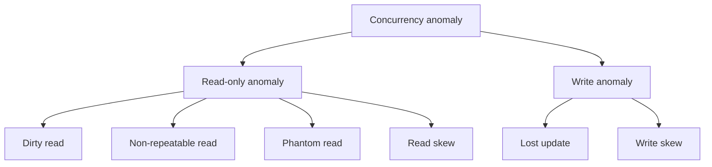

# Concurrency Anomalies — What Goes Wrong Without Isolation

> The SQL standard defines three "anomalies" (dirty read, non-repeatable read, phantom read). Practitioners add at least three more (lost update, read skew, write skew). Each is a way for two concurrent transactions to interfere and produce a result that no serial execution could have produced. Each has a precise Banking example.

## 1. What you already know

From [[00-ACID]]: Isolation is the property that makes concurrent transactions *appear serial*. When Isolation is weakened (for performance — see [[08-Trade-offs-Everywhere]]), concurrent transactions can observe each other's partial, intermediate, or future states. Those observations are *anomalies*. From [[00-Banking-Case-Study]]: rule 10 — *concurrent transfers are safe* — is the requirement that prevents these anomalies.

## 2. Why this layer exists

Full serializability is expensive (see [[05-Serializability]]). Databases offer weaker Isolation levels so that read-heavy or read-mostly workloads do not pay for serializability they do not need. But weakening Isolation opens the door to anomalies — and not all anomalies are equally harmful. The SQL standard therefore names the anomalies, lets each isolation level declare which it prevents, and lets the developer choose the cheapest level that prevents the anomalies they cannot tolerate.

You cannot choose the right isolation level without first knowing the anomalies by name and by example. This chapter is the catalog.

## 3. What is genuinely new

Six anomalies, each with a precise formal definition, a Banking example, and the Isolation level that prevents it. The two most important practical ones — *lost update* and *write skew* — are not in the SQL standard but are the ones that bite production systems most often. The standard's three (dirty/non-repeatable/phantom) are the easy ones; the additional three are the dangerous ones.

## 4. Concepts

### The SQL standard anomalies

**1. Dirty read.** T2 reads a row that T1 has written but not yet committed. If T1 then aborts, T2 has read data that never officially existed.

| T1 | T2 |
|---|---|
| `BEGIN` | |
| `UPDATE accounts SET balance = balance - 100 WHERE id = 1;` (balance now 400, uncommitted) | `BEGIN` |
| | `SELECT balance FROM accounts WHERE id = 1;` → 400 |
| `ROLLBACK;` (balance restored to 500) | |
| | `COMMIT;` (decision based on a balance that never existed) |

Banking example: a fraud-detection query reads the balance mid-flight during a transfer and triggers a false alert.

**2. Non-repeatable read.** T2 reads a row, then T1 modifies or deletes that row and commits, then T2 re-reads the row and gets different data.

| T1 | T2 |
|---|---|
| | `BEGIN` |
| | `SELECT balance FROM accounts WHERE id = 1;` → 500 |
| `BEGIN;` `UPDATE accounts SET balance = 400 WHERE id = 1;` `COMMIT;` | |
| | `SELECT balance FROM accounts WHERE id = 1;` → 400 (different!) |

Banking example: a statement generator that reads the balance, computes interest, and re-reads the balance to verify — the verification fails.

**3. Phantom read.** T2 runs a predicate query, then T1 inserts a row matching the predicate and commits, then T2 re-runs the query and gets additional rows.

| T1 | T2 |
|---|---|
| | `BEGIN` |
| | `SELECT COUNT(*) FROM ledger_entries WHERE amount > 10000;` → 5 |
| `BEGIN;` `INSERT INTO ledger_entries(account_id, amount) VALUES (1, 50000);` `COMMIT;` | |
| | `SELECT COUNT(*) FROM ledger_entries WHERE amount > 10000;` → 6 (phantom!) |

Banking example: a regulatory report that counts "large transactions" gets inconsistent numbers across two queries in the same transaction.

### The additional anomalies (the dangerous ones)

**4. Lost update.** T1 and T2 both read a row, both compute a new value based on the read, both write. One of the writes silently overwrites the other.

| T1 | T2 |
|---|---|
| `BEGIN` | `BEGIN` |
| `SELECT balance FROM accounts WHERE id = 1;` → 500 | `SELECT balance FROM accounts WHERE id = 1;` → 500 |
| | `UPDATE accounts SET balance = 400 WHERE id = 1;` (balance - 100) |
| `UPDATE accounts SET balance = 300 WHERE id = 1;` (balance - 200) | |
| `COMMIT;` | `COMMIT;` |

Final balance: 300. But two withdrawals of 100 and 200 from a 500 balance should leave 200. One withdrawal is *lost*. This is the classic concurrent-transfer bug.

Banking example: two ATM withdrawals from the same account at the same instant. Without protection, one withdrawal vanishes.

**5. Read skew (inconsistent analysis).** T2 reads two rows that T1 is in the middle of updating between them; T2 sees an inconsistent combination.

| T1 | T2 |
|---|---|
| `BEGIN` | `BEGIN` |
| `UPDATE accounts SET balance = 400 WHERE id = 1;` (debit account 1) | |
| | `SELECT balance FROM accounts WHERE id = 1;` → 400 |
| `UPDATE accounts SET balance = 600 WHERE id = 2;` (credit account 2) | |
| `COMMIT;` | `SELECT balance FROM accounts WHERE id = 2;` → 600 (was 500) |
| | Sum: 1000 — but the real total is 400+600=1000 too; looks ok? |

A subtler example: T2 reads account 1, sees the *post-debit* balance; T1 has not yet credited account 2; T2 reads account 2 and sees the *pre-credit* balance. Sum is 400+500=900 — but the invariant says the sum is conserved. The invariant temporarily fails *as observed by T2*.

Banking example: an audit job summing all account balances mid-transfer sees a total that violates conservation of money.

**6. Write skew.** T1 and T2 each read overlapping data, each verify a predicate holds, each write *different* rows so neither blocks the other, but together they violate an invariant the predicate was guarding.

Classic example: the "two doctors on call" rule. The invariant: at least one doctor must be on call. T1 sees two doctors on call, removes doctor A; T2 sees two doctors on call, removes doctor B; both commit; now no one is on call.

Banking example: rule "an account cannot have more than 5 transfers per day." T1 and T2 each see 4 transfers today for account 1, each inserts a 5th. Final count: 6. The check passed in both transactions because each saw the *pre-insert* state.

### Summary table

| Anomaly | Prevented by (standard level) | Prevented by (PostgreSQL) |
|---|---|---|
| Dirty read | READ COMMITTED | READ COMMITTED |
| Non-repeatable read | REPEATABLE READ | REPEATABLE READ |
| Phantom read | SERIALIZABLE | REPEATABLE READ (Snapshot Isolation) |
| Lost update | (not in standard) | REPEATABLE READ (errors on commit) |
| Read skew | (not in standard) | REPEATABLE READ (snapshot) |
| Write skew | (not in standard) | SERIALIZABLE only |

## 5. Banking application

The lost-update case in detail. Suppose two transfers out of account 1 (initial balance 500) happen simultaneously.

```java
// Both threads run this concurrently
public void withdraw(Connection c, long accountId, BigDecimal amount) throws SQLException {
    try (PreparedStatement s = c.prepareStatement(
            "SELECT balance FROM accounts WHERE id = ?")) {
        s.setLong(1, accountId);
        try (ResultSet rs = s.executeQuery()) {
            rs.next();
            BigDecimal balance = rs.getBigDecimal("balance");
            if (balance.compareTo(amount) < 0) throw new InsufficientFunds();
            BigDecimal newBalance = balance.subtract(amount);
            try (PreparedStatement u = c.prepareStatement(
                    "UPDATE accounts SET balance = ? WHERE id = ?")) {
                u.setBigDecimal(1, newBalance);
                u.setLong(2, accountId);
                u.executeUpdate();
            }
        }
    }
}
```

Under READ COMMITTED, both threads see balance = 500, both compute newBalance = 400 (one) or 300 (other), both write. Whichever writes last wins. The other withdrawal is *lost*.

The fix is one of:

1. Use `SERIALIZABLE` isolation — the second transaction's commit will fail; retry.
2. Use `REPEATABLE READ` (PostgreSQL snapshot isolation) — same effect.
3. Use an atomic `UPDATE accounts SET balance = balance - ? WHERE id = ? AND balance >= ?` and check the row count.
4. Use `SELECT ... FOR UPDATE` to lock the row.

Options 3 and 4 are the most common in production; option 1 is the cleanest but the most expensive.

## 6. Code / diagrams

### The anomaly taxonomy



### Lost-update timeline (ASCII)

```
Time →
T1:  BEGIN  read balance=500              compute 400  UPDATE(400)              COMMIT
T2:         BEGIN          read balance=500              compute 300  UPDATE(300)  COMMIT
                                                                                          Final: 300
                                                                                          Expected: 200
                                                                                          Lost: 100
```

### Atomic-update fix (PostgreSQL)

```sql
-- No race: a single statement is atomic; the WHERE clause is re-evaluated under the lock
UPDATE accounts
SET balance = balance - 100
WHERE id = 1 AND balance >= 100;
-- If rowcount = 0, the withdrawal must fail.
-- If rowcount = 1, success — no concurrent transaction can also have won.
```

### SELECT FOR UPDATE fix

```sql
BEGIN ISOLATION LEVEL READ COMMITTED;
SELECT balance FROM accounts WHERE id = 1 FOR UPDATE;  -- row lock held until COMMIT
-- application checks balance, computes new value
UPDATE accounts SET balance = ? WHERE id = 1;
COMMIT;
```

`FOR UPDATE` blocks the second transaction's `SELECT ... FOR UPDATE` until the first commits. No lost update.

## 7. What can go wrong

- **Assuming the SQL standard means what it says.** PostgreSQL's REPEATABLE READ is actually Snapshot Isolation, which is stronger than the standard requires. It prevents phantoms and lost updates. MySQL's REPEATABLE READ also prevents phantoms but does not error on lost update. Oracle's SERIALIZABLE is actually Snapshot Isolation. Always learn the implementation, not just the level name.
- **Write skew is invisible to most developers.** It does not produce an error; it produces wrong data. The "at most 5 transfers per day" check passes in both transactions, and the resulting count of 6 is silent.
- **Application-level checks are not enough.** A `SELECT` to check a predicate, followed by an `INSERT`, is a write-skew waiting to happen unless the read is locked or the isolation level is SERIALIZABLE.
- **Long read-only transactions at READ COMMITTED see inconsistent aggregates.** An audit job that sums 10 million rows at READ COMMITTED will see a different total depending on which concurrent writes happen between the first and last row scanned. Use REPEATABLE READ (or `REPEATABLE READ READ ONLY`) for audits.

## 8. Trade-offs

- **Strength vs abort rate.** SERIALIZABLE prevents every anomaly but aborts transactions it cannot serialize. Under heavy contention, abort rates can exceed 30% — throughput collapses. Snapshot Isolation is the practical middle.
- **Locking vs versioning.** `SELECT FOR UPDATE` is explicit, easy to reason about, and produces contention. MVCC (see [[04-MVCC]]) is invisible, automatic, and produces dead tuples. Choose based on contention pattern.
- **Atomic statements vs multi-statement transactions.** A single `UPDATE ... SET balance = balance - ?` is shorter, faster, and free of lost updates — but it cannot express "credit account 2, insert two ledger entries, write audit row" atomically. For multi-row invariants you need a transaction.
- **Correctness vs development speed.** `SERIALIZABLE` lets the developer ignore the entire catalog above. That is a powerful simplification — paid for in throughput. Many teams accept the cost for the correctness guarantee, then optimise specific hotspots down to weaker levels deliberately.

## 9. Forward links

- [[02-Isolation-Levels]] — the SQL levels and what each prevents.
- [[03-Two-Phase-Locking]] — how locking prevents lost updates and write skew.
- [[04-MVCC]] — how snapshot isolation prevents phantoms and read skew without locks.
- [[05-Serializability]] — the formal property that closes the loophole left by Snapshot Isolation (write skew).
- [[06-Deadlocks]] — the cost of locking for anomaly prevention.
- [[06-Transactions-In-SQL]] — `SET TRANSACTION ISOLATION LEVEL` syntax.
- [[00-Query-Optimization-Strategy]] — lock contention is a perf issue.
- [[00-Banking-Case-Study]] — rules 7 (idempotency) and 10 (concurrent safety).
