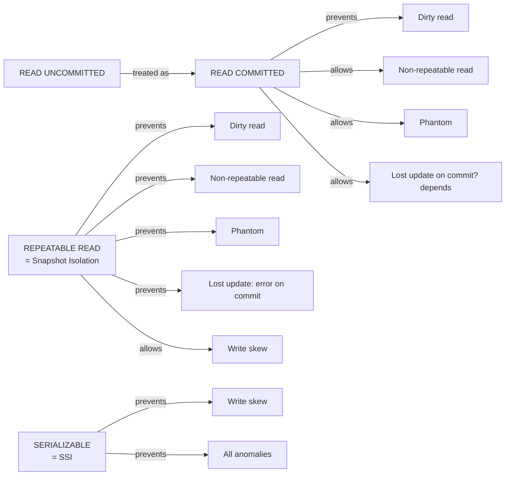

# Isolation Levels — The Spectrum from Wrong-But-Fast to Correct-But-Slow

> The SQL standard defines four levels. PostgreSQL implements them in a way that is sometimes *stronger* than the standard requires. The gap between the standard's prose and the database's actual guarantee is where most concurrency bugs live.

## 1. What you already know

From [[00-ACID]]: Isolation is the property that makes concurrent transactions appear serial. From [[01-Concurrency-Anomalies]]: six anomalies are possible when Isolation is weakened. The Isolation levels are the database's menu: pick the cheapest level that prevents the anomalies your code cannot tolerate.

## 2. Why this layer exists

Full serializability is correct but expensive. Many workloads do not need it: a balance read does not need to see a perfectly consistent snapshot; a statement generator does not need serial-equivalence with concurrent transfers. The database therefore offers *graded* Isolation, so each workload pays only for what it needs. The standard names four levels; PostgreSQL implements them via a mix of row-level locks and MVCC snapshots (see [[04-MVCC]]).

## 3. What is genuinely new

The four levels — READ UNCOMMITTED, READ COMMITTED, REPEATABLE READ, SERIALIZABLE — and the precise guarantees each gives in *PostgreSQL specifically*. The key surprise: PostgreSQL's REPEATABLE READ is Snapshot Isolation, which is *stronger* than the SQL standard's REPEATABLE READ. It prevents phantoms (against the standard's claim) and lost updates, but it does *not* prevent write skew. Only SERIALIZABLE closes that last gap, via SSI (Serializable Snapshot Isolation).

## 4. Concepts

### The SQL standard's table

The SQL standard defines isolation levels by the anomalies they *must* prevent:

| Level | Dirty read | Non-repeatable read | Phantom read |
|---|---|---|---|
| READ UNCOMMITTED | allowed | allowed | allowed |
| READ COMMITTED | prevented | allowed | allowed |
| REPEATABLE READ | prevented | prevented | allowed |
| SERIALIZABLE | prevented | prevented | prevented |

Notice: the standard does *not* mention lost update, read skew, or write skew. Those three were articulated later (Berenson et al. 1995, "A Critique of ANSI SQL Isolation Levels"). They are the anomalies that actually bite.

### The four levels

**READ UNCOMMITTED.** The lowest level. A transaction can read uncommitted changes made by other transactions. PostgreSQL *does not actually implement this level* — it treats `READ UNCOMMITTED` as `READ COMMITTED` (there is no performance benefit to going lower, and dirty reads are almost never useful). Some databases (older MySQL with certain engine settings, older SQL Server) do implement it.

**READ COMMITTED.** PostgreSQL's default. Each statement sees a fresh snapshot consisting of all transactions committed *before the statement began*. Within a single statement, the view is consistent. Across statements in the same transaction, the view can change — that is what allows non-repeatable reads and phantoms. Writes block on conflicting writes; the second writer waits for the first to commit or roll back, then re-reads the row and updates the *latest* version.

**REPEATABLE READ.** In PostgreSQL, this is **Snapshot Isolation**. The transaction takes its snapshot at the first statement (not at `BEGIN`!) and uses the *same* snapshot for the whole transaction. Reads never see other transactions' committed changes that occurred after the snapshot. This prevents non-repeatable reads *and* phantoms (against the standard's claim that phantoms are possible at this level). Writes that conflict with concurrent writes produce a serialization failure on commit — the application must retry.

What Snapshot Isolation does *not* prevent: **write skew** (see [[01-Concurrency-Anomalies]]). Two transactions can read overlapping data, each write a different row, both commit, and the resulting state violates an invariant neither checked at the right moment.

**SERIALIZABLE.** In PostgreSQL 9.1+, this is **SSI — Serializable Snapshot Isolation** (see [[05-Serializability]]). Snapshot Isolation is used as the base; on top, the database tracks *read-write dependencies* between transactions and aborts transactions whose commit would create an unsafe structure (a "dangerous structure" of three transactions forming a cycle). This guarantees true serializability with much lower overhead than old strict two-phase locking.

### The gap between standard and implementation

| Level (name) | SQL standard guarantees | PostgreSQL actually guarantees |
|---|---|---|
| READ UNCOMMITTED | dirty reads allowed | no dirty reads (treated as READ COMMITTED) |
| READ COMMITTED | no dirty reads | no dirty reads (statement snapshot) |
| REPEATABLE READ | no dirty / non-repeatable; phantoms allowed | no dirty / non-repeatable / phantoms / lost updates (snapshot isolation); write skew allowed |
| SERIALIZABLE | full serializability | full serializability (SSI) |

This table is the most important reference for designing concurrent applications on PostgreSQL. Read it twice.

### When the snapshot begins

A common confusion: in PostgreSQL, `BEGIN ISOLATION LEVEL REPEATABLE READ` does *not* take the snapshot at `BEGIN`. The snapshot is taken at the first statement (a `SELECT`, `UPDATE`, anything). This means a transaction can `BEGIN`, sit idle for an hour, then run its first statement and get a snapshot that is one hour old. The `SET TRANSACTION SNAPSHOT` feature allows one transaction to adopt another's snapshot, which is useful for parallel `pg_dump` workers.

## 5. Banking application

Different operations need different levels. Here is the banking decision table:

| Operation | Required level | Why |
|---|---|---|
| Transfer (debit + credit + ledger entries) | SERIALIZABLE | Money conservation invariant; lost update is unacceptable |
| Withdrawal (single account) | READ COMMITTED + atomic UPDATE | Single-statement atomic UPDATE is enough; no need for SERIALIZABLE |
| Balance inquiry (ATM) | READ COMMITTED | Slight staleness is fine; throughput matters |
| Monthly statement | REPEATABLE READ | Need a consistent snapshot across many queries |
| Regulatory audit (large) | REPEATABLE READ READ ONLY | Consistent snapshot for an hour-long read |
| Risk-engine batch | REPEATABLE READ | Need a consistent snapshot for the whole batch |

The Java service that picks the level per operation:

```java
public final class BankingService {

    private final DataSource ds;

    public void transfer(long from, long to, BigDecimal amount) throws SQLException {
        try (Connection c = ds.getConnection()) {
            c.setTransactionIsolation(Connection.TRANSACTION_SERIALIZABLE);
            c.setAutoCommit(false);
            // ... debit, credit, ledger entries, audit row ...
            c.commit();
        }
    }

    public BigDecimal balance(long accountId) throws SQLException {
        try (Connection c = ds.getConnection()) {
            // Default isolation = READ COMMITTED; fine for a balance read
            try (PreparedStatement s = c.prepareStatement(
                    "SELECT balance FROM accounts WHERE id = ?")) {
                s.setLong(1, accountId);
                try (ResultSet rs = s.executeQuery()) {
                    rs.next();
                    return rs.getBigDecimal("balance");
                }
            }
        }
    }

    public Statement generateStatement(long accountId, YearMonth period) throws SQLException {
        try (Connection c = ds.getConnection()) {
            c.setTransactionIsolation(Connection.TRANSACTION_REPEATABLE_READ);
            c.setAutoCommit(false);
            BigDecimal opening = openingBalance(c, accountId, period);
            List<LedgerEntry> entries = entriesFor(c, accountId, period);
            BigDecimal closing = opening;  // computed from the same snapshot
            for (var e : entries) closing = closing.add(e.amount());
            c.commit();
            return new Statement(accountId, period, opening, entries, closing);
        }
    }
}
```

Notice the statement generator: with REPEATABLE READ, the `openingBalance` and `entriesFor` queries see the *same* snapshot. A transfer that commits between the two queries is invisible to the statement — which is exactly what we want.

## 6. Code / diagrams

### The level-vs-anomaly matrix (PostgreSQL)



### SSI abort and retry pattern

```java
public void runSerializable(SqlAction action) throws SQLException {
    int attempts = 0;
    while (true) {
        try (Connection c = ds.getConnection()) {
            c.setTransactionIsolation(Connection.TRANSACTION_SERIALIZABLE);
            c.setAutoCommit(false);
            try {
                action.run(c);
                c.commit();
                return;
            } catch (SQLException e) {
                if ("40001".equals(e.getSQLState())) {
                    // serialization_failure — retry
                    if (++attempts > 10) throw e;
                    continue;
                }
                c.rollback();
                throw e;
            }
        }
    }
}

@FunctionalInterface
public interface SqlAction {
    void run(Connection c) throws SQLException;
}
```

### SQL showing the gap

```sql
-- Session A                                  -- Session B
BEGIN ISOLATION LEVEL REPEATABLE READ;
                                              BEGIN ISOLATION LEVEL REPEATABLE READ;
SELECT balance FROM accounts WHERE id = 1;
-- returns 500
                                              SELECT balance FROM accounts WHERE id = 1;
                                              -- returns 500
                                              UPDATE accounts SET balance = 400 WHERE id = 1;
                                              COMMIT;
UPDATE accounts SET balance = 300 WHERE id = 1;
-- ERROR: could not serialize access due to concurrent update
-- PostgreSQL detected the conflict and aborted this transaction.
-- Application must retry.
ROLLBACK;
```

This is the "first-updater-wins" rule of Snapshot Isolation: the second writer is told to retry, *not* silently lost.

## 7. What can go wrong

- **Picking the level by habit.** "Always SERIALIZABLE" gives correctness but kills throughput under contention. "Always READ COMMITTED" gives throughput but introduces write-skew bugs. The right level depends on the operation.
- **Forgetting that the snapshot is taken at first statement.** A transaction that `BEGIN`s, waits for user input, then queries sees a stale snapshot — sometimes desired, often surprising. Use `BEGIN ISOLATION LEVEL REPEATABLE READ` immediately before the first query if you want a tight snapshot.
- **Ignoring the SQLSTATE 40001.** SERIALIZABLE transactions *will* abort under contention. If the application does not retry, the user sees an error. This is the cost of correctness; embrace it.
- **Mixing levels in the same transaction.** You cannot lower the isolation level after the first query. Plan the level upfront.
- **Treating REPEATABLE READ as SERIALIZABLE.** Snapshot Isolation prevents most anomalies but not write skew. If your transaction relies on a multi-row invariant ("at most 5 transfers per day"), REPEATABLE READ is *not enough*.
- **Treating SERIALIZABLE as a silver bullet.** SSI adds overhead (predicate lock tracking, more aborts). Bench-mark it; do not assume it is free.

## 8. Trade-offs

- **Correctness vs throughput.** Each step up the ladder cuts throughput under contention. The exact cost depends on the workload; benchmarks are essential.
- **Simplicity vs tuning.** SERIALIZABLE is the simplest to reason about (the developer can ignore the anomaly catalog) but the most expensive. READ COMMITTED requires the developer to know the catalog and use explicit locks or atomic updates where needed.
- **PostgreSQL vs portability.** Code that relies on PostgreSQL's REPEATABLE READ preventing phantoms will produce wrong results if ported to a database whose REPEATABLE READ allows phantoms (e.g., SQL Server's default). Know the implementation, not just the level name.
- **Retry latency vs abort rate.** More retries = more user-visible latency. Under heavy contention, the retries can dominate the response time. Sometimes the right answer is to lower the level and use explicit locks.

## 9. Forward links

- [[03-Two-Phase-Locking]] — the classic mechanism for SERIALIZABLE before SSI.
- [[04-MVCC]] — how PostgreSQL implements snapshot isolation.
- [[05-Serializability]] — the formal property and SSI in detail.
- [[06-Deadlocks]] — the cost of locking-based isolation.
- [[06-Transactions-In-SQL]] — `SET TRANSACTION ISOLATION LEVEL` syntax.
- [[04-Unit-of-Work]] — the ORM's transaction boundary; usually defaults to READ COMMITTED.
- [[00-Query-Optimization-Strategy]] — lock contention as a performance problem.
- [[08-Trade-offs-Everywhere]] — isolation as a trade-off axis.
- [[00-Banking-Case-Study]] — rules 5, 7, 10.
