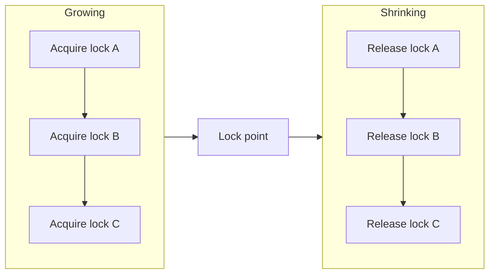
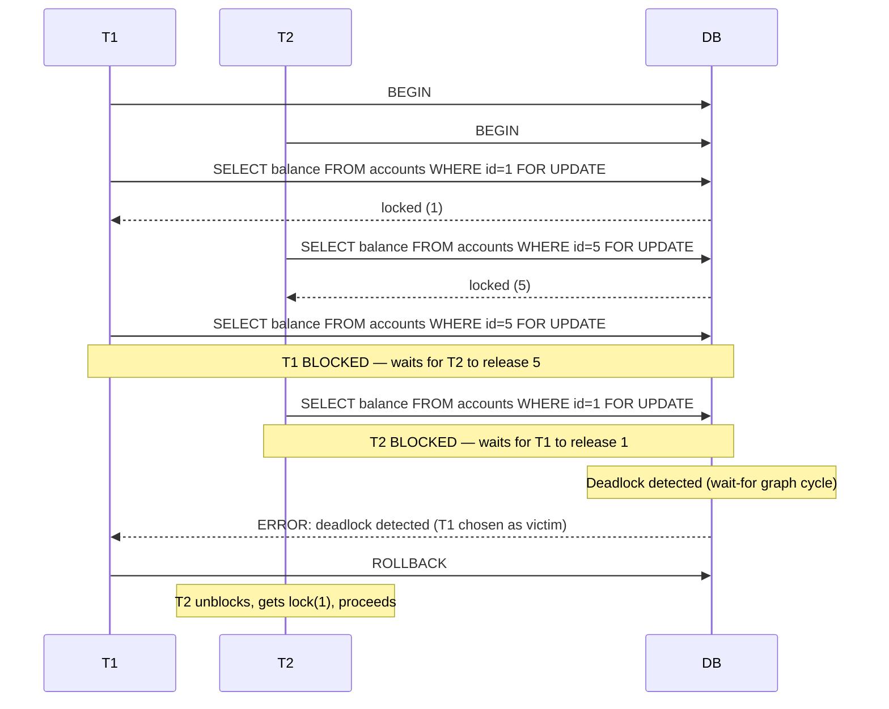
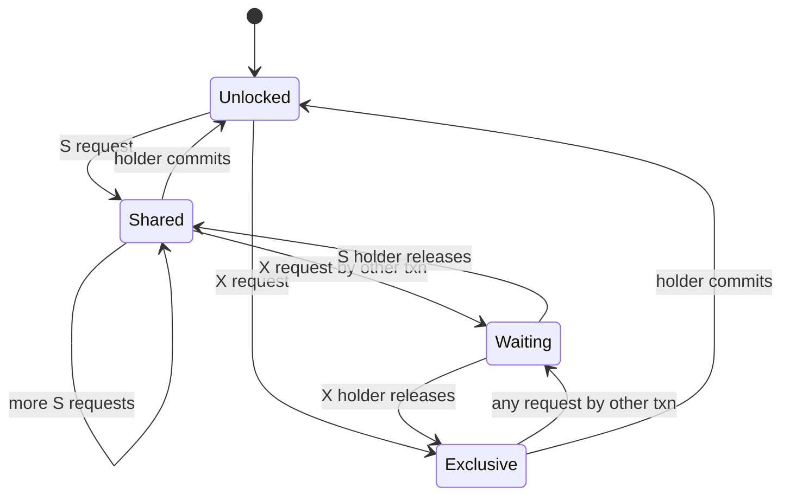

# Two-Phase Locking — The Classical Algorithm for Serializability

> Before MVCC and SSI, every serializable database used locking. Two-Phase Locking (2PL) is the foundational theorem of locking-based concurrency control. It is the algorithm the SQL standard implicitly assumed when it defined SERIALIZABLE. It is also the algorithm that taught the database community about deadlocks.

## 1. What you already know

From [[00-ACID]]: Isolation requires concurrent transactions to *appear serial*. From [[02-Isolation-Levels]]: SERIALIZABLE is the strongest level, and PostgreSQL implements it via SSI (a non-locking algorithm). This chapter goes back to the *original* mechanism for serializability — locking — because (a) many databases (older MySQL InnoDB, SQL Server by default, Oracle's "SERIALIZABLE" is actually Snapshot Isolation but historically) still use it, and (b) the deadlock problem is universal, regardless of mechanism. From [[01-Concurrency-Anomalies]]: locks are how you prevent lost updates and write skew without MVCC.

## 2. Why this layer exists

The theorem (Eswaran et al., 1976) is simple: *if every transaction acquires all its locks before releasing any of them, the resulting schedule is conflict-serializable.* That theorem gives a sufficient condition for serializability that is easy to enforce: just keep locks in two phases.

The cost is severe: locks are held longer, contention is higher, and deadlocks become possible (and frequent). 2PL is the textbook algorithm precisely because its trade-offs are so visible.

## 3. What is genuinely new

The two phases (growing, shrinking), the three variants (basic, strict, rigorous), the deadlock problem, and the lock-ordering discipline that prevents deadlocks in practice. The connection between strict 2PL and "no cascading aborts." The reason SSI exists: to provide serializability without locking, precisely because locking has these costs.

## 4. Concepts

### Basic 2PL

A transaction's life is divided into two phases:

1. **Growing phase.** The transaction acquires locks. It does not release any.
2. **Shrinking phase.** The transaction releases locks. It does not acquire any.

The transition point is called the *lock point*. Once a transaction starts releasing, it cannot acquire more.



The theorem: any schedule produced by a set of 2PL transactions is conflict-serializable (see [[05-Serializability]]).

### Strict 2PL

Basic 2PL has a problem: a transaction can release a write lock *before commit*, exposing its uncommitted value to another transaction that reads it. If the first transaction then aborts, the second transaction must also abort — *cascading abort*.

**Strict 2PL** fixes this: write locks are held until *commit or abort*. Read locks can be released earlier. This prevents cascading aborts because no other transaction can ever read uncommitted data.

### Rigorous 2PL

**Rigorous 2PL** (sometimes just called "strict 2PL"): both read and write locks are held until commit/abort. This is what most textbooks mean by "2PL" today. It is the simplest variant to reason about, because the lock-release point is always the same: end of transaction.

### Lock types

- **Shared (S) lock** — for reads. Multiple transactions can hold S locks on the same row simultaneously.
- **Exclusive (X) lock** — for writes. Only one transaction can hold an X lock; no other transaction can hold S or X on the same row.

Compatibility matrix:

| | S | X |
|---|---|---|
| **S** | ✓ | ✗ |
| **X** | ✗ | ✗ |

### The deadlock problem

Two transactions, two locks, opposite order:

```
T1: lock(A), then tries lock(B)
T2: lock(B), then tries lock(A)
```

T1 waits for T2 to release B; T2 waits for T1 to release A. Neither can proceed. The database must detect this and abort one of them. See [[06-Deadlocks]] for the full theory.

### Deadlock prevention by lock ordering

If every transaction acquires locks in the *same order*, deadlocks are impossible. The classic rule: lock rows in ascending primary-key order.

For a transfer from account 1 to account 5, the service always locks the lower-numbered account first. If another transfer goes from 5 to 1, it also locks 1 first, then 5. The locks no longer form a cycle.

## 5. Banking application

Two transfers in opposite directions, naive code:

```java
// Naive — deadlocks under concurrent opposite-direction transfers
public void transfer(Connection c, long from, long to, BigDecimal amount) throws SQLException {
    lock(c, from);                              // SELECT ... FOR UPDATE on `from`
    lock(c, to);                                // SELECT ... FOR UPDATE on `to`
    debit(c, from, amount);
    credit(c, to, amount);
    insertLedgerEntries(c, from, to, amount);
}
```

Concurrent `transfer(1, 5, 100)` and `transfer(5, 1, 50)` deadlock: T1 holds lock(1) and waits for lock(5); T2 holds lock(5) and waits for lock(1).

The fix — *deterministic lock ordering*:

```java
public void transfer(Connection c, long from, long to, BigDecimal amount) throws SQLException {
    long first  = Math.min(from, to);
    long second = Math.max(from, to);
    lock(c, first);                              // always lock the lower ID first
    lock(c, second);
    if (from < to) {
        debit(c, from, amount); credit(c, to, amount);
    } else {
        credit(c, to, amount); debit(c, from, amount);  // amounts handled here
    }
    insertLedgerEntries(c, from, to, amount);
}

private void lock(Connection c, long accountId) throws SQLException {
    try (PreparedStatement s = c.prepareStatement(
            "SELECT balance FROM accounts WHERE id = ? FOR UPDATE")) {
        s.setLong(1, accountId);
        try (ResultSet rs = s.executeQuery()) {
            if (!rs.next()) throw new AccountNotFound(accountId);
        }
    }
}
```

Now both transfers lock account 1 first, then account 5. One of them gets both locks and proceeds; the other waits. No cycle. No deadlock.

## 6. Code / diagrams

### The deadlock scenario



### Lock compatibility — state diagram



### SQL — strict 2PL via explicit locks

```sql
BEGIN;
-- Growing phase: acquire all locks
SELECT balance FROM accounts WHERE id = 1 FOR UPDATE;  -- X-lock on row 1
SELECT balance FROM accounts WHERE id = 5 FOR UPDATE;  -- X-lock on row 5
-- Lock point: locks held, work done
UPDATE accounts SET balance = balance - 100 WHERE id = 1;
UPDATE accounts SET balance = balance + 100 WHERE id = 5;
INSERT INTO ledger_entries(account_id, amount) VALUES
    (1, -100), (5, +100);
-- Shrinking phase (in strict 2PL, this is the COMMIT)
COMMIT;
-- Locks released atomically at commit
```

## 7. What can go wrong

- **Deadlocks.** The unavoidable cost of 2PL under contention. Either detect (wait-for graph) or prevent (lock ordering, timeouts, wound-wait, wait-die). See [[06-Deadlocks]].
- **Long lock-hold times.** A transaction that locks a row, then makes a slow HTTP call before committing, holds the lock for the entire call. Rule: never make external calls inside a transaction.
- **Lock escalation.** Some databases escalate many row locks to a single table lock when the count exceeds a threshold. PostgreSQL does not; SQL Server and DB2 do. Table locks drastically reduce concurrency.
- **Phantom problem under basic 2PL.** Predicate queries (`SELECT WHERE balance > 1000`) need *predicate locks* (or *gap locks*) to prevent phantoms. Predicate locks are expensive; this is one reason SSI replaced 2PL in PostgreSQL.
- **Cascading aborts under basic 2PL.** A transaction that releases its write locks before commit exposes uncommitted data. Strict 2PL is the fix.
- **Reader starvation.** Under strict 2PL, a long-running writer can block readers. MVCC (see [[04-MVCC]]) fixes this by giving readers a snapshot.

## 8. Trade-offs

- **Strictness vs concurrency.** Rigorous 2PL is the safest (no cascading aborts) but holds locks the longest. Basic 2PL releases locks sooner, improving concurrency but risking cascading aborts.
- **Locking vs MVCC.** Locking is simple, well-understood, and works for write-write conflicts. MVCC gives readers a snapshot so they never block — but it costs version storage and `VACUUM` overhead (see [[04-MVCC]]).
- **2PL vs SSI for SERIALIZABLE.** 2PL on predicates is expensive (gap locks, range locks). SSI tracks *read-write dependencies* instead, which is much lighter for most workloads but produces more aborts in others.
- **Lock ordering vs flexibility.** Deterministic lock ordering eliminates deadlocks but requires every transaction to know the global order. In a service-oriented system, that order is not always knowable.
- **Locking granularity.** Row locks are precise but many; table locks are few but blunt. PostgreSQL uses row locks by default; explicit `LOCK TABLE` is available when needed.

## 9. Forward links

- [[04-MVCC]] — PostgreSQL's primary concurrency mechanism; avoids the read-blocks-write problem of 2PL.
- [[05-Serializability]] — the formal property 2PL guarantees.
- [[06-Deadlocks]] — the cost of 2PL, in depth.
- [[02-Isolation-Levels]] — what each level corresponds to in 2PL terms (RC = short locks, RR = long locks, SER = 2PL or SSI).
- [[00-ACID]] — Isolation, the property 2PL enforces.
- [[00-Query-Optimization-Strategy]] — lock contention as a performance issue.
- [[08-Trade-offs-Everywhere]] — strictness vs concurrency as a trade-off axis.
- [[00-Banking-Case-Study]] — rule 10 (concurrent transfers safe).
