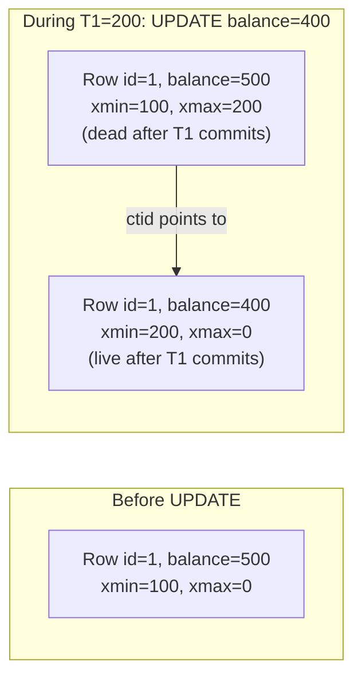
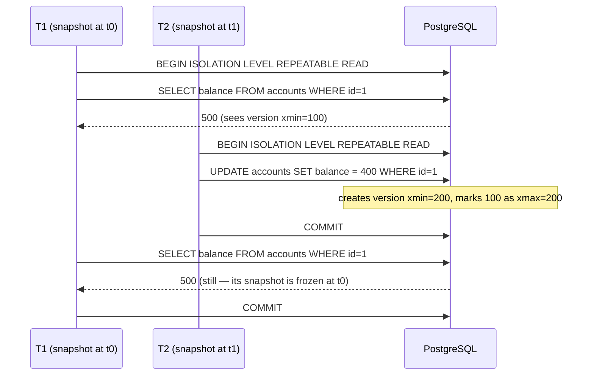

# MVCC — Multi-Version Concurrency Control

> The single biggest reason PostgreSQL scales as well as it does for read-heavy workloads. MVCC gives every transaction its own snapshot of the database, so readers never block writers and writers never block readers. The cost is version storage and the need for `VACUUM`.

## 1. What you already know

From [[03-Two-Phase-Locking]]: in classic locking, a reader takes a shared lock, a writer takes an exclusive lock, and they block each other. From [[02-Isolation-Levels]]: PostgreSQL's READ COMMITTED and REPEATABLE READ are snapshot-based. From [[01-Concurrency-Anomalies]]: lost updates and write skew are still possible under snapshot isolation. From [[02-Buffer-Pool]]: dirty pages live in memory; the on-disk page is not the truth.

## 2. Why this layer exists

Locking works, but it has a brutal cost: a long-running read transaction blocks writes to the rows it has read, and a writer blocks readers from seeing consistent data. For a banking system where a 30-minute regulatory audit runs alongside millions of transfers, locking is unworkable.

MVCC solves this by keeping *multiple versions* of each row. Each transaction sees the version of the row that was the latest committed version *when the transaction's snapshot was taken*. Readers see a consistent view; writers create new versions; neither blocks the other.

The idea is old (Reed, 1978, "Naming and Synchronization in a Decentralized Computer System"), but PostgreSQL's implementation is the canonical modern example.

## 3. What is genuinely new

PostgreSQL's tuple-versioning: every row has `xmin` (the transaction that created it) and `xmax` (the transaction that deleted it). A snapshot is described by `(xmin, xmax, xip)` — the transaction IDs that were in-flight when the snapshot was taken. Visibility is decided by a precise rule comparing the row's `xmin`/`xmax` to the snapshot. The cost: dead tuples accumulate and must be reclaimed by `VACUUM`. Write-write conflicts are still resolved by locking — MVCC does *not* eliminate write contention, only read-write contention.

## 4. Concepts

### The tuple header

Every PostgreSQL row (tuple) carries hidden system columns:

| Column | Meaning |
|---|---|
| `xmin` | Transaction ID that inserted this version of the row |
| `xmax` | Transaction ID that deleted/updated this version (0 if still alive) |
| `cmin`/`cmax` | Command IDs within the inserting/deleting transaction (for intra-transaction visibility) |
| `ctid` | Physical location (page, offset) of this tuple; for updates, points to the new version |

When you `UPDATE` a row, PostgreSQL does *not* modify the row in place. It writes a *new* tuple with a new `xmin`, marks the old tuple with the updating transaction's ID in `xmax`, and sets the old tuple's `ctid` to point at the new one.

### Visibility rule

A snapshot is described by `(xmin horizon, xmax horizon, in-progress list)`:

- `xmin horizon` — the transaction ID below which all transactions had committed before the snapshot was taken.
- `xmax horizon` — the first transaction ID that had not started when the snapshot was taken.
- `in-progress list` — the transaction IDs that were in-flight at snapshot time.

A tuple with `xmin = T` and `xmax = U` is visible to a snapshot `S` if and only if:

- `T` committed before `S` began (i.e., `T < S.xmin` or `T` committed and is not in `S.in_progress`), AND
- `U` did not commit before `S` began (`U >= S.xmax`, or `U` is in `S.in_progress`, or `U = 0`).

### The two isolation levels under MVCC

- **READ COMMITTED** — a new snapshot is taken at the start of *every statement*. Within a statement, the view is consistent. Across statements, it can change.
- **REPEATABLE READ** (Snapshot Isolation) — one snapshot is taken at the first statement and used for the whole transaction.

### Write-write conflicts: first-updater-wins

MVCC does not prevent write-write conflicts. Two transactions trying to update the same row are serialized via a row-level lock:

- T1 updates row R: R's old version gets `xmax = T1`. T1 holds a write lock on R.
- T2 tries to update R: it must wait for T1 to commit or abort.
- If T1 commits, T2 re-reads R (it sees the new version) and applies its update on top. The snapshot of T2 is *not* used for the re-read; the *latest committed* version is. This is why PostgreSQL's REPEATABLE READ prevents lost updates — T2 cannot silently overwrite T1.
- If T2's snapshot would have caused it to update a version that is no longer the latest, PostgreSQL raises `ERROR: could not serialize access due to concurrent update`. The application must retry.

This is the "first-updater-wins" rule of Snapshot Isolation.

### Dead tuples and VACUUM

When a row is updated, the old version becomes a *dead tuple* — still on disk, but invisible to all current snapshots. Eventually it will be invisible to *all* snapshots. Until it is reclaimed, it consumes disk and slows scans.

`VACUUM` scans tables, identifies dead tuples, and marks their space as reusable. `VACUUM FULL` rewrites the table to compact it (but locks the table). Autovacuum runs in the background and is essential for write-heavy PostgreSQL databases.

If `VACUUM` does not keep up, the table *bloats*: many dead tuples accumulate, indexes grow, scans slow down, and the cache hit ratio drops. Bloat is the most common performance problem on PostgreSQL write-heavy systems.

## 5. Banking application

How `SELECT balance FROM accounts WHERE id = $1` returns a consistent snapshot even as transfers update the account.

Imagine:

- Account 1's row has been updated 10 times today. The table has 10 versions of the row, only the latest of which is "live."
- A long-running statement generator takes a snapshot at 12:00.
- Concurrently, transfers update account 1 at 12:05, 12:10, 12:15.

The statement generator's `SELECT` follows the visibility rule:

```sql
-- The hidden system columns are visible via SELECT
SELECT xmin, xmax, balance FROM accounts WHERE id = 1;

--  xmin  |  xmax  | balance
-- -------+--------+---------
--  12340 |  12350 | 500.00     -- old version, superseded by txn 12350
--  12350 |  12360 | 400.00     -- old version, superseded by txn 12360
--  12360 |      0 | 300.00     -- current live version
```

If the statement generator's snapshot was taken when transaction 12340 had committed but 12350 had not, it sees the first row (the version with `xmin = 12340`). The newer versions are invisible — they were created by transactions whose `xmin` is later than the snapshot's horizon.

The Java code is identical regardless of MVCC internals — that is the abstraction at work (see [[04-Abstraction-and-Models]]):

```java
public BigDecimal balanceAtSnapshot(Connection c, long accountId) throws SQLException {
    // c is REPEATABLE READ — its snapshot is fixed at the first statement
    try (PreparedStatement s = c.prepareStatement(
            "SELECT balance FROM accounts WHERE id = ?")) {
        s.setLong(1, accountId);
        try (ResultSet rs = s.executeQuery()) {
            rs.next();
            return rs.getBigDecimal("balance");
        }
    }
}
```

But internally, PostgreSQL's executor is doing something far more sophisticated than "read the row from disk." It is selecting which version of the row matches the transaction's snapshot — and that selection is what gives us isolation without locks.

## 6. Code / diagrams

### The update creates a new version



### Visibility under REPEATABLE READ



### Seeing MVCC at work

```sql
-- Open two psql sessions

-- Session 1
BEGIN ISOLATION LEVEL REPEATABLE READ;
SELECT pg_current_snapshot();
-- (xmin, xmax, xip list)
-- e.g. (1000:1005:1001,1003) — xmin=1000, xmax=1005, in-flight = {1001,1003}

-- Session 2
UPDATE accounts SET balance = balance - 100 WHERE id = 1;
-- (creates a new tuple, commits)

-- Session 1
SELECT balance FROM accounts WHERE id = 1;
-- still sees the old balance; its snapshot excludes the update.

SELECT xmin, xmax, balance FROM accounts WHERE id = 1;
-- xmin    | xmax | balance
-- 1000    | 0    | 500.00     -- the version visible to this snapshot

COMMIT;
-- Now session 1's transaction is over. A new query would see:
SELECT balance FROM accounts WHERE id = 1;
-- 400.00 (the updated version)
```

### VACUUM in action

```sql
-- Before VACUUM: dead tuples occupy space
SELECT pg_stat_get_dead_tuples('accounts'::regclass);
-- e.g. 1500000

VACUUM (VERBOSE, ANALYZE) accounts;
-- INFO:  vacuuming "public.accounts"
-- INFO:  removed 1500000 dead row versions in 5432 pages
-- INFO:  table "accounts": found 1500000 removable, 1200000 nonremovable row versions

-- After VACUUM: dead tuples removed (space reusable, not returned to OS)
SELECT pg_stat_get_dead_tuples('accounts'::regclass);
-- 0
```

The "nonremovable" row versions in the output are versions still visible to some open transaction. This is why long-running transactions are so damaging — they prevent `VACUUM` from reclaiming dead tuples, and bloat grows.

## 7. What can go wrong

- **Bloat.** Heavy updates + slow `VACUUM` = table and index bloat. Symptoms: slow scans, falling cache hit ratio, growing table size on disk. Fix: tune autovacuum, run manual `VACUUM` during low-traffic windows, or `VACUUM FULL` (with downtime).
- **Long-running transactions hold back the xmin horizon.** A transaction that runs for an hour means `VACUUM` cannot reclaim any tuple that became dead during that hour, even if no other transaction needs it. Rule: kill idle transactions; use `idle_in_transaction_session_timeout`.
- **XID wraparound.** Transaction IDs are 32-bit. After 2 billion transactions, the counter wraps; without `VACUUM` to mark old tuples as "frozen" (visible to every future transaction), the database would lose track of which tuples are old. PostgreSQL's autovacuum runs *anti-wraparound* vacuums to freeze old tuples. If this fails, the database shuts down to protect itself — a famous production outage mode.
- **Snapshot lag in replicas.** A replica applies WAL serially. A long-running query on the replica can block WAL application, causing replication lag. PostgreSQL 9.6+ has `max_standby_streaming_delay` and conflict resolution; in 14+, the conflict is resolved by cancelling the long query.
- **Subtransaction overhead.** `SAVEPOINT` creates a subtransaction; each adds bookkeeping. Excessive subtransactions (e.g., one per row in a large batch) can slow down commits and conflict resolution.
- **Catalog bloat.** Heavy DDL (create/drop temp tables) bloats system catalogs. Autovacuum handles it, but the catalogs are smaller and more sensitive.

## 8. Trade-offs

- **Reader concurrency vs version storage.** MVCC gives you free readers — at the cost of dead tuples that need `VACUUM`. The cost is paid by background workers, not by the read itself.
- **Update in place vs new version.** Updating in place would be cheaper in I/O, but it would break the snapshot invariant. PostgreSQL always creates a new version. (Some engines — InnoDB with `READ COMMITTED` — do hybrid; this is one source of differences between databases.)
- **HOT updates vs index updates.** PostgreSQL's *Heap-Only Tuple* (HOT) update avoids updating indexes when no indexed column changed. Greatly speeds up updates that touch only non-indexed columns. Requires the new version to fit on the same page — so a moderately full page prevents HOT and forces index updates.
- **VACUUM cost vs write throughput.** More aggressive autovacuum reclaims space faster but uses more I/O. The tuning is workload-specific.
- **MVCC vs locking for write-heavy workloads.** MVCC shines for read-heavy. For pure write contention on a small set of rows, locking (or atomic `UPDATE`) is often faster than creating versions.

## 9. Forward links

- [[02-Isolation-Levels]] — how snapshot isolation maps to REPEATABLE READ.
- [[05-Serializability]] — SSI, the algorithm that adds true serializability on top of MVCC.
- [[00-WAL-Logging]] — how MVCC writes are logged for crash recovery.
- [[02-Buffer-Pool]] — where dirty versions live before being flushed.
- [[02-Checkpoints]] — how checkpoints interact with the WAL.
- [[03-Backup-And-Recovery]] — VACUUM and bloat considerations for backup strategy.
- [[00-Query-Optimization-Strategy]] — bloat as a performance problem.
- [[00-CAP-PACELC]] — MVCC is a single-node technique; distributed MVCC is much harder.
- [[00-Banking-Case-Study]] — rule 10 (concurrent transfers safe).
