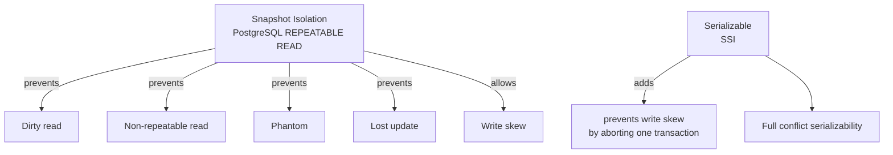

# Serializability — The Formal Definition and SSI

> The strongest isolation guarantee. A schedule is serializable if it is *equivalent* to some serial execution. This chapter gives the formal definition, the two flavors (conflict and view), the test (precedence graph), and the modern algorithm that delivers true serializability on top of MVCC: SSI — Serializable Snapshot Isolation.

## 1. What you already know

From [[00-ACID]]: Isolation means concurrent transactions appear serial. From [[02-Isolation-Levels]]: SERIALIZABLE is the strongest level, and PostgreSQL implements it via SSI. From [[04-MVCC]]: Snapshot Isolation (PostgreSQL's REPEATABLE READ) gives each transaction a snapshot but permits *write skew*. The gap between Snapshot Isolation and true serializability is exactly what SSI closes.

## 2. Why this layer exists

"Appears serial" sounds intuitive, but it is not precise enough. Does it mean *the same order* for all transactions, or *some order* for each? Does it mean the same final state, or the same intermediate reads? Two formal definitions exist — *conflict serializability* and *view serializability* — and they differ. The theory matters because it tells you what you can prove and what you cannot; it tells you why SSI exists and why it aborts transactions the way it does.

## 3. What is genuinely new

The formal definitions: a *schedule* (a sequence of operations of multiple transactions); *conflict serializability* (the schedule is equivalent to a serial schedule by swapping non-conflicting operations); *view serializability* (the schedule has the same read results as some serial schedule). The precedence-graph test for conflict serializability (acyclic ⇒ serializable). The fundamental gap: Snapshot Isolation is *not* serializable (write skew). The SSI algorithm: track read-write dependencies, detect "dangerous structures" of three transactions, abort one to break the structure.

## 4. Concepts

### Schedule

A *schedule* over transactions T1, T2, ..., Tn is a sequence of their operations (read, write, commit, abort) preserving the per-transaction order. Two operations *conflict* if they are from different transactions, on the same data item, and at least one is a write.

Three conflict types:

| Pair | Conflicts? |
|---|---|
| read-read | No |
| read-write | Yes |
| write-write | Yes |

### Conflict serializability

A schedule is *conflict serializable* if it can be transformed into a *serial schedule* by swapping non-conflicting adjacent operations.

The test: build a *precedence graph*. Each transaction is a node. For each pair of conflicting operations between Ti and Tj (in that order), add an edge Ti → Tj. The schedule is conflict serializable iff the graph is *acyclic*.

If acyclic, a topological sort gives a serial order equivalent to the schedule.

### View serializability

A schedule is *view serializable* if, for every read operation, the value it reads is the same as in *some* serial schedule. View serializability is strictly more general than conflict serializability — there are schedules that are view-serializable but not conflict-serializable. But view serializability is NP-hard to test, and no practical database enforces it. When we say "serializable" we mean "conflict serializable."

### Why Snapshot Isolation is not serializable

Snapshot Isolation guarantees:

- Each transaction reads from a consistent snapshot.
- First-updater-wins for writes — the second writer is aborted.

But it allows *write skew*: two transactions each read overlapping data, each writes a different row, each commits. The result can violate an invariant that no serial execution would violate.

Example (the "two-doctors" pattern applied to banking):

- Invariant: account 1's balance + account 2's balance ≥ 100 (some minimum liquidity).
- T1 reads both balances (sees 60 + 50 = 110). Decides account 1 can be debited by 30 (leaving 30 + 50 = 80 ≥ 100? No, 80 < 100. So actually let's say the invariant is sum ≥ 80). Reading 60+50=110 ≥ 80, debits account 1 by 30, leaving 30+50=80. OK.
- T2 reads both balances (snapshot taken before T1 commits). Sees 60 + 50 = 110. Decides account 2 can be debited by 30 (leaving 60 + 20 = 80). OK.
- Both commit. Final state: 30 + 20 = 50. Invariant violated.

In any serial order (T1 then T2, or T2 then T1), the second transaction would have read the post-first-write state and refused the debit. Snapshot Isolation let both see the pre-state, so neither noticed the conflict. This is *not* serializable.

### SSI — Serializable Snapshot Isolation

SSI (Cahill, 2008; adopted by PostgreSQL in 9.1) provides true serializability on top of Snapshot Isolation by tracking *read-write dependencies*:

- A transaction's *read* of a data item that another transaction *writes* is a `rw-dependency`.
- The set of `rw-dependencies`, plus the standard `ww-dependencies` (handled by first-updater-wins) and `wr-dependencies` (handled by snapshot), is tracked.

A **dangerous structure** is a cycle of three transactions: T1 reads something T2 writes, T2 reads something T3 writes, T3 reads something T1 writes. If all three commit, the result is not serializable. SSI aborts one of them — usually the one that has done the least work.

In practice, SSI tracks *predicate locks* on read sets. When a write conflicts with an outstanding predicate lock, the read transaction's *SIREAD* (serializable-read) lock is "upgraded" to a conflict; if a dangerous structure forms, one transaction is aborted with SQLSTATE 40001 (`serialization_failure`).

The cost: bookkeeping for predicate locks. PostgreSQL uses *SIREAD locks* stored in memory, with graceful degradation to finer/coarser granularity as memory pressure grows. Under low contention, the cost is minimal; under high contention, abort rates climb.

## 5. Banking application

The two-doctors pattern, in banking: an account-pair liquidity invariant. (Contrived, but real banks do have analogous multi-account invariants.)

```sql
-- Schema: each account has a balance; rule: sum of accounts 1 and 2 must be ≥ 100
ALTER TABLE accounts ADD CONSTRAINT liquidity_chk CHECK (true); -- placeholder

-- T1: debit account 1 by 30 if sum ≥ 100
-- T2: debit account 2 by 30 if sum ≥ 100
-- Both run concurrently
```

Under REPEATABLE READ (Snapshot Isolation), both see 60 + 50 = 110, both proceed, final state 30 + 20 = 50. Invariant violated. Silent failure.

Under SERIALIZABLE (SSI):

```java
public void withdrawIfLiquidityOk(Connection c, long accountId, BigDecimal amount) throws SQLException {
    c.setTransactionIsolation(Connection.TRANSACTION_SERIALIZABLE);
    c.setAutoCommit(false);
    try (PreparedStatement s = c.prepareStatement(
            "SELECT (SELECT balance FROM accounts WHERE id = 1) + "
            + "(SELECT balance FROM accounts WHERE id = 2) AS total")) {
        try (ResultSet rs = s.executeQuery()) {
            rs.next();
            if (rs.getBigDecimal("total").subtract(amount).compareTo(new BigDecimal("100")) < 0) {
                throw new InsufficientLiquidity();
            }
        }
    }
    try (PreparedStatement u = c.prepareStatement(
            "UPDATE accounts SET balance = balance - ? WHERE id = ?")) {
        u.setBigDecimal(1, amount);
        u.setLong(2, accountId);
        u.executeUpdate();
    }
    c.commit();
}
```

When T1 and T2 run concurrently under SERIALIZABLE, SSI tracks:

- T1 read account 2's balance (SIREAD lock on account 2).
- T2 read account 1's balance (SIREAD lock on account 1).
- T1 wrote account 1 (`rw` from T2's read of account 1 to T1's write — actually, the dangerous structure forms on the cross-reads).
- T2 wrote account 2.

A dangerous structure: T1 read account 2, T2 wrote account 2; T2 read account 1, T1 wrote account 1. SSI detects this when the *second* transaction commits and aborts it with `serialization_failure`. The application retries; on retry, it sees the post-T1 state and refuses the withdrawal.

This is exactly what serial execution would have produced.

## 6. Code / diagrams

### Precedence graph — conflict serializability test

```mermaid
flowchart LR
    T1[T1] -->|write A, then T2 reads A| T2
    T2 -->|write B, then T3 reads B| T3
    T3 -->|write C, then T1 reads C| T1
    Note over T1,T3: cycle ⇒ NOT conflict serializable
```

If we remove the T3 → T1 edge (e.g., T1 does not read C), the graph becomes acyclic, and the schedule is conflict serializable. A topological sort gives the equivalent serial order.

### The Snapshot Isolation gap



### The SSI dangerous structure

```mermaid
flowchart LR
    T1 -->|read x| T1r[reads x]
    T2 -->|write x| T2w[writes x]
    T1r -.rw.-> T2w
    T2 -->|read y| T2r[reads y]
    T3 -->|write y| T3w[writes y]
    T2r -.rw.-> T3w
    T3 -->|read z| T3r[reads z]
    T1 -->|write z| T1w[writes z]
    T3r -.rw.-> T1w
    Note over T1,T3: cycle of rw-dependencies ⇒ dangerous structure
```

If all three commit, the schedule is not serializable. SSI aborts one to break the cycle.

### SQL demonstrating the abort

```sql
-- Session A                                  -- Session B
BEGIN ISOLATION LEVEL SERIALIZABLE;
                                              BEGIN ISOLATION LEVEL SERIALIZABLE;
SELECT balance FROM accounts WHERE id = 1;  -- 60
SELECT balance FROM accounts WHERE id = 2;  -- 50
                                              SELECT balance FROM accounts WHERE id = 1;  -- 60
                                              SELECT balance FROM accounts WHERE id = 2;  -- 50
                                              UPDATE accounts SET balance = balance - 30 WHERE id = 2;
                                              COMMIT;   -- succeeds (no conflict yet, T1 not committed)
UPDATE accounts SET balance = balance - 30 WHERE id = 1;
COMMIT;
-- ERROR: could not serialize access due to read/write dependencies among transactions
-- DETAIL:  Reason code: Canceled on identification of a critical read/write dependency.
-- HINT:  The transaction might succeed if retried.
```

The application receives SQLSTATE 40001 and is expected to retry.

## 7. What can go wrong

- **Ignoring 40001.** SSI *will* abort transactions under contention. If the application does not retry, the user sees a confusing error. Retry logic is mandatory for SERIALIZABLE.
- **Excessive aborts.** Under heavy read-write contention, SSI can abort more than 30% of transactions. Throughput collapses. The fix is to lower the isolation level for workloads that do not need serializability, or to redesign the workload to reduce contention.
- **False conflicts from coarse predicate locks.** When memory is tight, SSI coarsens predicate locks (e.g., from a single row to the whole page or table). This causes false conflicts and unnecessary aborts. Monitor `pg_stat_database.deadlocks` and SSI-specific counters.
- **Long transactions under SSI.** A long-running transaction holds SIREAD locks for its entire duration, increasing the chance of dangerous structures. Keep transactions short.
- **Read-only transactions under SERIALIZABLE.** A read-only transaction can still be aborted by SSI in theory. PostgreSQL 9.6+ optimizes this with "safe retry" — read-only transactions are deferred until a safe snapshot is available, eliminating most aborts. Use `BEGIN READ ONLY DEFERRABLE`.
- **Mixing SERIALIZABLE and READ COMMITTED transactions.** A READ COMMITTED transaction does not track SIREADs, so its writes can violate the invariant a SERIALIZABLE transaction was checking. If you need serializability, *all* transactions touching the data must be SERIALIZABLE.

## 8. Trade-offs

- **Correctness vs throughput.** SSI is the strongest practical guarantee; it is also the most expensive under contention. The decision is workload-specific.
- **Lock-based vs SSI.** Old strict 2PL also gives serializability but blocks readers. SSI gives serializability with non-blocking reads — at the cost of abort-on-detection. For read-heavy workloads, SSI wins; for write-heavy with tight invariants, the comparison is closer.
- **Application simplicity vs tuning.** SERIALIZABLE lets the developer ignore the anomaly catalog. That simplicity is valuable — paid for in throughput.
- **Retry latency vs abort rate.** More aborts = more user-visible latency. Under heavy contention, retries can dominate. Sometimes lowering the level and using explicit locks is better.
- **Defensive coding vs SSI.** Some teams prefer READ COMMITTED + explicit `SELECT FOR UPDATE` everywhere, because the locks are visible and the costs are predictable. SSI hides the mechanism — which is good for clarity but bad for tuning.

## 9. Forward links

- [[02-Isolation-Levels]] — the SQL levels; SERIALIZABLE = SSI in PostgreSQL.
- [[04-MVCC]] — the base on which SSI is built.
- [[01-Concurrency-Anomalies]] — write skew, the anomaly SSI specifically prevents.
- [[03-Two-Phase-Locking]] — the old mechanism for serializability.
- [[06-Deadlocks]] — aborting for safety (different reason, similar shape).
- [[06-Transactions-In-SQL]] — `BEGIN ISOLATION LEVEL SERIALIZABLE`.
- [[00-CAP-PACELC]] — distributed serializability is much harder (consensus).
- [[08-Trade-offs-Everywhere]] — isolation as a trade-off axis.
- [[00-Banking-Case-Study]] — rule 5 (atomic transfers), rule 10 (concurrent safety).
