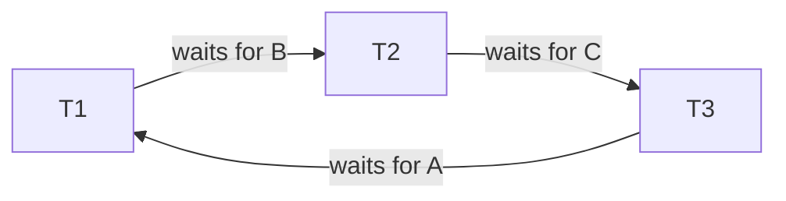
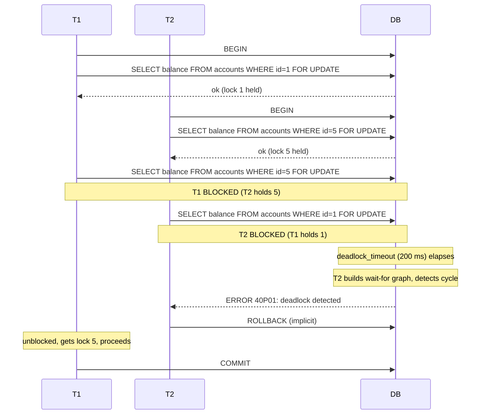
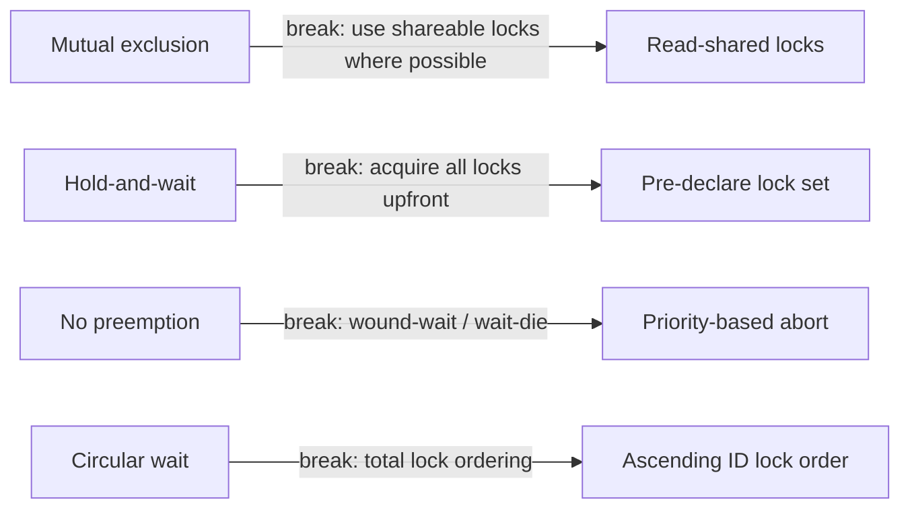

# Deadlocks — The Inevitable Cost of Locking

> Deadlocks are not bugs in the database; they are a *consequence* of locking. If you use locks (or any conflict-detection mechanism), you will have deadlocks. The job is to make them rare, detectable, and recoverable.

## 1. What you already know

From [[03-Two-Phase-Locking]]: locking creates cycles when transactions acquire locks in different orders. From [[05-Serializability]]: SSI can produce a similar-looking abort, but for a different reason (dangerous structure). From [[01-Concurrency-Anomalies]]: locks are the simplest way to prevent lost updates and write skew. From [[06-Coupling-and-Cohesion]]: cycles are the most expensive form of dependency — and a deadlock is a dependency cycle at runtime.

## 2. Why this layer exists

Deadlocks cannot be eliminated in a system that uses locks. The Coffman conditions (1971) prove it: if four conditions all hold simultaneously, deadlock is possible. Removing any one of them is the strategy for *prevention*; accepting the possibility and *detecting* deadlocks when they occur is the strategy for *recovery*. Production databases do a bit of both: prevention via timeouts and lock ordering heuristics, detection via wait-for graph cycle checks.

You need to understand deadlocks because (a) you will see them in production, (b) the fix is usually in the application code, not the database, and (c) the same conceptual pattern (cyclic dependency) reappears in distributed systems, message queues, and any concurrent code.

## 3. What is genuinely new

The four Coffman conditions, the three strategies (detection, prevention, avoidance), the wait-for graph and cycle detection, the application-level disciplines (short transactions, consistent lock ordering, retry on 40P01/40001), and the specific deadlock patterns in banking services. The general insight: a deadlock is a *cyclic dependency* at runtime, and the cure is the same as for any cyclic dependency (see [[03-Dependency-As-Root-Concept]]): break the cycle by introducing an ordering or an abstraction.

## 4. Concepts

### The Coffman conditions

A deadlock is possible if and only if all four conditions hold simultaneously:

1. **Mutual exclusion.** At least one resource is held in non-shareable mode (e.g., an exclusive row lock).
2. **Hold-and-wait.** A transaction holds at least one resource while waiting for others.
3. **No preemption.** Resources can only be released voluntarily by the transaction holding them (the database cannot yank a lock away).
4. **Circular wait.** There exists a cycle of transactions, each waiting for a resource held by the next.

Eliminate any one and deadlock is impossible. The strategies below each attack one condition.

### Strategies

**Detection** (PostgreSQL, MySQL InnoDB, SQL Server). Allow deadlocks to form, then detect them: a background process (in PostgreSQL, the deadlock checker runs every `deadlock_timeout` = 200 ms by default) builds the *wait-for graph* — a directed graph where an edge T1 → T2 means "T1 is waiting for a resource held by T2." A cycle in this graph is a deadlock. The detector picks a victim transaction (usually the one that has done the least work) and aborts it with SQLSTATE 40P01.

**Prevention.** Design the system so that one of the four conditions cannot hold.

- *Lock ordering* — break circular wait. Every transaction acquires locks in the same global order. No cycle possible.
- *Timeout* — break hold-and-wait. If a transaction waits longer than N seconds, abort it.
- *Wound-wait* — older transactions preempt younger ones. If T1 (old) wants a lock held by T2 (young), T2 is aborted ("wounded"). If T2 (young) wants a lock held by T1 (old), T2 waits. No cycle.
- *Wait-die* — the reverse. Old transactions wait for young ones; young transactions abort if they cannot get a resource held by an old one.

**Avoidance.** At each resource request, check whether granting it could lead to deadlock (Banker's algorithm — requires knowing all future resource requests of every transaction; impractical for databases).

### The wait-for graph

For transactions T1, T2, T3 holding and waiting:

```
T1 holds A, waits for B (held by T2)
T2 holds B, waits for C (held by T3)
T3 holds C, waits for A (held by T1)
```

The wait-for graph:



Cycle ⇒ deadlock. PostgreSQL aborts one (the victim), breaking the cycle. The other two eventually proceed.

### PostgreSQL's detection

- Default `deadlock_timeout` = 200 ms. A blocked transaction waits this long before triggering the deadlock check. This avoids the overhead of building the wait-for graph for every short wait.
- The check is performed by the blocked transaction itself (not a separate background process — a common misconception). It runs once after `deadlock_timeout`, then periodically.
- On detecting a cycle, PostgreSQL aborts the *current* transaction (the one running the check) with SQLSTATE 40P01. The choice of victim is simple: the transaction that triggered the check loses.
- Aborting breaks the cycle; the other transactions eventually proceed.

### The application developer's responsibility

- **Keep transactions short.** Shorter transactions hold locks for less time, reducing the window for deadlocks.
- **Lock in a consistent order.** Always lock resources in the same order across all transactions (e.g., ascending primary key). This eliminates the circular-wait condition.
- **Use the right isolation level.** SERIALIZABLE produces more aborts but no deadlocks in the classic sense (it uses SSI, not locks). READ COMMITTED + `FOR UPDATE` produces deadlocks that need handling.
- **Retry on 40P01 / 40001.** The application must catch these SQLSTATEs and retry the transaction, ideally with a small backoff. This is non-negotiable for production code.

## 5. Banking application

A deadlock between `TransferService` and `StatementService`:

- `TransferService.transfer(1, 5, 100)` locks account 1, then account 5.
- `StatementService.rebalance(5, 1)` — a routine that "moves a small adjustment" from account 5 to account 1 — locks account 5, then account 1.

These two transactions deadlock under READ COMMITTED + `FOR UPDATE`.

### The naive (deadlocking) code

```java
public class TransferService {
    public void transfer(long from, long to, BigDecimal amount) throws SQLException {
        try (Connection c = ds.getConnection()) {
            c.setAutoCommit(false);
            lock(c, from);               // SELECT ... FOR UPDATE
            lock(c, to);
            // ... debit, credit, ledger ...
            c.commit();
        }
    }
}

public class StatementService {
    public void rebalance(long a, long b) throws SQLException {
        try (Connection c = ds.getConnection()) {
            c.setAutoCommit(false);
            lock(c, a);                  // different order than TransferService!
            lock(c, b);
            // ... move adjustment ...
            c.commit();
        }
    }
}
```

Concurrent `transfer(1, 5)` and `rebalance(5, 1)` deadlock: T1 holds 1 waits for 5; T2 holds 5 waits for 1.

### The fix — shared lock-ordering utility

```java
public final class Locking {
    private Locking() {}

    /** Always lock in ascending id order. Call for every pair before any writes. */
    public static void lockBoth(Connection c, long a, long b) throws SQLException {
        long first = Math.min(a, b);
        long second = Math.max(a, b);
        lock(c, first);
        lock(c, second);
    }

    private static void lock(Connection c, long accountId) throws SQLException {
        try (PreparedStatement s = c.prepareStatement(
                "SELECT balance FROM accounts WHERE id = ? FOR UPDATE")) {
            s.setLong(1, accountId);
            try (ResultSet rs = s.executeQuery()) {
                if (!rs.next()) throw new AccountNotFound(accountId);
            }
        }
    }
}

public class TransferService {
    public void transfer(long from, long to, BigDecimal amount) throws SQLException {
        try (Connection c = ds.getConnection()) {
            c.setAutoCommit(false);
            Locking.lockBoth(c, from, to);          // always ascending
            // ... debit, credit, ledger ...
            c.commit();
        }
    }
}

public class StatementService {
    public void rebalance(long a, long b) throws SQLException {
        try (Connection c = ds.getConnection()) {
            c.setAutoCommit(false);
            Locking.lockBoth(c, a, b);               // also ascending — same order
            // ... move adjustment ...
            c.commit();
        }
    }
}
```

Now both services lock account 1 first, then account 5. No cycle. No deadlock.

### The retry wrapper

Even with lock ordering, deadlocks can still occur (e.g., between explicit locks and locks taken implicitly by foreign-key checks, or with SSI's serialization failures). The retry wrapper is mandatory:

```java
public final class Txn {
    public interface Action { void run(Connection c) throws SQLException; }

    public static void retry(DataSource ds, int maxAttempts, Action action) throws SQLException {
        for (int attempt = 1; attempt <= maxAttempts; attempt++) {
            try (Connection c = ds.getConnection()) {
                c.setAutoCommit(false);
                try {
                    action.run(c);
                    c.commit();
                    return;
                } catch (SQLException e) {
                    String state = e.getSQLState();
                    if ("40P01".equals(state)       // deadlock_detected
                     || "40001".equals(state)       // serialization_failure
                     || "40P02".equals(state)) {    // deadlocks related
                        if (attempt == maxAttempts) throw e;
                        // exponential backoff
                        sleep(attempt * 10L);
                        continue;
                    }
                    c.rollback();
                    throw e;
                }
            }
        }
    }

    private static void sleep(long ms) {
        try { Thread.sleep(ms); } catch (InterruptedException ie) {
            Thread.currentThread().interrupt();
        }
    }
}
```

## 6. Code / diagrams

### The deadlock timeline



### Coffman conditions and the strategy that breaks each



### SQL demonstrating the deadlock

```sql
-- Session A                                  -- Session B
BEGIN;                                        BEGIN;
SELECT balance FROM accounts WHERE id=1 FOR UPDATE;
                                              SELECT balance FROM accounts WHERE id=5 FOR UPDATE;
SELECT balance FROM accounts WHERE id=5 FOR UPDATE;
                                              SELECT balance FROM accounts WHERE id=1 FOR UPDATE;
                                              -- ERROR: deadlock detected
                                              -- SQLSTATE: 40P01
-- Session A proceeds
```

## 7. What can go wrong

- **Lock ordering is global.** If even one transaction in the codebase does not respect the order, deadlocks return. The discipline must be enforced across the team — ideally by a shared utility (`Locking.lockBoth` above), not by ad-hoc `FOR UPDATE` calls.
- **Hidden locks.** Foreign-key checks, unique-constraint checks, and some index operations take locks. These are not visible to the application developer and can produce deadlocks that do not match the visible code.
- **Lock escalation.** Some databases (SQL Server, DB2) escalate many row locks to a table lock, drastically increasing the deadlock surface. PostgreSQL does not escalate, but very large lock sets still consume memory.
- **Long-running transactions.** The longer a transaction runs, the more concurrent transactions can interfere with it. A transaction that makes HTTP calls while holding locks is a deadlock factory.
- **Retry storms.** Under heavy contention, retrying deadlocked transactions can amplify the load. Use exponential backoff with jitter, and consider a circuit breaker if the retry rate exceeds a threshold.
- **Synchronous chains.** Service A calls Service B inside a transaction; Service B calls Service C. If C takes a lock that A later needs (via a different code path), the chain deadlocks in a way that is hard to diagnose. Never call external services inside a transaction.
- **Distributed deadlocks.** In distributed transactions (see [[07-Distributed-Transactions]]), the wait-for graph spans multiple systems; detection becomes much harder, and 2PC's blocking behaviour is essentially a distributed deadlock with the coordinator as the cycle.

## 8. Trade-offs

- **Detection vs prevention.** Detection (PostgreSQL's default) is automatic and simple; the cost is the `deadlock_timeout` delay before detection. Prevention (lock ordering) eliminates deadlocks but requires discipline and is fragile under schema evolution.
- **Lock ordering vs flexibility.** A strict order reduces deadlocks but constrains the code. Some workloads (e.g., graph traversal) cannot easily impose a global order.
- **Timeouts vs correctness.** A timeout-based abort is simple but imprecise — a legitimately slow transaction can be aborted as a "deadlock." Choose the timeout carefully based on workload.
- **Wound-wait vs wait-die.** Wound-wait favors old transactions (they get to finish); wait-die favors old transactions too, by making young ones abort. Both prevent cycles; the choice depends on whether you want young transactions to retry (wait-die) or be aborted (wound-wait). Neither is used by PostgreSQL.
- **Retry latency vs deadlock rate.** More retries = more user-visible latency. If retries dominate, the design is wrong — likely the transactions are too long, or the lock granularity is too coarse.

## 9. Forward links

- [[03-Two-Phase-Locking]] — the mechanism that produces deadlocks.
- [[07-Distributed-Transactions]] — distributed deadlocks are much harder.
- [[08-Two-Phase-Commit]] — 2PC's blocking problem is a distributed deadlock.
- [[02-Isolation-Levels]] — SERIALIZABLE (SSI) replaces deadlocks with serialization failures.
- [[00-Query-Optimization-Strategy]] — lock contention as a perf issue.
- [[03-Dependency-As-Root-Concept]] — a deadlock is a cyclic runtime dependency.
- [[08-Trade-offs-Everywhere]] — detection vs prevention as a trade-off.
- [[00-Banking-Case-Study]] — rule 10 (concurrent transfers safe).
