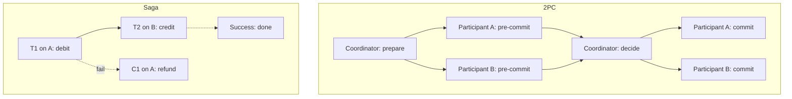
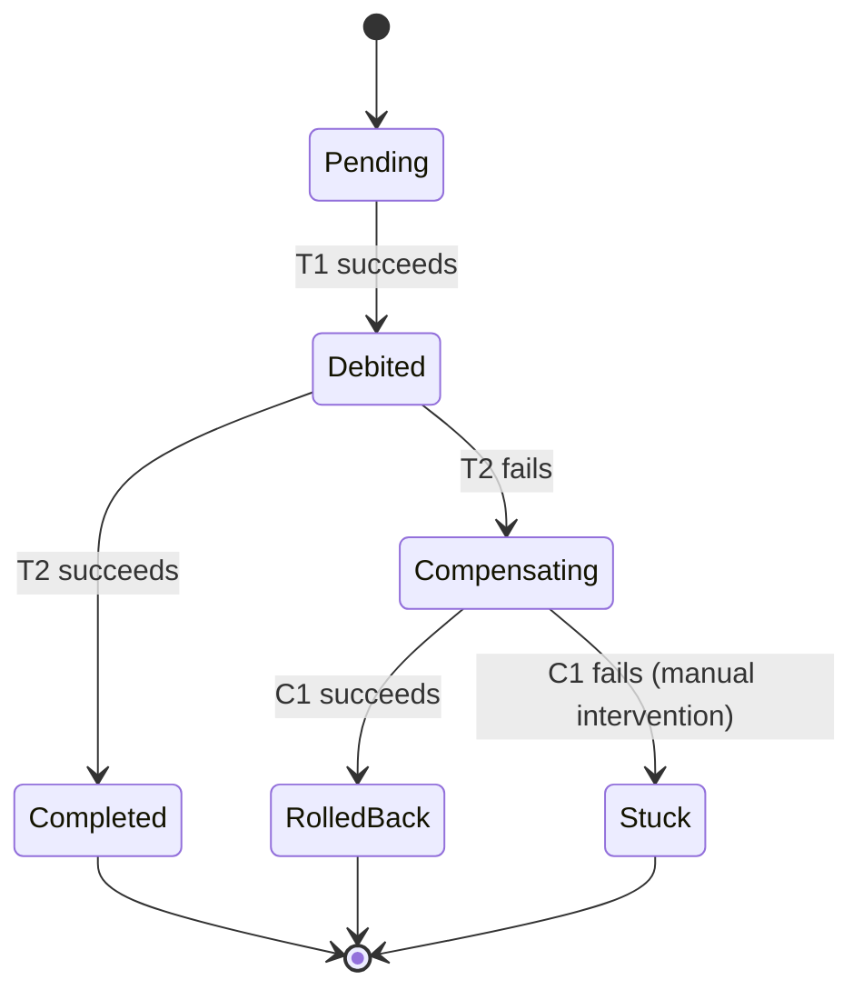

# Distributed Transactions — When a Transaction Spans Systems

> A transaction that touches one database is hard. A transaction that touches two databases, or a database and a message broker, or two services with their own databases, is an order of magnitude harder. The challenges — atomic commit, network partitions, partial failures — drive most of the architecture decisions in modern microservice systems.

## 1. What you already know

From [[00-ACID]]: Atomicity, Consistency, Isolation, Durability — the contract of a single-database transaction. From [[03-Dependency-As-Root-Concept]]: a transaction that spans two systems creates a *runtime dependency* between them — the failure of one affects the other. From [[06-Deadlocks]]: a cyclic dependency at runtime manifests as a deadlock; in distributed transactions, the coordinator is the central node of the cycle. From [[08-Trade-offs-Everywhere]]: the trade-offs here are severe (correctness vs availability).

## 2. Why this layer exists

As soon as a business operation spans two services — e.g., the TransferService and a FraudService in different deployments, or two bank databases that must be debited/credited together — the ACID guarantees of a single database no longer apply. The naive approach is to put both updates in one transaction, but there is no single transaction manager that controls both systems unless you set up 2PC (see [[08-Two-Phase-Commit]]).

The challenges are real:

- **Atomic commit** — both systems must commit, or both must abort. No half-states.
- **Network partitions** — the network between the systems can fail; messages can be lost, duplicated, or delayed.
- **Partial failures** — one system can crash while the other is fine.
- **No global clock** — you cannot atomically observe the state of both systems.

Solutions fall into three families:

1. **Distributed ACID via 2PC** — slow, blocking, but correct.
2. **Saga** — break the transaction into a sequence of local transactions, with compensating transactions for rollback.
3. **Eventual consistency** — accept temporary inconsistency; reconcile later.

Each has different trade-offs. This chapter compares them; the next chapter ([[08-Two-Phase-Commit]]) goes deep on 2PC.

## 3. What is genuinely new

The *impossibility* of perfect distributed transactions (the FLP result, the CAP theorem — see [[00-CAP-PACELC]]) forces you to choose. The *saga* pattern as the modern default for microservices. The *outbox* pattern as the bridge between a transactional database and a non-transactional message broker. The trade-off between 2PC (correct, slow, blocking) and saga (eventually consistent, fast, complex application logic).

## 4. Concepts

### Why a single database transaction cannot span systems

A database transaction is managed by *one* database engine. It holds locks in that engine, writes WAL in that engine, and recovers crashes with that engine's recovery algorithm. There is no engine that spans two databases — each has its own locks, its own WAL, its own recovery.

To coordinate them, you need a separate *transaction manager* (the coordinator) that talks to both. That coordinator is the 2PC protocol's defining role.

### 2PC at a glance (full detail in [[08-Two-Phase-Commit]])

```
Coordinator                Participant A            Participant B
    |                           |                       |
    |--- prepare -------------->|                       |
    |--- prepare --------------------------------------->|
    |<-- yes -------------------|                       |
    |<-- yes --------------------------------------------|
    |                           |                       |
    |--- commit --------------->|                       |
    |--- commit ---------------------------------------->|
    |<-- ack --------------------|                       |
    |<-- ack --------------------------------------------|
```

The coordinator asks each participant to *prepare* (write a pre-commit record to its WAL and lock resources). If all participants say yes, the coordinator decides commit and sends the commit message. If any says no (or times out), the coordinator decides abort.

The blocking problem: if the coordinator crashes after the participants have prepared but before sending the decision, the participants must hold their locks indefinitely until the coordinator recovers. This is 2PC's fundamental weakness.

### The saga pattern

A *saga* (Garcia-Molina & Salem, 1987) is a sequence of local transactions T1, T2, ..., Tn, each running on a single system, with compensating transactions C1, C2, ..., Cn-1. If Ti fails, the saga runs Ci-1, Ci-2, ..., C1 in reverse to semantically undo the work.

```
T1 -> T2 -> T3 -> ... -> Tn  (success path)

If T3 fails:
T1 -> T2 -> T3(fails) -> C2 -> C1  (compensation path)
```

A saga does *not* provide ACID. It provides *semantic atomicity*: the end state is consistent, but intermediate states are visible to other transactions. This is the cost — and the benefit (no global locks, no blocking).

There are two orchestration styles:

- **Choreography** — each service publishes events; others react. Decentralized; harder to follow the flow.
- **Orchestration** — a central orchestrator calls each service in sequence. Easier to follow; the orchestrator is a single point of failure.

### The outbox pattern

When a transactional database needs to publish to a non-transactional message broker (Kafka, RabbitMQ), you cannot safely do:

```java
// UNSAFE — what if commit succeeds but the publish fails? Or vice versa?
@Transactional
public void transfer(...) {
    updateAccounts(...);
    broker.publish(new TransferEvent(...));
}
```

The *outbox* pattern: write the event to an `outbox` table in the *same* database transaction. A separate process (the *outbox poller* or *CDC connector*) reads the outbox and publishes to the broker, then marks the row as published.

```sql
BEGIN;
UPDATE accounts SET balance = balance - 100 WHERE id = 1;
UPDATE accounts SET balance = balance + 100 WHERE id = 2;
INSERT INTO ledger_entries(account_id, amount) VALUES (1, -100), (2, +100);
INSERT INTO outbox(event_type, payload) VALUES ('TransferCompleted', '...');
COMMIT;
```

The outbox table is in the same transaction as the business data — so the event is persisted atomically with the state change. The poller guarantees *at-least-once* delivery; consumers must be idempotent (see [[04-Eventual-Consistency]]).

### Eventual consistency

The weakest guarantee: the system will *eventually* converge to a consistent state, but readers may see stale data in the meantime. Used when the cost of strong consistency (2PC) is too high and the cost of inconsistency is low (e.g., social-media feeds, search indexes).

For banking, eventual consistency is acceptable for *notifications* (a delayed email is fine) but not for *balances* (a wrong balance is a regulatory issue).

## 5. Banking application

A cross-bank transfer: bank A's database debits the source account; bank B's database credits the destination account. Two databases, two systems, one logical operation.

### Option 1: 2PC

```java
// Pseudo-code — requires a 2PC coordinator (e.g., Narayana, Atomikos)
public void transferCrossBank(long from, long to, BigDecimal amount) {
    TxnManager tm = ...;
    XAResource bankA = bankADb.getXAResource();
    XAResource bankB = bankBDb.getXAResource();

    tm.begin();
    tm.enlist(bankA);
    tm.enlist(bankB);

    // debit on bank A
    try (Connection c = bankADb.getConnection()) {
        try (PreparedStatement s = c.prepareStatement(
                "UPDATE accounts SET balance = balance - ? WHERE id = ?")) {
            s.setBigDecimal(1, amount);
            s.setLong(2, from);
            s.executeUpdate();
        }
    }
    // credit on bank B
    try (Connection c = bankBDb.getConnection()) {
        try (PreparedStatement s = c.prepareStatement(
                "UPDATE accounts SET balance = balance + ? WHERE id = ?")) {
            s.setBigDecimal(1, amount);
            s.setLong(2, to);
            s.executeUpdate();
        }
    }

    tm.commit();  // 2PC: prepare on both, then commit on both
}
```

Pros: ACID across both banks. Money is never lost or created.

Cons: slow (multiple network round trips), blocking (if the coordinator fails, both banks hold locks), fragile (XA drivers are buggy, support is uneven), operationally complex (coordinator recovery is hard).

### Option 2: Saga

```java
public void transferCrossBankSaga(long from, long to, BigDecimal amount) {
    // T1: debit source account on bank A
    bankA.debit(from, amount);
    try {
        // T2: credit destination account on bank B
        bankB.credit(to, amount);
    } catch (Exception e) {
        // C1: compensate — refund the debit on bank A
        bankA.refund(from, amount);
        throw e;
    }
}
```

Pros: no global locks, no coordinator, fast, resilient to partial failures.

Cons: intermediate states are visible (bank A is debited before bank B is credited — a customer looking at the right moment sees the money "gone" from A and not yet in B); compensation logic must be correct (what if the refund fails? what if the credit succeeded but the response was lost?).

### The practical banking answer

Real banking systems use *neither* pure 2PC nor pure saga. They use a *hold-and-confirm* pattern:

1. **Reserve** the amount on bank A (mark as "in-flight," not withdrawable but not yet sent).
2. **Send** a message to bank B (via a queue, with retries).
3. **Confirm**: bank B credits the destination and acks.
4. **Settle**: bank A marks the reservation as consumed.

If anything fails, the reservation is released (compensating action). This is a saga with an explicit reservation step that makes intermediate states safer.

## 6. Code / diagrams

### 2PC vs saga — comparison



### The outbox pattern

```mermaid
sequenceDiagram
    participant App
    participant DB as PostgreSQL
    participant Outbox as outbox table
    participant Poller as Outbox poller
    participant Broker as Kafka

    App->>DB: BEGIN
    App->>DB: UPDATE accounts SET balance = ...
    App->>Outbox: INSERT event row (same txn)
    App->>DB: COMMIT
    Note over DB,Outbox: Atomic — event persisted with state change
    Poller->>Outbox: SELECT unpublished events
    Outbox-->>Poller: rows
    Poller->>Broker: publish event
    Broker-->>Poller: ack
    Poller->>Outbox: UPDATE published_at
    Note over Poller,Broker: At-least-once; consumers must be idempotent
```

### Saga with compensation — state diagram



### Java — saga with reservation

```java
public final class CrossBankTransferSaga {

    public void transfer(long from, long to, BigDecimal amount) {
        String reservationId = bankA.reserve(from, amount);     // T1
        try {
            bankB.credit(to, amount);                            // T2
            bankA.settle(reservationId);                         // T3
        } catch (Exception e) {
            try {
                bankA.release(reservationId);                    // C1
            } catch (Exception ce) {
                // Compensation failed — log and alert; do not lose the money
                log.error("compensation failed for reservation {}", reservationId, ce);
                alerts.notifyStuckTransfer(reservationId);
            }
            throw e;
        }
    }
}
```

## 7. What can go wrong

- **2PC coordinator failure.** Participants hold locks indefinitely until the coordinator recovers. Recovery is hard; XA recovery logs can be corrupted; manual intervention is sometimes required.
- **2PC heuristic decisions.** When a participant cannot reach the coordinator, it may make a "heuristic" decision (commit or abort unilaterally). These decisions can disagree with the coordinator's, leaving the system inconsistent. Manual reconciliation is required.
- **Saga compensation failures.** If the compensation itself fails, the system is in an inconsistent state. There is no automatic recovery — the saga must be designed to either retry indefinitely or escalate to manual intervention.
- **Duplicate messages.** The outbox pattern guarantees at-least-once, not exactly-once. Consumers must be idempotent — they must detect and ignore duplicates. Use an idempotency key.
- **Ordering.** Events from different sources may arrive out of order. Consumers must handle this (e.g., by version numbers, timestamps, or sequence numbers per producer).
- **Long-running sagas.** A saga that takes minutes or hours holds intermediate state that may confuse users (e.g., "where is my money?"). Provide visibility — a status endpoint that shows the saga's progress.
- **Network partitions.** During a partition, the saga cannot progress. The system must be designed to wait out the partition and resume — or to fail fast and compensate.
- **Observability.** A saga's state is distributed across services. Without distributed tracing (correlation IDs, span propagation), debugging a stuck saga is hellish.

## 8. Trade-offs

- **2PC vs saga.** 2PC gives ACID but blocks and is fragile. Saga gives eventual consistency but is non-blocking and resilient. Modern systems prefer saga — the operational cost of 2PC is too high.
- **Choreography vs orchestration.** Choreography is decentralized and decoupled but harder to follow. Orchestration is centralized and easier to follow but introduces a single point of failure. Most production sagas use orchestration.
- **Synchronous vs asynchronous.** Synchronous sagas (HTTP calls between steps) are simpler but tie up resources. Asynchronous sagas (message-driven) are more complex but more scalable.
- **Strong vs eventual consistency for read models.** A read model (e.g., a customer-facing balance) that must be strongly consistent requires either 2PC or a single database. A read model that tolerates eventual consistency can be built from events.
- **Idempotency cost.** Idempotency requires storing keys, checking on every request, and handling races. It is essential for distributed transactions but adds overhead to every operation.

## 9. Forward links

- [[08-Two-Phase-Commit]] — the full 2PC protocol in depth.
- [[00-CAP-PACELC]] — the impossibility results that make distributed transactions hard.
- [[04-Eventual-Consistency]] — the weaker guarantee sagas often rely on.
- [[02-Replication]] — replication is a special case of distributed state.
- [[01-Consensus-Raft-Paxos]] — consensus is the foundation of distributed commit.
- [[04-Domain-Events]] — domain events are the unit of saga steps.
- [[00-ACID]] — what distributed transactions are trying to extend.
- [[06-Deadlocks]] — distributed deadlocks are 2PC's blocking problem.
- [[08-Trade-offs-Everywhere]] — the central trade-off: correctness vs availability.
- [[00-Banking-Case-Study]] — cross-bank transfers.
