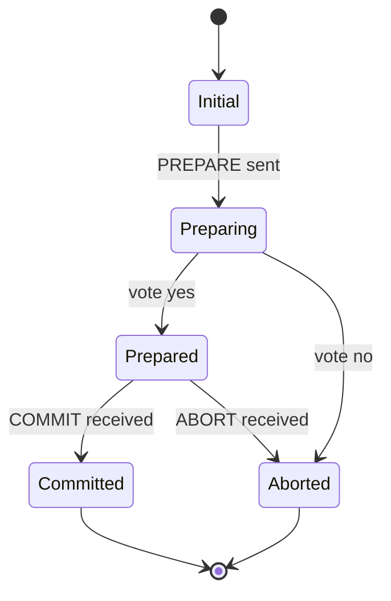
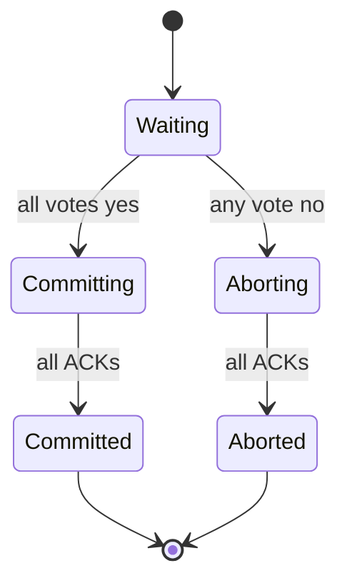
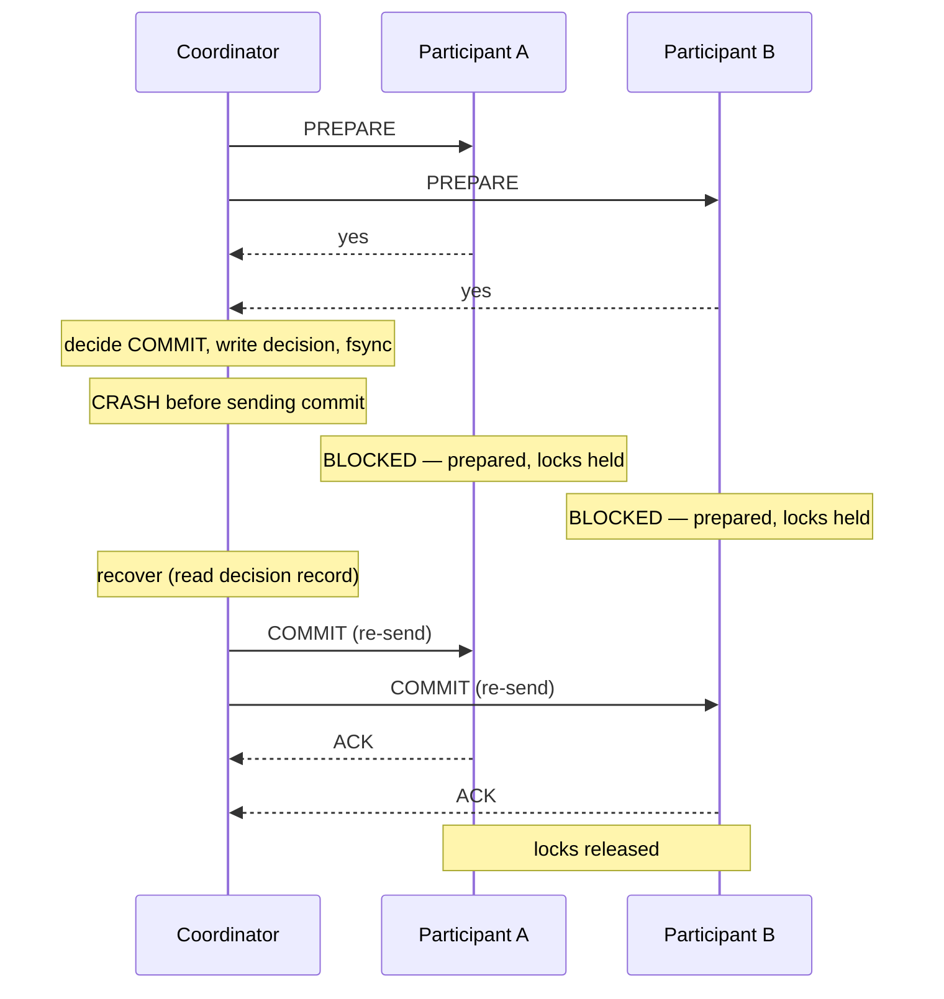

# Two-Phase Commit — The 2PC Protocol In Depth

> The classic algorithm for atomic commit across multiple systems. Beautiful in theory, brutal in practice. Almost no modern microservice system uses it — but understanding *why* it fails teaches you everything about distributed transactions.

## 1. What you already know

From [[07-Distributed-Transactions]]: 2PC is one of three families of solutions (with saga and eventual consistency). From [[06-Deadlocks]]: 2PC's blocking problem is a distributed form of cyclic dependency — the participants wait for the coordinator, who is waiting for the participants. From [[00-WAL-Logging]]: each participant writes a "prepare" record to its WAL before saying yes, so its decision survives crashes. From [[08-Trade-offs-Everywhere]]: 2PC is at the extreme end of the correctness axis, paying heavily in latency and availability.

## 2. Why this layer exists

When a transaction must atomically commit changes across two or more resource managers (databases, message queues), no single resource manager can guarantee the others' commitment. 2PC introduces a *coordinator* that runs a protocol guaranteeing: either all participants commit, or all abort. The protocol is two phases because the decision (phase 1) is separated from the execution (phase 2), giving the coordinator a single point at which it can change its mind without losing safety.

The protocol was standardized by X/Open (X/Open XA, early 1990s) and implemented in Java as JTA (Java Transaction API). It is the foundation of every distributed transaction manager (Narayana, Atomikos, Bitronix). It is also the protocol almost no one uses in new microservice systems today — and this chapter explains exactly why.

## 3. What is genuinely new

The protocol itself, in full detail: prepare, vote, decision, commit/abort, acknowledgment. The failure cases: participant crash during prepare, coordinator crash after decision, network partition between phases. The *blocking problem*: participants in the "prepared" state must hold their locks until they hear the decision, and if the coordinator is down, they wait indefinitely. The recovery algorithm. The cost: each commit takes multiple network round trips plus at least 3-4 fsyncs per participant — easily 10x the latency of a single-database commit. The reason modern systems avoid it: 2PC's blocking behaviour turns a single coordinator failure into a system-wide outage.

## 4. Concepts

### The protocol

**Phase 1 — Prepare (voting phase).**

1. Coordinator sends `PREPARE` to each participant.
2. Each participant:
   - Acquires all locks needed for the transaction.
   - Writes a *prepare record* (the transaction's redo log) to its WAL, fsynced.
   - Replies `VOTE_COMMIT` (yes) or `VOTE_ABORT` (no, e.g., constraint violation).
3. Coordinator collects votes.

**Phase 2 — Decision (commit phase).**

4. If all votes were `VOTE_COMMIT`, coordinator decides `COMMIT`. If any vote was `VOTE_ABORT` (or a participant timed out), coordinator decides `ABORT`.
5. Coordinator writes its *decision record* to its WAL, fsynced. (This is the *commit point* — once written, the decision is durable.)
6. Coordinator sends `COMMIT` (or `ABORT`) to each participant.
7. Each participant:
   - On `COMMIT`: applies the changes, writes a *commit record* to its WAL, fsynced, releases locks, replies `ACK`.
   - On `ABORT`: rolls back the changes, writes an *abort record* to its WAL, releases locks, replies `ACK`.
8. Coordinator collects ACKs. Once all ACKs are received (or presumed, after a timeout), the coordinator writes a *completion record* and discards the transaction.

### State machines





### Failure cases

**Participant crashes during prepare.** The coordinator times out waiting for the vote, decides ABORT, and sends ABORT to the other participants. When the crashed participant recovers, it has no prepared record, so it knows it did not commit; it acts as if it had voted ABORT.

**Participant crashes after voting yes, before receiving the decision.** This is the critical case. On recovery, the participant sees a *prepared record* in its WAL but no commit/abort record. It must hold its locks and *ask the coordinator* for the decision. If the coordinator is available, it answers; the participant commits or aborts accordingly. If the coordinator is *not* available, the participant is **blocked** — it cannot commit (the coordinator might have decided abort) and cannot abort (the coordinator might have decided commit). It waits indefinitely.

**Coordinator crashes after deciding, before sending the decision.** The participants are in the *prepared* state, holding locks. When the coordinator recovers, it reads its decision record from the WAL, re-sends the decision, and the participants proceed. The window of blocking is the coordinator's recovery time — which can be minutes or hours.

**Coordinator crashes after sending the decision to *some* participants but not all.** The coordinator re-sends the decision on recovery. Participants that already acted (committed or aborted) recognize the duplicate and reply ACK without re-acting.

**Network partition between phases.** Participants that cannot reach the coordinator are blocked. Participants that the coordinator cannot reach are presumed failed; the coordinator decides ABORT (if no unanimous yes) or waits for them.

### The blocking problem

The fundamental issue: a prepared participant cannot unilaterally decide. It must wait for the coordinator. If the coordinator is down, it waits. There is no protocol-level solution to this within 2PC — it is a consequence of the algorithm. Workarounds:

- **Three-phase commit (3PC)** — adds a "pre-commit" phase that allows participants to time out and abort if the coordinator is down, *assuming* a synchronous network (no partitions). 3PC is not used in practice because the synchronous-network assumption is unrealistic.
- **Paxos Commit / Consensus-based commit** — uses Paxos/Raft to make the coordinator's decision fault-tolerant. This is what Google Spanner and CockroachDB do. It adds another round trip and more complexity, but eliminates the blocking.
- **Heuristic decisions** — a participant makes a unilateral decision (heuristic commit or heuristic abort) after a long timeout. This *can* violate atomicity (the participant's decision may disagree with the coordinator's). Manual reconciliation is required. Heuristics are a last resort, not a solution.

### The cost

For each 2PC commit:

- 1 prepare round trip per participant (network + 1 fsync per participant).
- 1 decision record fsync at the coordinator.
- 1 commit round trip per participant (network + 1 fsync per participant).
- Plus ACK round trips.

For a 2-participant transaction: ~5 fsyncs and 4 network round trips, vs 1 fsync and 0 round trips for a single-database commit. Latency is 5-10x higher. Throughput is similarly reduced. Locks are held for the entire protocol — so contention is also higher.

### Why 2PC is rarely used in modern microservices

1. **Latency.** 5-10x commit latency is unacceptable for user-facing services.
2. **Blocking.** A coordinator failure halts all participants. In a microservice system with hundreds of services, this is unacceptable.
3. **Operational complexity.** XA recovery logs, heuristic decisions, manual reconciliation — these require specialized operations skills.
4. **Coupling.** 2PC couples the services at the resource level (shared transaction manager). This contradicts the microservice principle of independent deployability (see [[03-Bounded-Contexts]]).
5. **Better alternatives.** Saga + outbox + idempotent consumers provide eventual consistency with much lower operational cost. For most business operations, eventual consistency is acceptable (see [[08-Trade-offs-Everywhere]]).

2PC survives in niche scenarios: financial core systems (where ACID is non-negotiable), some sharded databases (CockroachDB, Spanner use consensus-based commit, not classical 2PC), and legacy systems.

## 5. Banking application

A 2PC transfer between two bank databases.

```java
public final class TwoPhaseTransferService {

    private final XADataSource bankADs;
    private final XADataSource bankBDs;
    private final TransactionManager tm;

    public void transfer(long from, long to, BigDecimal amount) throws Exception {
        XAResource xaA = null, xaB = null;
        Xid xid = newXid();

        try (Connection cA = bankADs.getXAConnection().getConnection();
             Connection cB = bankBDs.getXAConnection().getConnection()) {

            xaA = ((XAConnection) cA).getXAResource();
            xaB = ((XAConnection) cB).getXAResource();

            tm.begin();
            tm.enlist(xaA);
            tm.enlist(xaB);

            // Phase 0: do the work on both sides
            try (PreparedStatement s = cA.prepareStatement(
                    "UPDATE accounts SET balance = balance - ? WHERE id = ?")) {
                s.setBigDecimal(1, amount); s.setLong(2, from);
                s.executeUpdate();
            }
            try (PreparedStatement s = cB.prepareStatement(
                    "UPDATE accounts SET balance = balance + ? WHERE id = ?")) {
                s.setBigDecimal(1, amount); s.setLong(2, to);
                s.executeUpdate();
            }

            // Phase 1 + 2: the TM drives 2PC under the hood
            tm.commit();   // prepare on both, decide, commit on both
        } catch (Exception e) {
            tm.rollback();
            throw e;
        }
    }
}
```

What happens at `tm.commit()`:

1. TM calls `xaA.prepare(xid)`. Bank A acquires row locks on the source account, writes a prepare record to its WAL, fsyncs, returns `XAResource.XA_OK`.
2. TM calls `xaB.prepare(xid)`. Bank B does the same on the destination account.
3. Both prepared — TM decides commit, writes its decision record, fsyncs.
4. TM calls `xaA.commit(xid, false)`. Bank A writes a commit record, fsyncs, releases the lock.
5. TM calls `xaB.commit(xid, false)`. Bank B does the same.

### Failure scenario walkthrough

Suppose bank B crashes between prepare and commit:

1. Bank A has prepared (locks held, WAL flushed).
2. Bank B has prepared (locks held, WAL flushed) — then crashes.
3. TM decides commit (both voted yes), sends commit to A — A commits.
4. TM sends commit to B — B is down. TM retries.
5. Bank B recovers. On recovery, it scans its WAL, sees the prepared record, sees no commit/abort record, and asks the TM for the decision.
6. TM responds "commit." Bank B applies the change, writes a commit record, releases locks.

Money is conserved. The system is correct — but bank A's lock was held for the entire duration of bank B's outage.

If the *TM* crashes between deciding and sending the commit:

1. Both banks are prepared.
2. TM decides commit, writes decision record, fsyncs, then crashes.
3. Both banks hold their locks indefinitely.
4. TM recovers, reads its decision record, re-sends commit.
5. Both banks commit, release locks.

The duration of the lock-hold is the TM's recovery time. If the TM is down for an hour, the locks are held for an hour — likely causing other transactions on those rows to time out, possibly cascading into a wider outage.

## 6. Code / diagrams

### The full 2PC message flow

```mermaid
sequenceDiagram
    participant C as Coordinator (TM)
    participant A as Participant A (Bank A)
    participant B as Participant B (Bank B)
    C->>A: PREPARE
    C->>B: PREPARE
    Note over A: lock rows, write prepare to WAL, fsync
    A-->>C: VOTE_COMMIT
    Note over B: lock rows, write prepare to WAL, fsync
    B-->>C: VOTE_COMMIT
    Note over C: decide COMMIT, write decision record, fsync
    C->>A: COMMIT
    C->>B: COMMIT
    Note over A: write commit record, fsync, release locks
    A-->>C: ACK
    Note over B: write commit record, fsync, release locks
    B-->>C: ACK
    Note over C: write completion record; discard txn
```

### Failure case — coordinator crash after decision



### The blocking timeline

```
Time →
A: prepared(lock held) ────────── waiting ───────────── commit (lock released)
B: prepared(lock held) ────────── waiting ───────────── commit (lock released)
C:                decide ── CRASH ──── recover ── send commit
                                          ^
                                          |
                              Blocking window (locks held, no progress)
                              Duration = TM recovery time
```

### SQL showing the locks held during 2PC prepare

```sql
-- While a participant is in the PREPARED state, its locks are visible:
SELECT locktype, transactionid, virtualxid, mode, granted, pid
FROM pg_locks
WHERE transactionid IN (
    SELECT transactionid FROM pg_prepared_xacts
);

-- Prepared transactions visible system-wide:
SELECT * FROM pg_prepared_xacts;
--  transaction | gid | prepared | owner | database
--  1234        | tx1 | ...      | app   | bank_a
```

A prepared transaction's locks are *not* released even if the connection that started it disconnects. They persist until `COMMIT PREPARED` or `ROLLBACK PREPARED` is executed. This is the foundation of PostgreSQL's `PREPARE TRANSACTION` — a single-database simulation of the prepare phase.

## 7. What can go wrong

- **Coordinator failure during the critical window.** The participants are blocked. The blocking can last minutes to hours. Other transactions on those rows time out and fail. The blast radius is much larger than the failing transaction.
- **Heuristic decisions.** When an administrator manually resolves a stuck participant (e.g., `xa heal`), the decision may disagree with the coordinator's. The system is now inconsistent. Manual reconciliation is required — and the data may be wrong.
- **XA driver bugs.** XA drivers are complex and have a long history of bugs. Oracle's MySQL XA, in particular, had severe bugs for years. PostgreSQL's XA support is solid but rarely tested in production.
- **Suspicious timeouts.** The coordinator and participants must agree on timeouts. A too-short timeout causes false aborts; a too-long timeout makes failures slow to detect.
- **Locks held during network delays.** Even without failures, a slow network stretches the prepare-commit window. Locks are held longer; contention rises.
- **Heterogeneous systems.** Mixing XA drivers from different vendors (PostgreSQL + Oracle + IBM MQ) is fraught with edge cases. Each driver's interpretation of the XA spec differs in subtle ways.
- **Recovery log corruption.** The transaction manager's recovery log (where it stores its decisions) must be fsynced and crash-safe. If it is corrupted, the TM cannot recover, and all participants it was coordinating are stuck.
- **Operational skills gap.** 2PC recovery requires specialized knowledge. Most SREs have never handled a heuristic decision. The first time they encounter one, the system is down for hours.

## 8. Trade-offs

- **2PC vs saga.** 2PC gives ACID, blocks, and is fragile. Saga gives eventual consistency, is non-blocking, and is resilient. Modern systems choose saga — the operational cost of 2PC is too high.
- **2PC vs consensus-based commit.** Spanner/CockroachDB use Paxos/Raft to make the coordinator's decision fault-tolerant. This eliminates the blocking problem but adds another round trip and significant complexity.
- **Synchronous vs asynchronous.** 2PC is synchronous — all participants are locked for the entire protocol. Asynchronous alternatives (saga, outbox) decouple the participants at the cost of consistency.
- **Coupling vs consistency.** 2PC couples the services at the resource level (shared transaction manager). This coupling makes independent deployment and operation difficult. Saga decouples the services — at the cost of eventual consistency.
- **Single database vs sharded.** A single database can give ACID for free. Sharding introduces the distributed commit problem. The trade-off is between scale (sharding) and ACID (single database).

## 9. Forward links

- [[07-Distributed-Transactions]] — the broader context; 2PC is one option among three.
- [[00-WAL-Logging]] — the prepare record is a WAL entry; recovery depends on it.
- [[01-ARIES]] — ARIES recovery for the participants' local transactions.
- [[02-Checkpoints]] — checkpoints bound recovery time for the coordinator's recovery log too.
- [[06-Deadlocks]] — 2PC's blocking problem is a distributed form of deadlock.
- [[00-CAP-PACELC]] — the impossibility results that motivate the alternatives.
- [[01-Consensus-Raft-Paxos]] — the foundation of consensus-based commit (the modern alternative to classical 2PC).
- [[04-Eventual-Consistency]] — the weaker guarantee that sagas provide.
- [[08-Trade-offs-Everywhere]] — the central trade-off.
- [[00-Banking-Case-Study]] — cross-bank transfers as the canonical use case.
