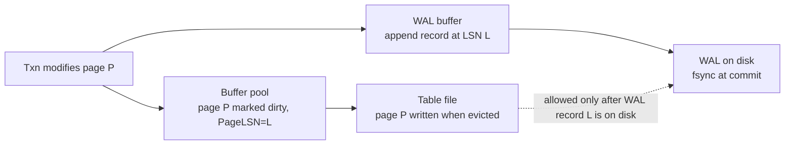
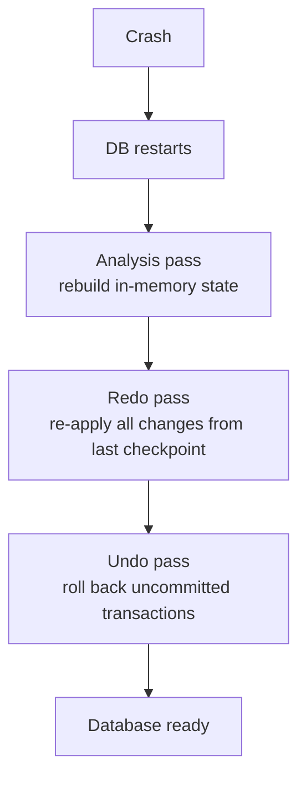

# WAL — Write-Ahead Logging

> The single mechanism that makes Durability cheap and crash recovery possible. Every modern database uses it; every distributed consensus algorithm uses it; every filesystem journal is a variant of it. If you understand WAL, you understand Durability.

## 1. What you already know

From [[00-ACID]]: Durability is the property that committed data survives crashes; the mechanism is the WAL. From [[02-Buffer-Pool]]: dirty pages live in memory and are flushed lazily; the WAL is what makes that safe. From [[04-MVCC]]: every update creates a new tuple; the WAL records that creation. From [[08-Trade-offs-Everywhere]]: WAL trades write amplification (every change is written twice — once to the log, once to the table) for crash safety.

## 2. Why this layer exists

The naive way to commit a transaction would be to flush every modified page to disk at commit. That would be catastrophic for performance: each commit would trigger dozens of random writes (one per dirty page), each requiring an fsync. Throughput would collapse to a few commits per second.

WAL solves this by separating two concerns:

1. **Durability of the commit** — ensured by appending a small log record to a sequential file (cheap, one fsync per commit).
2. **Durability of the data pages** — ensured lazily, by the background writer, which flushes dirty pages to disk whenever convenient.

The WAL rule: *the log record for a change must be flushed to disk before the data page containing that change is flushed.* This is the **write-ahead rule**. If the data page is flushed first, and the system crashes, we have no way to know whether the change was committed — the log is the source of truth.

Crash recovery replays the WAL: redo every committed change that is not yet on disk; undo every uncommitted change that is.

## 3. What is genuinely new

The log record format (LSN, transaction ID, before-image, after-image). The three logging strategies (physical, logical, physiological — PostgreSQL uses physiological). The force/no-force and steal/no-steal policies that define a database's WAL strategy. The relationship between WAL and checkpoints (which bound recovery time).

## 4. Concepts

### The log record format

A typical WAL record contains:

| Field | Meaning |
|---|---|
| LSN | Log Sequence Number — monotonically increasing, often the byte offset in the WAL file |
| TxnID | The transaction that produced this record |
| PrevLSN | The previous LSN for this transaction (forms a per-transaction linked list) |
| Type | BEGIN, UPDATE, COMMIT, ABORT, CLR (compensation log record), CHECKPOINT |
| PageID | The page that was modified (for physical/physiological records) |
| Offset | Where on the page the change was made |
| Before-image | The old value (for undo) |
| After-image | The new value (for redo) |

For some records, only the after-image is needed (redo-only, when undo is not required — e.g., a CLR). For others, only the operation is logged (logical logging).

### The LSN

The LSN is the universal currency of the WAL. It is the address of a log record. Every page in the database also carries a `PageLSN` — the LSN of the most recent WAL record that modified it. The recovery algorithm uses this to skip already-applied changes: if a log record's LSN ≤ the page's PageLSN, the change is already on disk; do not redo it.

### Physical, logical, physiological logging

**Physical logging.** The record describes the page-level change: "on page 42, byte 100-108 changed from `0x00..0` to `0x12..3`." Simple, easy to redo (apply the byte change). Easy to undo (apply the reverse byte change). Cost: large records; redo must reproduce the exact same page layout, so it cannot be used if the page was reorganized (e.g., by a vacuum that compacts the page).

**Logical logging.** The record describes the operation: "INSERT INTO ledger_entries VALUES (..., -100)." Compact records; redo and undo are operations (re-execute the INSERT or DELETE it). Cost: redo/undo must call the operation's logic, which may have side effects; redo must respect the same constraints as the original (so a logical redo can fail if the schema changed, can deadlock, etc.). Hard to make correct.

**Physiological logging.** The record describes the operation *on a specific page*: "on page 42 of the ledger_entries heap, insert this tuple." Combines physical (page-identified) and logical (operation described) approaches. The page is identified so redo can find it; the operation is described so redo is compact and tolerant of intra-page reorganization. PostgreSQL uses physiological logging exclusively.

### Force / no-force and steal / no-steal

These two dimensions define a database's WAL strategy:

**Force vs no-force.**
- *Force* — at commit, all modified pages are written to disk. WAL is unnecessary for durability (the pages themselves are durable). Cost: every commit flushes many random pages.
- *No-force* — at commit, only the log record is flushed. Pages are flushed lazily. Cost: WAL must be carefully managed; recovery is more complex.

Every production database uses *no-force* for performance.

**Steal vs no-steal.**
- *Steal* — the buffer pool manager is allowed to evict a dirty page (write it to disk) *before* the transaction that modified it commits. This is necessary for memory management — long transactions cannot pin pages forever.
- *No-steal* — dirty pages from uncommitted transactions are never written to disk. Cost: long transactions can exhaust the buffer pool; you cannot run a transaction that modifies more pages than fit in memory.

Every production database uses *steal* for flexibility.

The combination **no-force + steal** is the practical choice — and it requires WAL with both redo (for committed changes whose pages were not yet flushed) and undo (for uncommitted changes whose pages were stolen and flushed).

### The WAL rule (precisely)

> Before a modified data page is written to disk, the WAL record describing the modification must be flushed to disk.

The page's `PageLSN` ≤ the WAL's flush LSN before the page is written. This guarantees that, on crash recovery, the WAL contains everything needed to reconstruct or roll back the page's state.

### PostgreSQL's WAL implementation

PostgreSQL's WAL lives in the `pg_wal/` directory (formerly `pg_xlog/`), as a sequence of 16 MB segment files (configurable). Each segment is named by its LSN. Records are appended; old segments are recycled or archived (for PITR — see [[03-Backup-And-Recovery]]).

Key WAL-related settings:

| Setting | Default | Meaning |
|---|---|---|
| `wal_level` | `replica` | How much to log. `minimal` (crash recovery only), `replica` (adds replication info), `logical` (adds logical-decoding info) |
| `synchronous_commit` | `on` | Whether to fsync the WAL at commit. `off` trades durability for speed. |
| `wal_sync_method` | `fdatasync` (Linux) | How the WAL is fsynced (`fsync`, `fdatasync`, `O_DSYNC`) |
| `wal_buffers` | `-1` (auto) | In-memory WAL buffer; defaults to 1/32 of shared_buffers |
| `checkpoint_timeout` | 5 min | How often to checkpoint |
| `max_wal_size` | 1 GB | Max WAL before a checkpoint is forced |
| `wal_compression` | `off` | Compress WAL records (saves I/O, costs CPU) |

## 5. Banking application

A transfer's WAL records. The transfer transaction T1 transfers 100 from account 1 to account 2 and inserts two ledger entries.

```sql
BEGIN;
UPDATE accounts SET balance = balance - 100 WHERE id = 1;  -- debit
UPDATE accounts SET balance = balance + 100 WHERE id = 2;  -- credit
INSERT INTO ledger_entries(account_id, amount) VALUES (1, -100), (2, +100);
COMMIT;
```

The WAL records produced (simplified; PostgreSQL's actual records are more complex, with full-page images for the first modification of a page after a checkpoint):

```
LSN 1000  T1  BEGIN
LSN 1010  T1  UPDATE  page=accounts:p5  tuple=(id=1, old_balance=500, new_balance=400)
LSN 1020  T1  UPDATE  page=accounts:p9  tuple=(id=2, old_balance=300, new_balance=400)
LSN 1030  T1  INSERT  page=ledger_entries:p42  tuple=(account_id=1, amount=-100)
LSN 1040  T1  INSERT  page=ledger_entries:p42  tuple=(account_id=2, amount=+100)
LSN 1050  T1  COMMIT
```

On commit, PostgreSQL fsyncs the WAL up to LSN 1050. Once that fsync returns, the transfer is durable — even if the database crashes immediately afterward. Recovery will:

- Find LSN 1050 (COMMIT) — T1 is committed.
- Redo LSN 1010-1040 if their pages are not yet flushed (check PageLSN).
- T1 is fully applied; balances are 400 and 400; ledger entries exist.

If the database crashed *before* LSN 1050 was flushed:

- The WAL has no COMMIT record for T1.
- T1 is treated as uncommitted.
- Undo is applied (or, more accurately, the changes are simply not redone — see [[01-ARIES]]).

### The full-page image (FPI) optimization

PostgreSQL has a subtle optimization that matters for crash recovery: the *first modification* of a page after a checkpoint writes a *full-page image* to the WAL. This protects against torn-page writes (a partial write to a page that gets interrupted by a crash). On recovery, if the page on disk is torn, the FPI can be applied to restore it to its checkpoint state, and then the WAL records are redone from there.

Without FPIs, a torn page would be unrecoverable — the WAL records describing byte-level changes cannot be applied to a page whose bytes are partially old and partially new.

The cost: FPIs are large (8 KB each), so the first modification of every page after a checkpoint produces a large WAL record. Frequent checkpoints cause more FPIs; infrequent checkpoints cause longer recovery. This is one of the trade-offs in checkpoint tuning (see [[02-Checkpoints]]).

## 6. Code / diagrams

### The WAL rule



### The recovery flow (conceptual)



(See [[01-ARIES]] for the full algorithm.)

### LSN sequence — ASCII timeline

```
WAL disk:
LSN 1000 BEGIN T1
LSN 1010 UPDATE T1 (debit)
LSN 1020 UPDATE T1 (credit)
LSN 1030 INSERT T1 (ledger1)
LSN 1040 INSERT T1 (ledger2)
LSN 1050 COMMIT T1   ← fsync here; T1 durable

LSN 1060 BEGIN T2
LSN 1070 UPDATE T2 (some other write)
                              ← crash here, no COMMIT for T2
LSN 1080 (torn, partial)

Recovery:
- T1: has COMMIT → redo 1010-1040 if PageLSN < LSN
- T2: no COMMIT  → undo 1070 (or skip if page not flushed)
```

### Java — observing the WAL

JDBC does not expose WAL directly, but you can observe its effects:

```java
public void transferAndMeasure(Connection c, long from, long to, BigDecimal amount) throws SQLException {
    long t0 = System.nanoTime();
    try (PreparedStatement s = c.prepareStatement(
            "UPDATE accounts SET balance = balance - ? WHERE id = ?")) {
        s.setBigDecimal(1, amount); s.setLong(2, from);
        s.executeUpdate();
    }
    long t1 = System.nanoTime();
    try (PreparedStatement s = c.prepareStatement(
            "UPDATE accounts SET balance = balance + ? WHERE id = ?")) {
        s.setBigDecimal(1, amount); s.setLong(2, to);
        s.executeUpdate();
    }
    long t2 = System.nanoTime();
    c.commit();   // ← WAL fsync happens here
    long t3 = System.nanoTime();
    System.out.printf("debit: %.2fms, credit: %.2fms, commit: %.2fms%n",
        (t1 - t0)/1e6, (t2 - t1)/1e6, (t3 - t2)/1e6);
    // Typical output (SSD, no replication):
    // debit: 0.30ms, credit: 0.25ms, commit: 1.20ms
    // The commit time is dominated by the WAL fsync.
}
```

The commit time is dominated by `fsync`. The two updates are fast because they only modify in-memory pages and append to the in-memory WAL buffer; the actual disk I/O is deferred to commit.

### SQL — observing WAL behavior

```sql
-- How much WAL is being generated?
SELECT * FROM pg_stat_wal;
-- wal_records | wal_fpi | wal_bytes | wal_buffers_full | wal_write | wal_sync | wal_write_time | wal_sync_time

-- Per-table WAL generation:
SELECT relname, n_tup_ins, n_tup_upd, n_tup_del, n_tup_hot_upd
FROM pg_stat_user_tables
ORDER BY n_tup_upd DESC;

-- Force a WAL flush (rarely needed; commit does this):
SELECT pg_current_wal_lsn();
SELECT pg_walfile_name(pg_current_wal_lsn());  -- the current WAL segment file
```

## 7. What can go wrong

- **`synchronous_commit = off` set "for performance."** This trades away Durability. A crash within ~10 ms of commit can lose the transaction. Acceptable for some workloads (logging, metrics); unacceptable for banking.
- **Storage with lying fsync.** Some SSDs and RAID controllers report fsync success before the data is actually durable (they lie to look fast in benchmarks). On a power loss, the WAL is gone. Use only storage with honest fsync; verify with `pg_test_fsync`.
- **WAL on a slow disk.** The WAL's fsync latency is the commit latency. Putting the WAL on a slow disk makes every commit slow. Put the WAL on the fastest disk available (NVMe, ideally).
- **WAL disk full.** If the WAL disk fills, the database stalls — it cannot commit any transaction. Monitoring WAL disk usage is critical. `max_wal_size` triggers checkpoints; if checkpoints cannot keep up, the database stalls.
- **Replication slot lag.** A replication slot prevents the WAL from being recycled past the point the replica has consumed. If the replica is down, the WAL grows indefinitely — the primary can run out of disk. Monitor replication slot lag.
- **Full-page image bloat.** Frequent checkpoints cause more FPIs, bloating the WAL. Tune checkpoint frequency for the workload.
- **Long-running transactions holding back the WAL.** A long-running transaction prevents the WAL from being recycled past its start — even if the WAL is no longer needed for crash recovery. This is the same xmin-horizon problem as in MVCC (see [[04-MVCC]]).
- **`wal_level = minimal` with replication enabled.** Some features (replication, PITR) require `wal_level >= replica`. Setting it to `minimal` breaks them silently.

## 8. Trade-offs

- **WAL durability vs commit latency.** `synchronous_commit = off` cuts commit latency 5-10x but loses durability for ~10 ms of recent commits. The choice depends on the workload's tolerance for data loss.
- **WAL fsync method.** `fdatasync` (default on Linux) is fast and safe. `O_DIRECT` + `O_DSYNC` avoids double buffering but can be slower on some filesystems. Benchmark on your hardware.
- **WAL compression.** `wal_compression = on` (or `pglz`/`lz4`/`zstd` in newer PostgreSQL) saves I/O at the cost of CPU. Useful for bandwidth-constrained replication; less useful for local SSD.
- **WAL level vs features.** `wal_level = logical` enables logical replication and CDC but generates more WAL. Choose the minimum level that supports your features.
- **Checkpoint frequency vs recovery time.** Frequent checkpoints produce more FPIs (WAL bloat) but faster recovery. Infrequent checkpoints produce less WAL but slower recovery. See [[02-Checkpoints]].
- **Synchronous vs asynchronous replication.** Synchronous replication doubles commit latency (the WAL must be fsynced on the replica before the primary acks). Asynchronous replication is faster but risks data loss on failover. See [[02-Replication]].

## 9. Forward links

- [[01-ARIES]] — the recovery algorithm that uses the WAL.
- [[02-Checkpoints]] — how checkpoints bound recovery time.
- [[03-Backup-And-Recovery]] — PITR uses archived WAL.
- [[00-ACID]] — Durability, the property WAL enforces.
- [[02-Buffer-Pool]] — the buffer pool's dirty pages are the WAL's counterpart.
- [[04-MVCC]] — every MVCC version is described in the WAL.
- [[02-Replication]] — replicas apply the WAL.
- [[01-Consensus-Raft-Paxos]] — consensus algorithms use a similar log.
- [[00-Query-Optimization-Strategy]] — WAL fsync latency is often the bottleneck.
- [[00-Banking-Case-Study]] — the transfer's WAL records.
