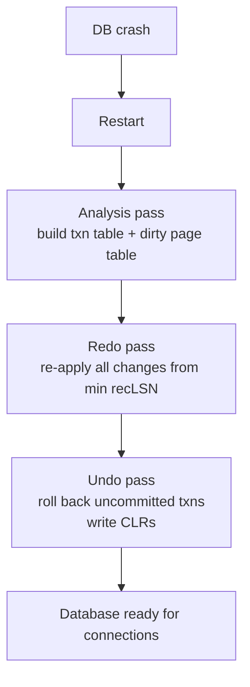
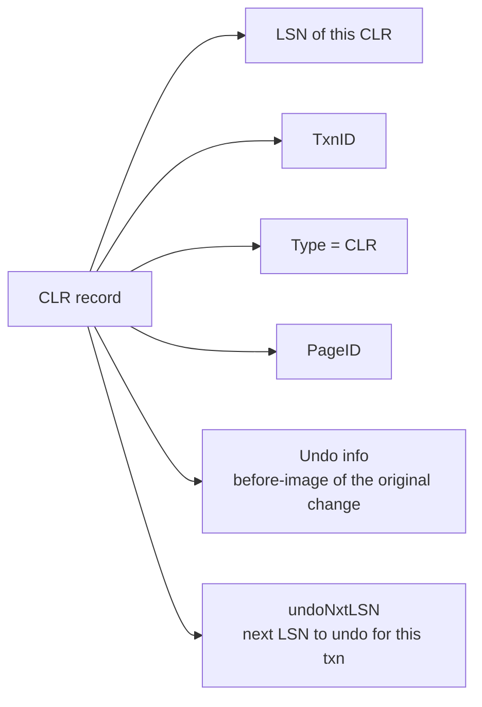

# ARIES — The Industry-Standard Recovery Algorithm

> ARIES (Algorithm for Recovery and Isolation Exploiting Semantics), Mohan et al., 1992. The algorithm every major relational database uses (or a close descendant). Three passes — Analysis, Redo, Undo — with one crucial innovation: Compensation Log Records (CLRs) that make undo idempotent and recoverable.

## 1. What you already know

From [[00-WAL-Logging]]: the WAL records every change with before-image and after-image; the WAL rule ensures the log is on disk before the data pages. From [[00-ACID]]: Durability is enforced by replaying the WAL (redo); Atomicity is enforced by reversing uncommitted changes (undo). From [[04-MVCC]]: PostgreSQL's tuple versioning means "undo" can often be "skip redo" instead — but the algorithm is still ARIES underneath. From [[08-Trade-offs-Everywhere]]: ARIES is the practical compromise that gives correct recovery with minimum I/O.

## 2. Why this layer exists

Crash recovery must reconstruct a consistent database state from the WAL and whatever dirty pages happened to be on disk. The naive approach — undo every uncommitted transaction, redo every committed transaction — is wrong because:

1. Some changes may already be on disk (the buffer pool stole and flushed them); redoing them would be incorrect.
2. Some committed changes may not yet be on disk; *not* redoing them would lose data.
3. Undo is itself a write, which generates WAL records; if the system crashes during undo, the undo must be *resumable*.

ARIES solves all three with a precise three-pass algorithm and the CLR innovation. Understanding ARIES is understanding how every modern database recovers from a crash.

## 3. What is genuinely new

The three passes (Analysis, Redo, Undo) and what each does. The per-transaction undo log (linked list of LSNs). The Compensation Log Record (CLR) — the record type that makes undo idempotent and recoverable. The repeating-history property: if recovery crashes and restarts, it produces the same result. The concept of *fuzzy checkpoints* (don't pause the system) — see [[02-Checkpoints]].

## 4. Concepts

### The three passes

After a crash, the database restarts and runs recovery. ARIES runs three passes over the WAL:

**Pass 1 — Analysis.** Start from the last checkpoint record. Scan forward through the WAL. Build:

- The *transaction table* — for each transaction active at any point after the checkpoint: its ID, its status (in-progress / committed / aborted), and its `lastLSN` (the most recent WAL record it produced).
- The *dirty page table (DPT)* — for each page modified after the checkpoint: the page ID and its `recLSN` (the LSN of the first WAL record that modified it after the checkpoint).

Analysis determines *what work was in progress* and *what pages might need redo*.

**Pass 2 — Redo.** Start from the minimum `recLSN` in the DPT (the earliest point any dirty page might have an unflushed change). Scan forward through the WAL. For each update record:

- If the record's page is not in the DPT, or the record's LSN < the page's `recLSN`, skip it (the page was clean at the checkpoint; the change is not needed).
- If the record's LSN ≤ the page's `PageLSN` (on disk), skip it (the change is already on disk).
- Otherwise, redo: apply the after-image to the page, set the page's PageLSN to the record's LSN.

Redo is *idempotent* — applying the same change twice produces the same result. This is what makes the "skip if PageLSN ≥ LSN" check safe: if we are unsure whether the change is on disk, we redo it; if it is already there, the redo is a no-op.

Redo replays *all* changes — committed and uncommitted. Why redo uncommitted changes? Because the buffer pool may have stolen and flushed their pages; we need to bring the on-disk state to a known point (the end of the WAL) before we can undo.

**Pass 3 — Undo.** For each transaction in the transaction table that is *not* committed (in-progress or aborted), roll back its changes. The undo proceeds *backwards* through the per-transaction LSN chain, from each transaction's `lastLSN` to its `BEGIN`.

For each update record being undone:

- Apply the *before-image* to the page (reversing the change).
- Write a *Compensation Log Record* (CLR) to the WAL. The CLR describes the undo operation; it carries the LSN of the record being undone (`undoNxtLSN`), which is the next LSN to undo for this transaction.
- The CLR is itself redo-only — if the system crashes during undo, the CLR is redone (re-applying the undo) but never undone (you cannot undo an undo — that would re-introduce the original change).

Undo terminates when every in-progress transaction has been rolled back to its BEGIN.

### The CLR — why it matters

Consider undo without CLRs. T1 modifies page P (LSN 100), then crashes before commit. Recovery undoes the modification. The undo writes "set P back to old value" — but this undo operation itself modifies P, and if the system crashes again before the undo completes, the next recovery must know the undo happened.

Without CLRs, the recovery algorithm cannot tell whether an undo was completed. It might undo twice (incorrect for non-idempotent operations) or skip a needed undo (incorrect — the change persists).

The CLR solves this:

- The CLR is *redo-only* — it can be redone (idempotently) but is never itself undone.
- The CLR carries `undoNxtLSN` — the LSN to undo next. This forms a *separate* undo chain that does not include the CLR.
- If the system crashes during undo, the next recovery's Analysis sees the CLR (it is a WAL record), includes it in the transaction's chain, and Redo replays it. Undo then proceeds from `undoNxtLSN` — which is the LSN *before* the original change. The undo is resumed, not restarted.

This is the **repeating-history property**: ARIES recovery, if it crashes and restarts, produces the same result as if it had not crashed. The state is recoverable from the WAL alone.

### Per-transaction undo log

Each transaction has a linked list of WAL records, threaded through the `PrevLSN` field. To undo a transaction:

1. Start at `lastLSN` (from Analysis).
2. If the record is a regular update, undo it and write a CLR with `undoNxtLSN = PrevLSN`.
3. If the record is a CLR, do *not* undo it (it is already undo); set `next = undoNxtLSN`.
4. If the record is a BEGIN, undo is complete.

This logic is what makes undo resumable: CLRs effectively "skip" the corresponding update records.

### Why ARIES is the standard

- **Correct.** Handles all failure cases (crash during normal operation, crash during recovery, partial page writes).
- **Efficient.** Redo skips pages whose changes are already on disk (PageLSN check). Undo only rolls back uncommitted transactions.
- **Idempotent.** Redo and undo can be repeated safely.
- **Resumable.** The CLR + repeating-history property means recovery can be interrupted and resumed.
- **Compatible with steal/no-force.** ARIES works with the practical buffer pool policy (steal dirty pages, do not force at commit) — which is what every production database uses.

### PostgreSQL's recovery — ARIES in spirit

PostgreSQL's recovery is ARIES-flavored, with adaptations:

- **Redo.** PostgreSQL replays WAL records from the last checkpoint. It uses the page's LSN to skip already-applied changes (idempotent redo).
- **Undo.** PostgreSQL does *not* undo uncommitted transactions in the classic sense. Because of MVCC, an uncommitted transaction's tuple versions are simply *not made visible*. After recovery, the tuple versions remain on disk but are invisible to every snapshot. `VACUUM` eventually reclaims them.

This is a clever adaptation: instead of writing undo records and CLRs, PostgreSQL relies on MVCC's visibility rules to make uncommitted transactions invisible. The cost is bloat (dead tuples from aborted transactions) until `VACUUM` runs; the benefit is simpler recovery (no undo pass).

But the structure is the same: WAL redo from the last checkpoint, with idempotent application and PageLSN checks. The concepts transfer directly.

## 5. Banking application

Trace a crash during a transfer through ARIES recovery.

```
Initial state:
  account 1 balance = 500 (page A, PageLSN = 50)
  account 2 balance = 300 (page B, PageLSN = 60)

T1 (transfer 100 from account 1 to account 2):
  LSN 100  BEGIN T1
  LSN 110  UPDATE page A: balance 500 → 400 (after-image)
  LSN 120  UPDATE page B: balance 300 → 400 (after-image)
  LSN 130  INSERT page L: ledger entry (1, -100)
  LSN 140  INSERT page L: ledger entry (2, +100)

  ← CRASH HERE, before COMMIT
  (pages A and B may or may not have been flushed; let's say A was flushed, B was not)
```

### Analysis pass

Starting from the last checkpoint (LSN 90, which lists T1 as in-progress with `lastLSN = 0`, and pages A, B as clean):

- Scan LSN 100-140.
- Transaction table: T1 in-progress, `lastLSN = 140`.
- Dirty page table: A (`recLSN = 110`), B (`recLSN = 120`), L (`recLSN = 130`).

### Redo pass

Start from min(recLSN) = 110.

- LSN 110: page A, PageLSN on disk = 110 (it was flushed) → skip (already on disk).
- LSN 120: page B, PageLSN on disk = 60 < 120 → redo. Apply after-image (balance = 400). Set PageLSN = 120.
- LSN 130: page L → redo (insert ledger entry 1).
- LSN 140: page L → redo (insert ledger entry 2).

After redo, the on-disk state matches the end-of-WAL state: account 1 = 400, account 2 = 400, ledger entries exist.

### Undo pass

T1 is in-progress (no COMMIT record). Undo T1's changes, starting from `lastLSN = 140`, going backwards:

- LSN 140 (INSERT ledger entry 2): undo → delete the tuple from page L. Write CLR with `undoNxtLSN = 130`.
- LSN 130 (INSERT ledger entry 1): undo → delete the tuple from page L. Write CLR with `undoNxtLSN = 120`.
- LSN 120 (UPDATE page B): undo → restore balance to 300. Write CLR with `undoNxtLSN = 110`.
- LSN 110 (UPDATE page A): undo → restore balance to 500. Write CLR with `undoNxtLSN = 100`.
- LSN 100 (BEGIN): undo complete. Write `ABORT T1` record.

Final state: account 1 = 500, account 2 = 300, no ledger entries. Same as before T1 started. Money conserved; invariants intact.

### If recovery crashes during undo

Suppose recovery crashes after writing the CLR for LSN 120 (undo of the credit) but before undoing LSN 110 (the debit). The next recovery:

- Analysis: sees T1 in-progress, with its chain including the original records *and* the CLRs.
- Redo: replays everything (including the CLRs — they are redo-only, so replaying them re-applies the undo).
- Undo: starts at T1's `lastLSN` = the CLR for LSN 120. The CLR's `undoNextLSN` = 110. Undo continues from LSN 110.

The undo is resumed, not restarted. This is the repeating-history property.

## 6. Code / diagrams

### ARIES three-pass overview



### The per-transaction LSN chain

```
T1's chain (forward):
  BEGIN (100) → UPDATE A (110) → UPDATE B (120) → INSERT L (130) → INSERT L (140) → COMMIT (150)

Undo walks backwards:
  start at 150 (COMMIT, no undo needed, move to prev)
         → 140 (INSERT, undo, write CLR with undoNxtLSN=130)
         → 130 (INSERT, undo, write CLR with undoNxtLSN=120)
         → 120 (UPDATE, undo, write CLR with undoNxtLSN=110)
         → 110 (UPDATE, undo, write CLR with undoNxtLSN=100)
         → 100 (BEGIN, undo complete)
```

### The CLR format



The `undoNxtLSN` is the key innovation: it lets undo skip the original record (the CLR is the undo of it) and continue with the previous one.

### PostgreSQL recovery messages

```sql
-- On startup after a crash, PostgreSQL's log shows:
-- LOG:  database system was interrupted; last known up at 2024-01-15 12:34:56 UTC
-- LOG:  database system was not properly shut down; automatic recovery in progress
-- LOG:  redo starts at 0/16000060
-- LOG:  redo done at 0/16400000
-- LOG:  last completed transaction was at log time 2024-01-15 12:34:50 UTC
-- LOG:  database system is ready to accept connections

-- (PostgreSQL skips the explicit Undo pass thanks to MVCC; aborted transactions'
--  tuple versions are simply invisible. VACUUM reclaims them later.)
```

### Java — handling recovery from the application's perspective

```java
public void callTransferServiceWithRetry(...) {
    int attempts = 0;
    while (true) {
        try {
            transferService.transfer(from, to, amount);
            return;
        } catch (SQLException e) {
            // PostgreSQL returns "could not serialize access" (40001) or
            // "deadlock detected" (40P01) for concurrency issues.
            // For recovery-related issues (e.g., connection dropped during crash),
            // we get a connection error — the transaction was rolled back by
            // the database's recovery (ARIES) on restart.
            if (isTransient(e) && attempts++ < 5) {
                sleep(backoff(attempts));
                continue;
            }
            throw new RuntimeException(e);
        }
    }
}

private static boolean isTransient(SQLException e) {
    String s = e.getSQLState();
    return "40001".equals(s) || "40P01".equals(s) || "08006".equals(s)  // connection failure
        || "57P03".equals(s);  // cannot connect now (database starting up)
}
```

## 7. What can go wrong

- **Long recovery time.** If the last checkpoint was long ago, redo must replay many WAL records. Recovery can take minutes to hours. The fix is more frequent checkpoints — at the cost of WAL bloat (FPIs).
- **Torn page writes not protected by FPI.** If full-page images are disabled (not the default in PostgreSQL, but possible), a torn page on crash is unrecoverable. PostgreSQL always writes FPIs for the first modification after a checkpoint; never disable this.
- **Corrupted WAL.** If the WAL file itself is corrupted (storage failure), recovery may fail. The fix is to restore from a base backup and replay archived WAL (see [[03-Backup-And-Recovery]]).
- **Bug in a CLR.** A database bug in CLR generation can produce incorrect undo. This is rare but catastrophic — the database recovers to an inconsistent state. PostgreSQL's MVCC approach avoids most CLR bugs by not writing CLRs for ordinary transactions.
- **Heuristic recovery in 2PC.** A prepared transaction (2PC) that survives a crash must be resolved manually if the coordinator is gone (see [[08-Two-Phase-Commit]]). ARIES does not handle this; the prepared transaction's locks are held until manual resolution.
- **Replication conflict during recovery.** A replica in recovery (applying WAL from the primary) can conflict with read queries on the replica. PostgreSQL cancels the conflicting query (or delays WAL application, up to `max_standby_streaming_delay`).
- **Out-of-disk during recovery.** Recovery writes CLRs (or, in PostgreSQL, may need to extend files). If the disk is full, recovery fails. Always leave headroom.

## 8. Trade-offs

- **Recovery time vs checkpoint frequency.** More frequent checkpoints = faster recovery but more WAL I/O. Tune for your RTO (see [[03-Backup-And-Recovery]]).
- **Full-page images vs WAL size.** FPIs protect against torn pages but bloat the WAL. Infrequent checkpoints reduce FPI count but extend recovery time.
- **Undo-via-MVCC vs undo-via-rollback.** PostgreSQL's approach (skip undo, let MVCC hide aborted changes) is simpler but produces bloat. Classic ARIES (rollback in place) is more I/O during recovery but produces no bloat.
- **Synchronous recovery vs parallel recovery.** PostgreSQL 9.6+ can apply WAL in parallel on replicas (but not yet on crash recovery of the primary). Parallel recovery is faster but more complex.
- **Recovery vs availability.** During recovery, the database is unavailable. Shorter recovery = higher availability. This is the RTO motivation (see [[03-Backup-And-Recovery]]).

## 9. Forward links

- [[00-WAL-Logging]] — the log ARIES operates on.
- [[02-Checkpoints]] — the checkpoint bounds the redo scan.
- [[03-Backup-And-Recovery]] — base backup + WAL archive = PITR.
- [[04-Banking-Recovery-Scenario]] — a realistic walk-through.
- [[00-ACID]] — Atomicity (undo) and Durability (redo) implemented by ARIES.
- [[04-MVCC]] — PostgreSQL's MVCC adaptation of ARIES undo.
- [[08-Two-Phase-Commit]] — prepared transactions interact with recovery.
- [[00-Banking-Case-Study]] — rule 5 (atomic transfers) and rule 6 (auditability) depend on ARIES.
