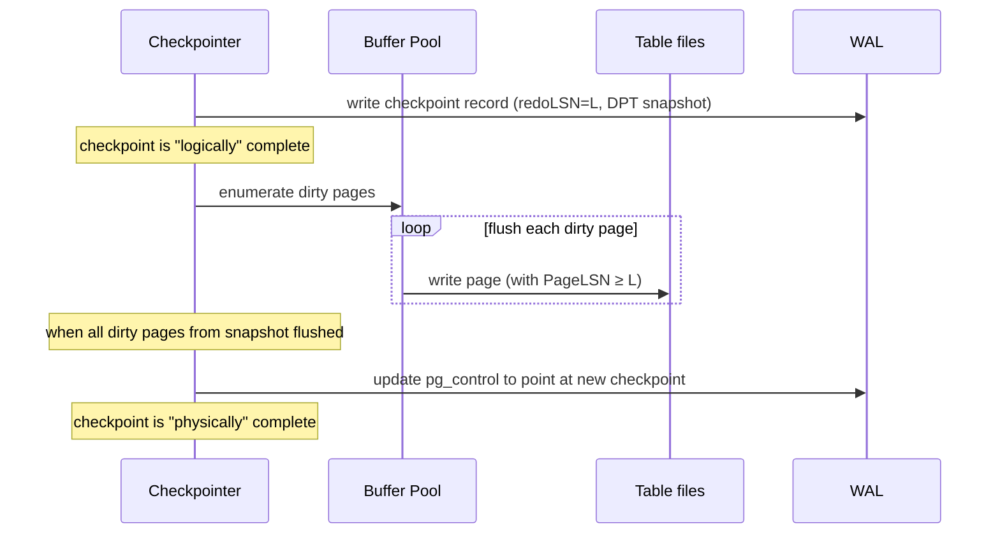
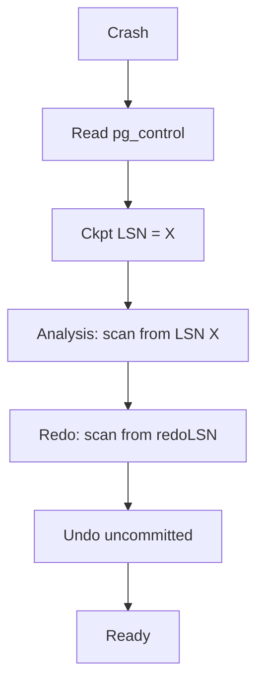

# Checkpoints — Bounding Recovery Time

> A checkpoint is a snapshot of in-memory state written to disk, used as the starting point for crash recovery. Without checkpoints, recovery would replay the entire WAL from the database's creation — minutes to hours for a long-lived database. Checkpoints bound recovery time to the last checkpoint plus the WAL generated since.

## 1. What you already know

From [[00-WAL-Logging]]: the WAL records every change; crash recovery replays it. From [[01-ARIES]]: the redo pass starts from the minimum `recLSN` in the dirty page table — which is determined by the last checkpoint. From [[02-Buffer-Pool]]: dirty pages accumulate in memory and are flushed lazily; a checkpoint forces them to disk. From [[08-Trade-offs-Everywhere]]: checkpoints trade I/O (more frequent checkpoints = more I/O) for recovery time (more frequent checkpoints = faster recovery).

## 2. Why this layer exists

Without checkpoints:

- The WAL grows forever; old segments cannot be recycled.
- Recovery time grows with the database's age.
- The dirty page table is unbounded; the redo scan starts from the beginning of the WAL.

A checkpoint solves all three by periodically:

1. Flushing all dirty pages to disk (or, in a *fuzzy* checkpoint, recording which pages are dirty and letting them be flushed later).
2. Writing a *checkpoint record* to the WAL with the current transaction table and dirty page table.
3. Allowing old WAL segments before the checkpoint to be recycled (or archived, for PITR — see [[03-Backup-And-Recovery]]).

After a checkpoint, recovery starts from the checkpoint's LSN, not from the beginning of the WAL.

## 3. What is genuinely new

The *fuzzy checkpoint* — the technique that lets the checkpoint not pause the system. The checkpoint record's contents (transaction table, dirty page table, next OID, etc.). The interaction between checkpoint frequency, recovery time, and WAL bloat (FPIs). PostgreSQL's `CHECKPOINT` command and the background writer. The trade-off: frequent checkpoints = faster recovery but more I/O and more FPIs.

## 4. Concepts

### The simple checkpoint (sharp)

A *sharp* checkpoint flushes all dirty pages to disk, then writes the checkpoint record. During the flush, the database is paused (no new writes can start, or they would create new dirty pages not covered by the checkpoint). This is simple but causes a noticeable pause — unacceptable for production OLTP.

### The fuzzy checkpoint

A *fuzzy* checkpoint does *not* flush all dirty pages immediately. Instead:

1. Record the current LSN as the checkpoint's "redo start point" (`redoLSN`).
2. Take a snapshot of the current dirty page table (DPT) — the pages that are dirty *now*.
3. Write the checkpoint record to the WAL, including the DPT snapshot and the transaction table.
4. The background writer continues flushing dirty pages asynchronously.

The key insight: the redo pass can start from `redoLSN`, but it does not need to redo changes that are *already* on disk. The DPT tells recovery which pages *might* need redo (those dirty at checkpoint time). The PageLSN check (see [[01-ARIES]]) determines which specific changes need redo.

A fuzzy checkpoint is "fuzzy" because it does not represent a precise instant — the dirty pages listed in the checkpoint record were dirty at slightly different times (during the checkpoint's snapshot phase). The DPT and PageLSN checks together make this safe.

### PostgreSQL's checkpoint

PostgreSQL uses fuzzy checkpoints. A checkpoint:

1. Records the current WAL insertion pointer as the checkpoint's `redoLSN`.
2. Snapshots the dirty page table.
3. Writes a checkpoint record to the WAL.
4. Initiates the flush of all dirty pages (the `checkpointer` process does this in the background).
5. Updates `pg_control` (a small file with the database's checkpoint info) to point at the new checkpoint record.

The checkpoint is "complete" when all dirty pages identified at the start have been flushed. Until then, the *previous* checkpoint is still the "official" recovery start point — if the system crashes during a checkpoint, recovery starts from the previous complete checkpoint.

When a checkpoint completes, WAL segments before the previous checkpoint's `redoLSN` can be recycled (or removed, if not needed for replication or archiving).

### The checkpoint record

A PostgreSQL checkpoint record contains:

- The `redoLSN` (where redo should start).
- The `prevTli` (previous timeline ID — see [[03-Backup-And-Recovery]] for timelines).
- The `fullPageWrites` flag (whether FPIs are enabled).
- The next OID, next XID, next MULTI, etc. (so recovery can reconstruct these counters).
- The current timestamp and other metadata.

The transaction table and DPT are *not* in the checkpoint record in PostgreSQL (they are reconstructed by the Analysis pass, which scans forward from the checkpoint). This is a simplification compared to classical ARIES, which includes them.

### When checkpoints happen

A checkpoint is triggered by:

1. `checkpoint_timeout` (default 5 minutes) — time-based.
2. `max_wal_size` (default 1 GB) — WAL-volume-based. When this much new WAL has been generated since the last checkpoint, a new checkpoint is forced.
3. Explicit `CHECKPOINT` command (admin only — causes a checkpoint immediately).
4. Shutdown modes (smart/fast) — the shutdown checkpoint ensures clean restart.
5. Certain operations like `pg_basebackup` (a checkpoint marks the consistent point for the backup).

### The background writer

The *background writer* (bgwriter) is a separate process that flushes dirty pages to disk continuously, between checkpoints. Its job is to keep the buffer pool "warm" — to ensure that, when a checkpoint does happen, most dirty pages are already on disk, and the checkpoint's flush phase is short.

The *checkpointer* process (separate from bgwriter since PostgreSQL 9.2) is responsible for actually executing checkpoints. Older PostgreSQL versions combined these roles.

### The trade-off

| Frequent checkpoints | Infrequent checkpoints |
|---|---|
| Faster recovery (less WAL to replay) | Slower recovery (more WAL to replay) |
| More I/O during normal operation (more flushes) | Less I/O during normal operation |
| More FPIs (more WAL bloat) | Fewer FPIs (less WAL bloat) |
| WAL segments recycled sooner | WAL segments retained longer |
| Less risk of running out of disk | More risk of running out of disk if WAL spikes |

The tuning knobs:

- `checkpoint_timeout` — increase for less frequent checkpoints (default 5 min; max 1 day; typical production: 5-30 min).
- `max_wal_size` — increase to allow more WAL between checkpoints (default 1 GB; typical production: 4-64 GB depending on workload).
- `checkpoint_completion_target` — the fraction of `checkpoint_timeout` during which the checkpoint should spread its I/O (default 0.9 = 90%, meaning a 5-min checkpoint spreads its writes over 4.5 min). Increase to smooth I/O; decrease to finish faster.

## 5. Banking application

A bank tunes its checkpoint parameters for a 5-minute recovery time objective (RTO). The bank's workload is 2,000 transfers per second, each generating ~1 KB of WAL. That is 2 MB/s of WAL — or 600 MB every 5 minutes.

Naive settings (`checkpoint_timeout = 5min`, `max_wal_size = 1GB`) would mean:

- Checkpoint every 5 minutes (driven by timeout).
- Recovery must replay up to 600 MB of WAL.
- At ~100 MB/s replay speed (typical NVMe), recovery takes ~6 seconds — well within the 5-minute RTO.

But if a transaction burst produces 5 GB of WAL in 5 minutes, the checkpoint is forced early (by `max_wal_size`), and recovery may need to replay 5 GB — ~50 seconds. Still within RTO, but tighter.

The bank's tuning:

```sql
-- Production settings
ALTER SYSTEM SET checkpoint_timeout = '15min';        -- less frequent, smoother I/O
ALTER SYSTEM SET max_wal_size = '8GB';                -- headroom for bursts
ALTER SYSTEM SET checkpoint_completion_target = 0.9;  -- smooth I/O across 13.5 min
ALTER SYSTEM SET min_wal_size = '2GB';                -- retain some WAL for recycling
ALTER SYSTEM SET wal_compression = 'on';              -- reduce WAL size
-- SELECT pg_reload_conf();
```

The bank monitors:

```sql
-- How many checkpoints, how much WAL, how long did they take?
SELECT
    checkpoints_timed,         -- checkpoints triggered by timeout
    checkpoints_req,           -- checkpoints triggered by max_wal_size (high = under-provisioned)
    checkpoint_write_time,     -- ms spent writing during checkpoints
    checkpoint_sync_time,      -- ms spent in fsync during checkpoints (high = slow disk)
    buffers_checkpoint,        -- buffers written by checkpoints
    buffers_backend,           -- buffers written by backends (high = bgwriter not keeping up)
    total_wal_bytes            -- WAL generated (custom view, see pg_stat_wal)
FROM pg_stat_bgwriter;
```

The bank's runbook:

- `checkpoints_req` climbing → `max_wal_size` is too small; increase it.
- `buffers_backend` climbing → bgwriter is not keeping up; tune `bgwriter_lru_maxpages` and `bgwriter_delay`.
- `checkpoint_sync_time` climbing → fsync is slow; check disk health, battery-backed cache, or filesystem settings.
- Recovery time > RTO → decrease `checkpoint_timeout`, but watch for FPI bloat.

## 6. Code / diagrams

### Checkpoint in the WAL timeline

```
WAL:
LSN 1000  ... normal records ...
LSN 2000  CHECKPOINT (redoLSN=2000, DPT={p1,p3,p5})  ← checkpoint A
LSN 2100  ... more records ...
LSN 2200  UPDATE p7 (first mod of p7 since ckpt → FPI)
LSN 2300  ... more records ...
LSN 3000  CHECKPOINT (redoLSN=3000, DPT={p3,p7})     ← checkpoint B
LSN 3100  ... more records ...

Crash at LSN 3500.

Recovery:
- Read pg_control → checkpoint B at LSN 3000, redoLSN=3000
- Analysis: scan 3000-3500, build txn table + DPT
- Redo: scan 3000-3500, apply changes (PageLSN check)
- Undo: roll back uncommitted transactions
```

### Fuzzy checkpoint — pages flushed asynchronously



### Recovery starting from checkpoint



### SQL — observing and triggering checkpoints

```sql
-- Force a checkpoint (admin)
CHECKPOINT;

-- View checkpoint-related stats
SELECT
    checkpoints_timed,
    checkpoints_req,
    round(checkpoint_write_time::numeric / 1000, 2) AS write_time_s,
    round(checkpoint_sync_time::numeric / 1000, 2)  AS sync_time_s,
    buffers_checkpoint,
    buffers_backend,
    buffers_clean
FROM pg_stat_bgwriter;

-- View current WAL insertion point (the LSN that will be the next redoLSN)
SELECT pg_current_wal_lsn();

-- View WAL segments currently in use
SELECT count(*), min(pg_walfile_name(pg_current_wal_lsn())) AS current
FROM pg_ls_waldir() WHERE name ~ '^[0-9A-F]{24}$';
```

### Java — calling CHECKPOINT after a big batch

```java
public void bulkImportAndCheckpoint(Connection c, List<LedgerEntry> entries) throws SQLException {
    try (PreparedStatement s = c.prepareStatement(
            "INSERT INTO ledger_entries(account_id, amount, occurred_at) VALUES (?, ?, ?)")) {
        for (var e : entries) {
            s.setLong(1, e.accountId());
            s.setBigDecimal(2, e.amount());
            s.setTimestamp(3, Timestamp.from(e.occurredAt()));
            s.addBatch();
        }
        s.executeBatch();
    }
    c.commit();   // WAL flushed for the inserts

    // After a large batch, force a checkpoint to bound recovery time.
    // (Requires superuser; usually done by the DBA, not the application.)
    try (PreparedStatement ck = c.prepareStatement("CHECKPOINT")) {
        ck.execute();
    }
}
```

In practice, applications rarely call `CHECKPOINT` explicitly — it is a DBA operation. But the application's batch size and commit pattern *influence* checkpoint behaviour via WAL generation rate, and the team must be aware of the interaction.

## 7. What can go wrong

- **Checkpoints too frequent.** Every page's first modification after a checkpoint triggers an FPI. Frequent checkpoints = many FPIs = WAL bloat and replication lag. Symptom: `wal_bytes` is much higher than expected.
- **Checkpoints too infrequent.** Recovery time grows; WAL disk usage grows; old WAL cannot be recycled. Symptom: recovery takes too long; `checkpoints_req` is high; WAL disk is near full.
- **`checkpoints_req` is high.** Means `max_wal_size` is being hit before `checkpoint_timeout`. Either WAL generation is higher than expected, or `max_wal_size` is too small. Investigate.
- **`checkpoint_sync_time` is high.** The fsyncs at the end of the checkpoint are slow. Likely cause: slow disk, no battery-backed cache, or aggressive filesystem settings. A single slow fsync at checkpoint end can cause noticeable latency spikes.
- **Full-page image storms.** After a checkpoint, the first modification of every page produces an FPI. A workload that touches many different pages right after a checkpoint generates a burst of FPIs. Spreading the workload or reducing checkpoint frequency helps.
- **`checkpoint_completion_target` too high.** If set to 1.0, the checkpoint I/O is spread over the entire timeout — but if the next checkpoint is forced early (by `max_wal_size`), the previous checkpoint's writes are still in flight, causing I/O contention. Default 0.9 is usually right.
- **Bgwriter not keeping up.** If `buffers_backend` is high (backends are writing their own dirty pages instead of letting bgwriter handle them), the buffer pool is not being flushed efficiently. Tune `bgwriter_lru_maxpages`, `bgwriter_delay`, or `bgwriter_lru_multiplier`.
- **Long shutdown.** A "fast" shutdown runs a final checkpoint. If there is a lot of WAL to flush, the shutdown can take minutes. A "smart" shutdown waits for connections to close first; "immediate" skips the checkpoint (recovery will be needed on restart).

## 8. Trade-offs

- **Checkpoint frequency vs recovery time.** The central trade-off. Tune for your RTO.
- **Checkpoint frequency vs WAL size.** More checkpoints = more FPIs = larger WAL. The trade-off interacts with replication bandwidth.
- **Checkpoint I/O smoothing vs latency spikes.** `checkpoint_completion_target = 0.9` spreads I/O smoothly but extends the checkpoint window. Lower values finish faster but produce spikes.
- **Bgwriter aggressiveness vs I/O contention.** A more aggressive bgwriter keeps the buffer pool clean but uses more I/O that competes with foreground queries.
- **`min_wal_size` vs disk usage.** Higher `min_wal_size` keeps more WAL pre-allocated (faster recycling) but uses more disk.
- **`wal_compression` vs CPU.** Compressed WAL saves I/O and replication bandwidth but uses CPU. Useful for bandwidth-constrained replication; less useful for local SSD where CPU is the bottleneck.

## 9. Forward links

- [[00-WAL-Logging]] — the log the checkpoint bounds.
- [[01-ARIES]] — the recovery algorithm that uses the checkpoint.
- [[03-Backup-And-Recovery]] — base backups are taken at a checkpoint; PITR replays WAL after a checkpoint.
- [[04-Banking-Recovery-Scenario]] — checkpoint tuning for the bank's RTO.
- [[02-Buffer-Pool]] — the dirty pages the checkpoint flushes.
- [[04-MVCC]] — VACUUM's interaction with the WAL and checkpoints.
- [[02-Replication]] — replicas start from a base backup's checkpoint.
- [[00-Query-Optimization-Strategy]] — checkpoint I/O as a performance consideration.
- [[00-Banking-Case-Study]] — rule 5 (atomic transfers) and rule 6 (auditability).
