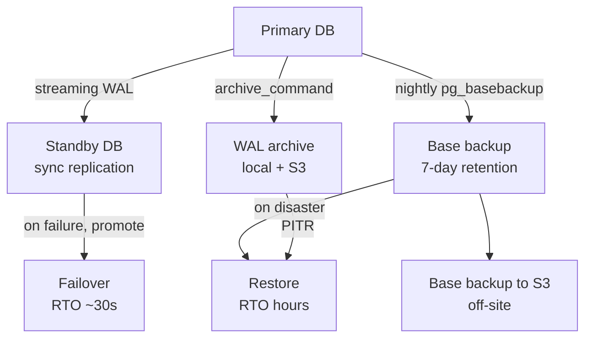
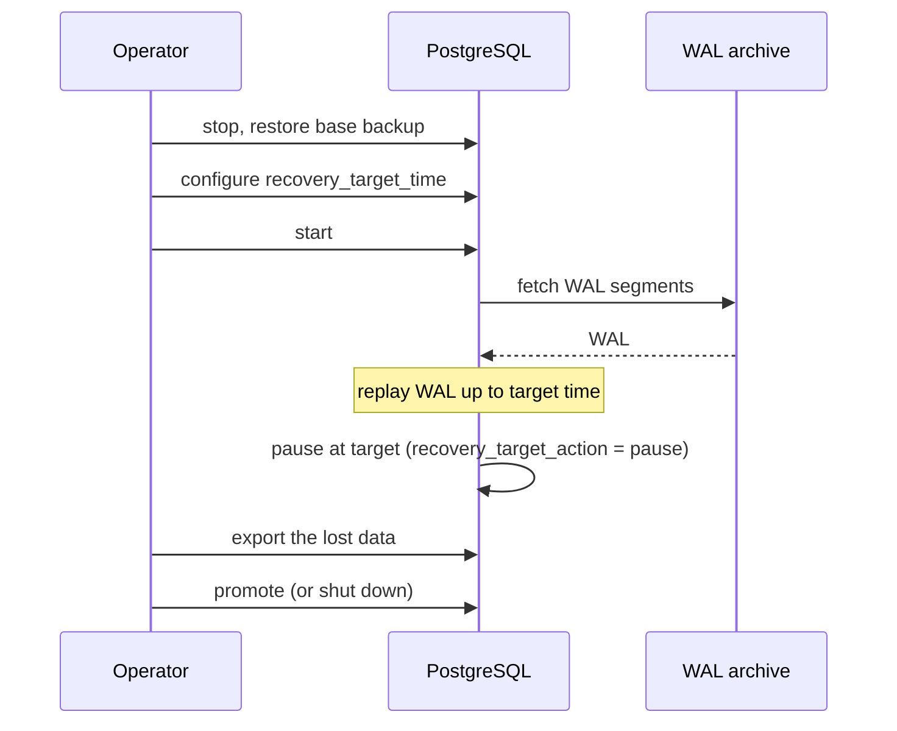

# Backup and Recovery — Physical, Logical, PITR, Replication

> A database that cannot be restored after a disaster is not a database; it is a liability. This chapter covers the strategies: physical vs logical backups, point-in-time recovery via WAL archiving, replication as a recovery strategy, and the RPO/RTO framework that should drive every decision.

## 1. What you already know

From [[00-WAL-Logging]]: the WAL records every change; archived WAL is the raw material for PITR. From [[02-Checkpoints]]: a base backup starts at a checkpoint; recovery replays WAL from that point forward. From [[01-ARIES]]: crash recovery replays the WAL; backup recovery does the same, but from a base backup instead of from the on-disk state. From [[08-Trade-offs-Everywhere]]: backup strategy is a trade-off between RPO (how much data you can lose), RTO (how long recovery takes), and cost.

## 2. Why this layer exists

Crash recovery (ARIES) handles the case where the database process or host crashes but the storage is intact. It does *not* handle:

- Storage failure (the disk is gone, the WAL is gone).
- User error (someone dropped the wrong table).
- Site failure (the data center is gone).
- Corruption (the on-disk state is wrong, and replaying the WAL reproduces the wrong state).

For these, you need backups. A backup strategy is the layered defense:

1. **Crash recovery** (ARIES) — handles process/host crashes; automatic.
2. **Base backup + WAL archive** (PITR) — handles storage failure and user error; restore to any point in time.
3. **Replication** (streaming standby) — handles host failure; promote the standby for fast failover.
4. **Off-site backups** — handles site failure; restore from a geographically separate copy.

Each layer has a different RPO and RTO. The strategy is to combine them.

## 3. What is genuinely new

The four backup types (physical, logical, base backup, snapshot), the PITR mechanism (base backup + WAL archive + recovery target), the RPO/RTO framework, the 3-2-1 backup rule, and the banking backup strategy that combines all of these for RPO = 0 and RTO = 30 seconds.

## 4. Concepts

### Physical backups

A *physical backup* copies the database's files (data directory, WAL, configuration) as-is. The restored database is byte-identical to the source at the backup moment.

- **`pg_basebackup`** — the standard PostgreSQL tool. Connects to a running server, takes a consistent snapshot of the data directory using the backup API (which is the same API replication uses). Can produce a tar archive or a directory; can include WAL or not.
- **Filesystem snapshot** — if the database is on a filesystem that supports snapshots (LVM, ZFS, Btrfs, EBS), a snapshot of the volume is a physical backup. The snapshot must be *consistent* — the database must be quiesced or the snapshot must use PostgreSQL's backup API to ensure consistency. The simplest approach: `pg_start_backup()`, take the snapshot, `pg_stop_backup()`. Modern PostgreSQL (10+) has non-exclusive backup API that avoids blocking.

Pros: fast to take (file copy), fast to restore (file copy), exact replica.

Cons: must be the same PostgreSQL major version on restore (cannot restore a PG 13 backup on PG 14); cannot selectively restore individual tables; large (full data directory).

### Logical backups

A *logical backup* exports the database's contents as SQL statements (or another portable format). The restored database is *logically* equivalent but physically different (different pages, different indexes, possibly different schema if the dump is partial).

- **`pg_dump`** — dumps a single database. Output is SQL (`CREATE TABLE`, `INSERT`, etc.) or a custom binary format (`-Fc`) that supports parallel restore and selective restore.
- **`pg_dumpall`** — dumps all databases plus globals (roles, tablespaces). Used for cluster-wide backups.

Pros: portable across PostgreSQL versions (useful for major upgrades); selective (dump specific tables or schemas); small for small datasets; can be used to restructure (dump from one schema, restore to another).

Cons: slow to take (must read every row); slow to restore (must execute every SQL statement, rebuild every index); loses physical optimizations (cluster order, fillfactor); cannot do PITR (no WAL replay).

### PITR — Point-In-Time Recovery

PITR combines a base backup with continuous WAL archiving to enable restore to *any point in time* between the backup and the present.

Setup:

1. Configure `archive_mode = on` and `archive_command = 'test ! -f /backup/wal/%f && cp %p /backup/wal/%f'`. PostgreSQL copies every WAL segment to the archive as it fills.
2. Take a base backup: `pg_basebackup -D /backup/base -X stream`.
3. Continue running. The archive accumulates WAL segments.

Restore to a point in time:

1. Stop the database.
2. Restore the base backup to the data directory.
3. Create a `recovery.signal` file (PostgreSQL 12+) and configure `restore_command` and `recovery_target_time` (or `recovery_target_lsn`, `recovery_target_xid`, `recovery_target_name`) in `postgresql.conf` or a `recovery.conf`-style override.
4. Start the database. It enters recovery mode, replays WAL from the archive up to the target, and then either pauses (`recovery_target_action = 'pause'`), promotes (`'promote'`), or shuts down (`'shutdown'`).

PITR is the standard mechanism for recovering from user error ("someone dropped a table at 14:32"). Restore to 14:31:59, export the table, then restore to current.

### Replication as recovery

A *streaming standby* is a replica that continuously applies WAL from the primary. If the primary fails, the standby can be promoted to primary — a failover.

- **Synchronous replication** — the primary waits for the standby to acknowledge WAL receipt (or flush, or apply) before acking commit to the application. Guarantees zero data loss on failover (`synchronous_commit = on` + `synchronous_standby_names`). Cost: commit latency is doubled (round trip to standby).
- **Asynchronous replication** — the primary does not wait. Standby lag can be milliseconds to seconds. On failover, transactions committed on the primary but not yet on the standby are lost. Cost: small data loss; benefit: low commit latency.

For the bank's RPO = 0 requirement, synchronous replication is mandatory. For a read-heavy analytics replica, asynchronous is fine.

The standby can also serve read queries (hot standby), offloading reporting workloads from the primary.

### RPO and RTO

- **RPO (Recovery Point Objective)** — the maximum acceptable data loss, measured in time. "RPO = 0" means no data loss. "RPO = 5 minutes" means up to 5 minutes of recent transactions may be lost.
- **RTO (Recovery Time Objective)** — the maximum acceptable time to recover, measured from failure to service restoration. "RTO = 30 seconds" means the system must be back online within 30 seconds of a failure.

These are *business* metrics, set by the business. The architecture's job is to meet them. RPO = 0 requires synchronous replication. RTO = 30 seconds requires automated failover (no manual steps).

### The 3-2-1 backup rule

A long-standing backup heuristic:

- **3** copies of the data (the production copy + 2 backups).
- **2** different media (e.g., disk + tape, or local disk + cloud).
- **1** copy off-site (in a geographically separate location).

The rule protects against media failure (two copies on the same disk array both die), site failure (the data center is destroyed), and corruption (one copy is silently corrupted but the others are intact).

For a database: production (1) + on-site base backup (2) + off-site WAL archive (3, different media, off-site). Or: production + streaming standby in another region + WAL archive to object storage.

## 5. Banking application

The bank's backup strategy: nightly base backup + continuous WAL archiving + synchronous replication to a standby. RPO = 0; RTO = 30 seconds.

```ini
# postgresql.conf (primary)
wal_level = replica
archive_mode = on
archive_command = 'test ! -f /backups/wal/%f && cp %p /backups/wal/%f'
synchronous_commit = on
synchronous_standby_names = 'FIRST 1 (standby1)'
max_wal_senders = 5
hot_standby = on   # for the standby's config; irrelevant on primary but conventional
```

```ini
# postgresql.conf (standby)
hot_standby = on
primary_conninfo = 'host=primary.example.com port=5432 application_name=standby1'
restore_command = 'cp /backups/wal/%f %p'
```

### Nightly base backup (cron)

```bash
#!/bin/bash
# Run nightly at 02:00
set -e
DATE=$(date -u +%Y%m%dT%H%M%SZ)
pg_basebackup -h primary -D /backups/base/$DATE -X stream -Ft -z -P
# Cleanup: keep the last 7 days of base backups
find /backups/base -maxdepth 1 -type d -mtime +7 -exec rm -rf {} +
```

### WAL archive to off-site object storage

```bash
# archive_command (improved) — copies to local disk AND uploads to S3
archive_command = 'cp %p /backups/wal/%f && aws s3 cp %p s3://bank-wal-archive/%f'
```

### Failover script (Patroni or pg_auto_failover handles this automatically)

```bash
#!/bin/bash
# Promote the standby to primary
pg_ctl promote -D /var/lib/postgresql/data
# Update connection pooler (pgbouncer) to point at the new primary
pgbouncer -R  # reload config
# Notify monitoring
curl -X POST https://monitoring.example.com/api/failover
```

### Restore to a point in time (user error: dropped table)

```bash
# 1. Stop the standby (we will use it as the restore target)
pg_ctl stop -D /var/lib/postgresql/data

# 2. Restore the most recent base backup BEFORE the incident
rm -rf /var/lib/postgresql/data/*
tar -xzf /backups/base/20240115T020000Z/base.tar.gz -C /var/lib/postgresql/data

# 3. Configure recovery
cat > /var/lib/postgresql/data/recovery.signal <<EOF
EOF

cat >> /var/lib/postgresql/data/postgresql.auto.conf <<EOF
restore_command = 'cp /backups/wal/%f %p'
recovery_target_time = '2024-01-15 14:31:59+00'
recovery_target_action = 'pause'
EOF

# 4. Start the database; it enters recovery and replays WAL up to the target
pg_ctl start -D /var/lib/postgresql/data

# 5. While paused, dump the dropped table
psql -c "COPY accounts_before_incident TO '/tmp/accounts.csv' CSV"

# 6. Promote (or shut down and re-clone from primary)
pg_ctl promote -D /var/lib/postgresql/data
```

### The Java application's retry logic for failover

When the primary fails and the standby is promoted, the application's connections break. The application must reconnect (the pool will retry) and the pool's configuration must point at the new primary.

```java
// HikariCP configuration with failover
HikariConfig config = new HikariConfig();
config.setJdbcUrl("jdbc:postgresql://primary.example.com,standby.example.com:5432/bank");
config.setUsername("app");
config.setPassword("...");
config.setConnectionTimeout(5000);   // fail fast on dead primary
config.setConnectionTestQuery("SELECT 1");
config.addDataSourceProperty("targetServerType", "primary");
// The driver automatically tries each host in order, picks the one that is primary
```

## 6. Code / diagrams

### The backup strategy layers



### PITR — restore to a point in time



### RPO/RTO matrix by failure type

| Failure | Mechanism | RPO | RTO |
|---|---|---|---|
| Process crash | ARIES recovery | 0 | seconds |
| Host crash (storage intact) | ARIES recovery | 0 | seconds-minutes |
| Storage failure | Failover to standby | 0 (sync) / seconds (async) | 30s (auto failover) |
| Site failure | Off-site backups + WAL archive | minutes (WAL archive lag) | hours (restore from backup) |
| User error (dropped table) | PITR from base backup + WAL | 0 (restore to before error) | minutes-hours |
| Data corruption | PITR from a point before corruption | minutes-hours (depends on detection) | hours |

### SQL — checking backup status

```sql
-- Is WAL archiving working?
SELECT * FROM pg_stat_archiver;
-- archived_count | last_archived_wal | last_archived_time | failed_count | last_failed_wal | ...

-- What is the replication state?
SELECT application_name, state, sync_state, sent_lsn, write_lsn, flush_lsn, replay_lsn
FROM pg_stat_replication;

-- Standby lag (on the standby):
SELECT now() - pg_last_xact_replay_timestamp() AS lag;
```

## 7. What can go wrong

- **Silent WAL archive failure.** If `archive_command` fails (e.g., the archive disk is full), WAL segments accumulate on the primary, eventually filling the WAL disk and stalling all transactions. Monitor `pg_stat_archiver.failed_count`.
- **Backup corruption.** A base backup that is silently corrupted (bit rot, storage error) is useless. Periodically *test* restores to verify backups. An untested backup is not a backup.
- **Replica lag in async replication.** A standby that is seconds behind the primary means seconds of data loss on failover. Monitor lag; alert if it exceeds the RPO.
- **Standby cannot be promoted.** A standby that has not been kept in a promotable state (e.g., it is in recovery but stuck) cannot take over. Regularly *test* failover.
- **Split-brain.** If both primary and standby think they are primary, clients write to both, and the divergence cannot be reconciled. Use fencing (STONITH) or a consensus-based failover manager (Patroni, etcd).
- **Backups on the same media as production.** A disk failure that destroys production also destroys the backups. The 3-2-1 rule exists for this reason.
- **Major version mismatch.** A base backup from PG 13 cannot be restored on PG 14. Plan upgrades carefully.
- **Logical backup misses objects.** `pg_dump` of a single database misses globals (roles, tablespaces). Use `pg_dumpall --globals-only` to capture them separately.
- **Long PITR recovery.** Replaying weeks of WAL to reach a target time can take hours. If you expect frequent PITR, take more frequent base backups.
- **Unarchived WAL on crash.** If the primary crashes before archiving the current WAL segment, that segment may be lost. PostgreSQL mitigates this with `archive_timeout` (forces a segment switch after N seconds of inactivity). For RPO = 0, use synchronous replication in addition to archiving.

## 8. Trade-offs

- **Physical vs logical backup.** Physical is fast and exact but version-locked. Logical is portable and selective but slow. Use both — physical for fast restore, logical for portability and selective recovery.
- **Sync vs async replication.** Sync gives RPO = 0 but doubles commit latency. Async is fast but risks data loss. Choose based on the business's RPO.
- **Backup frequency vs storage cost.** More frequent base backups = faster PITR but more storage. Less frequent = slower PITR but cheaper.
- **Local vs off-site backups.** Local is fast to restore but vulnerable to site failure. Off-site is safe but slow to restore. The 3-2-1 rule uses both.
- **Automated vs manual failover.** Automated failover meets tight RTOs but risks false failovers (split-brain). Manual failover is safer but slower. Most production systems use automated failover with consensus-based fencing.
- **Compression vs CPU.** Compressed backups save storage but cost CPU during backup and restore. Modern storage is cheap; CPU is precious — often compression is worth it.
- **Encryption vs complexity.** Encrypted backups protect against leakage but require key management. For sensitive data (banking), mandatory.
- **`pg_dump` vs `pg_basebackup`.** `pg_dump` is sufficient for small databases and selective recovery. `pg_basebackup` is required for PITR and large databases.

## 9. Forward links

- [[00-WAL-Logging]] — archived WAL is the raw material for PITR.
- [[01-ARIES]] — crash recovery on top of a base backup.
- [[02-Checkpoints]] — base backups are taken at a checkpoint.
- [[04-Banking-Recovery-Scenario]] — the bank's recovery procedure in action.
- [[02-Replication]] — streaming standby as a recovery strategy.
- [[04-Eventual-Consistency]] — async replication's consistency model.
- [[00-CAP-PACELC]] — sync replication's consistency-availability trade-off.
- [[00-ACID]] — Durability, the property backup strategies extend.
- [[08-Trade-offs-Everywhere]] — RPO/RTO as trade-off axes.
- [[00-Banking-Case-Study]] — the bank's RPO/RTO requirements.
